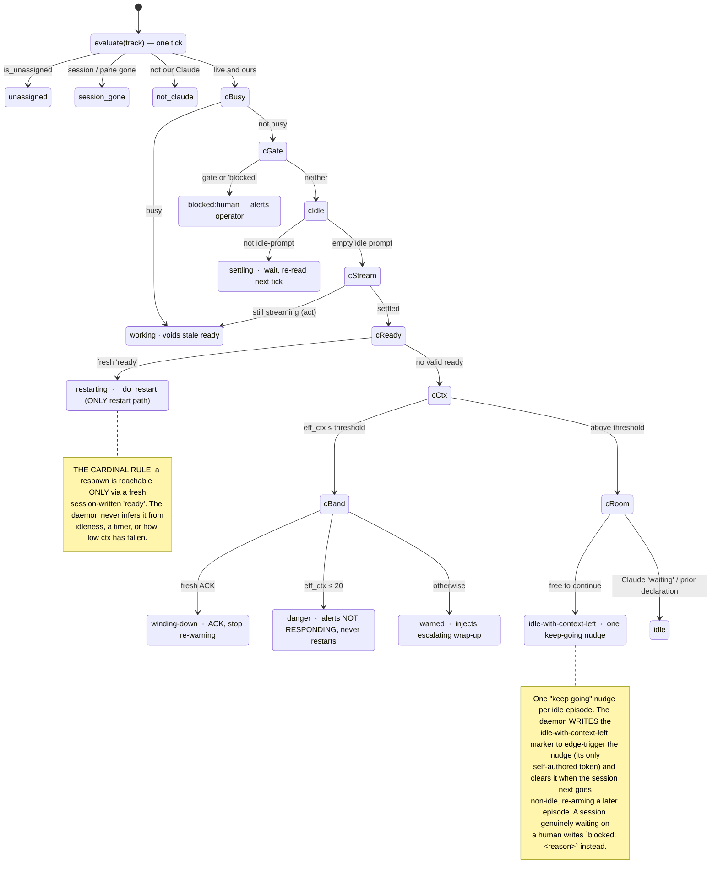

# Overseer — maintenance guide (for the developer editing it)

This is guidance for **editing the overseer**, not for running it. It is a
DIFFERENT document from `SKILL.md`:

- `SKILL.md` = the overseer **at runtime** ("when invoked, do X").
- this file = guidance for the developer **changing** the overseer ("when you
  change X, preserve invariant Y, watch gotcha Z, verify via W").

The overseer is a **deterministic multi-track supervisor**: a stdlib-Python
daemon (`supervisor.py`, the top pane) that watches parallel livespec plan
tracks across tmux sessions, plus a thin interactive Claude bottom pane
(`SKILL.md`). The daemon acts and renders a live table; it holds NO semantic
judgment. Every "am I done / blocked?" decision is made by the tracked
session's own LLM and expressed out-of-band on the filesystem — ONE state file
(`<repo>/tmp/overseer/<topic>/.overseer-state`) holding one of three values
(`ready` / `blocked: <reason>` / `winding-down`); the daemon only pattern-matches
deterministic tmux signals and that file.

## Why it exists / history

Two prior failure modes shaped this design, and they MUST NOT recur:

1. **Inline-worker context blowup.** A session ran the overseer window as an
   inline worker (did the track work itself), blew up its own context, and
   autocompacted. → The mechanics now run in a dumb, token-free Python process
   that cannot blow up a context; the interactive pane stays thin.
2. **Frozen top-pane snapshot.** A `/clear` does not kill tmux panes, so a prior
   overseer's dashboard kept rendering an hours-old "everything idle" snapshot
   while nothing was live. → The table is re-rendered from live captures every
   tick (and time-stamped), so it can never freeze on a stale snapshot.

Status: **PERMANENT** — a human-supervised alternate to autonomous mode (the
Beads/Dolt + Fabro Dispatcher / dark factory), not a stopgap awaiting a
replacement. The two are standing peers: autonomous mode runs *ready work-items*
unattended through the ledger; the overseer keeps *interactive plan tracks*
moving in parallel under a human driver, automating only the context-% wrap-up +
restart mechanics. Maintain it in place. **LOCAL-ONLY and unsynced:** it lives
under `.claude/skills/overseer/` in this repo only and is usable only from it. Do
NOT add it to the plugin, the spec, the copier template, fleet manifests,
conformance checks, or any other repo.

## The evaluate() state machine

`Supervisor.evaluate(track)` re-classifies each tracked session **from scratch
every tick** into exactly one status. Its only inputs are the pane capture, the
parsed `Ctx: N% left`, Claude's registry `status`, and the out-of-band
`.overseer-state` file (`ready` / `blocked` / `winding-down`, all
**session-written**). It is a **precedence cascade** — the FIRST matching guard
wins — not a persistent FSM: a session moves between statuses only by changing
those inputs (its own work, its own declaration, its context dropping). The
per-state side-effects (after the `·`) and the `(act)` guard fire ONLY when
`act=True` (the daemon loop); the read-only `list` path (`act=False`) classifies
without acting.



Every branch is a leaf: the tick ends there and the next tick re-enters
`evaluate()` from the top. The cross-tick lifecycle a session actually walks is
`working → … → warned` (daemon injects the wrap-up) `→ winding-down` (session
ACKs) `→ restarting` (session declares `ready`) `→` a fresh `working` after the
respawn — each arrow driven by the SESSION's own declaration, never a daemon
guess. `unassigned` / `session_gone` / `not_claude` are structural pre-checks
(no live managed pane to read); `settling` is a one-tick "wait and re-read".

Reading notes: `threshold` = the track's `ctx_threshold` override, else the
daemon-wide `warn_percent` (default 50). A malformed `.overseer-state` token is
surfaced as a row note and treated as **no declaration** (fail-closed) — it
changes no branch. Two act-only guards are folded for clarity: `cStream →
working` (drawn) skips a tick when an "idle" frame is still streaming, and an
identical post-settle identity re-check (not drawn) routes a pane that has
exited to a shell straight to `not_claude`. The `cRoom` choice guards the
`idle-with-context-left` nudge: an idle session ABOVE threshold reaches it, and
takes the `idle_ctx_left` leg only when it is not `waiting` on a human and has
made no declaration of its own (or already carries the marker — so the nudge is
sent once, not every tick); otherwise it is a plain `idle` leaf. See invariant 9
for the marker's edge-triggered lifecycle.

## Architecture invariants that must not regress

1. **The supervisor owns mechanics only.** Semantic judgment ("am I done / am I
   blocked?") stays in the tracked session's LLM, expressed via the **out-of-band
   state file** — NEVER inferred from printed pane text (prompt-echo, model
   quotation, scroll, and line-wrap all corrupt pane text; see the adversarial
   review). If you ever find yourself parsing a "the session says it's done"
   sentinel out of a pane capture, stop — that is the exact anti-pattern the
   state-file protocol replaced.

   **The overseer NEVER touches files under `plan/`.** It touches ONLY its own
   config (the mapping store, the injection-stamp sidecar, the fleet manifest)
   and temp files (`<repo>/tmp/overseer/<topic>/`). A session's `handoff.md` and
   everything else under `plan/<topic>/` is the SESSION's own workflow — the
   overseer never reads, writes, or hashes it. Discovery enumerates `plan/*/`
   DIRECTORIES only; the resume line *points* the session at the conventional
   `plan/<topic>/handoff.md` but never opens it; markers live under `tmp/`, never
   `plan/`. The daemon `git check-ignore`-validates each watched repo's
   `tmp/overseer/` at startup (`Supervisor.unignored_tmp_repos`) and REFUSES to
   run if any is not gitignored, so a marker can never dirty a tracked tree. If
   you ever add code that opens, writes, or stats a FILE under `plan/`, stop —
   that violates this invariant.
2. **The overseer stays thin.** The interactive bottom pane never does track
   work inline and never polls the tracked sessions from the Claude pane on a
   timer. Watching is the daemon's job.
3. **Surface-only for UNASSIGNED plans.** The daemon NEVER auto-spawns a session
   for a plan that has none. Launching a plan is a deliberate act (`start`,
   user-initiated); a discovered plan with no session shows as `unassigned`,
   flagged ready to start — never started automatically. This scopes the FIRST
   launch ONLY. It is a DIFFERENT rule from invariant 7 (which governs whether an
   ALREADY-TRACKED session may be restarted, and answers: only on its own `ready`
   declaration). Neither one licenses the other: "surface-only" is not a reason to
   ignore a `ready` declaration, and invariant 7 is not a reason to spawn a
   session for an unassigned plan.
4. **Discovery-driven list; JSONL = mapping only.** The track list is
   re-discovered from each watched repo's `plan/*/` every tick. The JSONL store
   (`~/.livespec-overseer.jsonl`) holds ONLY facts that cannot be rederived from
   the filesystem (topic↔tmux mapping, custom resume line, threshold override).
   Do NOT regress to a hand-maintained plan list.
5. **Cross-repo by construction.** Rows are repo-scoped; tmux session ids are
   repo-qualified `<repo-slug>--<topic>` (tmux names are global; plan topics are
   unique only per repo). Never hardcode `/data/projects/livespec`. The daemon's
   per-tick `auto_link` links a live session to a discovered plan ONLY when the
   repo-qualified session exists AND its `#{pane_current_path}` resolves inside the
   row's repo — never by topic name alone.
6. **Two-pane bootstrap + `adopt` (the `/overseer` startup, 2026-07-13).** The
   skill runs the `overseer-start` executable FIRST — and ONLY the skill does:
   it is skill-invoked (by Claude's Bash tool), never a standalone launcher, and
   does NOT start Claude (it splits the daemon pane beside the SAME Claude session
   that ran `/overseer`, which then resumes in the bottom pane). So it REFUSES
   before splitting unless `$CLAUDECODE` is set (the marker Claude Code exports in
   every Bash-tool shell) — a hand-run from a plain terminal would otherwise leave
   a daemon pane + a bare-shell bottom pane (no Claude), the exact broken state
   that guard prevents. It (a) detects the skill's OWN pane via `$TMUX_PANE`
   (Claude Code inherits it — do NOT re-derive tmux membership by hand; that
   improvisation is what falsely reported "not inside a tmux window" and grabbed a
   separate session), (b) splits THAT window
   (`tmuxio.split_window_top` targeting `$TMUX_PANE`, idempotent via a pane titled
   `overseer-daemon`) to run `overseerd` in a TOP pane while focus stays on the
   bottom pane, and (c) runs `Supervisor.adopt_sessions`. **`adopt` matches each
   live Claude session's registry `name`** — NOT the tmux session name (those are
   generic: `livespec`, `livespec1`), NOT the `#{pane_title}` terminal title
   (Claude DRIFTS it to a task summary), and NOT a screen-scrape of the input-box
   border (which vanishes whenever the pane shows a prompt — the failure that
   retired the border scrape). Claude Code writes each session's display `name` +
   `cwd` (+ live `status`) to `~/.claude/sessions/<pid>.json`; the maintainer's
   sessions run `claude --dangerously-skip-permissions` and are renamed at runtime,
   so the name is ONLY in that registry, never argv. `claude_sessions.py` reads the
   registry (keeping live PIDs — alive AND `/proc` start-time == recorded
   `procStart`, defeating PID reuse) and joins each to its tmux session by walking
   the claude PID up to a tmux pane PID (`tmuxio.pane_pid_sessions`). A session is
   adopted when its registry `cwd` is in a fleet repo AND its `name` is an ACTIVE
   discovered topic there; registry membership already proves it is a Claude
   process, so there is no worker-command guard. **Adopt runs EVERY tick** (in
   `build_rows(act=True)`), not just at bootstrap — so a session that was mid-prompt,
   renamed, or launched later is picked up within one interval (the fix for "the
   daemon never re-adopted after the prompt cleared"). It maps to the bare session
   name (`tmux == session`), never double-adds, and — distinct from invariant 5's
   `auto_link`, which links only the repo-qualified `<repo-slug>--<topic>` sessions
   the daemon itself launches. Codex sessions are NOT in Claude's registry, so they
   are not adopted (a documented gap; codex would need its own session-store read).
   (Per-session pane reads — `pane_id`/`pane_current_command`/`pane_current_path` —
   go through `list-panes`, not the flaky-for-detached-sessions `display-message`.)
7. **THE CARDINAL RULE — never restart a session that has not declared itself
   `ready` (maintainer-declared 2026-07-14).** The session's own `ready`
   declaration in its state file (`signals.ready_valid`) is the **SOLE**
   authorization for a restart, and `Supervisor._do_restart` has exactly ONE
   caller: the `ready` branch of `evaluate`. The daemon NEVER infers readiness —
   not from idleness, not from a timer, not from how low the context has fallen.

   **Why this is a correctness rule, not a courtesy.** A timer cannot know whether
   a session is safe to kill. **"Idle + settled" is NOT "at a safe stopping
   point"**: a session can be idle while a background build runs, while a sub-agent
   works, or while it waits on a human in another pane. Only the session knows, so
   only the session may authorize the restart. A session that declares NOTHING is
   **reported to the human as not responding** (`_alert_non_responder`) and
   otherwise **left alone** — that is a bug in the SESSION (which was told,
   escalatingly, exactly what to write), never a licence for the daemon to guess.

   **This REPLACED a previously-shipped invariant that said the opposite.** An
   earlier version of this list asserted the auto-restart was NON-NEGOTIABLE and
   that a warned track stalling idle at the danger line was **FORCE-restarted**
   after a grace (`_danger_or_force_restart` / `_STALL_RESTART_GRACE` /
   `_InjectState.danger_idle_since`). That was a **severe bug** — the daemon killed
   sessions it had no way to prove were safe to kill — and all of it is **deleted
   from the code**. If you find yourself re-adding a timer, a grace, or any
   daemon-side judgment that ends in a respawn, STOP: you are reintroducing it.

   The restart **mechanics** are unchanged and still required — only the **trigger**
   moved to the session's declaration:

   - **(a) exit + restart** — the ATOMIC `respawn-pane -k` (kill the pane's process
     and launch the new one in a single tmux op), NOT a `/exit` followed by a scrape
     for the shell prompt. The `❯` glyph is ambiguously BOTH the Claude idle prompt
     and the zsh prompt, so a mis-timed "the shell is back" would type into the
     still-live session.
   - **(b) `claude --dangerously-skip-permissions -n <topic>`** — BOTH flags are
     required (`Supervisor._launch_command`). Without
     `--dangerously-skip-permissions` the fresh session stalls on its first
     permission prompt and the restart is NOT autonomous, which defeats the whole
     mechanism; `-n <topic>` re-assigns the session name from the plan topic.
   - **(c) the resume line** — `read <repo>/plan/<topic>/handoff.md and follow it`,
     bracketed-pasted AND verify-submitted once the fresh TUI is up
     (`default_resume` + `_submit_prompt`). A `claude "<prompt>"` argv only
     PRE-FILLS the box without submitting — which is why the resume line is pasted
     after launch rather than passed on the command line.

   The abrupt kill is safe **because of** the declaration: the session asserted it
   is at a clean stopping point, and `respawn-pane -k` replaces the PROCESS — every
   file, worktree, and commit on disk survives it.

   **With the force-restart gone, the ESCALATION is the only lever.** So it has to
   actually sharpen: `wrapup_message` sends a SUGGESTION above `_INSIST_AT` (30%
   remaining) and an insistent "STOP AND WIND DOWN NOW" at 30 / 20 / 10. Re-sending
   identical text five times is repetition, not escalation. If you touch the wrap-up
   text, keep that gradient — it is load-bearing now.
8. **Notify, never block (maintainer-declared 2026-07-14).** **A question may only
   be asked by the actor that OWNS the decision, and the overseer must NEVER block
   on a question it does not own.** A tracked session's decision belongs to that
   session and is already displayed in ITS pane; re-asking it in the interactive
   bottom pane created a duplicate surface — the maintainer answered in the tracked
   session's pane, the overseer's modal stayed blocking, and the whole console
   wedged on it (a single point of failure). So:

   - **Track decisions → non-blocking TEXT.** The bottom pane relays
     `blocked:human`, a non-responding `danger` track, and a malformed state file as
     reported text; the operator answers **in the tracked session's own pane**. It
     NEVER raises `AskUserQuestion` on a track's behalf.
   - **Overseer-OWNED decisions → `AskUserQuestion` is still right** (add / remove /
     unassign / start a track, a threshold) — nobody else can answer those.
   - **It self-heals.** `blocked:human` is re-derived from the live pane every tick,
     so when the human answers in the tracked pane the alert simply stops. Nothing
     needs to be dismissed.
   - **Therefore every track-scoped alert MUST name WHERE to act.** Because the
     overseer never prompts on a track's behalf, the alert line is the operator's
     ONLY handover, so it must be self-sufficient: plan topic, repo, tmux SESSION,
     PANE, and a copy-pasteable `tmux switch-client -t <session>` jump command. That
     is what `Supervisor._alert` guarantees — route EVERY new track-scoped alert
     through it, never a bare `_surface` with an f-string of `repo::topic` (which
     told the operator WHAT was stuck but not WHERE to go). `_surface` remains for
     DAEMON-level notices with no track coordinates (a failed paste retry, a
     respawn failure, the singleton-lock refusal, the gitignore refusal).
9. **ONE state file with a VALUE — never two presence-markers.** The declaration is
   `<repo>/tmp/overseer/<topic>/.overseer-state`, whose first non-empty line is
   `<token>` or `<token>: <detail>`. There are **three SESSION-written tokens**
   (`ready`, `blocked`, `winding-down` — `signals.STATE_TOKENS`) plus **one
   DAEMON-written token** (`idle-with-context-left` — `signals._DAEMON_TOKENS`);
   `signals.valid_token` accepts either set. The predecessor pair
   `.overseer-ready` + `.overseer-blocked` is GONE: two presence-markers carried a
   built-in ambiguity — nothing stopped BOTH existing, and their precedence was
   incidental rather than designed. One file with a value makes that state
   unrepresentable. A malformed/typo'd token is **surfaced** and treated as **no
   declaration** (fail-closed, `signals.valid_token`); do not "helpfully" coerce or
   fuzzy-match it. If you ever add a second signal file, stop — you are re-creating
   the ambiguity this collapsed.

   **`idle-with-context-left` is the ONE token the daemon writes to itself, and it
   never authorizes a restart.** It is a marker, not a declaration: when a session
   goes idle while still ABOVE the wind-down threshold and is not waiting on a human
   (and has made no `ready`/`blocked`/`winding-down` declaration of its own), the
   daemon sends exactly ONE "keep going, don't stop with context left" nudge and
   stamps this token so it does not re-nudge every tick. It is EDGE-TRIGGERED: the
   nudge fires once per idle episode, and the daemon CLEARS the token the moment the
   session goes non-idle again (busy / gate / blocked branches call
   `_clear_idle_nudge_state`), re-arming a fresh nudge for a later episode. The
   clear only unlinks the file when it still holds `idle-with-context-left`, so it
   can never clobber a session's own `ready`/`blocked`/`winding-down`. This is NOT a
   crack in the cardinal rule (invariant 7): the marker gates a text NUDGE, never a
   respawn — the sole restart trigger is still a session-written `ready`. The
   nudge's own text tells the session it may instead write `blocked: <reason>` if it
   is genuinely waiting on a human (the escape hatch for a YOLO-mode session that can
   only say so in prose).
10. **The DAEMON owns "what needs attention"; the bottom pane must never be a status
    display (maintainer-declared 2026-07-14).** Current state is rendered ONLY by the
    daemon — the table plus its `NEEDS YOU` block (`Supervisor._attention_lines`,
    `needs_attention`, `ATTENTION_STATUSES`) — because that render is rebuilt from live
    captures every tick and costs no tokens, so it *cannot* go stale and *can* refresh
    forever. An LLM pane can do neither: it prints text ONCE, and that text then ages
    silently.

    **This is the frozen-snapshot failure (history #2) recurring in the other pane.** The
    bottom pane printed "two tracks want you", went idle, and kept showing it while both
    were resolved minutes later; the maintainer acted on a dead report. The original fix
    (re-render each tick + stamp it) had only ever been applied to the top pane.

    The split that resolves it — and that you must not blur:

    - **The table is STATE** (what is true *now*; self-correcting — a resolved track
      disappears from the block on the next tick).
    - **The log is HISTORY** (`tmp/overseer/daemon.log`; what happened and *when*). The
      bottom pane SHOULD know it and its format — answering questions from it is its job
      (maintainer 2026-07-14: "it should still know about the log and its format so it can
      answer questions with its data"). What it must not do is answer *"what needs
      attention?"* from it.

    Consequences that are load-bearing, not cosmetic:

    - **Every log line is timestamped** (`_log` / `_surface` prefix `_iso_now()`) — a
      history you cannot date cannot answer "when?".
    - **Track alerts are EDGE-TRIGGERED** (`_alert`'s `_alerted` dict; re-armed in
      `evaluate` when the row goes healthy). Re-emitting an unchanged alert every tick
      buried the history under thousands of identical lines (a track blocked overnight →
      ~3,000) *and* made `tail`ing the log look like a current-state read, which is the
      bug. If you make alerts repeat per-tick again, you have reintroduced it.
    - **The badge must be able to CLEAR.** `_refresh_window_name` drops back to `overseer`
      when the count is 0 — a badge that could only be set would be one more stale
      indicator.
    - **`unassigned` is not attention.** It is startable, not stuck, and it outnumbers the
      real rows ~10:1; including it re-buries the signal.

    If you find yourself putting the bottom pane on a timer to keep it fresh, STOP: that
    burns tokens forever to duplicate a surface that is already correct and free, and it
    walks back into history #1 (the context-blowing inline worker). The answer is fewer
    LLM refreshes, not more.

## Load-bearing mechanics + gotchas

- **Pane sizing + the window badge (`tmuxio.set_pane_height_percent` / `rename_window`).**
  The daemon pane gets **2/3** of the window (`overseer-start`'s
  `_DAEMON_PANE_HEIGHT_PERCENT = 66`) because it carries the table + `NEEDS YOU` block —
  the surfaces that answer "what needs my attention?"; the bottom pane is a command
  prompt and needs less. `overseer-start` normalizes the stack (`select_layout_even`)
  and THEN resizes, resolving the daemon pane **by title** (`pane_by_title`) so the
  idempotent re-run path — where the pane already existed and its id was never held —
  resizes it too. Percentage sizes (`resize-pane -y 66%`) are a real tmux feature
  (verified on 3.5a), so the split survives a terminal resize without recomputing rows.
  **`rename_window` MUST also set `automatic-rename off`** — tmux otherwise re-derives a
  window's name from its foreground command on the next tick and silently overwrites the
  badge; pinning is part of renaming, not an optional extra.
- **Row color is a TTY-only, whole-LINE affordance (`_row_color` / `_STATUS_COLOR`;
  2026-07-15).** `render` tints each DATA row by its raw status so the operator scans
  the list by hue — green = actively working (`working`/`winding-down`/`restarting`/
  `settling`), yellow = idle (`idle`/`idle-with-context-left`) / waiting on a human
  (`blocked:human`) / low on context (`warned`/`danger`), red = broken
  (`session-gone`/`not-claude`), default (uncolored,
  terminal white/gray) = `unassigned` and any unmapped status. Two invariants keep it
  safe: (a) the ANSI codes wrap the **already-padded whole line**, never a cell, so the
  column widths — still computed on plain-text `len` — stay aligned; and (b) color is
  emitted **only to a TTY** (`render` gates on `out.isatty()`), so a piped
  `supervisor.py list` and the beside-tests' plain `StringIO` get NO escape codes and
  every `row.split()` assertion stays valid. The header + separator are never tinted.
  If you add a status token, add it to `_STATUS_COLOR` too (an unmapped status is legal
  — it just renders in the default color).
- **`command tmux` semantics (`tmuxio.py`).** Every tmux call is
  `subprocess.run([...], shell=False)` with an argv LIST — no shell is spawned,
  so a user's zsh `tmux` function shim is bypassed (the `command tmux` effect).
  Never build a shell string for word-splitting.
- **Bracketed paste, never line-by-line.** Multi-line payloads (the wrap-up, the
  resume line) go in via `load-buffer -` + `paste-buffer -p` so the receiving
  Claude TUI takes the whole blob as ONE pasted input that cannot fragment into
  separate submitted prompts. `send-keys -l` typing a multi-line payload would
  fragment it — do not.
- **Bracketed-paste submission (`_submit_prompt`) — verified-submit loop.** Paste
  (`load-buffer` + `paste-buffer -p`, single- or multi-line, atomic — never type
  a payload key-by-key), then re-send `Enter` until the empty box returns
  (`signals.input_box_ready`), up to `_SUBMIT_MAX_ENTERS`. Verified live
  (2026-07-13): on a STEADY idle session a single `Enter` submits; but a
  freshly-`respawn`-ed session is often still drawing its welcome/news screen when
  the first `Enter` arrives and DROPS it, leaving the resume line un-submitted and
  the auto-restart stalled. The verify loop fixes that (an extra `Enter` on an
  already-empty prompt is a harmless no-op). Note: this is NOT the old
  `send-keys -l` key-by-key-typing collapse problem — the paste is always atomic;
  it is purely fresh-TUI submit TIMING.
- **Anchored, fail-closed Ctx% parse (`signals.parse_ctx_remaining`).** Scan only
  the last FEW non-empty pane rows (`_CTX_TAIL_ROWS`), ANSI-stripped, taking the
  LAST `Ctx: N% left` match. The statusline is the SECOND-to-last row — a footer
  hint (`⏵⏵ …` / `? for shortcuts`) renders BELOW it (verified live 2026-07-13) —
  so reading only the LAST row misses `Ctx:` entirely. NEVER scan the whole
  capture — page content (including the overseer design doc itself) contains
  `Ctx: N% left` and would yield a false reading; the small bound keeps that
  anti-false-match intent. No match ⇒ **unknown**, which keeps the last known
  value and NEVER counts as a threshold crossing. This is the one coupling: if
  the statusline stops emitting `Ctx: N% left`, ctx reads unknown and the daemon
  degrades safely (the table shows a dash).
- **Busy detection (`signals.is_busy` + the daemon's settled-delta).** The live
  TUI (verified 2026-07-13) renders NO persistent busy string while streaming
  tokens — the input box looks idle and the response accumulates above it — so
  single-capture markers are insufficient. `signals.is_busy` fires on the real
  active-generation spinner (`✻ … (… · Ns · ↓ tokens)` / `(running … hook…)`),
  `esc to interrupt` (older layouts), and `Waiting for N background`; it
  deliberately does NOT fire on the lingering completed-turn summary
  (`✻ Brewed for 25s`). Because streaming shows no spinner in the captured
  region, the daemon ALSO runs a two-capture **settled-delta**
  (`Supervisor._pane_settled`) before injecting/restarting an apparently-idle
  track: two captures `_SETTLE_DELAY` apart that DIFFER ⇒ actively working ⇒
  treated as `working` and skipped. Over-firing busy is the SAFE direction.
- **Claude registry `status` is AUTHORITATIVE for an adopted Claude session
  (`claude_sessions.status_by_tmux_session`; 2026-07-15).** Claude Code writes a live
  `status` into each session's registry file (`~/.claude/sessions/<pid>.json`), and its
  four values map cleanly onto the daemon's model — recomputed each tick into
  `Supervisor._claude_status` (`{tmux_session: status}`) by `_refresh_claude_status`, read
  in `evaluate`, and matched against `_CLAUDE_BUSY_STATUSES = {"busy", "shell"}`:
  - **`busy`** — actively generating, OR running an in-process sub-agent (Task tool). A
    sub-agent spawns NO descendant shell and need not repaint the pane, so
    `has_active_subshell` AND `is_busy` both miss it — but Claude reports `busy`, so the
    daemon marks it `working` (note `"sub-agent (Claude busy)"`). [fixed false-idle]
  - **`shell`** — at the prompt with a live `Bash(run_in_background)` command. This is
    Claude's OWN, accurate background-work signal → `working (background shell)`. [fixed
    the autonomous-mode false-idle: a real background dispatch mis-read as idle]
  - **`waiting`** — at a gate/prompt for the human. **`idle`** — nothing pending. Neither
    is busy; the session falls through to the gate/idle branches.
  For an adopted session the daemon therefore **IGNORES the process-tree shell-walk
  entirely** and trusts `status`: it is strictly better than the walk, which both MISSED
  sub-agents (false-idle) and false-fired on lingering/transient shells that Claude was
  not actually using (false-`working (background shell)` on a session sitting at a user
  prompt). Getting this right took two iterations — the first fix folded only `busy` in
  and made everything else ignore the shell, which then mis-read a genuine `shell`-status
  background dispatch as idle; the authoritative-`status` model (this bullet) is the
  root-cause fix.
- **Background-shell detection (`claude_sessions.has_active_subshell`) — the
  runtime-agnostic FALLBACK, Codex-only.** A descendant shell (`sh`/`bash`/`zsh`/…) under
  the pane process marks a session busy ONLY for a session with NO Claude registry entry
  (`claude_status is None` — Codex). It is the only busy signal that covers Codex. Its
  ORIGINAL job — blocking a force-restart of a live `Bash(run_in_background)` build — is
  moot now that the cardinal rule forbids restart without a `ready` declaration; for
  Claude the `shell` status supersedes it exactly and more accurately. The `/proc` readers
  (`proc_children`/`proc_comm`) are injected (`children_of`/`comm_of`) so the beside-tests
  fake them. When it is the SOLE reason a track isn't idle, the row `note` is
  `"background shell"`.
- **Idle-input detection (`signals.is_idle_input`).** The real idle prompt is an
  EMPTY `❯` between two horizontal rule lines (`────…`), statusline + hint below
  — NOT a `╭─╮` box with `? for shortcuts` (verified live 2026-07-13). Detect
  that structural shape (glyph/hint-independent); require the prompt EMPTY so the
  daemon never injects over existing input; gate with not-busy + not-gate.
- **State-file declaration (`signals.read_state` / `valid_token` /
  `ready_valid`).** The ONE state file lives at
  `<repo>/tmp/overseer/<topic>/.overseer-state` (the repo's gitignored temp dir —
  NEVER under `plan/`); its first non-empty line is `<token>` or
  `<token>: <detail>`. The restart interlock (`ready_valid`) fires ONLY when: an
  injection stamp exists for this round, the token is **exactly `ready`**, AND its
  mtime is strictly newer than that stamp (this round, not a stale declaration).
  Beyond the token, **contents are NOT inspected** (no handoff hash): the handoff
  and everything under `plan/` is the session's own business, which the overseer
  must never read or hash. Any missing/unreadable/other-valued file ⇒ False
  (fail-closed). The daemon writes the injection stamp BEFORE pasting the wrap-up
  (so a subsequent declaration has `mtime > stamp`) and DELETES the file as it
  restarts (`_clear_state` — so a declaration can never re-trigger). **`ready` is
  the SOLE restart authorization — never reshape this into "the daemon may decide
  for itself"** (invariant 7). The full contract is in `marker-protocol.md`; keep
  it and `supervisor.py`'s `_WRAPUP_SUGGEST_HEAD` / `_WRAPUP_INSIST_HEAD` /
  `_WRAPUP_BODY` in sync.
- **Stale-`ready` voiding (`_void_if_stale` + `_MARKER_VOID_GRACE`).** A session
  that declares `ready` and then RESUMES work must not be restarted on that (now
  false) declaration. So on a busy/blocked tick a `ready` OLDER than
  `_MARKER_VOID_GRACE` (120s) is cleared. Younger ones SURVIVE deliberately: the
  declaring turn's own tail (final text streaming + stop hooks) legitimately keeps
  the pane busy for a while right after the write, and voiding on ANY busy would
  destroy every legitimate declaration before the pane ever went idle (RB1).
- **The `winding-down` ACK (`_ACK_STALE_AFTER`).** A FRESH `winding-down` (≤ 900s
  old) suppresses further wrap-up injections — the daemon must never keystroke into
  a session that is actively wrapping up — and shows as the `winding-down` row
  status. A STALE one resumes the escalation and re-reports the track (an ACK must
  not become an infinite stall), but it STILL never authorizes an act: only `ready`
  does.
- **Reporting a non-responder (`_alert_non_responder`).** This is the WHOLE response
  to a session that declared nothing at/below `DANGER_CTX_REMAINING` (20%): say so,
  loudly, with the tmux coordinates to go fix it — and do nothing else. It is a
  DEFECT REPORT about that session (it got an escalating wrap-up telling it exactly
  what to write), not a chore for the operator to work around. The fix is to make
  the session honour the protocol; it is NEVER to have the daemon guess on its
  behalf.
- **State precedence** (`evaluate`, top to bottom). `working` and `blocked:human`
  are evaluated FIRST, so an injection/keystroke is suppressed while a pane is busy
  (including a live background shell) or showing a structured gate (permission
  prompt / picker) — never keystroke into a gate. Then `settling` / identity
  re-check, then `restarting` (a fresh `ready`), then the threshold branch
  (`winding-down` on a fresh ACK, else `danger` at/below 20%, else `warned`), else
  the idle branch. `restarting` is checked BEFORE `warned`: a fresh `ready` means the
  session already declared it is done, so it supersedes any re-warn. The idle branch
  itself splits: an idle session still ABOVE threshold, not `waiting` on a human, and
  carrying no session declaration (or already holding the marker) becomes
  `idle-with-context-left` and gets ONE keep-going nudge; anything else is plain
  `idle` (see invariant 9 for the marker lifecycle).
- **Atomic restart via `respawn-pane -k`, proven by `#{pane_current_command}`.**
  Restart replaces the pane's process in one step (`respawn-pane -k -c <repo>
  'claude --dangerously-skip-permissions -n <topic>'`) — NEVER `/exit` then
  screen-scrape a shell prompt. The `❯` glyph is ambiguously BOTH the Claude idle
  prompt and the zsh prompt, so a mis-timed "shell is back" could type `claude …`
  into the still-live session. Wait for the fresh TUI by polling
  `#{pane_current_command}` → `node`/`claude` (`signals.pane_is_claude`), never by
  scraping `❯`. There is exactly ONE restart path and its abrupt kill is safe
  because of the DECLARATION: the session itself asserted it is at a clean stopping
  point, and the kill destroys only the PROCESS (files, worktrees, branches, and
  commits on disk survive). Every tmux step is a hard gate: a failed respawn, or a
  pane that never becomes a live Claude, SURFACES and returns WITHOUT clearing the
  round — the `ready` declaration is preserved and the restart retried, never
  silently destroyed.
- **`claude --dangerously-skip-permissions -n <topic>`** is the launch command
  (`_launch_command`), and BOTH flags are load-bearing.
  `--dangerously-skip-permissions` makes the restarted session AUTONOMOUS — without
  it the fresh session stalls on its first permission prompt and the auto-restart
  silently accomplishes nothing (invariant 7b). `-n <topic>` sets the session's
  display name in the prompt box, the `--resume` picker, AND the terminal title
  (which tmux surfaces) — a cleaner equivalent of typing `/rename`. The resume line
  is then pasted as the first prompt (a `claude "<prompt>"` argv only pre-fills, no
  auto-submit — which is why it is pasted after launch, not passed on the command
  line). Related `claude` flags to know: `--session-id` and `--resume`.

## Build / toolchain facts

- **Stdlib-only Python, host-only.** No third-party imports; four modules
  (`registry.py`, `signals.py`, `tmuxio.py`, `supervisor.py`) plus beside-tests.
  Precedent for host-only Python under `.claude/`:
  `.claude/hooks/livespec_footgun_guard.py`. Stdlib-only is now **load-bearing
  for the invocation surface too**: the `overseerd` executable carries a
  `#!/usr/bin/env -S uv run --script --no-project` shebang, so it runs with an
  isolated interpreter and **no dependencies** — a third-party import would break
  the shebang launch (there is no project sync to satisfy it).
- **Invocation surface (daemon vs module split; 2026-07-13).** Two homes:
  - **`overseerd`** — the dedicated daemon **executable** (uv shebang above +
    `chmod +x`). Run it with NO args/options/subcommands (`overseerd`): it calls
    `supervisor.run_daemon()`, which watches the whole fleet. It pins its own dir
    onto `sys.path` so `import supervisor` (and supervisor's siblings) resolve
    from any cwd. This is the ONLY thing the `/overseer` skill launches in the top
    pane.
  - **`supervisor.py`** — a **plain module** (NO shebang, NOT executable). It
    holds the `Supervisor` logic + `run_daemon()` + the one-shot track-management
    CLI (`list` / `add` / `remove` / `unassign` / `start`, `--repo` / `--topic`
    keyword flags). It carries NO `daemon` subcommand (a dedicated executable has
    no business being a subcommand of a track CLI). The skill invokes it as
    `uv run --no-project python .claude/skills/overseer/supervisor.py <cmd>` — a
    module invoked from the skill, never a supported bare `python3` path.
  There are **no config knobs** anywhere: store (`~/.livespec-overseer.jsonl`) and
  injection-stamp (`~/.livespec-overseer-stamps.json`) paths are hard-coded via
  the `registry` defaults, and the watch-set is the whole fleet read from
  `.livespec-fleet-manifest.jsonc` (resolved relative to the module file, so it
  works from any cwd) — no `--store` / `--stamp` / `--repos` / `--repos-only` /
  `--manifest`, and `overseerd` takes no `--interval` / `--once` / `--recover`
  (surface-only: no startup auto-recovery). The `Supervisor` dataclass keeps
  `store_path` / `stamp_path` / `watch_repos` / `manifest_path` injectable, but
  **only the beside-tests inject them** (they redirect `registry.DEFAULT_STORE_PATH`
  for CLI isolation) — neither `overseerd` nor the module CLI exposes them.
- **Deliberately OUTSIDE the product gates.** The folder is excluded from every
  product Python gate, by four concrete config facts (the design's "PR #1109 /
  dev-tooling `.claude/` universe exemption" labels are paraphrase for these):
  - **ruff** — `pyproject.toml` `[tool.ruff].extend-exclude` names
    `.claude/skills/overseer/**` (ruff's repo-wide scan is the one gate whose
    denylist must name the path; precedent `.claude/hooks/**`).
  - **pyright** — `[tool.pyright].include` lists only `.claude-plugin/scripts`
    and `dev-tooling`; the overseer folder is omitted, so it is never
    type-checked.
  - **coverage** — pytest's `testpaths = ["tests"]` means the product suite
    never collects the beside-tests, so `fail_under = 100` does not apply to
    these modules.
  - **import-linter** — `root_packages = ["livespec"]`; these modules are not
    part of the `livespec` package, so no import contract touches them.
  - The dev-tooling shared checks read their scope from
    `livespec_dev_tooling.config` (`source_tree_prefixes` /
    `target_dirs`), none of which include `.claude/skills/` — so
    `check-claude-md-coverage` and the style checks never reach here.
- **ALWAYS run the beside-tests before pushing ANY change to this folder — they
  are the ONLY gate on it.** This folder is outside the product discipline, so
  `just check`, the pre-push hook, and CI do NOT run these tests (pytest
  `testpaths = ["tests"]` never collects them; nothing in the justfile or
  `.github/` references `skills/overseer/`). A broken overseer change will merge
  green with NOTHING having exercised its behavior — that is exactly how a
  critical regression once reached master here (the auto-merge landed a green PR
  whose overseer bug no gate caught). So running them is a **hard pre-push step
  for the developer**, not optional:

  ```bash
  uv run pytest .claude/skills/overseer/ -q
  ```

  (`conftest.py` puts the folder on `sys.path` so `import registry` / `import
  signals` / `import tmuxio` resolve when pytest collects the beside-tests.)
  Deliberately kept lightweight (a manual pre-push run, no CI wiring) to preserve
  the "outside the product gates" design — the discipline lives here, in the
  developer's hands, not in a gate.
- **Adding a `.py` here?** Keep it stdlib-only. The ruff `**` exclude covers new
  files automatically, but new beside-tests must be run manually (they will not
  be collected by `just check`'s product suite).
- **The nested `.claude/CLAUDE.md -> ../AGENTS.md` symlink beside this file** is
  the repo's per-directory nested-memory convention (so Claude Code loads this
  guide when working in the folder). No structural or coverage check objects to
  a nested `.claude/` dir inside a skill folder — verified against
  `tests/test_plugin_distribution.py` (which only asserts `.claude-plugin/skills/`
  is absent and the repo-root `.claude/skills` is not a symlink).

## How to exercise it live

The **beside-tests are the primary, complete gate** for the acting mechanics
(inject → declare → restart, archive-GC, reboot recovery, and the RB1
declaration / round timing) — they drive a FAKE tmux deterministically, so they
own that coverage. Run them first (see "Build / toolchain facts"). Since the CLI
no longer has a `--repos` / `--store` escape hatch, there is no scratch-repo
sandbox: live exercise runs against the **real fleet** (maintainer decision
2026-07-13). That is safe because the daemon is **surface-only** — nothing is
restarted unless a real track crosses threshold AND declares `ready` AND is idle.

For a change to the invocation / config surface (this file's usual subject), the
end-to-end check is the discovery + render path, exercised safely read-only:

1. Run a **read-only render** against the real fleet:
   `uv run --no-project python .claude/skills/overseer/supervisor.py list` — it
   calls `tick(act=False)`, so it discovers every fleet-manifest repo's `plan/*/`,
   joins the mapping, and prints the `Status · Topic · tmux · Ctx% · Repo` table
   **without injecting or restarting anything**. This exercises the whole reshaped
   surface (module invocation, fixed store path, fleet-only watch-set) with zero
   mutation risk.
2. Optionally observe a **brief live daemon** (`.claude/skills/overseer/overseerd
   2> tmp/overseer/daemon.log`, stopped after a render or two) to confirm the loop
   renders and refreshes. Surface-only means it will not act on any real session
   unless that session is genuinely at threshold + certified + idle.

   **Isolation tip for exercising `overseerd` safely off the real fleet:** because
   `overseerd` has no `--repos`/`--manifest` knob and resolves the manifest
   relative to the module file, run a COPY of this folder inside a scratch repo
   tree (`<scratch>/<repo>/.claude/skills/overseer/`) with a scratch
   `.livespec-fleet-manifest.jsonc` beside it and a scratch `plan/<topic>/`. The
   copied `overseerd` then discovers ONLY the scratch fleet — real sessions
   untouched (verified: `overseerd` via its uv shebang renders the scratch fleet
   identically from cwd `/tmp`, `/`, and `~`). Two gotchas learned the hard way:
   - **Do NOT point `HOME` at a fresh empty dir to isolate the store.** `uv run`
     keys its cache off `$HOME/.cache/uv`; an empty HOME forces uv to cold-rebuild
     its whole environment and **hangs** (looks exactly like a daemon bug — it is
     not). If you must isolate the store off `~`, symlink the warm cache in first
     (`ln -s ~/.cache "$SCRATCH_HOME/.cache"`), or just run with the real `$HOME`:
     an `act=True` scratch daemon with no live scratch sessions never writes to
     the real store (it only auto-links sessions that actually exist).
   - The render flushes each tick but `uv run` may swallow piped stdout when the
     process is `timeout`-SIGTERM-killed; capture with a decent timeout and read
     the streamed lines, or observe the pane directly. (Direct `python`/venv-python
     runs the same body identically; the beside-tests remain the primary gate.)

The daemon's diagnostics + `overseer[SURFACE]:` alerts go to stderr; redirect
them to a log under `tmp/overseer/` (maintainer-owned scratch root — use a
scoped subdir, never `rm` the root).

**Timing-sensitive behavior (the RB1 lesson) is covered by the beside-tests, not
a hand-driven loop.** The regression that once slipped through a live re-test —
the "void the `ready` declaration when busy" logic racing the declaring turn's own
busy tail (final streaming + stop hooks keep the pane busy 10–60s AFTER the file
is written) — is now pinned by deterministic fake-tmux tests
(`test_fresh_marker_survives_busy_certifying_tail`,
`test_stale_marker_voided_when_busy_past_grace`,
`test_void_resets_inject_state_so_round_can_recertify`). The invariant-7/8/9
behaviors are pinned the same way
(`test_idle_at_danger_with_no_declaration_is_never_restarted`,
`test_winding_down_ack_suppresses_the_rewarn`,
`test_stale_winding_down_ack_resumes_escalation_but_still_never_acts`,
`test_malformed_state_value_is_surfaced_and_never_restarts`,
`test_every_track_alert_names_the_tmux_session_and_pane`). Do NOT try to reproduce
any of it by manufacturing a threshold crossing on a real working session — the
daemon exercises the full inject → declare → restart cycle live only when a real
track naturally reaches it (its steady-state job); the deterministic tests own that
coverage, and hand-spaced ticks would mask the timing anyway.

## Pointers

- `design.md` (beside the plan at `plan/overseer-rewrite/`) — the hardened
  design, including its "Adversarial review (2026-07-12)" section (the 8 blockers
  and why the mechanics are shaped as they are).
- `SKILL.md` — the runtime bottom-pane contract.
- `marker-protocol.md` — the escalating wrap-up + the ONE-state-file declaration
  contract (`ready` / `blocked: <reason>` / `winding-down`) and the restart
  interlock.
- The repo-root agent-instruction guidance — the root `AGENTS.md` and its
  `.ai/agent-disciplines` topic (the "Overseer / long-running-coordinator
  discipline" and "Factory-dispatch over inline implementation" sections).
