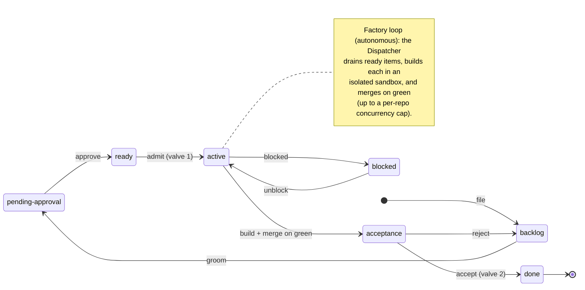

# livespec

A system for governing a living natural-language specification —
seeding, proposing changes, critiquing, revising, validating, and
versioning. This repo is livespec CORE: the contract, the
harness-neutral driving prose, the reference spec-side CLIs, the
schemas, and the built-in templates. The interactive slash-command
surface ships separately as a per-agent-runtime **Driver** plugin
(the first is [livespec-driver-claude](https://github.com/thewoolleyman/livespec-driver-claude)
for Claude Code).

> **New here?** Start with the **[spec / implementation lifecycle
> diagram](SPECIFICATION/spec.md#tool-agnostic-workflow--spec--implementation-lifecycle)**
> in `SPECIFICATION/spec.md` — the whole tool-agnostic workflow at a
> glance: how intent becomes spec, and how the **Gap** (spec →
> implementation) and **Drift** (implementation → spec) flows span the
> Spec, Orchestrator, and Control planes. Single-sourced in the spec and
> referenced here, never copied.

## Install

> **Setting up a new project?** See **[docs/installation.md](docs/installation.md)**
> for the full end-to-end guide — choosing an orchestrator backend,
> `.livespec.jsonc`, seeding the spec, and the Beads/Dolt + Fabro host
> runtime. The summary below covers plugin enablement only.

Two plugins — core (this repo: prose + CLIs + templates) and the
Claude Code Driver (the `/livespec:*` commands). Enable them
**per-project** by committing a `.claude/settings.json` to the repo
you want livespec to govern, so the skills (and the Driver's bundled
hooks) load **only** in that project — never machine-wide:

```jsonc
{
  "extraKnownMarketplaces": {
    "livespec":               { "source": { "source": "github", "repo": "thewoolleyman/livespec", "ref": "release" } },
    "livespec-driver-claude": { "source": { "source": "github", "repo": "thewoolleyman/livespec-driver-claude", "ref": "release" } },
    "livespec-orchestrator-beads-fabro":    { "source": { "source": "github", "repo": "thewoolleyman/livespec-orchestrator-beads-fabro", "ref": "release" } }
  },
  "enabledPlugins": {
    "livespec@livespec": true,
    "livespec@livespec-driver-claude": true,
    "livespec-orchestrator-beads-fabro@livespec-orchestrator-beads-fabro": true
  }
}
```

Enable **core + Driver + the impl-plugin named by your project's
`.livespec.jsonc`** `implementation.plugin` key — swap
`livespec-orchestrator-beads-fabro` for your impl (e.g. `livespec-impl-plaintext`)
in both the `extraKnownMarketplaces` and `enabledPlugins` blocks.
Because enablement is committed at **project scope**, clones, CI, and
sandboxes all resolve the same remote-GitHub marketplaces, and
unrelated projects on the same machine are untouched.

After committing the settings, restart Claude Code (or run
`/reload-plugins`). The eight slash commands below become available
with the `livespec:` namespace prefix (the Driver plugin is
deliberately named `livespec` to preserve the established surface).

> Maintainer dogfooding loads the local source instead: launch with
> `claude --plugin-dir .` from the repo root (see "Daily dogfooding"
> in `.claude/CLAUDE.md`). A machine-wide `/plugin install
> livespec@livespec` still works, but it enables the plugin in
> **every** project on the host — prefer the committed project-scoped
> settings above.

## Slash commands

- `/livespec:seed` — author the initial natural-language spec
- `/livespec:propose-change` — file a proposed change against the spec
- `/livespec:critique` — surface issues in the spec
- `/livespec:revise` — accept or reject pending proposed changes
- `/livespec:doctor` — run static + LLM-driven validation
- `/livespec:prune-history` — collapse old `history/vNNN/` entries
- `/livespec:next` — rank the next spec-side action (revise, propose-change, critique, prune-history, or none)
- `/livespec:help` — overview + routing to the right sub-command

## Architecture — contract + reference implementations

The **canonical architecture diagram** (Mermaid) is the single source
of truth in
[`SPECIFICATION/spec.md` §"Contract + reference implementations architecture"](SPECIFICATION/spec.md#contract--reference-implementations-architecture)
— it renders inline there on GitHub. To keep it DRY (one source, no
duplication / rot / drift), this README **references** that diagram
rather than embedding a second copy.

The decided target architecture (2026-06-09): LiveSpec core is a
**CLI contract** wired by `.livespec.jsonc`, agnostic to both the
**Driver** (the thin per-agent-runtime wrapper — Claude Code, Codex,
Pi) and the **orchestrator** (the pluggable producer whose work
product is the implementation; internally a Ledger + Loop +
Dispatcher). There are ZERO direct dependencies between Driver and
orchestrator. Reference orchestrators: **git-jsonl** (serial) and
**Beads/Dolt + Fabro** (parallel; dogfooded fleet-wide).

Three invariants the diagram pins down:

- **ZERO direct Driver ↔ orchestrator dependencies** (load-bearing
  invariant). Forbidden both ways: the Driver never reads
  orchestrator prose; the orchestrator never calls back into the
  Driver.
- **The orchestrator is self-contained**: prose / prompts / store /
  loop are PRIVATE. Interactive dialogue is orchestrator-owned via
  its own in-repo SKILL.md front-ends (decision 2026-06-09). If
  LLM-driven without its own runtime, it shells a model CLI as a
  subprocess — depending on "a model is invokable", NOT on the
  Driver. Ledger/Loop/Dispatcher is internal decomposition guidance,
  never core contract surface.
- **Doctor is NOT privileged**: config-named and overridable like any
  other spec-side CLI. Its entire cross-boundary job is CLI
  callability. Core never sees work-items, gaps, stores, or
  dependency graphs.

Normative home: `SPECIFICATION/spec.md` §"Contract + reference
implementations architecture", which carries the canonical Mermaid
diagram itself (single source of truth).
Design rationale:
[`research/workflow-processes/livespec-as-contract-and-reference-implementations.md`](research/workflow-processes/livespec-as-contract-and-reference-implementations.md)
(+ the
[reframing follow-up](research/workflow-processes/livespec-as-contract-and-reference-implementations-reframing.md)).
The §"Cross-repo orchestration" section below describes the
post-cutover state: the resident Layer-3 loop driver has been retired
in favor of the reference Dispatcher.

## How livespec relates to the field

Spec-driven development tools have converged on a three-lane model —
**reason → specify → produce**. livespec governs all three as one
disciplined, agent-runtime-agnostic system, and adds the rule the field
has not solved: a planning artifact must never quietly become a second
tracker.

| Lane | The field | livespec |
|---|---|---|
| **Reason / plan** | spec-kit `plan.md`, Kiro `design.md`, Cline `activeContext.md` + `progress.md` | the **Planning Lane** — durable `plan/<topic>/` reasoning plus a ledger-anchored, resumable handoff, under the **no-shadow-ledger** rule |
| **Specify** | spec-kit `spec.md`, Kiro `requirements.md` | the governed `/livespec:*` natural-language spec lifecycle (`seed`, `propose-change`, `critique`, `revise`, `doctor`, versioned history) |
| **Produce** | beads ledger, ad-hoc agent loops | an **orchestrator-agnostic** producer (reference: Beads/Dolt + Fabro) consuming the spec through three CLIs, with a Gap/Drift feedback spine |

The gap livespec closes: the field treats planning as scratch prose that
drifts into an unaccountable parallel work queue. livespec's **Planning
Lane** makes planning a first-class, multi-session lane whose status is
always *derived from* the work-item ledger — never stored — so the plan
stays a plan and the ledger stays the single source of truth. The
architecture is framed in
[`SPECIFICATION/spec.md` §"Workflow planes and the Planning Lane"](SPECIFICATION/spec.md#workflow-planes-and-the-planning-lane);
the design rationale lives in
[`research/planning-workflow-gap/`](research/planning-workflow-gap/).

## Cross-repo orchestration

Cross-repo orchestration is carried by the reference **Beads/Dolt +
Fabro orchestrator** — a Beads/Dolt Ledger, a Fabro Loop, and a thin
Dispatcher (`livespec-orchestrator-beads-fabro`'s `dispatcher.py`). The Dispatcher
polls the ledger, dispatches each ready work-item into its own Fabro
sandbox, runs `just check` plus `/livespec:doctor` as a hard janitor
gate, verifies the merge, and closes the item — carrying routine
cross-repo work unattended across the whole livespec fleet (livespec,
livespec-impl-*, livespec-dev-tooling, livespec-runtime).

The project-local `/livespec-orchestrate` Layer-3 loop-driver skill
that previously filled this role was **retired at the W6 dark-factory
cutover** (user-declared 2026-06-15), per `SPECIFICATION/spec.md`
§"Contract + reference implementations architecture". No repository is
required to carry a cross-repo loop driver as core contract surface;
the Dispatcher's invocation surface (`mode`, `budget`), janitor
hard-gate, and structured iteration journal are codified in the
orchestrator repo's own specification. The retired skill is
recoverable from git history.

## The work-item lifecycle

livespec runs software work as an explicit, **deterministic state
machine**, so that an autonomous **factory** can build and merge routine
changes unattended — with a human in control at exactly two points. Every
unit of work (a *work-item*: a bug, a feature slice, a chore) moves through
seven named states, and those transitions are the only way work advances:

- **backlog** — filed, not yet shaped
- **pending-approval** — shaped ("groomed") into a well-defined slice, awaiting a go-ahead
- **ready** — approved; eligible for the factory to pick up
- **active** — a doer (usually the factory) is building it
- **acceptance** — built, merged, and live; awaiting a final "is this actually good?" check
- **done** — accepted and closed
- **blocked** — waiting on something external (a dependency, a human, an outside system)

Two **human-delegable valves** gate the risk — safe by default, but each
can be set to run automatically for low-risk work:

- **Admission** (`ready → active`) — *should the factory start this?*
  Risky or irreversible work waits for a human; routine work is auto-admitted.
- **Acceptance** (`acceptance → done`) — *is the shipped result good?*
  Confirmed after the change is live (against tests + telemetry) by an AI
  check, a human, or both.

The **factory loop** is the autonomous span in the middle: an
orchestrator's *Dispatcher* continuously drains **ready** items (up to a
per-repo concurrency cap), builds each in an isolated sandbox, runs the
full checks, and **merges on green** into **acceptance**. Everything before
`ready` is shaping; everything after `acceptance` is sign-off; in between,
the factory runs on its own.



Storage is pluggable — the reference orchestrator uses a Beads/Dolt
ledger — but the states and rules are livespec's own; a backend is just
one realization. This is a deliberately minimal, human-oriented view; the
fully-specified machine (transition guards, ordering, rationale) lives in
[`SPECIFICATION/`](SPECIFICATION/).

## Fresh-clone setup

After cloning, run `just bootstrap` once. The target idempotently installs the canonical structural commit-refuse hook at `.git/hooks/pre-commit`, `.git/hooks/pre-push`, and `.git/hooks/commit-msg` (per `SPECIFICATION/non-functional-requirements.md` §"Primary-checkout commit-refuse hook" / §"Commit-refuse hook bootstrap procedure") — armed on install, refusing commits/pushes at the primary checkout structurally (when `git rev-parse --git-dir` equals `git rev-parse --git-common-dir`), with no `livespec.primaryPath` arming step — forcing every edit through `git worktree add` while still allowing reads/fetches at the primary, then installs lefthook hooks, resolves plugin dependencies, creates `~/.worktrees`, and registers it in mise's `trusted_config_paths`. That last step ensures every worktree created at `~/.worktrees/<repo>/<branch>` auto-trusts its `.mise.toml`, so the first `mise exec` inside a fresh worktree never stalls on a "config not trusted" prompt.

## Dogfooding (editing the plugin source in this repo)

Two paths:

- **Live-reload mode** (daily dev): launch Claude Code with
  `claude --plugin-dir .` from the repo root. The core plugin loads
  directly from the local source; edits to `.claude-plugin/prose/<name>.md`
  and `.claude-plugin/scripts/...` are picked up via `/reload-plugins`
  without re-installing. (The Driver's SKILL.md bindings resolve a
  local core checkout automatically when the governed project IS this
  repo; edit the bindings themselves in the
  [livespec-driver-claude](https://github.com/thewoolleyman/livespec-driver-claude)
  repo.)
- **Marketplace install path** (verifies the published flow):
  use the install commands above (or
  `/plugin marketplace add ./.claude-plugin/marketplace.json`
  for the local marketplace variant). Either copies the plugin
  into `~/.claude/plugins/cache/` and does NOT live-reload — run
  `/plugin update livespec@livespec` to pull changes after editing.

## Observability

The livespec fleet dogfoods its own telemetry. CI runs, Red→Green commit-gate cycles, the beads+fabro dispatcher, sandbox runs, and harness sub-agents are published to a shared Honeycomb environment:

- **[livespec fleet — all activity](https://ui.honeycomb.io/thewoolleyweb/environments/livespec/board/krThv8DvcwS)** — the cross-repo activity board (Honeycomb, `livespec` environment).

## More

- See [docs/installation.md](docs/installation.md) for the full end-to-end install / onboarding guide.
- See [AGENTS.md](AGENTS.md) for repo orientation.
- See [SPECIFICATION/](SPECIFICATION/) for the live livespec specification (dogfooded).
- See [archive/](archive/) for bootstrap-process history.
