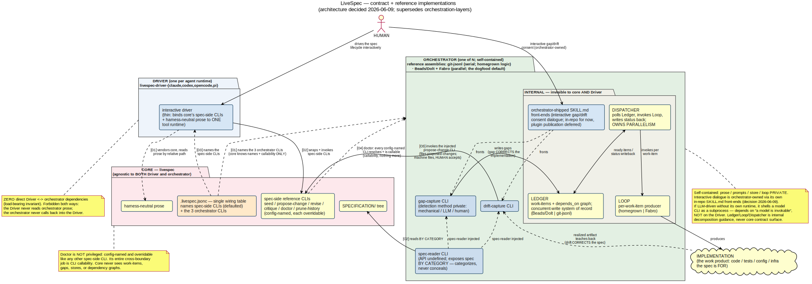

# livespec

A Claude Code plugin for governing a living natural-language
specification — seeding, proposing changes, critiquing, revising,
validating, and versioning.

## Install

```
/plugin marketplace add thewoolleyman/livespec
/plugin install livespec@livespec
```

After install, restart Claude Code (or run `/reload-plugins`).
The eight slash commands below become available with the
`livespec:` namespace prefix.

## Slash commands

- `/livespec:seed` — author the initial natural-language spec
- `/livespec:propose-change` — file a proposed change against the spec
- `/livespec:critique` — surface issues in the spec
- `/livespec:revise` — accept or reject pending proposed changes
- `/livespec:doctor` — run static + LLM-driven validation
- `/livespec:prune-history` — collapse old `history/vNNN/` entries
- `/livespec:next` — rank the next spec-side action (revise, propose-change, critique, prune-history, or none)
- `/livespec:help` — overview + routing to the right sub-command

## Architecture — contract + reference implementations



The decided target architecture (2026-06-09): LiveSpec core is a
**CLI contract** wired by `.livespec.jsonc`, agnostic to both the
**Driver** (the thin per-agent-runtime wrapper — Claude Code, Codex,
Pi) and the **orchestrator** (the pluggable producer whose work
product is the implementation; internally a Ledger + Loop +
Dispatcher). There are ZERO direct dependencies between Driver and
orchestrator. Reference orchestrators: **git-jsonl** (serial) and
**Beads/Dolt + Fabro** (parallel; dogfooded family-wide).

Diagram source:
[`contract-and-reference-implementations.plantuml`](research/workflow-processes/diagrams/contract-and-reference-implementations.plantuml).
Normative spec change (pending revise):
[`SPECIFICATION/proposed_changes/contract-and-reference-implementations-phase-1.md`](SPECIFICATION/proposed_changes/contract-and-reference-implementations-phase-1.md).
Design rationale:
[`research/workflow-processes/livespec-as-contract-and-reference-implementations.md`](research/workflow-processes/livespec-as-contract-and-reference-implementations.md)
(+ the
[reframing follow-up](research/workflow-processes/livespec-as-contract-and-reference-implementations-reframing.md)).
The §"Cross-repo orchestration" section below describes the CURRENT
(pre-migration) state and is superseded as the phases land.

## Cross-repo orchestration

The Layer 3 cross-repo orchestration driver lives at
[`.claude/skills/livespec-orchestrate/SKILL.md`](.claude/skills/livespec-orchestrate/SKILL.md)
per `SPECIFICATION/spec.md` §"Three-layer orchestration architecture". It
is a project-local skill (loaded as `/livespec-orchestrate` when
working inside this repo) — NOT a namespaced plugin skill; the
`livespec-` prefix is a manual visual scoping convention to avoid
colliding with the harness's built-in `/loop` recurring-task skill —
and it is the single Layer 3 driver across the whole livespec family
of repos (livespec, livespec-impl-*, livespec-dev-tooling,
livespec-runtime).

The driver composes `/livespec:next` and the active impl-plugin's
`next` into a cross-side ranking, dispatches sub-agents (with
worktree isolation) into the sibling repos, runs `just check` plus
`/livespec:doctor` as a hard janitor gate, and emits a structured
iteration journal. It accepts `mode` (interactive | autonomous),
`budget` (iteration count | wallclock | tokens), an optional `epic`
work-item ID, and an optional `scope-file` carrying epic-specific
pre-authorization rules.

Halt conditions, dispatch table, and the wave-plan grammar for
`scope-file` are documented in the skill body.

## Fresh-clone setup

After cloning, run `just bootstrap` once. The target idempotently sets `livespec.primaryPath` on the primary checkout and installs the canonical commit-refuse hook at `.git/hooks/pre-commit` + `.git/hooks/pre-push` (per `SPECIFICATION/non-functional-requirements.md` §"Primary-checkout commit-refuse hook" / §"Commit-refuse hook bootstrap procedure"), forcing every edit through `git worktree add` while still allowing reads/fetches at the primary, then installs lefthook hooks and resolves plugin dependencies.

## Dogfooding (editing the plugin source in this repo)

Two paths:

- **Live-reload mode** (daily dev): launch Claude Code with
  `claude --plugin-dir .` from the repo root. The plugin loads
  directly from the local source; edits to `.claude-plugin/skills/<name>/SKILL.md`
  and `.claude-plugin/scripts/...` are picked up via `/reload-plugins`
  without re-installing.
- **Marketplace install path** (verifies the published flow):
  use the install commands above (or
  `/plugin marketplace add ./.claude-plugin/marketplace.json`
  for the local marketplace variant). Either copies the plugin
  into `~/.claude/plugins/cache/` and does NOT live-reload — run
  `/plugin update livespec@livespec` to pull changes after editing.

## More

- See [AGENTS.md](AGENTS.md) for repo orientation.
- See [SPECIFICATION/](SPECIFICATION/) for the live livespec specification (dogfooded).
- See [archive/](archive/) for bootstrap-process history.
