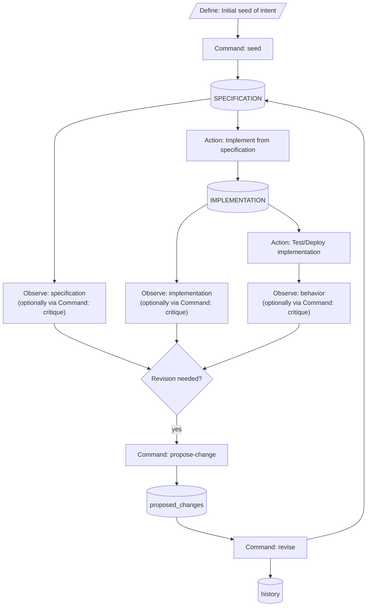

# Specification — `livespec`

This document MUST be read alongside `contracts.md`, `constraints.md`, and `scenarios.md`. The four files together constitute the canonical natural-language specification for `livespec` per the `livespec` template's multi-file convention. Each file scopes a different concern: this file describes intent and behavior; `contracts.md` carries the wire-level interfaces; `constraints.md` carries the architecture-level constraints; `scenarios.md` carries the behavioral narratives.

## Project intent

`livespec` provides governance and lifecycle management for a living `SPECIFICATION` directory. It MUST NOT be conflated with a spec authoring format, an implementation engine, or a workflow runner. The central invariant: a project's `SPECIFICATION` is the maintained source of truth for intended system behavior, and all changes to that `SPECIFICATION` flow through a documented, versioned propose → revise → acknowledge → validate cycle.

The seeded `SPECIFICATION/` tree at this revision (v001) derives from the brainstorming archive at `brainstorming/approach-2-nlspec-based/PROPOSAL.md` (frozen at v036) and `brainstorming/approach-2-nlspec-based/goals-and-non-goals.md`. Companion docs in that archive (the Python style requirements, the NLSpec discipline doc, lifecycle and terminology docs, prior-art survey) MUST migrate via dedicated Phase 8 propose-change cycles per Plan §"Phase 8 — Process every deferred-items entry" rather than land en masse in this seed.

## Runtime and packaging

`livespec` ships as a Claude Code plugin at `.claude-plugin/`. The plugin bundle MUST contain (a) skill prompts under `skills/<sub-command>/SKILL.md`, (b) a Python wrapper layer under `scripts/bin/<sub-command>.py` and `scripts/livespec/commands/<sub-command>.py`, (c) built-in templates under `specification-templates/<name>/`, and (d) vendored pure-Python libraries under `scripts/_vendor/`.

Python 3.10 is the minimum runtime per `.python-version` and `pyproject.toml`'s `requires-python`. The `_bootstrap.py` shebang-wrapper preamble MUST exit 127 on Python below 3.10 with an install-instruction message before any `livespec` import.

Vendored runtime dependencies are: `fastjsonschema`, `returns` (+ vendored upstream `typing_extensions` per v027 D1), `structlog`, and a hand-authored JSONC shim per v026 D1. Each vendored entry MUST appear in `.vendor.jsonc` with non-placeholder `upstream_url`, `upstream_ref`, and `vendored_at` fields.

## Specification model

A spec tree is a directory rooted at the `spec_root` path declared in the active template's `template.json`. The tree MUST contain the template-declared spec files (e.g., `spec.md`, `contracts.md`, `constraints.md`, `scenarios.md`, `README.md` for the `livespec` template), a `proposed_changes/` subdir, and a `history/` subdir. Both the `proposed_changes/` and `history/` subdirs carry a skill-owned `README.md` written by the seed wrapper at seed time and never modified by `revise`; per `contracts.md` §"Sub-spec structural mechanism", every sub-spec tree carries the same skill-owned README pair.

Multi-tree projects (the meta-project case where the project ships its own `livespec` templates) MAY emit one sub-spec tree per template under `<spec_root>/templates/<template-name>/`. Sub-specs follow the same internal structure as the main spec uniformly per v020 Q1, decoupled from the user-facing template's end-user spec convention.

## Sub-command lifecycle

`livespec` exposes six sub-commands: `seed`, `propose-change`, `critique`, `revise`, `prune-history`, and `doctor`. Each sub-command MAY be invoked via `/livespec:<name>` from Claude Code, which dispatches to the matching `skills/<name>/SKILL.md` prompt. The skill prose MUST orchestrate (a) dialogue capture, (b) prompt-driven content generation, (c) wrapper invocation, and (d) structured-finding interpretation.

Per PROPOSAL.md §"Sub-command lifecycle orchestration", every command except `help`, `doctor`, and `resolve_template` MUST run a pre-step `doctor`-static check before its action and a post-step `doctor`-static check after. Pre-step ensures the working state is consistent before mutation; post-step ensures the result is consistent before returning success.

Sub-command applicability for the pre-step / post-step wrapper lifecycle:

- **`seed`** is exempt from pre-step `doctor` static (see PROPOSAL.md). Runs sub-command logic + post-step only.
- **`help` and `doctor`** have no pre-step and no post-step wrapper-side static.
- **`prune-history`** has pre-step and post-step static but no post-step LLM-driven phase.
- **`propose-change`, `critique`, `revise`** have both pre-step and post-step static.

The post-step LLM-driven phase, where applicable, runs from skill prose AFTER the Python wrapper exits; Python MUST NOT invoke the LLM. The `--skip-doctor-llm-objective-checks` / `--run-doctor-llm-objective-checks` and `--skip-doctor-llm-subjective-checks` / `--run-doctor-llm-subjective-checks` flag pairs are LLM-layer only — they gate the two post-step LLM-driven phases (both skill prose) and MUST NOT reach Python wrappers.

Python composition mechanism for the lifecycle chain (pre-step + sub-command logic + post-step) is implementer choice under the architecture-level constraints in `SPECIFICATION/constraints.md`.

**`critique` payload validation.** `bin/critique.py` validates the inbound `--findings-json` payload against `proposal_findings.schema.json` at the wrapper boundary before any internal delegation. Schema-violation, JSON-malformation, and absent-payload-file failures all lift to exit 4 with structured findings emitted on stderr per the `LivespecError` envelope. Per contracts.md §"Lifecycle exit-code table", the calling `critique/SKILL.md` prose SHOULD interpret exit 4 as a retryable malformed-payload signal and re-invoke the template prompt with error context; the retry count is intentionally unspecified in v1. The skill MAY surrender after a bounded number of retries by surfacing the structured findings to the user.

**`critique` internal delegation (PROPOSAL.md §"`critique`" lines 2364-2403).** After successful payload validation, `bin/critique.py` resolves the author identifier via the unified precedence already codified in §"Author identifier resolution" and delegates to `propose-change`'s internal Python logic with the resolved-author stem as topic hint and the literal string `"-critique"` as the reserve-suffix parameter. The topic hint passed in is the un-slugged resolved-author stem itself; `critique` MUST NOT pre-attach `-critique` to the hint. `propose-change`'s reserve-suffix canonicalization (codified in §"Proposed-change and revision file formats" under "Reserve-suffix canonicalization (v016 P3...)") composes the two into the canonical critique-delegation topic, guaranteeing the `-critique` suffix is preserved intact at the 64-char cap and pre-attached `-critique` does not double. `-critique` is the canonical critique-delegation suffix; no other suffix value is permitted on this code path. The internal delegation MUST NOT retrigger the pre/post `doctor`-static cycle described above — the outer `critique` invocation's wrapper ROP chain already covers the whole operation; only one pre-step and one post-step `doctor` run per outer CLI invocation, regardless of how many internal wrapper compositions occur. After the delegation writes the proposed-change file, `critique` exits with `propose-change`'s exit code; `critique` does NOT run `revise`. The user reviews the resulting proposed-change file and invokes `/livespec:revise` separately to process it.

**`revise` payload validation.** `bin/revise.py` validates the inbound `--revise-json` payload against `revise_input.schema.json` at the wrapper boundary before any deterministic file-shaping. Schema-violation, JSON-malformation, and absent-payload-file failures all lift to exit 4 with structured findings emitted on stderr per the `LivespecError` envelope. Per contracts.md §"Lifecycle exit-code table", the calling `revise/SKILL.md` prose SHOULD interpret exit 4 as a retryable malformed-payload signal and re-assemble (or re-prompt) accordingly; the retry count is intentionally unspecified in v1. The skill MAY surrender after a bounded number of retries by surfacing the structured findings to the user.

**`revise` lifecycle and responsibility separation (PROPOSAL.md §"`revise`" lines 2405-2522).** The `revise` LLM-driven per-proposal acceptance dialogue, the per-`## Proposal` accept/modify/reject decision-and-rationale capture, the `modify`-decision iteration to convergence, the apply-to-all-remaining-proposals delegation toggle, the optional `<revision-steering-intent>` disambiguation (warn-and-proceed when steering-intent contains spec content rather than per-proposal decision-steering), and the retry-on-exit-4 handshake are skill-prose responsibilities under `revise/SKILL.md`; `bin/revise.py` MUST NOT invoke the template prompt, the LLM, or the interactive confirmation flow. After the skill assembles a `revise_input.schema.json`-conforming payload, the wrapper performs deterministic file-shaping: (a) it MUST fail hard with `PreconditionError` (exit 3) when `<spec-target>/proposed_changes/` contains no in-flight proposal files (the skill-owned `proposed_changes/README.md` does not count); (b) proposals are processed in YAML front-matter `created_at` creation-time order (oldest first), with lexicographic filename as tiebreaker; within each file, `## Proposal` sections are processed in document order; (c) per v038 D1 (Statement B), a new `<spec-target>/history/vNNN/` is cut on every successful revise invocation — when at least one decision is `accept` or `modify`, the working-spec files named in those decisions' `resulting_files[]` are updated in place before the snapshot; when every decision is `reject`, the new version's spec files are byte-identical copies of the prior version's spec files (rejection-flow audit trail per Plan Phase 7 line 3383); (d) on every cut, `<spec-target>/history/vNNN/` snapshots every template-declared spec file byte-identically as it stands post-update (or post-no-update, on all-reject); (e) every processed proposal moves byte-identically from `<spec-target>/proposed_changes/<stem>.md` to `<spec-target>/history/vNNN/proposed_changes/<stem>.md` — the filename stem is preserved including any `-N` collision-disambiguation suffix per the §"Proposed-change and revision file formats" filename-stem rule (v017 Q7); (f) every processed proposal gets a paired `<stem>-revision.md` written to the same `history/vNNN/proposed_changes/` directory using the same stem; (g) after successful completion `<spec-target>/proposed_changes/` MUST be empty of in-flight proposals (the skill-owned `proposed_changes/README.md` persists). The author identifier for the revision-file `author_llm` field follows the unified precedence already codified in §"Author identifier resolution".

**`prune-history` lifecycle and responsibility separation (PROPOSAL.md §"Pruning history" lines 1827-1872, §"`prune-history`" lines 2532-2544).** The `prune-history` LLM-driven invocation dialogue, the destructive-operation user-confirmation flow (the skill SKILL.md frontmatter MUST set `disable-model-invocation: true` so the user MUST invoke `/livespec:prune-history` explicitly), and the post-prune narrative are skill-prose responsibilities under `prune-history/SKILL.md`; `bin/prune_history.py` MUST NOT invoke the template prompt, the LLM, or the interactive confirmation flow. The wrapper resolves the spec root from `--project-root` and `.livespec.jsonc` via the shared upward-walk helper (the main spec tree only — there is no `--spec-target` flag for prune-history in v1) and performs deterministic file-shaping: (a) it identifies the current highest version `vN` under `<spec-root>/history/`; (b) it resolves the carry-forward `first` field — if `<spec-root>/history/v(N-1)/PRUNED_HISTORY.json` exists, it reads that file's `pruned_range[0]` and uses it as `first`; otherwise `first` is the smallest-numbered v-directory currently under `<spec-root>/history/` (typically `1`); (c) it deletes every `<spec-root>/history/vK/` where `K < N-1`; (d) it replaces the contents of `<spec-root>/history/v(N-1)/` with a single file `<spec-root>/history/v(N-1)/PRUNED_HISTORY.json` containing exactly `{"pruned_range": [first, N-1]}` — no timestamps, git SHAs, or identity fields (per the no-metadata invariant; git commit metadata already provides that audit context); (e) `<spec-root>/history/vN/` is left fully intact. The version counter never resets — `PRUNED_HISTORY.json`'s `pruned_range[0]` carries the original-earliest version number forward across multiple prune cycles. Two no-op short-circuits MUST be detected before reaching step (c): (i) only `v001` exists under `<spec-root>/history/` (nothing to prune); (ii) the oldest surviving v-directory under `<spec-root>/history/vK/` (smallest `K < N`) already contains a `PRUNED_HISTORY.json` marker (no full versions remain to prune below the prior marker). On either no-op, the wrapper emits a single-finding `{"findings": [{"check_id": "prune-history-no-op", "status": "skipped", "message": "nothing to prune; oldest surviving history is already PRUNED_HISTORY.json"}]}` JSON document to stdout and exits 0; the existing marker is NOT re-written, no new commit-worthy diff is produced.

**Pre-step skip control (PROPOSAL.md §"Pre-step skip control" lines 811-822).** The `propose-change`, `critique`, `revise`, and `prune-history` wrappers each support a mutually-exclusive `--skip-pre-check` / `--run-pre-check` flag pair via argparse's `add_mutually_exclusive_group`. Effective skip resolution: (1) `--skip-pre-check` present → skip = true; (2) `--run-pre-check` present → skip = false (overrides config); (3) neither flag → use the `.livespec.jsonc` config key `pre_step_skip_static_checks` (default `false`); (4) both flags present → argparse rejects with a usage error and the wrapper exits 2 via `IOFailure(UsageError)`. When the resolved value is `true`, the wrapper MUST emit a single-finding `{"findings": [{"check_id": "pre-step-skipped", "status": "skipped", "message": "pre-step checks skipped by user config or --skip-pre-check"}]}` JSON document to stdout and proceed without invoking the pre-step doctor static phase. The Python layer MUST NOT print warning text outside the structured-findings contract or as ad-hoc stderr text — LLM narration in the SKILL.md prose surfaces the warning to the user. `bin/doctor_static.py` rejects BOTH `--skip-pre-check` AND `--run-pre-check` (it IS the static phase); passing either to it results in argparse usage error, exit 2.
## Versioning

The `SPECIFICATION/history/v<NNN>/` directory holds an immutable snapshot of every spec file as it stood when revision `vNNN` was finalized. Snapshots are produced by `revise`; they MUST be byte-identical to the live spec files at the moment the revision is committed. The version sequence is contiguous: `v001`, `v002`, `v003`, … with no gaps.

`livespec` itself versions via Conventional Commits + semantic-release per v034 D1. Releases happen on `master` as a side-effect of `feat:` / `fix:` commits landing through the protected-branch PR workflow.

## Pruning history

`prune-history` MAY remove the oldest contiguous block of `history/v*/` directories down to a caller-specified retention horizon while preserving the contiguous-version invariant for the remaining tail. Phase 3 lands the parser-only stub; Phase 7 widens it to the actual pruning mechanic.

**`version-directories-complete` pruned-marker exemption (PROPOSAL.md §"Doctor static checks" lines 2777-2785).** The `version-directories-complete` doctor static check enforces that every `<spec-root>/history/vNNN/` directory contains the full set of template-required spec files, a `proposed_changes/` subdir, and — when the active template declares a versioned per-version `README.md` (the built-in `livespec` template declares one; the built-in `minimal` template does not, per v014 N1 / v015 O2) — a matching `README.md`. The pruned-marker directory is exempt from this requirement: the oldest surviving v-directory under `<spec-root>/history/`, when its root contains a `PRUNED_HISTORY.json` document, MUST contain ONLY `PRUNED_HISTORY.json` (no template-required spec files, no `proposed_changes/` subdir, no per-version `README.md`). The marker-detection predicate is the literal presence of `PRUNED_HISTORY.json` at the directory root; the `version-directories-complete` static check honors this exemption uniformly across main spec and sub-spec trees. This is the consumer-side counterpart to the producer-side mechanic in §"Sub-command lifecycle" (the `prune-history` lifecycle paragraph), which describes how `prune-history` replaces `<spec-root>/history/v(N-1)/`'s contents with a single `PRUNED_HISTORY.json` file when constructing the marker directory.

## Proposed-change and revision file formats

`<spec-target>/proposed_changes/<topic>.md` holds an in-flight change request. The file MUST contain one or more `## Proposal: <name>` sections with `### Target specification files`, `### Summary`, `### Motivation`, and `### Proposed Changes` subsections per PROPOSAL.md §"propose-change".

**Topic canonicalization (v015 O3).** `propose-change` treats the inbound `<topic>` as a user-facing topic hint, not yet the canonical artifact identifier. Before collision lookup, filename selection, or front-matter population, the wrapper canonicalizes the topic via: lowercase → replace every run of non-[a-z0-9] characters with a single hyphen → strip leading and trailing hyphens → truncate to 64 characters. If the result is empty, the wrapper exits 2 with `UsageError`. The canonicalized topic is used uniformly for the output filename, the proposed-change front-matter `topic` field, and the collision-disambiguation namespace. This applies to direct callers and to internal delegates such as `critique`.

**Reserve-suffix canonicalization (v016 P3; PROPOSAL.md scope trimmed to invariants-only in v017 Q1).** `propose-change` accepts an optional `--reserve-suffix <text>` flag (also exposed as a keyword-only parameter on the Python internal API path used by `critique`'s internal delegation). When supplied, canonicalization guarantees that the resulting topic is at most 64 characters AND that the caller-supplied suffix is preserved intact at the end of the result, even when the inbound hint already ends in that suffix (pre-attached case) or when truncation would otherwise clip the suffix. When `--reserve-suffix` is NOT supplied, canonicalization behaves exactly as the v015 O3 rule above. The empty-after-canonicalization `UsageError` (exit 2) continues to apply to the final composed result. The exact algorithm (pre-strip, truncate-and-hyphen-trim, re-append) is codified in `deferred-items.md`'s `static-check-semantics` entry; this spec deliberately does not duplicate the algorithm here, per the architecture-vs-mechanism discipline.

**Collision disambiguation (v014 N6).** If a file with topic `<canonical-topic>.md` already exists, the wrapper MUST auto-disambiguate by appending a hyphen-separated **monotonic integer suffix starting at `2`**: the first collision becomes `<canonical-topic>-2.md`, the second `<canonical-topic>-3.md`, and so on. No zero-padding is applied (so the tenth collision is `<canonical-topic>-10.md`; alphanumeric sort misordering past nine duplicates is accepted as an extreme edge case). No user prompt for collision. Starting the counter at `2` (not `1`) makes the "this is the second file named `<canonical-topic>`" relationship explicit; the first file is suffix-less by convention. Note: this convention applies to `propose-change` and `critique` filenames. The `out-of-band-edit-<UTC-seconds>.md` filename form used by the `doctor-out-of-band-edits` check is a separate always-appended UTC-timestamp convention (each backfill is a distinct timed event); the two conventions are not unified.

**Single-canonicalization invariant (v016 P4).** The `topic` field's value MUST be derived via the same canonicalization rule across ALL creation paths — user-invoked `propose-change`, `critique`'s internal delegation (which adds the `-critique` reserve-suffix; see the v016 P3 reserve-suffix paragraph above), and skill-auto-generated artifacts (`seed` auto-capture, `doctor-out-of-band-edits` backfill). Implementations MUST route every `topic` derivation through a single shared canonicalization so two `livespec` implementations cannot diverge on the `topic` value for semantically-identical inputs. This is an architecture-level requirement on the interface; the exact code-path mechanism (single helper function vs. anything else) is an implementation choice.

**Filename stem vs. front-matter `topic` distinction (v017 Q7).** Under the v014 N6 collision-disambiguation rule, the proposed-change filename stem may include a `-N` suffix (`foo.md`, `foo-2.md`, `foo-3.md`). The front-matter `topic` field carries ONLY the canonical topic WITHOUT the `-N` suffix — every file sharing a canonical topic shares the same front-matter `topic` value. The `-N` suffix is filename-level disambiguation only. Revision-pairing (per the `revision-to-proposed-change-pairing` doctor-static check) walks filename stems (not front-matter `topic` values); each `<stem>-revision.md` pairs with `<stem>.md` in the same directory.

`<spec-target>/proposed_changes/<topic>-revision.md` is the paired revision record produced by `revise`. After the revise commit lands, both files move atomically into `<spec-target>/history/v<NNN>/proposed_changes/`.

**Revision file format (PROPOSAL.md §"Revision file format" lines 3107-3167).** Each `<topic>-revision.md` MUST contain, in order: (1) YAML front-matter with the keys `proposal: <stem>.md` (the paired proposed-change filename stem, including any `-N` collision-disambiguation suffix per the filename-stem rule above), `decision: accept | modify | reject`, `revised_at: <UTC ISO-8601 seconds>`, `author_human: <git user.name and user.email per livespec.io.git.get_git_user(), or the literal "unknown" when git is available but either config value is unset>`, and `author_llm: <resolved author id per the unified precedence in §"Author identifier resolution">`; (2) `## Decision and Rationale` — always required; one paragraph explaining the decision; (3) `## Modifications` — REQUIRED when `decision: modify`; prose-form description of how the proposal was changed before incorporation, with optional short fenced before/after excerpts permitted for hyper-local clarity (line-number-anchored unified diffs are NOT used here per PROPOSAL §"Revision file format" line 3154 — they are fragile across multi-proposal revises); (4) `## Resulting Changes` — REQUIRED when `decision: accept` or `modify`; names the specification files modified and lists the sections changed; (5) `## Rejection Notes` — REQUIRED when `decision: reject`; explains what would need to change about the proposal for it to be acceptable in a future revision (this is the rejection-flow audit-trail richness Plan Phase 7 line 3383 mandates). For automated skill-tool-authored revisions (e.g., `seed` auto-capture, `out-of-band-edits` auto-backfill), `author_llm` takes the convention value `livespec-seed` / `livespec-doctor`, hardcoded by the wrapper and bypassing the precedence above.

## Author identifier resolution

The file-level `author` field in the resulting proposed-change front-matter is resolved by the unified precedence used across all three LLM-driven wrappers (`propose-change`, `critique`, `revise`):

1. If `--author <id>` is passed on the CLI and non-empty, use its value.
2. Otherwise, if the `LIVESPEC_AUTHOR_LLM` environment variable is set and non-empty, use its value.
3. Otherwise, if the LLM self-declared an `author` field in the `proposal_findings.schema.json` payload (file-level, optional) and it is non-empty, use that value.
4. Otherwise, use the literal `"unknown-llm"`.

A warning is surfaced via LLM narration whenever fallback (4) is reached.

**Author identifier → filename slug transformation (v014 N5).** When the resolved `author` value is used as a filename component (the raw topic stem passed from `critique`, or any other author-derived filename use in the future), the wrapper transforms it via the following rule: lowercase → replace every run of non-[a-z0-9] characters with a single hyphen → strip leading and trailing hyphens → truncate to 64 characters. The **slug form** is used as the filename component; the **original un-slugged value** is preserved in the YAML front-matter `author` / `author_human` / `author_llm` fields for audit-trail fidelity. The slug rule matches the GFM slug algorithm already used by the `anchor-reference-resolution` doctor-static check. This transformation applies whenever a resolved author value is used to derive a topic hint or filename component. Full semantics (edge cases, interaction with topic canonicalization, collision with already-slugged topic values) are codified in `deferred-items.md`'s `static-check-semantics` entry.

**`livespec-` prefix convention.** Identifiers with the prefix `livespec-` (e.g., `livespec-seed`, `livespec-doctor`) are used by skill-auto-generated artifacts (seed auto-capture, doctor-`out-of-band-edits` backfill). Human authors and LLMs SHOULD NOT use this prefix for their own artifacts so that the audit trail can visually distinguish skill-auto artifacts from user/LLM-authored ones. This is a convention; no mechanical enforcement exists — no schema pattern rejects `livespec-`-prefixed values from user-supplied sources, and no wrapper rejects them on input. Users who deliberately type `livespec-`-prefixed identifiers create self-inflicted audit-trail confusion but nothing breaks.

## Testing approach

Every Python source file under `livespec/`, `bin/`, and `dev-tooling/checks/` MUST have a paired test file at the mirrored path under `tests/`, except: (a) **private-helper modules** — `.py` files whose filename starts with `_` and is NOT `__init__.py` (e.g., `_seed_railway_emits.py`); these are covered transitively through the public function that imports them. (b) **Pure-declaration modules** — files whose AST contains no `FunctionDef` / `AsyncFunctionDef` anywhere (no module-level or class-level functions); covers boilerplate `__init__.py`, pure dataclass declarations, value-object modules, and the `LivespecError` hierarchy — none have testable behavior independent of their consumers. The `bin/_bootstrap.py` shebang preamble has its own special-cased test at `tests/bin/test_bootstrap.py`. The `dev-tooling/checks/tests_mirror_pairing.py` script enforces the binding mechanically and runs in the `just check` aggregate. Per-file line+branch coverage MUST be 100% (enforced by `dev-tooling/checks/per_file_coverage.py`). Coverage is computed under `pytest --cov` with `pyproject.toml`'s `[tool.coverage.run]` settings active.

The v034 D2-D3 Red→Green replay contract gates every `feat:` / `fix:` commit: the Red commit stages exactly one new test file and zero impl files; the Green amend stages the impl that turns the test green; the commit-msg hook verifies the temporal Red→Green order via reflog inspection plus test-file SHA-256 checksum.

**Prompt-QA tier (PROPOSAL.md §"Prompt-QA tier (per-prompt verification, v018 Q5)" lines 3987-4047).** Above the unit-test layer (which gates 100% per-file line+branch coverage on `livespec/`, `bin/`, `dev-tooling/checks/`), every built-in template's REQUIRED prompts (`prompts/seed.md`, `prompts/propose-change.md`, `prompts/revise.md`, `prompts/critique.md`) are exercised by per-prompt tests under `tests/prompts/<template>/`. Each test loads one or more fixture files capturing a prompt-input + canonical-LLM-response pair, validates the canonical response against its named JSON Schema (`seed_input.schema.json`, `proposal_findings.schema.json`, `revise_input.schema.json`), and asserts every declared semantic-property name in the fixture against per-template assertion functions. The prompt-QA tier is invoked via `just check-prompts` (included in `just check`); each built-in template MUST ship at least one prompt-QA test per REQUIRED prompt (4 prompts × 2 built-in templates = 8 minimum cases). The prompt-QA tier is scope-distinct from the v014 N9 end-to-end harness at `tests/e2e/` (which drives wrappers via the Claude Agent SDK surface) — the prompt-QA harness performs no LLM round-trip and no wrapper invocation, only deterministic replay-and-assert against canonical fixtures. Per the unit-tier coverage scope codified above, `tests/prompts/` is NOT measured for line+branch coverage; the prompt-QA tier provides additional confidence but does not contribute to the 100% gate.

Tests MUST NOT mutate files under `tests/fixtures/`; test-local filesystem state MUST use pytest's `tmp_path` fixture. Tests MUST NOT require network access; impure wrappers are stubbed via `monkeypatch.setattr`. Tests MUST be independent of execution order; no module-level mutable state that a prior test could leave behind. `@pytest.mark.parametrize` is the preferred idiom for tabulated inputs. Assertions use pytest's default assertion-introspection; no third-party assertion library is used. `pytest-icdiff` is enabled via `pyproject.toml`; it produces structured diffs on failure, aiding LLM consumption of test output.

The meta-test `tests/test_meta_section_drift_prevention.py` verifies every top-level (`##`) heading in each specification file has at least one corresponding entry in `tests/heading-coverage.json`. The meta-test `tests/bin/test_wrappers.py` verifies every `bin/*.py` wrapper (excluding `_bootstrap.py`) matches the exact 6-statement shebang-wrapper shape.

### Property-based testing for pure modules

Pure `Result`-returning modules (`livespec/parse/` and `livespec/validate/`) are mandatory targets for property-based testing via `hypothesis` (uv-managed per v024, NOT vendored). PBT generates many input shapes and checks invariants the test author may not have imagined.

- `hypothesis` and `hypothesis-jsonschema` (MIT) MUST be uv-managed via `pyproject.toml` `[dependency-groups.dev]`. They are NOT vendored in `_vendor/`.
- Each test module under `tests/livespec/parse/` and `tests/livespec/validate/` MUST declare at least one `@given(...)`-decorated test function.
- For schema-driven validators, `hypothesis-jsonschema` provides auto-generated strategies from the schema's JSON Schema definition; tests SHOULD use this rather than hand-authoring `@composite` strategies.

Enforced by AST check `check-pbt-coverage-pure-modules`.

### Mutation testing as release-gate

Mutation testing via `mutmut` (MIT; uv-managed per v024, NOT vendored) runs on a release-gate schedule (CI release branch only; not per-commit; NOT part of `just check`).

- `just check-mutation` runs `mutmut run` against `livespec/parse/` and `livespec/validate/` and reports kill rate.
- **Threshold:** ≥80% mutation kill rate. The 80% figure is initial guidance; first real measurement against shipping code may surface a different appropriate value, updated via a new propose-change cycle.
- Before first release-tag run, a `.mutmut-baseline.json` file MUST be committed at the repo root recording the kill-rate measurement at initial adoption. Subsequent tag runs compare against `min(baseline.kill_rate_percent - 5, 80)`.
- `just check-mutation` MUST emit to stderr a structured JSON summary when the threshold fails, containing `threshold_percent`, `kill_rate_percent`, and a `surviving_mutants` array with `file`, `line`, and `mutation_kind` fields.

## Test-Driven Development discipline

PROPOSAL.md §"Test-Driven Development discipline" is the canonical reference. This section is the operational companion: how the discipline is applied at the keyboard, day to day, in Python.

**Authoring rhythm.** Red and Green happen in the editor; only the cohesive unit of value (Red+Green together for a feature/bugfix; or a behavior-preserving structural change for a refactor) commits. `just check` runs as the pre-commit hook and a failing test rejects the commit — the discipline aligns with that: keep the Red phase in the editor, run it, observe it fail for the right reason, then write Green and commit the pair.

**Running a Red test in isolation.** Use pytest's `-k` or test-id syntax to run exactly the new test: `uv run pytest tests/livespec/<area>/test_<module>.py::<test_name>`. Confirm the failure message names the missing behavior. Unhelpful Reds (`ImportError`, `ModuleNotFoundError`, `NameError`, `TypeError` on call shape) MUST be fixed before proceeding to Green.

**Writing Green: the minimum that turns Red green.** A stub that returns `Failure(<error>)` for the specific inputs the test exercises is often enough. Resist anticipating downstream tests. Once Green, run `just check-coverage` (full suite + 100% line+branch in one pass per v039 D1).

**Per v039 D4 (proactive coverage discipline).** Before staging the Green amend, run `just check-coverage-incremental --paths <impl_path>`. The incremental tool finishes in seconds and surfaces coverage gaps (including defensive branches) BEFORE the Green amend triggers the full pre-commit aggregate. The full `check-coverage` aggregate runs at pre-commit as the load-bearing safety net; the incremental tool exists to make the failure mode rare.

**Refactor cycle (independent, structure-only).** A refactor commit is reviewable on its own terms: (1) confirm the suite is green pre-refactor; (2) identify and characterize any coverage gaps in the area; (3) apply the structural change, running `just check` after each meaningful step — tests MUST stay green throughout; (4) commit with a `refactor:` message prefix. If a test goes red mid-refactor, behavior changed — stop and reapply as a Red-Green-driven feature or restart with better characterization.

**Exception clauses (exhaustive list per PROPOSAL.md §"Test-Driven Development discipline"):**

| Change | Exception category |
|---|---|
| Rename a file via grep (no behavior change; existing tests follow) | Mechanical migration |
| Add `# noqa: E501` to a long line | Configuration-only |
| Add `__all__: list[str] = []` to a module | Type-only / convention |
| Update `CLAUDE.md` text | Documentation-only |
| Bump `pytest` minor version in `pyproject.toml` | Configuration-only (version pin)* |
| Introduce a `NewType` alias and propagate annotations | Type-only |
| Extract a helper function with no behavior change | Pure refactor |

\* If a config bump surfaces a new lint violation in covered code, the violation IS a behavior change and test-first reapplies — the failing-rule output is the Red signal. "I couldn't think of a failing test smaller than the implementation" is NOT an exception.

## Developer-tooling layout

`justfile` is the single source of truth for every dev-tooling invocation. `lefthook.yml` and CI workflows MUST delegate to `just <target>` and MUST NOT shell out to underlying tools directly (enforced by `dev-tooling/checks/no_direct_tool_invocation.py`). Tool versions for non-Python binaries (`uv`, `just`, `lefthook`) pin via `.mise.toml`; Python and Python packages pin via `uv` against `pyproject.toml`'s `[dependency-groups.dev]`. Lefthook pre-commit runs `just lint-autofix-staged` as its first step, which applies `ruff check --fix` + `ruff format` to the staged Python files only and re-stages them in place; this lets auto-fixable lint trivia (import ordering, formatting) get fixed without forcing a full pre-commit retry. The autofix step runs BEFORE the v034 D3 commit-msg replay hook computes the Red commit's test-file SHA-256 checksum, so the recorded checksum reflects post-autofix bytes; the Green amend stages impl files only (not the test), preserving the test-file-byte-identical invariant the replay hook enforces.

The canonical `just check` aggregate is enumerated in the justfile recipe and re-enumerated in PROPOSAL.md §"Canonical target list". The aggregate runs sequentially with continue-on-failure semantics and exits non-zero if any target fails. This matches CI's `fail-fast: false` matrix; one local run reproduces full CI feedback.

**First-time bootstrap:** `mise install`, then `uv sync --all-groups` (resolves Python dev deps into a project-local `.venv` and commits `uv.lock`), then `just bootstrap`. The `bootstrap` target runs `lefthook install` (registers the pre-commit and pre-push hooks with git) and any other one-time setup. Without `just bootstrap`, lefthook hooks do not fire on commit.

## Definition of Done

A `livespec` change MUST satisfy the Definition of Done in PROPOSAL.md §"Definition of Done" before merge. Bootstrap-minimum: `just check` aggregate passes, paired tests exist for every new source file, the CLAUDE.md coverage check passes, the heading-coverage check passes against `tests/heading-coverage.json`, and the v034 D3 replay-hook trailers are present on `feat:` / `fix:` commits.

The full DoD widens via Phase 7 dogfooded propose-change cycles when individual DoD items surface as needing more rigorous specification.

## Non-goals

`livespec` v1 explicitly does NOT solve subdomain ownership inside a `SPECIFICATION`, semantic routing of cross-cutting changes, or any universal decomposition strategy. It does NOT replace implementation engines. It does NOT define the full template mechanism beyond the v1 contract. See the seeded `goals-and-non-goals` material (this revision's seed input) and the deferred-items archive at `brainstorming/approach-2-nlspec-based/deferred-items.md` for the long-form non-goal rationale.

Python-implementation non-goals:

- **Interactive CLI.** Python scripts bundled with the skill are non-interactive by design; all input arrives through arguments, flags, env vars, or stdin pipe.
- **Windows native support.** Not a v1 target; Linux + macOS only.
- **Async / concurrency.** livespec's workload is synchronous and deterministic. No `asyncio`, no threading, no multiprocessing.
- **Performance tuning.** livespec is a CLI-scale tool; no hot-path work.
- **Runtime dependency resolution.** Missing or too-old `python3` → exit 127 from `bin/_bootstrap.py`; installing Python is the user's concern.
- **LLM integration from Python.** Python scripts handle only deterministic work; LLM-driven behavior stays at the skill-markdown layer (per-sub-command `SKILL.md`, template prompts).
- **Mypy compatibility.** Pyright is the sole type checker.
- **Ruby / Node / other language hooks.** No non-Python dev-tooling scripts.
- **Automated vendored-lib drift detection.** Pinned versions in `.vendor.jsonc` + the no-edit discipline + code review are the controls; no `check-vendor-audit` script exists.

## Lifecycle

The `livespec` process is a **revision loop**, not a one-way waterfall. The loop begins with intent (a seed of desire, observation, or change pressure), produces a living specification, governs implementation, and generates new intent inputs from observations and feedback. The following diagram and terminology summary are archived from the brainstorming phase in `brainstorming/approach-2-nlspec-based/`; this section is the living-spec record.

### Revision loop

### Terminology

**Intent** — inputs feeding into specification revision: seeds, requests, critiques, observations, external requirements, implementation feedback, and other change pressure. The specification is itself the current authoritative and ratified form of intent, but the term `intent` in the diagram refers to incoming change pressure.

**The specification is one logical living specification** represented on disk as multiple files for explicit LLM boundaries, lower nondeterminism, and specialized processing. `spec.md` is the primary source surface. `contracts.md`, `constraints.md`, and `scenarios.md` are specialized operational partitions of the same specification.

**Why `spec.md`** (not `intent.md`, `behavior.md`, or `core.md`): the file is the default authoritative surface for all current spec content not factored into the specialized files. `spec.md` is the clearest machine-facing name for LLM routing, even though `SPECIFICATION/spec.md` is aesthetically redundant to human readers. The redundancy is acceptable because it improves explicit LLM boundaries.

**Why not a single file**: `contracts.md`, `constraints.md`, and `scenarios.md` are separated because they are processed with lower ambiguity and stronger mechanical enforcement. Keeping them separate keeps the per-file LLM processing surface small and unambiguous.

## Prior Art

The following annotated references shaped the livespec design. Each entry is archived in full at `brainstorming/approach-2-nlspec-based/prior-art.md`; this section records the key citation and its design relevance.

**NLSpec:** TG-Techie's NLSpec Spec (GitHub) — the main direct prior art for separation between intent, specification, and implementation. The term `livespec` adapts its core framing while rejecting the one-way `Intent → NLSpec → Implementation` waterfall in favor of a revision loop.

**Requirements engineering foundations:** Zave & Jackson ("Four Dark Corners") and Zave ("Foundations of Requirements Engineering") — separated kinds of intent (desired effects, domain assumptions, specification) and grounded the distinction between requirement-level desire and formalized specification. Supported treating architecture as legitimately living inside the living spec surface (de Boer et al., "On the Similarity Between Requirements and Architecture").

**Iterative development:** Nuseibeh's weaving model and the Twin Peaks model (Microtool) — rejected a strictly one-way lifecycle; reinforced that requirements and architecture co-develop iteratively.

**Multi-view documentation:** ISO/IEC/IEEE 42010 Conceptual Model, Kruchten's 4+1 View Model, and arc42 — supported treating `contracts.md`, `constraints.md`, and `scenarios.md` as operational partitions rather than competing specs.

**Living documentation and executable specification:** Fowler ("Specification by Example") and Cucumber BDD series — connected scenarios as first-class specification artifacts.

**AI-native spec-driven tooling:** Augment Code Intent, Fission AI OpenSpec (closest public precedent for a canonical spec plus in-flight change model), BMad Code BMAD-METHOD, Kiro Specs — contemporary references for AI-assisted specification workflows. Sumers et al. ("Cognitive Architectures for Language Agents") — background vocabulary for AI-native implementation systems.

**Five design directions these sources shaped:** (1) The specification is one logical living specification across multiple files. (2) `spec.md` names the primary authoritative surface. (3) `intent` is reserved for incoming change pressure. (4) The process is a loop, not a single pass. (5) `contracts`, `constraints`, and `scenarios` are specialized operational partitions.

## Subdomain routing

Cross-cutting changes — those spanning multiple subdomains in a larger `SPECIFICATION` — require ownership decisions: which part of the `SPECIFICATION` owns which statement? This routing problem is not solved in `livespec` v1. No deterministic mechanism assigns cross-cutting requirements to specific spec files; the assignment is author judgment at propose-change time.

Contemporary public precedents (OpenSpec, Kiro) show analogous gaps: OpenSpec centers on a rigid path-based merge model once the target spec path is already known, but does not solve semantic routing of cross-cutting changes; Kiro's model is per-feature rather than cross-cutting. `livespec` v1 does not attempt to solve the general case.

The brainstorming analysis in `brainstorming/approach-2-nlspec-based/subdomains-and-unsolved-routing.md` is preserved for context; its conclusion is that this is a genuine open problem in spec-governance tooling, not a limitation unique to `livespec`.

## Self-application

`livespec` is self-applied: this very `SPECIFICATION/` tree is the seeded output of running `/livespec:seed` against the project's own brainstorming archive. The Phase 6 self-application is bootstrap-only, with the imperative window closing at this seed commit per PROPOSAL.md §"Self-application" (v018 Q2; v019 Q1 clarification). All subsequent mutations to this `SPECIFICATION/` MUST flow through `/livespec:propose-change` → `/livespec:revise` against this tree (or, for the two sub-spec trees under `templates/`, against the corresponding sub-spec target).

The v021 Q3 imperative one-time `tests/heading-coverage.json` population step lands alongside this seed commit; from this revision onward, every revise that adds, changes, or removes a `##` heading MUST update `tests/heading-coverage.json` via the governed propose-change/revise loop's `resulting_files[]` mechanism.
