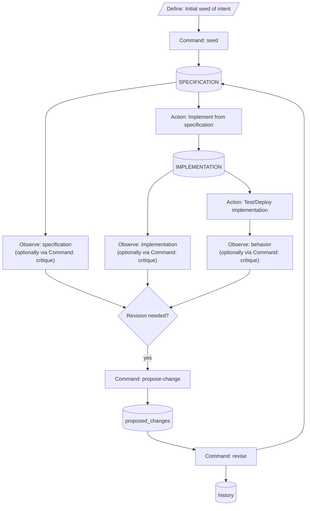

# Specification — `livespec`

This document MUST be read alongside `contracts.md`, `constraints.md`, and `scenarios.md`. The four files together constitute the canonical natural-language specification for `livespec` per the `livespec` template's multi-file convention. Each file scopes a different concern: this file describes intent and behavior; `contracts.md` carries the wire-level interfaces; `constraints.md` carries the architecture-level constraints; `scenarios.md` carries the behavioral narratives.

## Project intent

`livespec` provides governance and lifecycle management for a living `SPECIFICATION` directory. It MUST NOT be conflated with a spec authoring format, an implementation engine, or a workflow runner. The central invariant: a project's `SPECIFICATION` is the maintained source of truth for intended system behavior, and all changes to that `SPECIFICATION` flow through a documented, versioned propose → revise → acknowledge → validate cycle.

## Runtime and packaging

`livespec` ships as a Claude Code plugin at `.claude-plugin/`. The plugin bundle MUST contain (a) skill prompts under `skills/<sub-command>/SKILL.md`, (b) a Python wrapper layer under `scripts/bin/<sub-command>.py` and `scripts/livespec/commands/<sub-command>.py`, (c) built-in templates under `specification-templates/<name>/`, and (d) vendored pure-Python libraries under `scripts/_vendor/`.

Python 3.10 is the minimum runtime per `.python-version` and `pyproject.toml`'s `requires-python`. The `_bootstrap.py` shebang-wrapper preamble MUST exit 127 on Python below 3.10 with an install-instruction message before any `livespec` import.

Vendored runtime dependencies are: `fastjsonschema`, `returns` (+ vendored upstream `typing_extensions` per v027 D1), `structlog`, and a hand-authored JSONC shim per v026 D1. Each vendored entry MUST appear in `.vendor.jsonc` with non-placeholder `upstream_url`, `upstream_ref`, and `vendored_at` fields.

The plugin is distributed via a Claude Code marketplace catalog declared at `.claude-plugin/marketplace.json` at the repo root; see `contracts.md` §"Plugin distribution" for the install path, the marketplace + plugin names, and the slash-command surface.

## Specification model

A spec tree is a directory rooted at the `spec_root` path declared in the active template's `template.json`. The tree MUST contain the template-declared spec files (e.g., `spec.md`, `contracts.md`, `constraints.md`, `scenarios.md`, `README.md` for the `livespec` template), a `proposed_changes/` subdir, and a `history/` subdir. Both the `proposed_changes/` and `history/` subdirs carry a skill-owned `README.md` written by the seed wrapper at seed time and never modified by `revise`; per `contracts.md` §"Sub-spec structural mechanism", every sub-spec tree carries the same skill-owned README pair.

Multi-tree projects (the meta-project case where the project ships its own `livespec` templates) MAY emit one sub-spec tree per template under `<spec_root>/templates/<template-name>/`. Sub-specs follow the same internal structure as the main spec uniformly per v020 Q1, decoupled from the user-facing template's end-user spec convention.

## Lifecycle

The `livespec` process is a **revision loop**, not a one-way waterfall. The loop begins with intent (a seed of desire, observation, or change pressure), produces a living specification, governs implementation, and generates new intent inputs from observations and feedback.

### Revision loop

### Terminology

**Intent** — inputs feeding into specification revision: seeds, requests, critiques, observations, external requirements, implementation feedback, and other change pressure. The specification is itself the current authoritative and ratified form of intent, but the term `intent` in the diagram refers to incoming change pressure.

**The specification is one logical living specification** represented on disk as multiple files for explicit LLM boundaries, lower nondeterminism, and specialized processing. `spec.md` is the primary source surface. `contracts.md`, `constraints.md`, and `scenarios.md` are specialized operational partitions of the same specification.

**Why `spec.md`** (not `intent.md`, `behavior.md`, or `core.md`): the file is the default authoritative surface for all current spec content not factored into the specialized files. `spec.md` is the clearest machine-facing name for LLM routing, even though `SPECIFICATION/spec.md` is aesthetically redundant to human readers. The redundancy is acceptable because it improves explicit LLM boundaries.

**Why not a single file**: `contracts.md`, `constraints.md`, and `scenarios.md` are separated because they are processed with lower ambiguity and stronger mechanical enforcement. Keeping them separate keeps the per-file LLM processing surface small and unambiguous.

## Sub-command lifecycle

`livespec` exposes seven sub-commands: `seed`, `propose-change`, `critique`, `revise`, `prune-history`, `doctor`, and `help`. Each sub-command MAY be invoked via `/livespec:<name>` from Claude Code, which dispatches to the matching `skills/<name>/SKILL.md` prompt. The skill prose MUST orchestrate (a) dialogue capture, (b) prompt-driven content generation, (c) wrapper invocation, and (d) structured-finding interpretation.

Every command except `help`, `doctor`, and `resolve_template` MUST run a pre-step `doctor`-static check before its action and a post-step `doctor`-static check after. Pre-step ensures the working state is consistent before mutation; post-step ensures the result is consistent before returning success.

Sub-command applicability for the pre-step / post-step wrapper lifecycle:

- **`seed`** is exempt from pre-step `doctor` static. Runs sub-command logic + post-step only.
- **`help`** has no pre-step, no post-step wrapper-side static, and no LLM-driven phase. It is a SKILL.md-only sub-command with no Python wrapper.
- **`doctor`** has no pre-step and no post-step wrapper-side static.
- **`prune-history`** has pre-step and post-step static but no post-step LLM-driven phase.
- **`propose-change`, `critique`, `revise`** have both pre-step and post-step static.

The post-step LLM-driven phase, where applicable, runs from skill prose AFTER the Python wrapper exits; Python MUST NOT invoke the LLM. The `--skip-doctor-llm-objective-checks` / `--run-doctor-llm-objective-checks` and `--skip-doctor-llm-subjective-checks` / `--run-doctor-llm-subjective-checks` flag pairs are LLM-layer only — they gate the two post-step LLM-driven phases (both skill prose) and MUST NOT reach Python wrappers.

Python composition mechanism for the lifecycle chain (pre-step + sub-command logic + post-step) is implementer choice under the architecture-level constraints in `SPECIFICATION/constraints.md`.

### `revise` skill-prose responsibilities

The `revise` LLM-driven per-proposal acceptance dialogue, the per-`## Proposal` accept/modify/reject decision-and-rationale capture, the `modify`-decision iteration to convergence, the apply-to-all-remaining-proposals delegation toggle, the optional `<revision-steering-intent>` disambiguation (warn-and-proceed when steering-intent contains spec content rather than per-proposal decision-steering), the start-of-revise stale-pending-proposal narration (the skill prose MUST surface, before the per-proposal accept/modify/reject loop begins, the count of in-flight proposals under `<spec-target>/proposed_changes/` and the canonical topic + `created_at` of the oldest pending proposal, formatted as a single informational line; this narration MUST NOT gate the wrapper, MUST NOT add any pre-step or post-step doctor check, and MUST NOT block downstream wrapper invocations — its sole purpose is pending-proposal-accumulation visibility so the user MAY choose to address older proposals during the current pass), and the retry-on-exit-4 handshake are skill-prose responsibilities under `revise/SKILL.md`; `bin/revise.py` MUST NOT invoke the template prompt, the LLM, or the interactive confirmation flow. The wrapper's deterministic file-shaping mechanics are codified in `constraints.md` §"Sub-command lifecycle mechanics".

### `prune-history` skill-prose responsibilities

The `prune-history` LLM-driven invocation dialogue, the destructive-operation user-confirmation flow (the skill `SKILL.md` frontmatter MUST set `disable-model-invocation: true` so the user MUST invoke `/livespec:prune-history` explicitly), and the post-prune narrative are skill-prose responsibilities under `prune-history/SKILL.md`; `bin/prune_history.py` MUST NOT invoke the template prompt, the LLM, or the interactive confirmation flow. The wrapper's deterministic file-shaping mechanics are codified in `constraints.md` §"Sub-command lifecycle mechanics".

## Versioning

The `SPECIFICATION/history/v<NNN>/` directory holds an immutable snapshot of every spec file as it stood when revision `vNNN` was finalized. Snapshots are produced by `revise`; they MUST be byte-identical to the live spec files at the moment the revision is committed. The version sequence is contiguous: `v001`, `v002`, `v003`, … with no gaps.

`livespec` itself versions via Conventional Commits + semantic-release per v034 D1. Releases happen on `master` as a side-effect of `feat:` / `fix:` commits landing through the protected-branch PR workflow.

## Pruning history

`prune-history` MAY remove the oldest contiguous block of `history/v*/` directories down to a caller-specified retention horizon while preserving the contiguous-version invariant for the remaining tail. Phase 3 lands the parser-only stub; Phase 7 widens it to the actual pruning mechanic.

**`version-directories-complete` pruned-marker exemption.** The `version-directories-complete` doctor static check enforces that every `<spec-root>/history/vNNN/` directory contains the full set of template-required spec files, a `proposed_changes/` subdir, and — when the active template declares a versioned per-version `README.md` (the built-in `livespec` template declares one; the built-in `minimal` template does not, per v014 N1 / v015 O2) — a matching `README.md`. The pruned-marker directory is exempt from this requirement: the oldest surviving v-directory under `<spec-root>/history/`, when its root contains a `PRUNED_HISTORY.json` document, MUST contain ONLY `PRUNED_HISTORY.json` (no template-required spec files, no `proposed_changes/` subdir, no per-version `README.md`). The marker-detection predicate is the literal presence of `PRUNED_HISTORY.json` at the directory root; the `version-directories-complete` static check honors this exemption uniformly across main spec and sub-spec trees. This is the consumer-side counterpart to the producer-side mechanic in §"Sub-command lifecycle" (the `prune-history` lifecycle paragraph), which describes how `prune-history` replaces `<spec-root>/history/v(N-1)/`'s contents with a single `PRUNED_HISTORY.json` file when constructing the marker directory.

## Proposed-change and revision file formats

`<spec-target>/proposed_changes/<topic>.md` holds an in-flight change request. The file MUST contain one or more `## Proposal: <name>` sections with `### Target specification files`, `### Summary`, `### Motivation`, and `### Proposed Changes` subsections.

**Topic canonicalization (v015 O3).** `propose-change` treats the inbound `<topic>` as a user-facing topic hint, not yet the canonical artifact identifier. Before collision lookup, filename selection, or front-matter population, the wrapper canonicalizes the topic via: lowercase → replace every run of non-[a-z0-9] characters with a single hyphen → strip leading and trailing hyphens → truncate to 64 characters. If the result is empty, the wrapper exits 2 with `UsageError`. The canonicalized topic is used uniformly for the output filename, the proposed-change front-matter `topic` field, and the collision-disambiguation namespace. This applies to direct callers and to internal delegates such as `critique`.

**Reserve-suffix canonicalization.** `propose-change` accepts an optional `--reserve-suffix <text>` flag (also exposed as a keyword-only parameter on the Python internal API path used by `critique`'s internal delegation). When supplied, canonicalization guarantees that the resulting topic is at most 64 characters AND that the caller-supplied suffix is preserved intact at the end of the result, even when the inbound hint already ends in that suffix (pre-attached case) or when truncation would otherwise clip the suffix. When `--reserve-suffix` is NOT supplied, canonicalization behaves exactly as the v015 O3 rule above. The empty-after-canonicalization `UsageError` (exit 2) continues to apply to the final composed result. The exact algorithm (pre-strip, truncate-and-hyphen-trim, re-append) is mechanism-level detail covered by the `propose-change` wrapper's implementation; this spec deliberately does not duplicate the algorithm here, per the architecture-vs-mechanism discipline.

**Collision disambiguation (v014 N6).** If a file with topic `<canonical-topic>.md` already exists, the wrapper MUST auto-disambiguate by appending a hyphen-separated **monotonic integer suffix starting at `2`**: the first collision becomes `<canonical-topic>-2.md`, the second `<canonical-topic>-3.md`, and so on. No zero-padding is applied (so the tenth collision is `<canonical-topic>-10.md`; alphanumeric sort misordering past nine duplicates is accepted as an extreme edge case). No user prompt for collision. Starting the counter at `2` (not `1`) makes the "this is the second file named `<canonical-topic>`" relationship explicit; the first file is suffix-less by convention. Note: this convention applies to `propose-change` and `critique` filenames. The `out-of-band-edit-<UTC-seconds>.md` filename form used by the `doctor-out-of-band-edits` check is a separate always-appended UTC-timestamp convention (each backfill is a distinct timed event); the two conventions are not unified.

**Single-canonicalization invariant (v016 P4).** The `topic` field's value MUST be derived via the same canonicalization rule across ALL creation paths — user-invoked `propose-change`, `critique`'s internal delegation (which adds the `-critique` reserve-suffix; see the v016 P3 reserve-suffix paragraph above), and skill-auto-generated artifacts (`seed` auto-capture, `doctor-out-of-band-edits` backfill). Implementations MUST route every `topic` derivation through a single shared canonicalization so two `livespec` implementations cannot diverge on the `topic` value for semantically-identical inputs. This is an architecture-level requirement on the interface; the exact code-path mechanism (single helper function vs. anything else) is an implementation choice.

**Filename stem vs. front-matter `topic` distinction (v017 Q7).** Under the v014 N6 collision-disambiguation rule, the proposed-change filename stem may include a `-N` suffix (`foo.md`, `foo-2.md`, `foo-3.md`). The front-matter `topic` field carries ONLY the canonical topic WITHOUT the `-N` suffix — every file sharing a canonical topic shares the same front-matter `topic` value. The `-N` suffix is filename-level disambiguation only. Revision-pairing (per the `revision-to-proposed-change-pairing` doctor-static check) walks filename stems (not front-matter `topic` values); each `<stem>-revision.md` pairs with `<stem>.md` in the same directory.

`<spec-target>/proposed_changes/<topic>-revision.md` is the paired revision record produced by `revise`. After the revise commit lands, both files move atomically into `<spec-target>/history/v<NNN>/proposed_changes/`.

**Revision file format.** Each `<topic>-revision.md` MUST contain, in order: (1) YAML front-matter with the keys `proposal: <stem>.md` (the paired proposed-change filename stem, including any `-N` collision-disambiguation suffix per the filename-stem rule above), `decision: accept | modify | reject`, `revised_at: <UTC ISO-8601 seconds>`, `author_human: <git user.name and user.email per livespec.io.git.get_git_user(), or the literal "unknown" when git is available but either config value is unset>`, and `author_llm: <resolved author id per the unified precedence in §"Author identifier resolution">`; (2) `## Decision and Rationale` — always required; one paragraph explaining the decision; (3) `## Modifications` — REQUIRED when `decision: modify`; prose-form description of how the proposal was changed before incorporation, with optional short fenced before/after excerpts permitted for hyper-local clarity (line-number-anchored unified diffs are NOT used here — they are fragile across multi-proposal revises); (4) `## Resulting Changes` — REQUIRED when `decision: accept` or `modify`; names the specification files modified and lists the sections changed; (5) `## Rejection Notes` — REQUIRED when `decision: reject`; explains what would need to change about the proposal for it to be acceptable in a future revision (this preserves the rejection-flow audit trail). For automated skill-tool-authored revisions (e.g., `seed` auto-capture, `out-of-band-edits` auto-backfill), `author_llm` takes the convention value `livespec-seed` / `livespec-doctor`, hardcoded by the wrapper and bypassing the precedence above.

## Author identifier resolution

The file-level `author` field in the resulting proposed-change front-matter is resolved by the unified precedence used across all three LLM-driven wrappers (`propose-change`, `critique`, `revise`):

1. If `--author <id>` is passed on the CLI and non-empty, use its value.
2. Otherwise, if the `LIVESPEC_AUTHOR_LLM` environment variable is set and non-empty, use its value.
3. Otherwise, if the LLM self-declared an `author` field in the `proposal_findings.schema.json` payload (file-level, optional) and it is non-empty, use that value.
4. Otherwise, use the literal `"unknown-llm"`.

A warning is surfaced via LLM narration whenever fallback (4) is reached.

**Author identifier → filename slug transformation (v014 N5).** When the resolved `author` value is used as a filename component (the raw topic stem passed from `critique`, or any other author-derived filename use in the future), the wrapper transforms it via the following rule: lowercase → replace every run of non-[a-z0-9] characters with a single hyphen → strip leading and trailing hyphens → truncate to 64 characters. The **slug form** is used as the filename component; the **original un-slugged value** is preserved in the YAML front-matter `author` / `author_human` / `author_llm` fields for audit-trail fidelity. The slug rule matches the GFM slug algorithm already used by the `anchor-reference-resolution` doctor-static check. This transformation applies whenever a resolved author value is used to derive a topic hint or filename component. Full semantics (edge cases, interaction with topic canonicalization, collision with already-slugged topic values) are mechanism-level detail covered by the wrapper's implementation, not duplicated in this spec per the architecture-vs-mechanism discipline.

**`livespec-` prefix convention.** Identifiers with the prefix `livespec-` (e.g., `livespec-seed`, `livespec-doctor`) are used by skill-auto-generated artifacts (seed auto-capture, doctor-`out-of-band-edits` backfill). Human authors and LLMs SHOULD NOT use this prefix for their own artifacts so that the audit trail can visually distinguish skill-auto artifacts from user/LLM-authored ones. This is a convention; no mechanical enforcement exists — no schema pattern rejects `livespec-`-prefixed values from user-supplied sources, and no wrapper rejects them on input. Users who deliberately type `livespec-`-prefixed identifiers create self-inflicted audit-trail confusion but nothing breaks.

## Non-goals

`livespec` v1 explicitly does NOT solve subdomain ownership inside a `SPECIFICATION`, semantic routing of cross-cutting changes, or any universal decomposition strategy. It does NOT replace implementation engines. It does NOT define the full template mechanism beyond the v1 contract.

Python-implementation non-goals:

- **Interactive CLI.** Python scripts bundled with the skill are non-interactive by design; all input arrives through arguments, flags, env vars, or stdin pipe.
- **Windows native support.** Not a v1 target; Linux + macOS only.
- **Async / concurrency.** livespec's workload is synchronous and deterministic. No `asyncio`, no threading, no multiprocessing.
- **Performance tuning.** livespec is a CLI-scale tool; no hot-path work.
- **Runtime dependency resolution.** Missing or too-old `python3` → exit 127 from `bin/_bootstrap.py`; installing Python is the user's concern.
- **LLM integration from Python.** Python scripts handle only deterministic work; LLM-driven behavior stays at the skill-markdown layer (per-sub-command `SKILL.md`, template prompts).
- **Mypy compatibility.** Pyright is the sole type checker.
- **Ruby / Node / other language hooks.** No non-Python dev-tooling scripts.
- **Automated vendored-lib drift detection.** Pinned versions in `.vendor.jsonc` + the no-edit discipline + code review are the controls; no `check-vendor-audit` script exists.

## Prior Art

The following annotated references shaped the livespec design.

**NLSpec:** TG-Techie's NLSpec Spec (GitHub) — the main direct prior art for separation between intent, specification, and implementation. The term `livespec` adapts its core framing while rejecting the one-way `Intent → NLSpec → Implementation` waterfall in favor of a revision loop.

**Requirements engineering foundations:** Zave & Jackson ("Four Dark Corners") and Zave ("Foundations of Requirements Engineering") — separated kinds of intent (desired effects, domain assumptions, specification) and grounded the distinction between requirement-level desire and formalized specification. Supported treating architecture as legitimately living inside the living spec surface (de Boer et al., "On the Similarity Between Requirements and Architecture").

**Iterative development:** Nuseibeh's weaving model and the Twin Peaks model (Microtool) — rejected a strictly one-way lifecycle; reinforced that requirements and architecture co-develop iteratively.

**Multi-view documentation:** ISO/IEC/IEEE 42010 Conceptual Model, Kruchten's 4+1 View Model, and arc42 — supported treating `contracts.md`, `constraints.md`, and `scenarios.md` as operational partitions rather than competing specs.

**Living documentation and executable specification:** Fowler ("Specification by Example") and Cucumber BDD series — connected scenarios as first-class specification artifacts.

**AI-native spec-driven tooling:** Augment Code Intent, Fission AI OpenSpec (closest public precedent for a canonical spec plus in-flight change model), BMad Code BMAD-METHOD, Kiro Specs — contemporary references for AI-assisted specification workflows. Sumers et al. ("Cognitive Architectures for Language Agents") — background vocabulary for AI-native implementation systems.

**Five design directions these sources shaped:** (1) The specification is one logical living specification across multiple files. (2) `spec.md` names the primary authoritative surface. (3) `intent` is reserved for incoming change pressure. (4) The process is a loop, not a single pass. (5) `contracts`, `constraints`, and `scenarios` are specialized operational partitions.

## Subdomain routing

Cross-cutting changes — those spanning multiple subdomains in a larger `SPECIFICATION` — require ownership decisions: which part of the `SPECIFICATION` owns which statement? This routing problem is not solved in `livespec` v1. No deterministic mechanism assigns cross-cutting requirements to specific spec files; the assignment is author judgment at propose-change time.

Contemporary public precedents (OpenSpec, Kiro) show analogous gaps: OpenSpec centers on a rigid path-based merge model once the target spec path is already known, but does not solve semantic routing of cross-cutting changes; Kiro's model is per-feature rather than cross-cutting. `livespec` v1 does not attempt to solve the general case.

## Self-application

`livespec` is self-applied: this very `SPECIFICATION/` tree is the seeded output of running `/livespec:seed` against the project's own brainstorming archive. The Phase 6 self-application was bootstrap-only; the imperative window closed at the Phase 6 seed commit and remains closed. All subsequent mutations to this `SPECIFICATION/` MUST flow through `/livespec:propose-change` → `/livespec:revise` against this tree (or, for the two sub-spec trees under `templates/`, against the corresponding sub-spec target).

The v021 Q3 imperative one-time `tests/heading-coverage.json` population step lands alongside this seed commit; from this revision onward, every revise that adds, changes, or removes a `##` heading MUST update `tests/heading-coverage.json` via the governed propose-change/revise loop's `resulting_files[]` mechanism.
