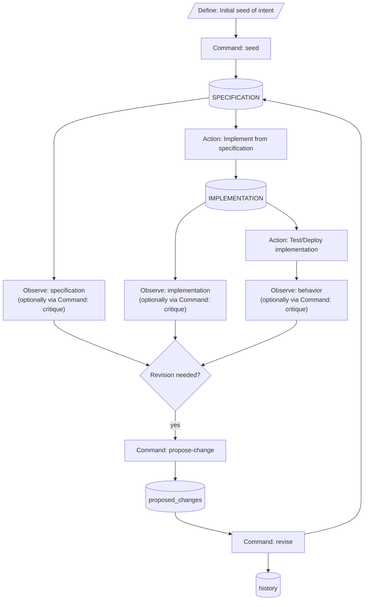
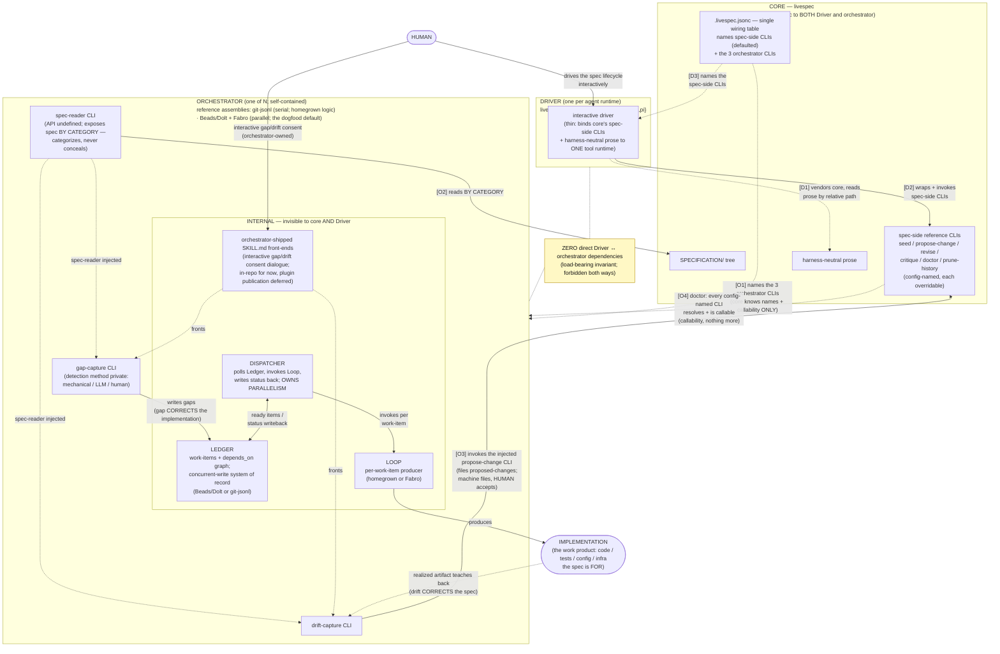

# Specification — `livespec`

This document MUST be read alongside `contracts.md`, `constraints.md`, and `scenarios.md`. The four files together constitute the canonical natural-language specification for `livespec` per the `livespec` template's multi-file convention. Each file scopes a different concern: this file describes intent and behavior; `contracts.md` carries the wire-level interfaces; `constraints.md` carries the architecture-level constraints; `scenarios.md` carries the behavioral narratives.

## Project intent

`livespec` provides governance and lifecycle management for a living `SPECIFICATION` directory. It MUST NOT be conflated with a spec authoring format, an implementation engine, or a workflow runner. The central invariant: a project's `SPECIFICATION` is the maintained source of truth for intended system behavior, and all changes to that `SPECIFICATION` flow through a documented, versioned propose → revise → acknowledge → validate cycle.


## Runtime and packaging

`livespec` ships as the core artifact at `.claude-plugin/`. The core bundle MUST contain (a) harness-neutral operation prose under `prose/<sub-command>.md`, (b) a Python wrapper layer under `scripts/bin/<sub-command>.py` and `scripts/livespec/commands/<sub-command>.py`, (c) built-in templates under `specification-templates/<name>/`, and (d) vendored pure-Python libraries under `scripts/_vendor/`. Core MUST NOT contain a `.claude-plugin/skills/` binding tree; per-runtime Driver repositories or project-local adapters bind the core prose and wrappers to their own agent runtime.

Python 3.10 is the minimum runtime per `.python-version` and `pyproject.toml`'s `requires-python`. The `_bootstrap.py` shebang-wrapper preamble MUST exit 127 on Python below 3.10 with an install-instruction message before any `livespec` import.

Vendored runtime dependencies are: `fastjsonschema`, `returns` (+ vendored upstream `typing_extensions` per v027 D1), `structlog`, and a hand-authored JSONC shim per v026 D1. Each vendored entry MUST appear in `.vendor.jsonc` with non-placeholder `upstream_url`, `upstream_ref`, and `vendored_at` fields.

The core artifact is distributed via the Claude Code marketplace catalog declared at `.claude-plugin/marketplace.json` at the repo root; see `contracts.md` §"Plugin distribution" for the core install path and for how the Claude Driver plugin supplies the slash-command surface. Codex dogfooding currently uses project-local `.agents/skills/` adapters rather than a Codex marketplace entry.

## Specification model

A spec tree is a directory rooted at the `spec_root` path declared in the active template's `template.json`. The tree MUST contain the template-declared spec files (e.g., `spec.md`, `contracts.md`, `constraints.md`, `scenarios.md`, `README.md` for the `livespec` template), a `proposed_changes/` subdir, and a `history/` subdir. Both the `proposed_changes/` and `history/` subdirs carry a skill-owned `README.md` written by the seed wrapper at seed time and never modified by `revise`; per `contracts.md` §"Sub-spec structural mechanism", every sub-spec tree carries the same skill-owned README pair. Per §"Template manifest" below, the active template MAY declare additional file kinds (markdown sub-files, diagram source, diagram rendered output) beyond the canonical NLSpec markdown set; the manifest is the source of truth for per-kind behavior across heading-coverage, LLM-context inclusion, and history-snapshot scope.

Multi-tree projects (the meta-project case where the project ships its own `livespec` templates) MAY emit one sub-spec tree per template under `<spec_root>/templates/<template-name>/`. Sub-specs follow the same internal structure as the main spec uniformly per v020 Q1, decoupled from the user-facing template's end-user spec convention.
## Template manifest

The active template MAY declare a `spec_files` manifest in `template.json` mapping spec-target-relative paths to per-file declarations. Each declaration MUST carry a `kind` field with one of three values: `markdown`, `diagram_source`, or `diagram_rendered`. A `diagram_rendered` entry MUST also carry a `derived_from` field naming the `diagram_source` path it was rendered from. The wire shape is codified in `contracts.md` §"Template manifest wire contract".

The built-in `livespec` template's manifest MUST declare only the six existing markdown files (`spec.md`, `contracts.md`, `constraints.md`, `non-functional-requirements.md`, `scenarios.md`, `README.md`). **Mermaid is livespec's standard diagram format.** Common diagram types (sequence, class, state, ER, flowchart/dependency, light C4) SHOULD be authored as fenced ` ```mermaid ` blocks inside `kind: markdown` spec files — such diagrams require NO manifest entries, NO render command, and NO history special-casing: they are markdown content and follow the markdown file's lifecycle. The separate `livespec-with-diagrams` template variant is Mermaid-first: it seeds diagram conventions and example fenced blocks into the template's spec files, and uses the `diagram_source` / `diagram_rendered` manifest mechanism ONLY for the **PlantUML escape hatch** — diagram types Mermaid lacks first-class support for (deployment, timing, object, mind map, rich C4/sprites). Existing PlantUML diagrams migrate to Mermaid opportunistically when next touched, not big-bang. The built-in opinion stays narrow; the manifest is the extension point that lets custom templates add files without forking the entire template surface.

### Per-kind behavior axes

The three `kind` values govern three orthogonal aspects of how the file participates in livespec's lifecycle:

- **Markdown-shaped checks** (heading-coverage and any future check that walks markdown structure): MUST apply only to files of `kind: markdown`. Files of `kind: diagram_source` or `kind: diagram_rendered` MUST be exempt from these checks.
- **LLM-context inclusion** (critique, doctor LLM-driven phases, propose-change context-building): MUST include `markdown` and `diagram_source` files (PlantUML, Mermaid, and similar textual diagram languages are LLM-readable). MUST NOT include `diagram_rendered` files (rendered output is opaque to LLMs and frequently oversized).
- **History snapshots** (`<spec-target>/history/vNNN/` materialization during revise): MUST include all three kinds. Rendered files are required in history because viewing an old revision in a browser MUST render correctly — markdown references like `` would otherwise produce broken images, defeating the human-readable audit trail. The history-bloat cost of rendered artifacts is accepted as the price of human-readable history; the source-only-in-history alternative was considered and rejected. The rendered-files-in-history requirement applies to the escape-hatch `diagram_source`/`diagram_rendered` pairing; fenced Mermaid blocks inside `kind: markdown` files need nothing additional — any `history/vNNN/` snapshot of the markdown renders them natively.

### Rendering in the revise lifecycle

Rendering of `diagram_source` files to `diagram_rendered` outputs MUST integrate with `/livespec:revise` and ONLY with `/livespec:revise`. Proposal documents under `<spec-target>/proposed_changes/<topic>.md` MUST remain prose write-ups of intended changes; they MUST NOT become tree-shaped patches and `propose-change` MUST NOT render. When a revise pass writes updated diagram source via `resulting_files[]`, the revise wrapper MUST invoke the project-declared render command (see `contracts.md` §"Template manifest wire contract" for the `.livespec.jsonc` `render_commands` shape) AFTER writing the source and BEFORE snapshotting to `history/vNNN/`. The rendered output sits alongside its source in the spec tree at the same relative path the manifest names.

The revise pass MUST be transactional: if the render command exits non-zero, revise MUST fail the entire revision, leave `<spec-target>/` untouched, and surface the failure on the same supervisor pattern-match path as a precondition failure (exit 3). No half-applied state — markdown edits committed but rendering failed — is permitted. The internal sequencing MUST stage all changes to a working location, run render, then on full success commit edits and snapshot to history.

### Multi-diagram-per-source accommodation

A single `diagram_source` file MAY produce multiple `diagram_rendered` outputs (e.g., a single `.puml` file with multiple `@startuml ... @enduml` blocks, each rendering to its own SVG). The manifest accommodates this by allowing multiple `diagram_rendered` entries to share the same `derived_from` value pointing at the source. The spec-author convention SHOULD be to name the rendered outputs to identify which block they came from (e.g., `@startuml auth-flow` → `auth-flow.svg`) so prose references navigate cleanly for both LLM and human readers.

### Template schema versioning

The `template.json` schema bumps from `template_format_version: 1` to `template_format_version: 2` with the introduction of the `spec_files` manifest. v1 templates SHOULD continue to load: their implicit file set MUST be treated as a manifest of `kind: markdown` entries for the well-known files declared by the template's seed prompt. v2 templates MUST declare `spec_files` explicitly. No breaking change is introduced for existing forks; the v1→v2 migration is opt-in per template.

### Heading-coverage and doctor-static rewiring

The `dev-tooling/checks/heading_coverage.py` check MUST consult the active template's `spec_files` manifest and apply only to files of `kind: markdown`. The current hardcoded NLSpec-file tuple is superseded; under v2 templates, the manifest is the source of truth.

A new static doctor check `doctor-diagram-source-rendered-drift` SHOULD warn when a `diagram_rendered` file's content does not match a fresh re-render of its `derived_from` source, or (as a cheaper proxy) when the rendered file's mtime predates the source's mtime. This check catches the case where someone edits diagram source manually outside the revise flow and forgets to re-render.

### Explicitly rejected alternatives

The following design alternatives were considered and rejected during the v2 manifest design:

- **Bundling `plantuml.jar` and Java detection in livespec core** — rejected as a real toolchain commitment (JRE + Graphviz install burden) masquerading as a dependency-bundle.
- **Restructuring `proposed_changes/` from flat prose files to tree-shaped patches** — rejected; the proposal document is a prose write-up of intent, not a file-by-file diff. Revise materializes the patch from the prose.
- **Source-only-in-history (rendered artifacts gitignored or excluded from snapshots)** — rejected because old revisions MUST render correctly for human readers; the bit-for-bit reconstructibility from source plus pinned renderer was judged over-engineering for a natural-language spec tool.
- **`diagram_rendered` as a general spec-file kind admitting hand-authored SVG** — out of scope for v2. The contract treats `diagram_source` as textual diagram description (PlantUML, Mermaid, or similar) and `diagram_rendered` as opaque rendered output produced by the project's render command. Hand-authored raster-export SVG is a human aid and SHOULD live outside `<spec-target>/`.

## Lifecycle

The `livespec` process is a **revision loop**, not a one-way waterfall. The loop begins with intent (a seed of desire, observation, or change pressure), produces a living specification, governs implementation, and generates new intent inputs from observations and feedback.

### Revision loop



### Terminology

**Durable-pending (queue/archive item)** — An item category in which pending is a normal, expected state. Pending proposed changes are durable-pending: deliberation takes time, and a long-open item is not a hygiene violation. Doctor MUST NOT enforce staleness invariants on durable-pending items. Pile-up and staleness heuristics for spec-side durable-pending items are the domain of productivity tooling (`/livespec:next`, defined by §"`/livespec:next` spec-side thin-transport skill" in `contracts.md`), NOT of doctor invariants. Doctor MAY enforce structural invariants on durable-pending items (e.g., revision-to-proposed-change pairing, front-matter well-formedness); the rule is that structural invariants are in scope and productivity heuristics are not. Contrasts with **Transient (queue/archive item)**.

**Intent** — inputs feeding into specification revision: seeds, requests, critiques, observations, external requirements, implementation feedback, and other change pressure. The specification is itself the current authoritative and ratified form of intent, but the term `intent` in the diagram refers to incoming change pressure.

**Transient (queue/archive item)** — An item category in which the item type is defined by needing disposition: the item's value is exhausted on routing to one of its terminal dispositions, and pile-up of transient items violates the type. The category was historically instantiated by memos; the reference orchestrators have since retired that surface (in-flight captures now flow to the work-item ledger, spec input to `/livespec:propose-change`, and durable lessons to the orchestrator's own knowledge home), so core ships no transient instance and its doctor enforces nothing against any orchestrator that chooses to keep a transient queue privately. The category principle remains load-bearing for doctor-catalogue scoping. Contrasts with **Durable-pending (queue/archive item)**. The transient-vs-durable-pending principle MUST be load-bearing for proposals that expand doctor's invariant catalog: structural invariants on either category are in scope; productivity-heuristic invariants (staleness, pile-up) on durable-pending items are out of scope and belong to `/livespec:next` instead.

**Driver** — the thin, agent-runtime-specific wrapper (Claude Code, Codex, OpenCode, Pi, …) through which a human drives the spec lifecycle interactively. Core is agnostic to it; "harness" is NOT used for this role. See §"Contract + reference implementations architecture".

**Orchestrator** — the pluggable producer that consumes the spec and produces the implementation. Core's contract sees only its three config-named CLIs; everything else about it (store, prompts, internal state) is private. See §"Contract + reference implementations architecture".

**Implementation (work product)** — the code, tests, config, and infra the spec is *for*. Not a tier and not an actor: the orchestrator produces it. See §"Contract + reference implementations architecture".

**Gap (flow)** — the spec → implementation flow: a divergence corrected by changing the IMPLEMENTATION, landing as a tracked work-item owned by the orchestrator. See §"Contract + reference implementations architecture".

**Drift (flow)** — the implementation → spec flow: a divergence corrected by changing the SPEC, landing as a proposed-change owned by the spec lifecycle and accepted only by a human. See §"Contract + reference implementations architecture".

**The specification is one logical living specification** represented on disk as multiple files for explicit LLM boundaries, lower nondeterminism, and specialized processing. `spec.md` is the primary source surface. `contracts.md`, `constraints.md`, and `scenarios.md` are specialized operational partitions of the same specification.

**Why `spec.md`** (not `intent.md`, `behavior.md`, or `core.md`): the file is the default authoritative surface for all current spec content not factored into the specialized files. `spec.md` is the clearest machine-facing name for LLM routing, even though `SPECIFICATION/spec.md` is aesthetically redundant to human readers. The redundancy is acceptable because it improves explicit LLM boundaries.

**Why not a single file**: `contracts.md`, `constraints.md`, and `scenarios.md` are separated because they are processed with lower ambiguity and stronger mechanical enforcement. Keeping them separate keeps the per-file LLM processing surface small and unambiguous.


**Authored operation prose** — a harness-neutral core prose artifact whose contents carry the LLM-facing orchestration for an operation: dialogue capture, detection logic, judgment calls, structured-finding interpretation, or wrapper-output narration. A Driver binding reads and follows this prose, but the prose is not itself a Claude Code `SKILL.md`. Contrasts with **Thin-transport binding**. The pre-decomposition livespec skills authored before 2026-05-18 (`seed`, `propose-change`, `critique`, `revise`, `doctor`, `prune-history`, `help`) are now represented by core prose plus per-runtime Driver bindings.

**Thin-transport binding** — a Driver binding whose entire responsibility is to invoke its backing Python wrapper at `.claude-plugin/scripts/bin/<cmd>.py` and present the structured output verbatim, with NO ranking, summarization, or judgment in the binding. Used for query operations that need deterministic, fast, repeatable output suitable for invocation by other Driver bindings or automated tooling. The binding prose MUST stay short and MUST NOT accrete prompt content; all ranking, filtering, and formatting logic MUST live in the backing Python implementation. Mechanical enforcement (lint rule, line-count check, or adapter schema) is deferred to a follow-on refinement, but the discipline is load-bearing. Thin-transport bindings render through the same Driver surface as authored operations; the distinction is internal design vocabulary, not a cross-plugin contract category.


## Sub-command lifecycle

`livespec` defines eight spec-side sub-commands: `seed`, `propose-change`, `critique`, `revise`, `prune-history`, `doctor`, `help`, and `next`. Each sub-command has a core-owned operation prose artifact under `.claude-plugin/prose/<name>.md`; every command except `help` also has a config-named wrapper CLI under `.claude-plugin/scripts/bin/`. A Driver MAY expose those operations as slash commands such as `/livespec:<name>` (Claude Code) or as project-local Codex skills, but that invocation surface belongs to the Driver binding, not to core package contents. For authored operations the core prose MUST orchestrate (a) dialogue capture, (b) prompt-driven content generation, (c) wrapper invocation, and (d) structured-finding interpretation. Thin-transport operations (e.g., `next`) orchestrate only (c) and (d); their Driver binding is a short pass-through per the **Thin-transport binding** terminology entry above.

Every command except `help`, `doctor`, `next`, and `resolve-template` MUST run a post-step `doctor`-static check after its action; every such command except `seed` MUST also run a pre-step `doctor`-static check before its action (`seed` is exempt from pre-step because it materializes the spec tree). Pre-step ensures the working state is consistent before mutation; post-step ensures the result is consistent before returning success.

Sub-command applicability for the pre-step / post-step wrapper lifecycle:

- **`seed`** is exempt from pre-step `doctor` static. Runs sub-command logic + post-step only.
- **`help`** has no pre-step, no post-step wrapper-side static, and no LLM-driven phase. It is a prose-only sub-command with no Python wrapper.
- **`doctor`** has no pre-step and no post-step wrapper-side static.
- **`prune-history`** has pre-step and post-step static but no post-step LLM-driven phase.
- **`propose-change`, `critique`, `revise`** have both pre-step and post-step static.
- **`next`** has no pre-step, no post-step wrapper-side static, and no LLM-driven phase. The backing Python wrapper at `bin/next.py` performs the spec-side ranking; the Driver binding is a thin-transport pass-through per the **Thin-transport binding** terminology entry above.

The post-step LLM-driven phase, where applicable, runs from core operation prose through the active Driver AFTER the Python wrapper exits; Python MUST NOT invoke the LLM. The `--skip-doctor-llm-objective-checks` / `--run-doctor-llm-objective-checks` and `--skip-doctor-llm-subjective-checks` / `--run-doctor-llm-subjective-checks` flag pairs are LLM-layer only — they gate the two post-step LLM-driven phases (both Driver-bound prose) and MUST NOT reach Python wrappers.

Python composition mechanism for the lifecycle chain (pre-step + sub-command logic + post-step) is implementer choice under the architecture-level constraints in `SPECIFICATION/constraints.md`.

### `revise` operation-prose responsibilities

The following constitute the `revise` LLM-driven per-proposal acceptance dialogue and are operation-prose responsibilities under `.claude-plugin/prose/revise.md`:

- per-`## Proposal` accept/modify/reject decision-and-rationale capture;
- `modify`-decision iteration to convergence;
- the apply-to-all-remaining-proposals delegation toggle;
- the optional `<revision-steering-intent>` disambiguation (warn-and-proceed when steering-intent contains spec content rather than per-proposal decision-steering);
- the start-of-revise stale-pending-proposal narration: the operation prose MUST surface, before the per-proposal accept/modify/reject loop begins, (a) the count of in-flight proposals under `<spec-target>/proposed_changes/` and the canonical topic + `created_at` of the oldest pending proposal in that target, formatted as a single informational line, AND (b) a per-tree summary of any pending proposals in every OTHER spec tree in the project (the main spec when `<spec-target>` is a sub-spec, plus every `<main-spec-root>/templates/<name>/` sub-spec when `<spec-target>` is the main spec or a different sub-spec) — one informational line per other tree carrying the tree root path, the count of pending proposals, and the canonical topic + `created_at` of the oldest pending proposal in that tree (omitting any other-tree line entirely when that tree's `proposed_changes/` carries no in-flight proposals). This cross-tree visibility prevents the user from missing pending work in a sub-spec when invoking revise against the main spec (or vice versa). The narration MUST NOT gate the wrapper, MUST NOT add any pre-step or post-step doctor check, and MUST NOT block downstream wrapper invocations — its sole purpose is pending-proposal-accumulation visibility so the user MAY choose to address older proposals during the current pass, possibly by invoking revise against a different `--spec-target` first;
- the retry-on-exit-4 handshake.

`bin/revise.py` MUST NOT invoke the template prompt, the LLM, or the interactive confirmation flow. The wrapper's deterministic file-shaping mechanics are codified in `constraints.md` §"Sub-command lifecycle mechanics".


### `propose-change` operation-prose responsibilities

The following constitute the `propose-change` LLM-driven authoring dialogue and are operation-prose responsibilities under `.claude-plugin/prose/propose-change.md`:

- the start-of-propose-change in-flight-survey narration: the operation prose MUST surface, before the change-authoring dialogue begins, every remote branch matching the project's propose-change branch prefix (default `spec/*`) AND every open pull request whose diff touches the spec tree (any file under `<spec-root>/`), and for each surfaced item the canonical topic slug (when derivable from the branch name or PR title) plus a brief characterization of which spec sections it touches. Network failures (`git fetch` or `gh` exit non-zero, missing auth, etc.) MUST be surfaced as a degraded-survey warning rather than blocking propose-change. This cross-branch + open-PR visibility is symmetric to the in-tree stale-pending-proposal narration in `### revise operation-prose responsibilities` (which surfaces local-FS pending state); together the two narrations close the loop between revise-time and propose-change-time visibility of in-flight design work;
- the alignment-intent capture: for each in-flight item surfaced above, the operation prose MUST elicit the user's intended relationship — align (the new proposal conforms to the in-flight design), modify-to-accommodate (the new proposal partially supersedes with explicit rationale), or explicitly supersede (the new proposal replaces the in-flight design; the in-flight branch SHOULD be closed/abandoned upstream). The captured alignment intent feeds the propose-change template prompt as steering context for the authoring dialogue; it is NOT serialized into the resulting proposed-change findings JSON;
- the retry-on-exit-4 handshake (shared discipline with the other LLM-driven wrappers).

The narration MUST NOT gate the wrapper (`bin/propose_change.py` runs regardless), MUST NOT add any pre-step or post-step doctor check, and MUST NOT block downstream wrapper invocations — its sole purpose is in-flight-design-drift prevention so the user MAY choose to align with, modify, or supersede concurrent designs before the new proposal lands.

`bin/propose_change.py` MUST NOT invoke the template prompt, the LLM, the interactive confirmation flow, or the in-flight survey. The wrapper's deterministic file-shaping mechanics are codified in `constraints.md` §"Sub-command lifecycle mechanics".

### `prune-history` operation-prose responsibilities

The `prune-history` LLM-driven invocation dialogue, the destructive-operation user-confirmation flow, and the post-prune narrative are operation-prose responsibilities under `.claude-plugin/prose/prune-history.md`. A Driver binding for `prune-history` MUST require explicit user invocation and MUST disable autonomous model activation when its runtime offers such a control. `bin/prune_history.py` MUST NOT invoke the template prompt, the LLM, or the interactive confirmation flow. The wrapper's deterministic file-shaping mechanics are codified in `constraints.md` §"Sub-command lifecycle mechanics".

## Contract + reference implementations architecture

LiveSpec is a **contract plus reference implementations**. The core `livespec` library is agnostic to the **Driver** (the thin, agent-runtime-specific wrapper through which a human drives the spec lifecycle interactively — Claude Code, Codex, OpenCode, Pi) and to the **orchestrator** (the pluggable producer that consumes the spec and produces the implementation). The product is the contract plus reference implementations at each seam: reference spec-side CLIs, reference Driver bindings, and reference orchestrators.

**Implementation is the work product.** Not a tier, not an actor: the implementation is the code, tests, config, and infra the spec is *for*. The orchestrator produces it.

**The two flows are the preserved spine.** The asymmetric cross-boundary pair:

| | **Gap** | **Drift** |
|---|---|---|
| Direction | spec → implementation | implementation → spec |
| Corrects | the IMPLEMENTATION | the SPEC |
| Destination | a tracked work-item, owned by the orchestrator | a proposed-change, owned by the spec lifecycle |
| Method | mechanical / LLM / human — the orchestrator's private choice, usually LLM | usually needs a human |
| Human dependency | optional | usually REQUIRED |

Method is NOT a determinism distinction.

**Drift's human gate is load-bearing doctrine.** Only a human can rule "the implementation is right, the spec is wrong"; that is why drift lands as a proposed-change and never a direct spec write — the propose-change/revise gate IS the human adjudication mechanism, and it is the irreducible human touchpoint that survives even a fully autonomous orchestrator. Orchestrators MAY file drift (the machine path); only humans accept it.

**Orchestrator internal decomposition (guidance, NOT contract).** A working orchestrator decomposes internally into a **Ledger** (work-item store + dependency graph; the authoritative concurrent-write system of record), a **Loop** (the per-work-item producer that consumes a ready work-item and emits implementation artifacts), and a **Dispatcher** (polls the Ledger, invokes the Loop, writes results back; owns parallelism). This decomposition is orchestrator-internal guidance only: core's contract sees exactly the three orchestrator CLIs of `contracts.md` §"Orchestrator CLI contract — the three named CLIs" and never names Ledger/Loop/Dispatcher in any config key or invariant. The two halves swap independently (keep the Ledger, swap the Loop; keep the Loop, swap the Ledger).

**Substrate guidance.** A shared-mutable-file JSONL ledger is unsuitable for PARALLEL producers (git's unit of concurrency is the commit, not the row; N concurrent producers serialize and collide on merge); it remains acceptable for serial use. A parallel-capable Ledger requires row-level concurrent writes and structural merge (e.g. Beads on Dolt). Code artifacts stay in git (branch-per-run is already correct there); the contention problem is specific to the shared ledger.

**Reference orchestrators.** Exactly two are current work: **git-jsonl** (serial use; the existing homegrown orchestration logic; optionally driven directly by a human via a coding agent runtime) and **Beads/Dolt + Fabro** (Beads/Dolt Ledger + Fabro Loop with a thin Dispatcher; parallel-capable; the assembly the livespec family itself dogfoods for ALL internal repos). Other fills (Gas City fleets, Kilroy) are possible future alternates the decomposition admits, not commitments.

**Vocabulary.** "Layer 1/2/3" is retired. "Harness" is NOT used for the thin agent wrapper (it collides with the established wider meaning: everything in an agent except the model); the wrapper is the **Driver**.

**No required cross-repo loop driver.** No repository is REQUIRED or expected to carry a cross-repo loop driver as core contract surface. The `.claude/skills/livespec-orchestrate/SKILL.md` that this repository carried as interim working tooling — WITHOUT contract status — has been RETIRED: the reference Beads/Dolt + Fabro orchestrator now realizes the Dispatcher and carries routine cross-repo work unattended, so no livespec-resident loop-driver skill is needed. Whatever loop discipline is normative survives as the orchestrator-internal Dispatcher guidance in `non-functional-requirements.md` §"Orchestrator-internal Dispatcher guidance"; the rest was mechanism that belongs to the orchestrator repo's own specification.

**Canonical architecture diagram.** The fenced Mermaid block below IS this section's canonical architecture diagram — the **single source of truth**. It is authored as a ` ```mermaid ` block in this `kind: markdown` spec file (per §"Template manifest", Mermaid diagrams are markdown content requiring no manifest entry, render command, or paired rendered artifact); it renders natively wherever this file is viewed — on GitHub and in every `history/vNNN/` snapshot. To stay DRY, exactly ONE copy exists: the repo README's Architecture section **references** this section rather than embedding its own copy, so the diagram cannot duplicate, rot, or drift. The escape-hatch `diagram_source`/`diagram_rendered` manifest mechanism and its `doctor-diagram-source-rendered-drift` static check remain available ONLY for the PlantUML diagram types Mermaid lacks first-class support for (a Mermaid syntax lint MAY be added as a CI nicety but is not a contract requirement).



## Versioning

The `SPECIFICATION/history/v<NNN>/` directory holds an immutable snapshot of every spec file as it stood when revision `vNNN` was finalized. Snapshots are produced by `revise`; they MUST be byte-identical to the live spec files at the moment the revision is committed. The version sequence is contiguous: `v001`, `v002`, `v003`, … with no gaps.

`livespec` itself versions via Conventional Commits + semantic-release per v034 D1. Releases happen on `master` as a side-effect of `feat:` / `fix:` commits landing through the protected-branch PR workflow.

## Pruning history

`prune-history` MAY remove the oldest contiguous block of `history/v*/` directories down to a caller-specified retention horizon while preserving the contiguous-version invariant for the remaining tail.

**`version-directories-complete` pruned-marker exemption.** The `version-directories-complete` doctor static check enforces that every `<spec-root>/history/vNNN/` directory contains the full set of template-required spec files, a `proposed_changes/` subdir, and — when the active template declares a versioned per-version `README.md` (the built-in `livespec` template declares one; the built-in `minimal` template does not, per v014 N1 / v015 O2) — a matching `README.md`. The pruned-marker directory is exempt from this requirement: the oldest surviving v-directory under `<spec-root>/history/`, when its root contains a `PRUNED_HISTORY.json` document, MUST contain ONLY `PRUNED_HISTORY.json` (no template-required spec files, no `proposed_changes/` subdir, no per-version `README.md`). The marker-detection predicate is the literal presence of `PRUNED_HISTORY.json` at the directory root; the `version-directories-complete` static check honors this exemption uniformly across main spec and sub-spec trees. This is the consumer-side counterpart to the producer-side mechanic in §"Sub-command lifecycle" (the `prune-history` lifecycle paragraph), which describes how `prune-history` replaces `<spec-root>/history/v(N-1)/`'s contents with a single `PRUNED_HISTORY.json` file when constructing the marker directory.

## Proposed-change and revision file formats

`<spec-target>/proposed_changes/<topic>.md` holds an in-flight change request. The file MUST contain one or more `## Proposal: <name>` sections with `### Target specification files`, `### Summary`, `### Motivation`, and `### Proposed Changes` subsections.

**Topic canonicalization (v015 O3).** `propose-change` treats the inbound `<topic>` as a user-facing topic hint, not yet the canonical artifact identifier. Before collision lookup, filename selection, or front-matter population, the wrapper canonicalizes the topic via: lowercase → replace every run of non-[a-z0-9] characters with a single hyphen → strip leading and trailing hyphens → truncate to 64 characters. If the result is empty, the wrapper exits 2 with `UsageError`. The canonicalized topic is used uniformly for the output filename, the proposed-change front-matter `topic` field, and the collision-disambiguation namespace. This applies to direct callers and to internal delegates such as `critique`.

**Reserve-suffix canonicalization.** `propose-change` accepts an optional `--reserve-suffix <text>` flag (also exposed as a keyword-only parameter on the Python internal API path used by `critique`'s internal delegation). When supplied, canonicalization guarantees that the resulting topic is at most 64 characters AND that the caller-supplied suffix is preserved intact at the end of the result, even when the inbound hint already ends in that suffix (pre-attached case) or when truncation would otherwise clip the suffix. When `--reserve-suffix` is NOT supplied, canonicalization behaves exactly as the v015 O3 rule above. The empty-after-canonicalization `UsageError` (exit 2) continues to apply to the final composed result. The exact algorithm (pre-strip, truncate-and-hyphen-trim, re-append) is mechanism-level detail covered by the `propose-change` wrapper's implementation; this spec deliberately does not duplicate the algorithm here, per the architecture-vs-mechanism discipline.

**Collision disambiguation (v014 N6).** If a file with topic `<canonical-topic>.md` already exists, the wrapper MUST auto-disambiguate by appending a hyphen-separated **monotonic integer suffix starting at `2`**: the first collision becomes `<canonical-topic>-2.md`, the second `<canonical-topic>-3.md`, and so on. No zero-padding is applied (so the tenth collision is `<canonical-topic>-10.md`; alphanumeric sort misordering past nine duplicates is accepted as an extreme edge case). No user prompt for collision. Starting the counter at `2` (not `1`) makes the "this is the second file named `<canonical-topic>`" relationship explicit; the first file is suffix-less by convention. Note: this convention applies to `propose-change` and `critique` filenames. The `out-of-band-edit-<UTC-seconds>.md` filename form used by the `doctor-out-of-band-edits` check is a separate always-appended UTC-timestamp convention (each backfill is a distinct timed event); the two conventions are not unified.

**Single-canonicalization invariant (v016 P4).** The `topic` field's value MUST be derived via the same canonicalization rule across ALL creation paths — user-invoked `propose-change`, `critique`'s internal delegation (which adds the `-critique` reserve-suffix; see the v016 P3 reserve-suffix paragraph above), and skill-auto-generated artifacts (`seed` auto-capture, `doctor-out-of-band-edits` backfill). Implementations MUST route every `topic` derivation through a single shared canonicalization so two `livespec` implementations cannot diverge on the `topic` value for semantically-identical inputs. This is an architecture-level requirement on the interface; the exact code-path mechanism (single helper function vs. anything else) is an implementation choice.

**Filename stem vs. front-matter `topic` distinction (v017 Q7).** Under the v014 N6 collision-disambiguation rule, the proposed-change filename stem may include a `-N` suffix (`foo.md`, `foo-2.md`, `foo-3.md`). The front-matter `topic` field carries ONLY the canonical topic WITHOUT the `-N` suffix — every file sharing a canonical topic shares the same front-matter `topic` value. The `-N` suffix is filename-level disambiguation only. Revision-pairing (per the `revision-to-proposed-change-pairing` doctor-static check) walks filename stems (not front-matter `topic` values); each `<stem>-revision.md` pairs with `<stem>.md` in the same directory.

**Spec→impl commitment declaration.** A proposed-change file MAY declare expected impl-side follow-ups via an optional top-level YAML front-matter field `spec_commitments`. The block is OPTIONAL informational provenance for human readers; no enforcement attaches to it. The field's shape:

```yaml
spec_commitments:
  impl_followups:
    - id_hint: <author-chosen kebab-case slug>
      description: |
        <one-paragraph description of the impl change required after
         this propose-change is revised in>
  supersedes:
    - <earlier-id_hint>
```

Each `impl_followups[]` entry declares one expected impl-side follow-up. The `id_hint` is a human-author-chosen kebab-case slug (NOT a generated work-item id). Whether an orchestrator tracks declared follow-ups is its private choice; core neither files nor verifies them. Gap detection — the spec → implementation flow per §"Contract + reference implementations architecture" — is the durable mechanism that surfaces unrealized spec commitments.

The field is OPTIONAL. Propose-changes with no expected impl-side follow-up omit it; revise treats absent `spec_commitments` as a zero-commitment payload. The field is only meaningful for propose-changes that revise accepts (decision `accept` or `modify`); rejected propose-changes carry no meaningful declaration regardless of their declared `spec_commitments`.

Authors SHOULD declare impl-follow-up provenance via the structured front-matter field rather than freeform Markdown headings (e.g., `## Impl-side follow-ups`); the structured field keeps the provenance uniformly discoverable for human and machine readers.

The optional `spec_commitments.supersedes[]` sub-field carries a list of `id_hint` values from EARLIER propose-changes whose commitments this propose-change either absorbs or revokes — informational provenance for readers tracing commitment lineage across revisions. The `supersedes` sub-field is OPTIONAL; absent when the propose-change introduces fresh declarations only.

The propose-change wrapper (`bin/propose_change.py`) SHOULD validate the field shape on write (e.g., `id_hint` is a non-empty kebab-case slug, `description` is a non-empty string) and exit `4` on schema-violation per the existing `propose_change_findings.schema.json` boundary. The exact wrapper-side validation algorithm is mechanism-level detail per the architecture-vs-mechanism discipline already established in this section.

`<spec-target>/proposed_changes/<topic>-revision.md` is the paired revision record produced by `revise`. After the revise commit lands, both files move atomically into `<spec-target>/history/v<NNN>/proposed_changes/`.

**Revision file format.** Each `<topic>-revision.md` MUST contain, in order: (1) YAML front-matter with the keys `proposal: <stem>.md` (the paired proposed-change filename stem, including any `-N` collision-disambiguation suffix per the filename-stem rule above), `decision: accept | modify | reject`, `revised_at: <UTC ISO-8601 seconds>`, `author_human: <git user.name and user.email per livespec.io.git.get_git_user(), or the literal "unknown" when git is available but either config value is unset>`, and `author_llm: <resolved author id per the unified precedence in §"Author identifier resolution">`; (2) `## Decision and Rationale` — always required; one paragraph explaining the decision; (3) `## Modifications` — REQUIRED when `decision: modify`; prose-form description of how the proposal was changed before incorporation, with optional short fenced before/after excerpts permitted for hyper-local clarity (line-number-anchored unified diffs are NOT used here — they are fragile across multi-proposal revises); (4) `## Resulting Changes` — REQUIRED when `decision: accept` or `modify`; names the specification files modified and lists the sections changed; (5) `## Rejection Notes` — REQUIRED when `decision: reject`; explains what would need to change about the proposal for it to be acceptable in a future revision (this preserves the rejection-flow audit trail). For automated skill-tool-authored revisions (e.g., `seed` auto-capture, `out-of-band-edits` auto-backfill), `author_llm` takes the convention value `livespec-seed` / `livespec-doctor`, hardcoded by the wrapper and bypassing the precedence above.

## Author identifier resolution

The file-level `author` field in the resulting proposed-change front-matter is resolved by the unified precedence used across all three LLM-driven wrappers (`propose-change`, `critique`, `revise`):

1. If `--author <id>` is passed on the CLI and non-empty, use its value.
2. Otherwise, if the `LIVESPEC_AUTHOR_LLM` environment variable is set and non-empty, use its value.
3. Otherwise, if the LLM self-declared an `author` field in the `proposal_findings.schema.json` payload (file-level, optional) and it is non-empty, use that value.
4. Otherwise, use the literal `"unknown-llm"`.

A warning is surfaced via LLM narration whenever fallback (4) is reached.

**Author identifier → filename slug transformation (v014 N5).** When the resolved `author` value is used as a filename component (the raw topic stem passed from `critique`, or any other author-derived filename use in the future), the wrapper transforms it via the following rule: lowercase → replace every run of non-[a-z0-9] characters with a single hyphen → strip leading and trailing hyphens → truncate to 64 characters. The **slug form** is used as the filename component; the **original un-slugged value** is preserved in the YAML front-matter `author` / `author_human` / `author_llm` fields for audit-trail fidelity. The slug rule matches the GFM slug algorithm already used by the `anchor-reference-resolution` doctor-static check. This transformation applies whenever a resolved author value is used to derive a topic hint or filename component. Full semantics (edge cases, interaction with topic canonicalization, collision with already-slugged topic values) are mechanism-level detail covered by the wrapper's implementation, not duplicated in this spec per the architecture-vs-mechanism discipline.

**`livespec-` prefix convention.** Identifiers with the prefix `livespec-` (e.g., `livespec-seed`, `livespec-doctor`) are used by skill-auto-generated artifacts (seed auto-capture, doctor-`out-of-band-edits` backfill). Human authors and LLMs SHOULD NOT use this prefix for their own artifacts so that the audit trail can visually distinguish skill-auto artifacts from user/LLM-authored ones. This is a convention; no mechanical enforcement exists — no schema pattern rejects `livespec-`-prefixed values from user-supplied sources, and no wrapper rejects them on input. Users who deliberately type `livespec-`-prefixed identifiers create self-inflicted audit-trail confusion but nothing breaks.

## Non-goals

`livespec` v1 explicitly does NOT solve subdomain ownership inside a `SPECIFICATION`, semantic routing of cross-cutting changes, or any universal decomposition strategy. It does NOT replace implementation engines. It does NOT define the full template mechanism beyond the v1 contract.

Python-implementation non-goals:

- **Interactive CLI.** Python scripts bundled with the skill are non-interactive by design; all input arrives through arguments, flags, env vars, or stdin pipe.
- **Windows native support.** Not a v1 target; Linux + macOS only.
- **Async / concurrency.** livespec's workload is synchronous and deterministic. No `asyncio`, no threading, no multiprocessing.
- **Performance tuning.** livespec is a CLI-scale tool; no hot-path work.
- **Runtime dependency resolution.** Missing or too-old `python3` → exit 127 from `bin/_bootstrap.py`; installing Python is the user's concern.
- **LLM integration from Python.** Python scripts handle only deterministic work; LLM-driven behavior stays at the skill-markdown layer (per-sub-command `SKILL.md`, template prompts).
- **Mypy compatibility.** Pyright is the sole type checker.
- **Ruby / Node / other language hooks.** No non-Python dev-tooling scripts.
- **Automated vendored-lib drift detection.** Pinned versions in `.vendor.jsonc` + the no-edit discipline + code review are the controls; no `check-vendor-audit` script exists.

## Prior Art

The following annotated references shaped the livespec design.

**NLSpec:** TG-Techie's NLSpec Spec (GitHub) — the main direct prior art for separation between intent, specification, and implementation. The term `livespec` adapts its core framing while rejecting the one-way `Intent → NLSpec → Implementation` waterfall in favor of a revision loop.

**Requirements engineering foundations:** Zave & Jackson ("Four Dark Corners") and Zave ("Foundations of Requirements Engineering") — separated kinds of intent (desired effects, domain assumptions, specification) and grounded the distinction between requirement-level desire and formalized specification. Supported treating architecture as legitimately living inside the living spec surface (de Boer et al., "On the Similarity Between Requirements and Architecture").

**Iterative development:** Nuseibeh's weaving model and the Twin Peaks model (Microtool) — rejected a strictly one-way lifecycle; reinforced that requirements and architecture co-develop iteratively.

**Multi-view documentation:** ISO/IEC/IEEE 42010 Conceptual Model, Kruchten's 4+1 View Model, and arc42 — supported treating `contracts.md`, `constraints.md`, and `scenarios.md` as operational partitions rather than competing specs.

**Living documentation and executable specification:** Fowler ("Specification by Example") and Cucumber BDD series — connected scenarios as first-class specification artifacts.

**AI-native spec-driven tooling:** Augment Code Intent, Fission AI OpenSpec (closest public precedent for a canonical spec plus in-flight change model), BMad Code BMAD-METHOD, Kiro Specs — contemporary references for AI-assisted specification workflows. Sumers et al. ("Cognitive Architectures for Language Agents") — background vocabulary for AI-native implementation systems.

**Five design directions these sources shaped:** (1) The specification is one logical living specification across multiple files. (2) `spec.md` names the primary authoritative surface. (3) `intent` is reserved for incoming change pressure. (4) The process is a loop, not a single pass. (5) `contracts`, `constraints`, and `scenarios` are specialized operational partitions.


## Subdomain routing

Cross-cutting changes — those spanning multiple subdomains in a larger `SPECIFICATION` — require ownership decisions: which part of the `SPECIFICATION` owns which statement? This routing problem is not solved in `livespec` v1. No deterministic mechanism assigns cross-cutting requirements to specific spec files; the assignment is author judgment at propose-change time.

Contemporary public precedents (OpenSpec, Kiro) show analogous gaps: OpenSpec centers on a rigid path-based merge model once the target spec path is already known, but does not solve semantic routing of cross-cutting changes; Kiro's model is per-feature rather than cross-cutting. `livespec` v1 does not attempt to solve the general case.


## Self-application

`livespec` is self-applied: this very `SPECIFICATION/` tree was seeded by running `/livespec:seed` against the project's own brainstorming archive. The initial bootstrap self-application is closed. All mutations to this `SPECIFICATION/` MUST flow through `/livespec:propose-change` → `/livespec:revise` against this tree (or, for the two sub-spec trees under `templates/`, against the corresponding sub-spec target).

The v021 Q3 imperative one-time `tests/heading-coverage.json` population step lands alongside this seed commit; from this revision onward, every revise that adds, changes, or removes a `##` heading MUST update `tests/heading-coverage.json` via the governed propose-change/revise loop's `resulting_files[]` mechanism.

The same co-edit discipline extends to behavior-clause links: every revise pass that adds, changes, or removes a load-bearing behavior clause (a `MUST` / `SHOULD` line) in a behavior-bearing spec file MUST also maintain that clause's `clauses[]` link in `tests/heading-coverage.json` via the same `resulting_files[]` mechanism — adding the link for a new clause, dropping it for a removed clause, and re-deriving the gap-id when the clause text or its heading path changes — so the clause-to-scenario map stays in lockstep with the spec. The `clauses[]` link shape is defined in `constraints.md` §"Heading taxonomy"; the `behavior_scenario_link` check that consumes it is defined in `non-functional-requirements.md` §"Behavior-clause-to-scenario link check".
