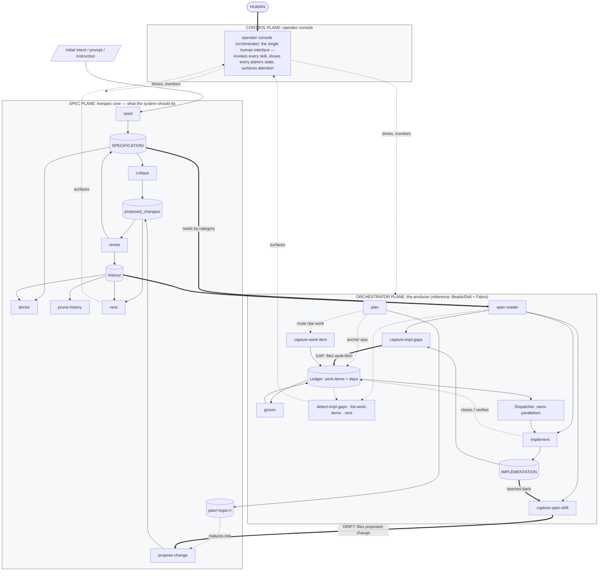

## Proposal: Tool-agnostic workflow diagram at the top of spec.md

### Target specification files

- SPECIFICATION/spec.md
- tests/heading-coverage.json

### Summary

Add a prominent, refreshed Mermaid 'tool-agnostic workflow — spec / implementation lifecycle' diagram as a new first section of SPECIFICATION/spec.md, re-authoring the stale early-brainstorming PlantUML SVG (research/workflow-processes/diagrams/tool-agnostic-workflow.svg) for the current system: memos and Persistent Agent Knowledge retired, the three-plane (Control/Spec/Orchestrator) framing, the Planning Lane, prune-history, plan/groom, the Ledger/Dispatcher, the read surfaces, and the orchestrate console added, with the Gap/Drift cross-boundary spine preserved. The repo-root README references the section (DRY) via a follow-up impl edit.

### Motivation

The maintainer flagged the original tool-agnostic-workflow SVG as an important diagram that 'captures the crux of what the system does' but is outdated (memos and other retired surfaces, old skill names, missing newer workflow) and is PlantUML rather than Mermaid. It should be refreshed for the current system, authored in Mermaid per the project's diagram standard, placed prominently at the beginning of spec.md, and prominently linked from the beginning of README.md.

### Proposed Changes

**What to add.** Insert a new first `## ` section in `SPECIFICATION/spec.md` — placed immediately after the opening three-line file intro and **before** `## Project intent` — so the spec opens with a single-glance picture of the whole spec ↔ implementation lifecycle. The section carries one fenced Mermaid diagram plus a one-line caption. This refreshes, for the current system, the early-brainstorming diagram at `research/workflow-processes/diagrams/tool-agnostic-workflow.svg` (a stale PlantUML-rendered SVG) and re-authors it in Mermaid per §"Template manifest" (Mermaid is the standard; fenced ` ```mermaid ` blocks need no manifest entry, render command, or paired rendered artifact).

**Proposed heading + caption** (sentence-case, matching the file's heading style):

```
## Tool-agnostic workflow — spec / implementation lifecycle

The whole lifecycle at a glance: intent enters via `seed`; the
human-gated spec-governance loop maintains `SPECIFICATION/`; and the
**Gap** (spec → implementation) and **Drift** (implementation → spec)
flows are the load-bearing cross-boundary spine. This is the
operation/dataflow view; §"Contract + reference implementations
architecture" is the complementary dependency/boundary view (the
canonical architecture diagram, single source of truth).
```

**The diagram** (validated to render; convention-compliant — three planes named exactly Spec/Orchestrator/Control as subgraphs, console is the operator cockpit and never a "Driver", full skill names in labels, stores as cylinders, IMPLEMENTATION inside the Orchestrator Plane, no temporal markers, escaped HTML):



**Refresh delta vs. the old SVG** (record for the revise pass):
- REMOVED (retired): `Capture Memo`, `Process Memos`, `List Memos`, the `Memos` store, and the `Persistent Agent Knowledge` store — the memo paradigm and the persistent-knowledge store were retired (per §"Lifecycle" → Terminology and the reference-orchestrator cutover).
- RENAMED/RESTRUCTURED: the old two flat packages "SPEC SIDE / IMPLEMENTATION SIDE" → the **three planes** (Control / Spec / Orchestrator) the current spec uses; "Implementation side" → **Orchestrator Plane** (the producer; reference Beads/Dolt + Fabro).
- ADDED: spec-side `prune-history`; the `plan/&lt;topic&gt;/` Planning-Lane store; orchestrator `plan`, `groom`, the `Ledger`, the `Dispatcher`, and the read surfaces `detect-impl-gaps` / `list-work-items` / `next`; the Control-Plane `orchestrate` operator console.
- PRESERVED: the **Gap** and **Drift** cross-boundary spine, with Drift human-gated at `revise`.

**Paired `tests/heading-coverage.json` co-edit (REQUIRED at the revise pass).** This proposal adds one new `## ` heading to `spec.md`, so the accepting revise payload MUST include `tests/heading-coverage.json` in its `resulting_files[]` (path spelled `../tests/heading-coverage.json` relative to the main `SPECIFICATION/` spec-target) with a new entry for the added heading. The section is diagram + caption only — it asserts no `MUST`/`SHOULD` behavior clause — so the entry is a `TODO` + `reason` ("introductory diagram section; carries no behavior clause, hence no `clauses[]` scenario links"), keeping the heading-coverage map in lockstep without inventing a spurious scenario link.

**README reference (DRY; lands as the impl-side follow-up, NOT in this spec edit).** Mirroring the existing pattern where the repo-root `README.md` *references* the canonical architecture diagram rather than embedding a copy, the new spec section is the single source of truth and the README links to it prominently near the top. The actual `README.md` edit is a host/implementation-file change (the root README is not a spec file), so it is declared as a `spec_commitments` impl-followup on this proposal and realized via the `capture-impl-gaps` → `implement` step after this proposal is revised in — it is intentionally NOT part of the spec.md diff.

---

**Open framing questions for the revise pass** (captured here rather than blocking a live review — the propose-change is the reviewable artifact):

1. **DRY vs. the existing diagrams.** `spec.md` already carries the canonical architecture diagram (§"Contract + reference implementations architecture", dependency/boundary view) and two Workflow-planes diagrams (§"Workflow planes and the Planning Lane"). Recommended: add this lifecycle/dataflow diagram as a NEW top section (it is a genuinely distinct view). Decide at revise whether any overlap with the Workflow-planes diagrams warrants consolidating instead.
2. **Heading text.** "Tool-agnostic workflow — spec / implementation lifecycle" (proposed, preserves the original SVG's title) vs. a terser "Spec / implementation lifecycle at a glance".
3. **Level of detail.** The draft folds the orchestrator "Loop" into `implement` and collapses the three thin read-surfaces into one `oquery` node. Keep for cleanliness, or expand (show `Loop`) / simplify (drop `Dispatcher` + read-surfaces) for a tighter crux view.
4. **Spine highlighting.** Currently thick labelled `==>` arrows for Gap/Drift (matches the repo's current Mermaid style). The original SVG used red cross-boundary edges; decide whether to add red `linkStyle` coloring to make the spine pop.
