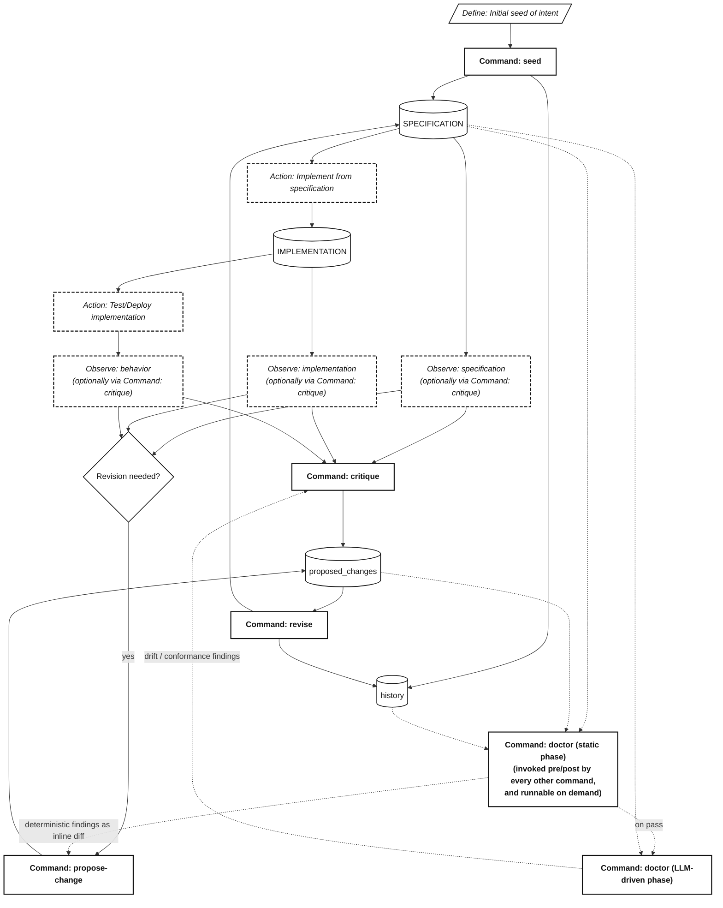

# NLSpec Lifecycle Diagram — Detailed

This is the detailed companion to `2026-04-19-nlspec-lifecycle-diagram.md`.
It adds the `critique` and `doctor` commands and shows that `doctor`
splits into a static phase (deterministic findings, expressible as inline
diff and routed straight to `propose-change`) and an LLM-driven phase
(non-deterministic findings, routed to `critique` to formulate a fix).

## Notes

- **`doctor` static phase → `propose-change` (direct).** Static checks
  are deterministic, so any fix can be expressed as an inline unified
  diff and routed straight to `propose-change` without a `critique`
  pass. The resulting proposed change still flows through `revise` like
  any other.
- **`doctor` LLM-driven phase → `critique`.** Findings here are
  non-deterministic (drift detection, NLSpec conformance, semantic
  template compliance, internal self-consistency), so `critique`
  formulates the fix before it becomes a proposed change.
- **`seed` writes to both `SPECIFICATION` and `history`.** `seed`
  creates `v001` directly so that `history/` is non-empty from the
  first moment.
