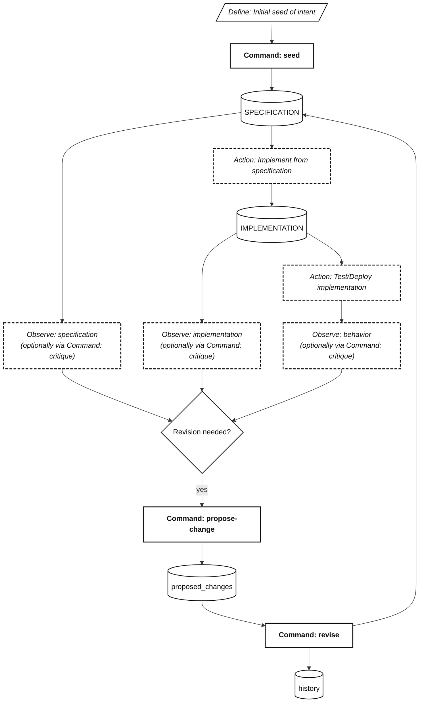

# NLSpec Lifecycle Diagram

```mermaid
flowchart TD
    seed_intent[/"Define: Initial seed of intent"/] --> seed_cmd["Command: seed"]
    seed_cmd --> spec[(SPECIFICATION)]

    spec --> implement["Action: Implement from specification"]
    implement --> impl[(IMPLEMENTATION)]

    spec --> observe_spec["Observe: specification
(optionally via Command: critique)"]
    impl --> observe_impl["Observe: implementation
(optionally via Command: critique)"]
    impl --> test_deploy["Action: Test/Deploy implementation"]
    test_deploy --> observe_behavior["Observe: behavior
(optionally via Command: critique)"]

    observe_spec --> revise_needed{"Revision needed?"}
    observe_impl --> revise_needed
    observe_behavior --> revise_needed

    revise_needed -->|yes| propose_cmd["Command: propose-change"]
    propose_cmd --> proposed[(proposed_changes)]

    proposed --> revise_cmd["Command: revise"]
    revise_cmd --> spec
    revise_cmd --> history[(history)]

    classDef command stroke:#111,stroke-width:2px,fill:#fff,color:#111,font-weight:bold;
    classDef action stroke:#111,stroke-width:2px,stroke-dasharray:6 3,fill:#fff,color:#111,font-style:italic;
    classDef input stroke:#111,stroke-width:1.5px,fill:#fff,color:#111,font-style:italic;
    classDef artifact stroke:#111,stroke-width:1.5px,fill:#fff,color:#111;
    classDef decision stroke:#111,stroke-width:1.5px,fill:#fff,color:#111;

    class seed_cmd,propose_cmd,revise_cmd command;
    class implement,observe_spec,observe_impl,test_deploy,observe_behavior action;
    class seed_intent input;
    class spec,impl,proposed,history artifact;
    class revise_needed decision;
```
