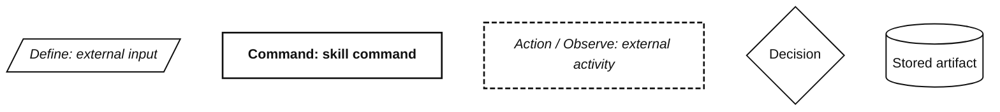

# NLSpec Lifecycle Legend

```mermaid
flowchart LR
    l_input[/"Define: external input"/]
    l_command["Command: skill command"]
    l_action["Action / Observe: external activity"]
    l_decision{"Decision"}
    l_store[(Stored artifact)]

    l_input --- l_command --- l_action --- l_decision --- l_store

    classDef command stroke:#111,stroke-width:2px,fill:#fff,color:#111,font-weight:bold;
    classDef action stroke:#111,stroke-width:2px,stroke-dasharray:6 3,fill:#fff,color:#111,font-style:italic;
    classDef input stroke:#111,stroke-width:1.5px,fill:#fff,color:#111,font-style:italic;
    classDef artifact stroke:#111,stroke-width:1.5px,fill:#fff,color:#111;
    classDef decision stroke:#111,stroke-width:1.5px,fill:#fff,color:#111;

    class l_command command;
    class l_action action;
    class l_input input;
    class l_store artifact;
    class l_decision decision;

    linkStyle 0 stroke:transparent;
    linkStyle 1 stroke:transparent;
    linkStyle 2 stroke:transparent;
    linkStyle 3 stroke:transparent;
```
