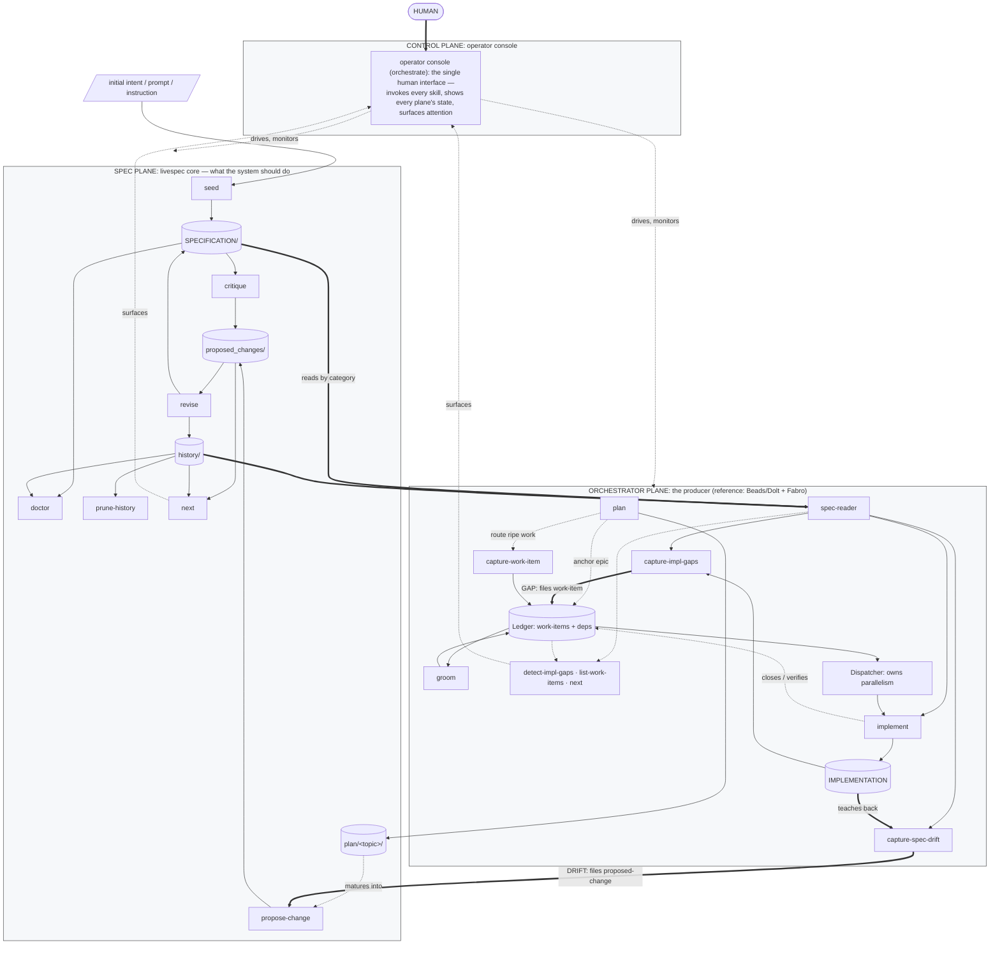

# Handoff: Mermaid spec/implementation lifecycle diagram

**Track:** lifecycle-diagram · **Ledger:** *(no epic yet — see "Next
concrete action")*. This file carries the durable *draft diagram +
plan*; once an epic is anchored, the *authoritative status* lives in
the ledger, never here.

## FIRST ACTION — orient (do not trust this file for status)

```
git -C /data/projects/livespec log --oneline -15
ls /data/projects/livespec/SPECIFICATION/proposed_changes/
```

Then check whether a `proposed_changes/*lifecycle*diagram*.md` (or
similar) already landed — if so, the propose-change phase is DONE and
the next step is the revise pass + the impl-side README link. Derive
"what's done / what's next" from `git log` + the proposed_changes/
listing, not from prose here.

## Why this track exists

The user flagged the early-brainstorming diagram at
`research/workflow-processes/diagrams/tool-agnostic-workflow.svg`
(PlantUML-rendered SVG) as "an important diagram that captures the crux
of what the system does," but **outdated**: it still shows the retired
**memo** paradigm (`Capture Memo`, `Process Memos`, `List Memos`, the
`Memos` store) and the retired `Persistent Agent Knowledge` store, uses
the old two-side framing, and predates the Planning Lane, the
three-plane model, and the orchestrator decomposition.

Goal: a **refreshed, convention-compliant Mermaid** version of that
lifecycle diagram, placed **prominently at the beginning of
`SPECIFICATION/spec.md`** and **prominently linked from the beginning
of the repo-root `README.md`**.

User's requested track shape: **(1)** update the spec via
`/livespec:propose-change`, **(2)** capture the gap, **(3)** implement.
The user originally asked to pause for live diagram review; the Overseer
overrode that — the **propose-change IS the reviewable artifact**, so
open framing questions are captured in the proposal body for the revise
pass instead of blocking.

## Read first

1. This file (the draft diagram + plan below).
2. `research/workflow-processes/tool-agnostic-workflow.md` — the
   **narrative** the original SVG illustrates (glossary, per-node
   rationale, cross-boundary contracts table). Source of truth for the
   *meaning* the refreshed diagram must preserve. NOTE it still
   describes memos / Persistent Agent Knowledge — those are RETIRED;
   do not reintroduce them.
3. `SPECIFICATION/spec.md` — especially §"Lifecycle" (the revision-loop
   Mermaid), §"Workflow planes and the Planning Lane" (two plane
   diagrams), and §"Contract + reference implementations architecture"
   (the **canonical** architecture diagram — single source of truth,
   DRY-referenced by the README). The new diagram is the
   **operation/dataflow** view; those existing ones are the
   **dependency/boundary** view — complementary, NOT a duplicate. See
   the DRY open question below.
4. `.claude/CLAUDE.md` §"Spec and architecture diagram authoring
   conventions" — the binding rules the diagram already satisfies
   (three planes named exactly Spec/Orchestrator/Control; full skill
   names in labels; stores as cylinders; IMPLEMENTATION inside the
   Orchestrator Plane; no temporal markers; escaped HTML).
5. `.claude/CLAUDE.md` §"Revise co-edit discipline —
   tests/heading-coverage.json" — a new `## ` heading in spec.md
   obliges a paired `tests/heading-coverage.json` entry in the revise
   payload's `resulting_files[]`.

## What changed from the original SVG (the refresh delta)

- **REMOVED** (retired): `Capture Memo`, `Process Memos`, `List Memos`,
  the `Memos` store, the `Persistent Agent Knowledge` store.
- **RENAMED/RESTRUCTURED:** old two flat packages "SPEC SIDE /
  IMPLEMENTATION SIDE" → **three planes** (Control / Spec /
  Orchestrator). "Implementation side" → **Orchestrator Plane** (the
  producer; reference Beads/Dolt + Fabro).
- **ADDED:** spec-side `prune-history`; the `plan/<topic>/` Planning-Lane
  store; orchestrator `plan`, `groom`, the `Ledger`, the `Dispatcher`,
  and the read surfaces `detect-impl-gaps` / `list-work-items` /
  `next`; the Control-Plane `orchestrate` operator console.
- **PRESERVED SPINE:** the **Gap** (spec→impl) and **Drift** (impl→spec,
  human-gated at revise) cross-boundary flows.

## The draft diagram (convention-compliant; validated to render)

This is the load-bearing artifact — the exact Mermaid to land in
spec.md (caption/heading TBD per open questions). It rendered cleanly
via the Mermaid validator. Self-review vs. the authoring conventions:
three planes named exactly ✅ · console is the cockpit, never a Driver
✅ · full skill names in labels ✅ · stores as cylinders ✅ ·
IMPLEMENTATION inside the Orchestrator Plane ✅ · no temporal markers ✅
· HTML escaped (`&lt;topic&gt;`, `<br/>`) ✅.



## Placement plan

- **spec.md:** add a new first `## ` section (right after the opening
  3-line intro, before `## Project intent`) carrying the diagram + a
  one-line caption. Working heading: **"Spec / implementation lifecycle
  at a glance"** (title is an open question — the user leaned toward
  keeping the original "Tool-Agnostic Workflow — Spec / Implementation
  Lifecycle"). A new H2 → **paired `tests/heading-coverage.json` entry**
  in the revise payload's `resulting_files[]`.
- **README.md (repo root):** a prominent link near the top pointing at
  the new spec.md section — mirroring the existing DRY pattern where the
  README *references* the canonical architecture diagram rather than
  embedding a copy. This README edit is an **impl-side realization**
  (root README is a host file, not a spec file), so it rides the
  capture-gap → implement step, declared as a `spec_commitments`
  impl-followup on the propose-change.

## Next concrete action (where the track resumes)

Sequence the user asked for:

1. **propose-change (this session's deliverable):** file
   `/livespec:propose-change` against `SPECIFICATION/spec.md` adding the
   diagram section. Drive the wrapper directly:
   `python3 .claude-plugin/scripts/bin/propose_change.py <topic>
   --findings-json <tmp.json> --project-root <worktree>` with a payload
   conforming to `proposal_findings.schema.json` (one finding:
   `name`, `target_spec_files` = [`SPECIFICATION/spec.md`,
   `tests/heading-coverage.json`], `summary`, `motivation`,
   `proposed_changes` carrying the full fenced Mermaid + the
   heading-coverage entry + the open questions). Declare the README
   link as a `spec_commitments.impl_followups[]` entry. Commit
   `chore(spec): …` (docs-only, no TDD ritual) via worktree → PR →
   rebase-merge.
2. **revise:** accept the proposal; land the diagram in spec.md AND the
   paired `tests/heading-coverage.json` entry in `resulting_files[]`
   (atomic). Resolve the open framing questions during this pass.
3. **capture the gap → implement:** the spec now prescribes the README
   reference; `capture-impl-gaps` surfaces the README-not-yet-linked
   gap → `implement` adds the prominent README link.

## Open framing questions (resolve at the revise pass; do NOT block)

1. **DRY vs. the existing diagrams.** spec.md already carries the
   canonical architecture diagram (dependency/boundary) + two
   Workflow-planes diagrams. Add this lifecycle/dataflow diagram as a
   NEW top section (recommended — distinct view), or merge/replace one
   of the existing ones? Watch for genuine overlap with the
   Workflow-planes diagrams.
2. **Heading text** — "Spec / implementation lifecycle at a glance" vs.
   the original "Tool-Agnostic Workflow — Spec / Implementation
   Lifecycle".
3. **Level of detail** — the draft folds the orchestrator "Loop" into
   `implement` and collapses the three thin read-surfaces into one node.
   Keep, or expand/simplify (e.g. drop `Dispatcher` + read-surfaces for
   a cleaner "crux" view)?
4. **Spine highlighting** — currently thick labelled `==>` arrows for
   Gap/Drift (matches the repo's current Mermaid style). The original
   SVG used red cross-boundary edges; add red `linkStyle` coloring?

## Constraints / non-negotiables

- **Dogfood the discipline.** All work in
  `~/.worktrees/<repo>/<branch>`; worktree → PR → rebase-merge; never
  commit on a primary checkout; `mise exec -- git …`; never
  `--no-verify`; halt and report on any hook failure.
- **Spec mutations flow through `/livespec:propose-change` →
  `/livespec:revise`** — never hand-edit `SPECIFICATION/` directly.
- **Heading co-edit is load-bearing** — any spec.md H2 add/change/remove
  pairs a `tests/heading-coverage.json` edit in the revise
  `resulting_files[]`.
- **Mermaid only**, fenced inside the `kind: markdown` spec file — no
  manifest entry, no render command, no paired rendered artifact (per
  spec.md §"Template manifest"). Do NOT add a second PlantUML/SVG.
- **DRY** — single source of truth; the README references the diagram,
  never embeds a second copy.
- **No human-scale time framings** in commits/docs/spec.

## Archive condition

When the diagram has landed in spec.md (revised in) AND the README link
is implemented AND any gap-tied work-item is closed, `git mv` this file
to `archive/prompts/` with a completion banner. Durable history then
lives in the spec, the commits, and (if an epic was anchored) the
ledger.
