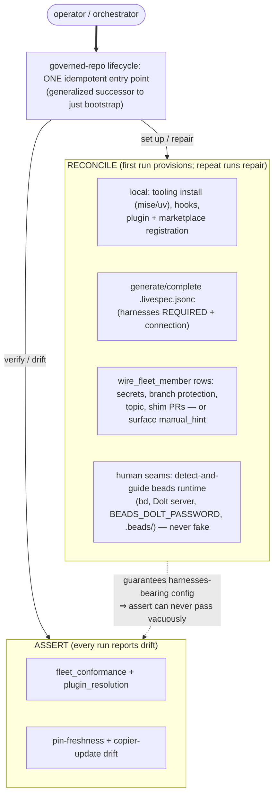

# Governed-repo lifecycle — design and plan

Captured 2026-06-26 from the `governed-repo-lifecycle` planning-track
brief (maintainer-approved framing). **This is research, not
specification text.** Nothing here is normative until it moves through
`/livespec:propose-change` → `/livespec:revise`. This doc is the durable
reasoning ("why this shape"); the runnable handoff is
`prompts/governed-repo-lifecycle-handoff.md`; the queryable plan is
ledger epic **`livespec-zs22.8`** (Increment 6, sibling of the
Conformance Pattern `livespec-zs22.7`, under parent `livespec-zs22`).

Companions:
- `research/factory-conformance/cross-repo-conformance-pattern.md` — the
  Conformance Pattern (the five-slot mechanism this sits beside and
  reuses; its drift-check is the *assert* half this superset wraps).
- `research/planning-workflow-gap/planning-lane-design.md` — the
  Planning Lane this track files its milestones through, and the
  three-plane model (Spec / Orchestrator / Control).

## Bottom line

livespec can **check** whether a governed repo conforms (the Conformance
Pattern, `livespec-zs22.7`, just completed) but has nothing that **sets
one up** or **keeps it set up**. "Onboarding" is an undefined manual
step today; the only safety net is a conformance report plus operator
diligence — and that net has a hole: the plugin-resolution check
*skips* a repo that has no `.livespec.jsonc` at all, so a config-less
repo passes vacuously even after the M6-g required-key flip.

The good news, found by reading the machinery: the Conformance Pattern
*already* has the two-mode shape this initiative needs. The
fleet-membership contract is one obligation table with two readers —
`fleet_conformance` (**assert mode**, the CI sweep) and
`wire_fleet_member` (**idempotent reconcile mode**, the wiring). The
livespec spec states it directly: *"assert mode is CI; reconcile mode is
wiring."* Reconcile already detect-and-guides (applies a machine fix per
violated row, or surfaces that row's `manual_hint` where no machine fix
exists) and already pushes secrets safely (env→stdin, values never
logged).

So the move is **not** "build a setup framework." It is: stand up **one
idempotent entry point** — the generalized successor to `just bootstrap`
— that composes the *existing* reconcile-then-assert pair, **extends**
the obligation coverage to the setup dimensions that today live outside
the conformance machinery (local tooling install, plugin/marketplace
registration, `.livespec.jsonc` generation incl. the `connection`
block, beads runtime detect-and-guide), and by guaranteeing a
`harnesses`-bearing `.livespec.jsonc` exists, **closes the vacuous-pass
hole** so the drift gate can never pass on an unconfigured repo. First
run provisions; repeat runs report and repair. Setup and drift-check are
the same logic in two modes.

## The gap

The Conformance Pattern (`zs22.7`) delivered the *check* side fleet-wide:
a declarative manifest, a `baseline` conformance floor, the five-slot
anatomy (Contract / Mechanism / Installer / Verifier / Exemption), and
four-tier enforcement. What it deliberately does **not** own (its M1
scope is "checks policy; assumes setup already done"):

1. **First-touch local setup of an arbitrary governed repo.** Today this
   is `just bootstrap` — but it is *this-repo-only* (it operates on the
   current checkout's `.git`, `~/.worktrees`, and project-scoped plugin
   enablement) and is copied per repo via the copier template. It is not
   a verb you can point at "any governed repo, new or existing, fleet or
   adopter."
2. **`.livespec.jsonc` generation.** The copier template ships a
   `harnesses` stub but deliberately omits the `connection` block
   ("tenant identity is provisioned at fleet-onboarding, not copier
   time"). An *existing* adopter repo with no `.livespec.jsonc` at all
   has nothing generate it — and that is exactly the repo the drift gate
   skips.
3. **The human seams as a first-class, repeatable step.** The beads
   runtime prerequisites (the `bd` binary, a running Dolt `sql-server`,
   the tenant `BEADS_DOLT_PASSWORD`, the `.beads/` pointer files) are
   documented in prose (`AGENTS.md` §"Beads runtime prerequisites") and
   provisioned by hand. `wire_fleet_member` can push fleet secrets from
   the 1Password wrapper, but nothing walks an operator through the
   detect-and-guide for a fresh adopter end to end.

The result is that "set up a governed repo" is scattered across pieces
that do not compose into one runnable, idempotent step, and "keep it set
up" is several independent drift signals (pin-freshness, copier-update
drift, the conformance sweep) with no single front door.

### The vacuous-pass hole, precisely

The cross-harness plugin-resolution Verifier
(`livespec_dev_tooling/checks/plugin_resolution.py`) is the load-bearing
gate, but it short-circuits when there is no config to read
(`plugin_resolution.py:322-324`):

```python
path = root / _LIVESPEC_JSONC
if not path.is_file():
    return None, "no .livespec.jsonc; no declared harness surface"
```

That `None` becomes a skip and `main()` exits `0`
(`plugin_resolution.py:426-428`). M6 (`zs22.7.7`) narrowed the hole — a
`.livespec.jsonc` that *exists* but omits `harnesses` is now fail-closed
(`plugin_resolution.py:347-351`, "required fleet-wide since M6") — but a
repo with **no file at all** still passes vacuously. The fleet-side
mirror `assert_baseline_harnesses` (`_rows_baseline.py`) is the same
shape. The setup mode is what removes the hole structurally: once setup
guarantees a `harnesses`-bearing `.livespec.jsonc`, "config-less" is no
longer a reachable state for a governed repo, so the skip branch is
never taken on one.

## What already exists — the two-mode machinery and the scatter

The central realization is that the brief's "same logic, two modes" is
already the documented design of the conformance machinery; the
lifecycle system orchestrates and extends it rather than re-implementing
it.

| Mode | Realized by | What it does | Vantage |
|---|---|---|---|
| **assert** (verify / drift) | `livespec_dev_tooling.fleet.fleet_conformance` | Walks the obligation table for every member; reports findings. The CI sweep + release-fan-out preflight. | central (manifest) |
| **reconcile** (set up / repair) | `livespec_dev_tooling.fleet.wire_fleet_member` | Walks the **same** table for ONE member; per violated row applies the row's reconcile reference **or** surfaces its `manual_hint`. | central (manifest) |

Both read one shared `contract.py` (`OBLIGATION_ROWS`, `PROFILE_LAYERS =
("baseline", "fleet-infra", "orchestrator-plugin", "app")`). The
manifest is `.livespec-fleet-manifest.jsonc` (`fleet[]` +
`adopters[]`). Reconcile already does detect-and-guide and already
handles secrets safely. **This pair is the spine the lifecycle system
wraps.**

What the pair does **not** cover today — the dimensions that must be
folded in or composed:

| # | Piece | Where | Concern | Scope today |
|---|---|---|---|---|
| 1 | `just bootstrap` | `justfile:67` (+ `install-commit-refuse-hooks:57`, `ensure-plugins:120`, `ensure-codex-plugins:136`) | setup (local: hooks, mise trust, plugins) | this-repo-only |
| 2 | impl-plugin copier template | `templates/impl-plugin/` (`.livespec.jsonc.jinja` ships `harnesses`, omits `connection`) | setup (scaffold) | new-repos-only |
| 3 | `wire_fleet_member` (reconcile) | `livespec_dev_tooling/fleet/wire_fleet_member.py` | setup/repair (central: secrets, branch-protection, topic, shim PRs) | fleet members in the manifest |
| 4 | `fleet_conformance` (assert) | `livespec_dev_tooling/fleet/fleet_conformance.py` | drift-check (the conformance sweep) | cross-repo (manifest) |
| 5 | `plugin_resolution` Verifier | `livespec_dev_tooling/checks/plugin_resolution.py` (`justfile:776`) | drift-check (harness surface) | per-repo gate (+ fleet mirror) |
| 6 | `.livespec.jsonc` | `/.livespec.jsonc` (`template`, `spec_root`, `harnesses`, `implementation`, `<impl>.compat.pinned` + `connection`, `external_references`, `cross_repo_targets`) | setup (the artifact to generate) | per-repo |
| 7 | bump-pin / pin-freshness | reusable workflows in `livespec-dev-tooling`; per-repo shims | drift-check (pin staleness) | cross-repo |
| 8 | copier-update-drift (the "template sync") | `templates/.../copier-update-drift.yml.jinja` (no literal `template-sync` exists) | drift-check (scaffold divergence) | cross-repo |
| 9 | manual install + beads prereqs | `contracts.md` §"Plugin distribution"; `AGENTS.md` §"Plugin install" / §"Beads runtime prerequisites" | setup (manual, un-automated) | per-consumer + host backend |

Read the table as: rows 3 + 4 are the existing reconcile/assert spine;
rows 1, 2, 6, 9 are setup dimensions the spine does not yet reach
(local first-touch, scaffold, config generation, the human seams); rows
5, 7, 8 are independent drift signals with no single front door. The
lifecycle system is the orchestrating layer that gives all of these one
idempotent entry point.

## The design

### The unifying insight



One entry point, two modes over the same obligation set. "Setup" is
reconcile run on a repo that has little in place; "drift-check" is
assert (plus the per-dimension drift signals) run on a repo that is
mostly in place. A single idempotent invocation can do both: reconcile
what it can, then assert and report what remains (including the
manual-only rows it surfaced rather than faked).

### Locked framing (maintainer-approved), grounded

1. **ONE idempotent command — the generalized successor to `just
   bootstrap`**, with setup + verify/drift modes (or one idempotent run
   that reports+repairs). `just bootstrap` becomes a thin special case
   ("this repo, locally") of the general verb. Idempotence is already
   the contract on both halves it composes (`wire_fleet_member` is
   "idempotent reconcile"; assert is read-only).
2. **Sit beside and REUSE the Conformance Pattern machinery — do not
   re-implement.** The fleet manifest, the `baseline` profile, the
   `OBLIGATION_ROWS`, `fleet_conformance` (assert), `wire_fleet_member`
   (reconcile), and the per-row `manual_hint` are the substrate. The
   lifecycle system is the orchestrating layer on top; new setup
   dimensions are added as **new obligation rows / reconcile references**
   in the shared `contract.py`, not as a parallel mechanism. This keeps
   one source of truth for "what a governed repo must have."
3. **Human seams cannot be fully automated — detect-and-guide with
   actionable TODOs, never fake.** This is already realized: a reconcile
   row with no machine fix surfaces its `manual_hint`; secrets flow
   env→stdin from the 1Password wrapper and values never appear in any
   stream. The lifecycle system extends this to the beads runtime
   prerequisites (probe for the `bd` binary, a reachable Dolt
   `sql-server`, the injected `BEADS_DOLT_PASSWORD`, the `.beads/`
   pointer files) and emits a precise, copy-pasteable TODO for each
   missing piece — it never writes a fake connection or a placeholder
   secret.
4. **Surface: a runnable script + a `just` target** — host-mutation +
   install, **not** spec-side prose. It lives where `bootstrap` lives
   (the non-functional tooling plane), is callable by the conformance
   reporting (assert can invoke "and here is the one command that
   repairs this"), and never enters livespec core's *functional* spec or
   the `/livespec:*` surface. This respects the same functional /
   non-functional boundary the `just`-keystone mandate draws.

### What it reuses vs. what it adds (the delta)

**Reuses unchanged:** `.livespec-fleet-manifest.jsonc`; `contract.py`
(`OBLIGATION_ROWS`, `PROFILE_LAYERS`); `fleet_conformance` (assert);
`wire_fleet_member` (reconcile + secret projection + `manual_hint`);
`plugin_resolution`; the pin-freshness / copier-update-drift workflows;
the structural commit-refuse hook + `install-commit-refuse-hooks`.

**Adds (each as a reconcile reference / obligation row where possible,
so assert gains the matching check for free):**

- A **local first-touch** reconcile path (mise install, uv sync, hook
  install, project-scoped plugin + marketplace registration) — today
  only in `just bootstrap`; generalize it so it runs against any
  governed checkout, not just this one.
- A **`.livespec.jsonc` generator/completer** that guarantees a
  `harnesses` declaration (closing the vacuous-pass hole) and fills the
  `connection` block from the wrapper-projected tenant identity, leaving
  it as a guided TODO when the human seam is unresolved.
- A **beads-runtime detect-and-guide** row set (binary / server /
  secret / pointers), each emitting a `manual_hint` when unmet.
- The **idempotent orchestrator** itself: the entry point that sequences
  reconcile-then-assert, dispatches local vs. central rows correctly,
  and renders one report (provisioned / repaired / needs-human).

### Closing the vacuous-pass hole

The setup mode's post-condition is the fix: a governed repo that has run
setup has a `harnesses`-bearing `.livespec.jsonc`, so `plugin_resolution`
and `assert_baseline_harnesses` never reach their "no file → skip"
branch on it. The complementary guard (out of scope to *build* here but
worth recording) is a manifest-level assertion that every declared
governed repo has run setup — i.e. the assert sweep treats "a manifest
member whose config is absent" as a finding, not a skip. Together they
make "config-less governed repo" an unreachable state rather than a
silently tolerated one.

## Relationship to the Conformance Pattern

- **Sibling, not child of the pattern.** The Conformance Pattern defines
  and checks the floor; the lifecycle system provisions and maintains
  it. Same obligation table, opposite direction.
- **The drift-check is a superset that includes conformance.** "Is this
  repo still set up?" subsumes "does it conform?" and adds the
  dimensions conformance does not own (pin staleness, template
  divergence, config completeness, local tooling). The lifecycle
  system's assert mode calls the conformance sweep and folds in the
  other drift signals under one report.
- **The five-slot anatomy still applies to each new concern** the
  lifecycle system introduces (e.g. "`.livespec.jsonc` exists and is
  complete" is a Contract / Mechanism / Installer=reconcile-row /
  Verifier=assert-row / Exemption=declared-exempt-harness). Adding a
  setup dimension is "fill five slots," same as adding a conformance
  concern.

## Open questions

- **Where the generalized verb lives.** `wire_fleet_member` is in
  `livespec-dev-tooling` (the fleet's enforcement-suite package);
  `just bootstrap` is in core's `justfile`. The unified entry point
  most naturally lives beside `wire_fleet_member` (it extends the same
  obligation table) with a thin `just` target in each repo delegating to
  it — but the `baseline`-tooling-extraction sequencing
  (`cross-repo-conformance-pattern.md` §"dev-tooling cohesion") may move
  the home. Decide when the first milestone is cut.
- **Adopter local setup vs. central wiring.** `wire_fleet_member`
  operates from a central GitHub vantage (it opens PRs, sets branch
  protection). First-touch *local* setup (mise/uv/hooks/plugins) is
  inherently in-checkout. The entry point must dispatch a row to the
  right vantage; the clean split is "local rows run in the checkout,
  central rows run against the manifest" — confirm no row needs both.
- **Manifest membership for adopters with no config yet.** The
  register-first rule (`wire_fleet_member` exits 1 if `--repo` is not in
  the manifest) assumes the repo is already a declared member. A
  brand-new adopter is not. Decide whether setup registers-then-wires in
  one idempotent pass, or whether registration stays a deliberate
  human-gated first step.
- **Relationship to `copier update`.** For template-born repos, scaffold
  drift is reconciled by `copier update` (a 3-way merge). Does the
  lifecycle entry point invoke/await that, or only *report* the drift
  and leave the merge to the operator? (Leaning: report + guide, because
  the merge needs human conflict resolution — another `manual_hint`.)

## Milestone sketch (drafted; the maintainer owns the cut)

Filed as `livespec-zs22.8.*` children as each ripens — same discipline
as the Conformance Pattern's M0–M6. Not yet filed; this is the proposed
decomposition for approval.

- **M0 — Decisions locked** (this doc + handoff): the two-mode framing,
  reuse-first over `wire_fleet_member`/`fleet_conformance`, the
  detect-and-guide seam via `manual_hint`, the script + `just`-target
  surface. *No code.*
- **M1 — The unified entry point specified** (`propose-change` into
  `non-functional-requirements.md`): the generalized successor to `just
  bootstrap`; setup=reconcile / drift=assert; the new obligation rows
  (local first-touch, `.livespec.jsonc` completeness, beads runtime);
  the vacuous-pass closure post-condition.
- **M2 — Generalize `just bootstrap` → the lifecycle verb**: local
  first-touch reconcile that runs against an arbitrary checkout; `just
  bootstrap` becomes its this-repo special case. Reuse-first; no copies.
- **M3 — `.livespec.jsonc` generate/complete + close the hole**:
  guarantee `harnesses`; fill `connection` from the wrapper or emit the
  guided TODO; add the assert-side "member-without-config is a finding"
  guard.
- **M4 — Beads-runtime detect-and-guide rows**: probe binary / server /
  secret / pointers; `manual_hint` for each unmet seam; secrets stay
  probe-only.
- **M5 — Fleet dogfood**: run the unified verb against a fleet member
  end to end (set up from a fresh clone; verify drift on a configured
  one); `just check` green.
- **M6 — Adopter dogfood**: run it against an *existing, config-less*
  adopter repo — proving it both onboards and closes the vacuous-pass
  hole outside the fleet.
