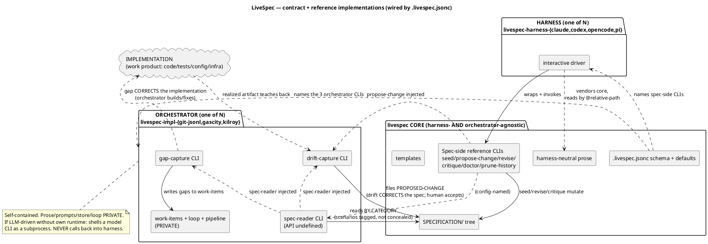

# LiveSpec as a contract with reference implementations

**Status:** open / pre-formal research capture (per `research/workflow-processes/CLAUDE.md` graduation rule — NOT yet codified into `SPECIFICATION/`).

**Date:** 2026-06-02.

**Authored from:** branch `master`, multi-session design discussion.

**Evolves:** the two-tier spec-vs-implementation framing in `tool-agnostic-workflow.md` and the diagrams in `diagrams/` (especially `core-vs-impl-api-surface.svg` and `orchestration-layers.svg`).

**Companion captures:** the orchestrator-agnostic three-layer exploration that preceded this (Gas City / Beads / Dolt; StrongDM Dark Factory / Kilroy / Attractor; holdout scenarios). This doc is the convergence of that thread.

> This is a **re-steering of the whole project**, not an increment.
> It reframes "implementation" from a peer tier into the *work
> product* of a pluggable orchestrator, and rebuilds the contract
> as a CLI surface wired by `.livespec.jsonc` — making core
> agnostic to BOTH the orchestrator AND the harness.

---

## 1. The thesis

**LiveSpec is a contract plus reference implementations at every
seam.** The core `livespec` library is agnostic to:

- the **harness** (Claude Code, Codex, OpenCode, Pi — how a human
  drives it), and
- the **orchestrator** (git-jsonl, Gas City, Kilroy — what
  produces the implementation).

The product is the contract + reference implementations that prove
it is real and swappable: a reference spec-side CLI, reference
harness bindings, and reference orchestrators.

### What "implementation" is now

Not a tier, not an actor — the **work product**. The goal. The code,
tests, config, infra the spec is *for*. The orchestrator is the
*producer*; the implementation is the *artifact produced*. The old
two-tier picture was right that implementation is the point, but it
conflated the **product** (implementation) with the **producer**
(orchestrator) and drew a Claude-Code plugin behind it.

### Why this supersedes "third tier" / "layer" framings

Earlier in the discussion we tried "add a third orchestration tier"
and an L1/L2/L3 "layer" stack. Both are **rejected**:

- There is no third tier. There is a **spec tier that exposes an
  API**, and **orchestrators that consume it**. Implementation is
  the output of the latter.
- "Layer" (CLI / skill / loop) is retired. The loop moves into the
  orchestrator. A "skill" decomposes into **(prose, in core) +
  (CLI, the contract)**: the prose backing the LLM portions stays a
  first-class **core** artifact (DRY, shared across all harnesses);
  only the harness-specific *binding* of that prose to a tool runtime
  (e.g. Claude's `/livespec:*` slash commands) lives in the harness.
  With no loop in core, there is no stack to layer.

---

## 2. The two flows — the preserved spine

The one thing to preserve from the existing diagrams is the pair of
asymmetric cross-boundary flows. Both are **about the implementation
as artifact**, in opposite directions. Each flow **corrects its
destination**:

| | **gap** | **drift** |
|---|---|---|
| Direction | spec → implementation | implementation → spec |
| Corrects | the **implementation** (build/fix the artifact) | the **spec** (amend intent) |
| Question | "what does the spec require that the impl doesn't satisfy?" | "where has the realized impl diverged, and is the impl right?" |
| Destination | a tracked work-item (orchestrator-owned) | a **proposed-change** (spec-lifecycle-owned) |
| Method | mechanical / **LLM** / human — orchestrator's private choice; usually LLM (comparing large prose to code) | mechanical / **LLM** / human — usually needs a human |
| Human dependency | optional | **usually required** |

**Method is NOT a determinism distinction.** (Correcting a stale
belief: the live `contracts.md` says `detect-impl-gaps` has "no LLM
in the detection path" — wrong for real semantic gap detection,
which compares a large spec to an implementation and is normally
LLM-driven. A future codification must fix that clause.)

**Drift's human dependency is the load-bearing doctrine.** Only a
human can rule "the implementation is right, the spec is wrong."
That is *why* drift lands as a proposed-change and never a direct
spec write: the propose-change/revise gate **is** the human
adjudication mechanism. This is the **irreducible human touchpoint
that survives even a fully autonomous (dark-factory) orchestrator** —
an orchestrator that accepted its own drift would be grading its own
homework at the intent level (the same independence StrongDM
enforces by holding scenarios out). Orchestrators may *file* drift
(machine path, no harness); only humans *accept* it (harness path).

---

## 3. The contract: CLIs named in `.livespec.jsonc`

The contract is no longer "skills" (that ties it to Claude Code). It
is a **CLI surface**, and `.livespec.jsonc` is the single wiring
table. The CLI is the common interface; harnesses wrap it.

### Three orchestrator-side CLIs (named in config)

LiveSpec defines **none of their behavior** — only that they are
named and callable:

1. **Spec reader CLI** — reads the spec however it wants (plain
   reads, cached, indexed, embedded, RAG…). **Its API is undefined**
   — it can be, because the *same orchestrator* writes both the
   reader and everything that consumes it; their shared interface is
   private. Exposes spec content **by category** (spec / contracts /
   constraints / scenarios / …) so a consumer can *tell* what is a
   scenario. It **categorizes, never conceals** — holdout is the
   orchestrator's policy choice, not the contract's.
2. **Gap-capture CLI** — a *capture* interface. Detects gaps and
   writes them to whatever work-item mechanism the orchestrator has.
   The **spec-reader CLI is injected** as a reference. LiveSpec never
   sees the gaps or the store.
3. **Drift-capture CLI** — a *capture* interface. The **spec-reader
   CLI and the propose-change CLI are injected**. Routes drift →
   propose-change. Filing is a machine path; acceptance is human.

### Spec-side CLIs (also named in config; core ships defaults)

seed / propose-change / revise / critique / doctor / prune-history.
**Pre-populated with core's defaults, each overridable** — an
alternate implementation is selected simply by overriding the name
in config. `propose-change` is the one spec-side CLI injected into
the orchestrator (into drift-capture).

### Doctor shrinks to almost nothing

All semantic cross-boundary invariants disappear (gap-tracking-1:1,
no-stale-gap-tied, work-item introspection, the 10-skill schema).
Doctor's entire cross-boundary job: **every config-named CLI
resolves and is callable.** It never inspects gaps, work-items, or
stores. It is **not privileged** — config-named and overridable like
any other spec-side CLI.

### CLI shape conventions (the "tool-agnostic" part)

- One binary per side, subcommands; NOT slash commands.
- `--json` everywhere with stable schemas; human text otherwise.
- stdin/stdout + files for payloads (any language can drive it).
- Stable exit codes (reuse the existing lifecycle exit-code table).
- "Callable" test for doctor: the named CLI resolves + is
  executable (leaning zero-shape, no probe convention).

---

## 4. Two orthogonal pluggability axes + the spec-side itself

| Axis | Role | Reference repos | Boundary |
|---|---|---|---|
| **Harness** | how a human *drives* livespec interactively | `livespec-harness-{claude,codex,opencode,pi}` | wraps spec-side CLIs; vendors core; reads **only core's spec-side prose** by relative path (Claude via `@…`), harness-neutral register |
| **Orchestrator** | *produces* the implementation (the work product); owns work-items + production loop | `livespec-impl-{git-jsonl,gascity,kilroy}` | the 3 named CLIs; **self-contained** |
| **Spec-side** | the spec lifecycle | core (default), config-named, overridable | the spec-side CLIs |

### Prose lives in exactly one cross-boundary path: core → harness

Decomposition: a "skill" = **(prose, in core) + (CLI, the
contract)**. The harness binds prose to a tool runtime. Harnesses
vendor core and refer to prose by **relative path** (transport); the
prose itself is written in a **harness-neutral register** — it may
say "run the propose-change CLI named in config" and "confirm with
the user," but never "use the Bash tool" or "/livespec:next." Each
harness translates intent into its own tool-calling.

**Orchestrator prose does NOT cross to the harness.** (Corrected
mid-discussion.) The gap/drift/implement interaction prose is
*enacted by the orchestrator's own CLI*, internal to the orchestrator
repo. If the batteries-included `git-jsonl` orchestrator wants to be
LLM-driven without shipping a runtime, it **shells a model CLI as a
subprocess** (`claude -p`, `codex exec`, an API call) — its prompt
stays private; it depends on *a model being invokable*, not on the
harness reading its prose. The inverse (orchestrator calling back
into the harness to "enact this prose") is **forbidden** — it would
re-create exactly the coupling this refactor removes.

### "plaintext" is dead as a name

`livespec-impl-git-jsonl` names the actual substrate. This vindicates
the whole thread: "plaintext" was always an orchestrator, never a
storage format. git-committed JSONL stays as `git-jsonl`'s substrate
(durable git persistence is required for the default), and the
append-only-store concerns become **that one orchestrator's private
problem**, not a cross-cutting contract.

---

## 5. The wiring diagram (PlantUML — to be rendered like the others)

PlantUML, consistent with the existing `diagrams/*.plantuml` sources
(NOT Mermaid). Source to be saved as
`diagrams/contract-and-reference-implementations.plantuml` when this
graduates; inlined here for review.

---

## 6. `.livespec.jsonc` — what stays, moves, or leaves core (item 0)

Audit of the current config + cross-repo contract surface against
the refactor.

### Stays (becomes the single wiring table)

- `template`, `spec_root` — spec-tier facts.
- **NEW:** named spec-side CLIs (defaulted) + the 3 orchestrator
  CLI names. This is the heart of the new contract.

### Must change

- `implementation: { plugin: "livespec-impl-plaintext" }` — the
  Claude-Code-"plugin" framing becomes an **orchestrator** selection
  naming an orchestrator repo (e.g. `livespec-impl-git-jsonl`) and
  its 3 CLIs.
- The `livespec-impl-plaintext` block (`format`, `work_items_path`,
  `memos_path`) — these are **orchestrator-private** now. `git-jsonl`
  may keep them in *its own* config section, but core's contract MUST
  NOT know about `work_items_path`/`memos_path`. **Move out of the
  core contract.**

### Open question — multi-repo dependency machinery

The biggest item-0 question. Today core's contract carries a large
cross-repo surface: `cross_repo_targets`, the typed `DependsOnEntry`
union (`local` / `sibling_work_item` / `pull_request` / `branch`),
`livespec_runtime.cross_repo.resolve_ref`, and the
`depends_on-ref-wellformedness` + `no-orphan-dependency` +
`no-stalled-epic` doctor invariants that walk it.

Under the refactor, **work-items and their `depends_on` graph are
orchestrator-private.** Therefore:

- `depends_on`, the typed `DependsOnEntry` union, and cross-repo
  ref-resolution are **work-item concerns → they belong to the
  orchestrator**, not core's contract. An orchestrator that models
  cross-repo dependencies (git-jsonl) owns that machinery;
  gascity/kilroy may model it entirely differently or natively.
- The doctor invariants that walk `depends_on` (no-orphan,
  no-stalled-epic, depends_on-ref-wellformedness) **leave core** —
  they were semantic work-item invariants, exactly the class doctor
  is shedding.
- `cross_repo_targets` (repo slug → github_url/local_clone/branch)
  is partly orchestrator (work-item resolution) and partly a
  **family-coordination** concern. Likely splits: the resolution use
  → orchestrator; any release-coordination use → see below.
- `livespec_runtime.cross_repo` (the resolver) → moves to wherever
  the orchestrator wants it; it is not core-contract surface.

### Open question — pin-and-bump / `compat`

`compat` (semver range + pinned tag) and the bump-pin automation
coordinate **release versions across the family**. This is real and
survives, but it is a **family build-coordination** concern, not part
of the spec↔orchestrator contract. Candidate disposition: relocate
pin-and-bump to a family/dev-tooling coordination surface
(`livespec-dev-tooling` already owns the automation), and **remove
the `compat`-reading doctor invariant from core's contract** (it is
not "is a named CLI callable"). To decide.

### Net for item 0

Core's `.livespec.jsonc` contract shrinks to: spec-tier facts +
named CLIs. Everything about work-items, dependencies, stores, and
release-pinning **moves out of the core contract** into orchestrators
(work-item/dependency machinery) or the family-coordination surface
(pin-and-bump). This is consistent with doctor's collapse.

---

## 7. Phased migration plan (DRAFT)

> Sequencing principle: **decouple before extracting.** Make core
> agnostic first (CLI contract + config wiring), THEN split harness
> and orchestrator into their own repos, THEN add alternates. Each
> phase ends green and releasable.

**Phase 0 — Quiesce & decide dispositions (this doc's appendix).**
Close/abandon/reframe every open item across all repos that would
otherwise be migrated into a model that's being deleted. No new
direction work starts until the board is clean. (See Appendix A.)

**Phase 1 — Spec the new contract.** A coordinated propose-change in
core: replace the 10-skill surface + thin-transport doctrine with the
CLI contract; define the 3 orchestrator CLIs + config wiring; shrink
doctor to callability; move work-item/dependency/pin machinery out of
the core contract (item 0). This is the load-bearing spec change;
everything else realizes it.

**Phase 2 — Build the spec-side reference CLIs in core.** Promote the
existing `bin/*.py` wrappers to the *named, config-resolved* spec-side
CLI contract. Decompose skills into (prose in core) + (CLI). Strip
Claude-Code specifics from core.

**Phase 3 — Extract harness: `livespec-harness-claude`.** Move the
Claude-specific *binding* — the `/livespec:*` slash commands and the
SKILL.md wrappers that point Claude at the shared prose — out of core
into the first harness repo. The shared LLM-backing **prose stays in
core**; the harness vendors core and reads that prose by relative
path. Core now has no `.claude/`, but retains the harness-neutral
prose.

**Phase 4 — Rebuild the default orchestrator as
`livespec-impl-git-jsonl`.** Rename from `livespec-impl-plaintext`;
implement the 3 CLIs (spec-reader, gap-capture, drift-capture) over
git-JSONL; fold memos into work-items (status, not type); pull the
append-only-store concerns in as *its* private problem. Its prose is
private; LLM via subprocess.

**Phase 5 — Prove both axes swap.** Stand up one more harness
(`-codex`) and document/scaffold one more orchestrator
(`-gascity` or `-kilroy`) to validate genuine pluggability. Even a
thin reference proves the contract holds.

**Phase 6 — Codify the diagrams.** Graduate this doc's PlantUML +
the re-axised `core-vs-impl-api-surface` into the SPECIFICATION
template (the long-standing uncodified-diagram gap), with a doctor
drift-check so they can't rot.

(Phase boundaries are PR boundaries; ordering of 3/4 can overlap once
Phase 1+2 land.)

---

## Appendix A — Open-item disposition (THE INITIAL DELIVERABLE)

Every open proposed-change, work-item, and memo across **all four
repos** as of 2026-06-02 (reduced from each `origin/master`), with a
proposed disposition. **Items marked CLOSE-FIRST must be resolved
before Phase 1 starts**; CARRY items survive the migration; REFRAME
items change meaning under the new model.

### A.1 Pending proposed-changes (core)

| PC | Disposition | Rationale |
|---|---|---|
| `recast-layer3-standalone-orchestrate-plugin.md` | **REFRAME / likely supersede** | Its core move (orchestrator consumes only the published surface) is *right* and survives, but "standalone Layer-3 orchestrate plugin" is overtaken by the orchestrator-is-the-loop model. Fold its valid parts into Phase 1; retire the rest. Decide before revising. |
| `append-only-store-legibility-and-merge-safe-reduction.md` | **REFRAME → orchestrator-private** | Order-independent reduction / supersession / no-divergent-heads / no-raw-store-read stop being core cross-cutting contract and become `git-jsonl`'s private store discipline. Do NOT revise into core as-is. Move to the orchestrator repo's concerns. |

### A.2 Open work-items — core `livespec` (13)

| ID | Disposition | Note |
|---|---|---|
| `li-hookimpl` | **CARRY → harness/orchestrator** | "PreToolUse hook redirecting auto-memory writes" is Claude-Code-harness-specific → belongs in `livespec-harness-claude`, not core. Reframe target repo. |
| `li-qyk` (Phase F: impl-beads) | **REFRAME** | "sibling impl-beads repo" = an orchestrator under the new model (`-gascity`/`-kilroy` cohort). Keep as a Phase-5 alternate; restate. |
| `li-1f5-rest` | **REVIEW** | Agent-collaboration discipline; may be harness-prose, may be obsolete. Triage in Phase 0. |
| `li-cvaudit`, `li-cvnoarg`, `li-cvredmd`, `li-cvstale`, `li-cvtodo` | **CLOSE-FIRST or CARRY (dev-tooling)** | justfile carve-out elimination — these are dev-tooling/CI hygiene, orthogonal to the refactor. Either finish before Phase 1 (clean board) or explicitly carry as dev-tooling work. Not migration-blocking semantically, but noise. |
| `li-reapwt` | **CARRY (dev-tooling/orchestrator)** | worktree-reaper bug; mechanical, not contract. |
| `li-storeschema-ci` | **CLOSE/DROP** | "CI guard validating work-items.jsonl against impl-plaintext store schema" — the store becomes orchestrator-private; core validating it contradicts the refactor. Likely DROP. |
| `li-pxsrc` | **CARRY (dev-tooling)** | adopt v0.8.0 config-driven shared checks; build hygiene. |
| `li-huxsg3` | **CARRY** | extract templates/library/ for sibling libs; aligns with multi-repo direction. |
| `li-l6asrr` | **CARRY (dev-tooling)** | cross-repo `uv run` lockfile discipline. |

### A.3 Open work-items — `livespec-impl-plaintext` (1)

| ID | Disposition | Note |
|---|---|---|
| `li-tenpup` | **REFRAME → git-jsonl private** | work-item-merge-evidence schema fields — pure orchestrator-store concern; survives inside `livespec-impl-git-jsonl`, leaves the core contract. |

### A.4 Open work-items — `livespec-dev-tooling` (2)

| ID | Disposition | Note |
|---|---|---|
| `li-4x3a45` | **CARRY** | master_ci_green env escape hatch; CI infra, unaffected. |
| `li-bccscn` | **CARRY** | pin-autodiscovery walks workflows; relevant to where pin-and-bump lands (item 0). Revisit when relocating `compat`. |

### A.5 Open work-items — `livespec-runtime` (0)

None.

### A.6 Open memos (across repos)

| Repo | Memos | Disposition |
|---|---|---|
| core | 8× `mm-*` "Wave-0 stale-branch cleanup / abandon-with-backup-ref" | **CLOSE-FIRST** — administrative branch-cleanup records; disposition them out (they're already decided "abandon"). Zero migration value. |
| core | `mm-7lvwm7` "fix /livespec-orchestrate aggregation snippet" | **DROP** — the orchestrate skill is being deleted by this refactor; fixing its snippet is wasted. |
| impl-plaintext | `mm-mjgigw` (red_green_replay `_IMPL_PREFIXES`) | **CARRY (dev-tooling)** — tooling detail. |
| dev-tooling | `mm-int2fg` (cross-repo epic sub-task spec-model deviation) | **REVIEW** — may inform item-0 pin-and-bump relocation. |
| dev-tooling | `mm-ka7zjg` (`doctor_static.py` ModuleNotFound from plugin cache) | **CARRY/REVIEW** — doctor packaging; doctor is being reshaped anyway. |

### A.7 Close-first summary (the gate to Phase 1)

Before migration starts, resolve: the **8 Wave-0 cleanup memos** +
`mm-7lvwm7` (core); decide **`li-storeschema-ci`** (likely drop);
and make the **two pending PCs' disposition explicit** (reframe
recast, move append-only-store to orchestrator). The `cv*` carve-out
cluster and dev-tooling items are CARRY (not blocking) but should be
acknowledged so the board reads clean.

---

## Open questions still to settle

1. **Item 0 — pin-and-bump home.** Relocate `compat` + bump-bump
   automation to the family-coordination surface and drop the
   `compat` doctor invariant from core? (Leaning yes.)
2. **Item 0 — `cross_repo_targets` split.** Resolution use →
   orchestrator; coordination use → family surface. Confirm the cut.
3. **recast PC fate** — fold-and-supersede, or formally reject +
   refile under the new model?
4. **Harness ↔ orchestrator for the interactive default.** When a
   human drives `git-jsonl` via the Claude harness, who runs the
   gap/drift *dialogue* — the orchestrator CLI (which then needs an
   interactive channel) or the harness (which would need the
   orchestrator's prose, which we forbade)? The subprocess-model
   answer needs a worked example for the interactive case.
5. **Whether dev-tooling/runtime (which also dogfood livespec via
   their own SPECIFICATION/) migrate in the same wave** or lag.
