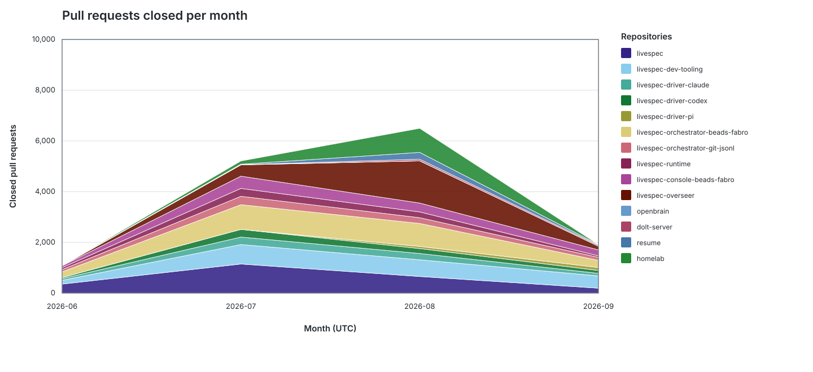
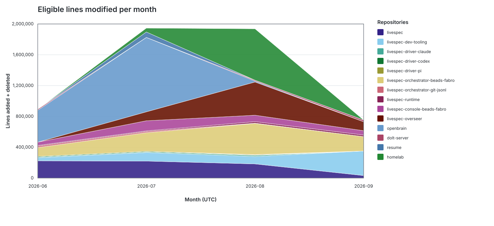
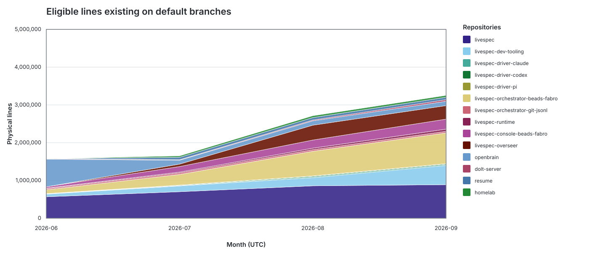

# Livespec-governed repository activity

Generated by [`update-activity.sh`](update-activity.sh) at **2026-09-09 11:59:26 UTC** from live GitHub pull-request data and freshly fetched Git refs. The reporting window is **2026-06-01 through 2026-09-09 UTC** and includes all 14 entries in `.livespec-fleet-manifest.jsonc` (`fleet` and `adopters`).

## Activity tables

### Pull requests closed

| Repository | 2026-06 | 2026-07 | 2026-08 | 2026-09 | Overall |
|:--|--:|--:|--:|--:|--:|
| [livespec](https://github.com/thewoolleyman/livespec) | 355 | 1,146 | 654 | 194 | 2,349 |
| [livespec-dev-tooling](https://github.com/thewoolleyman/livespec-dev-tooling) | 149 | 768 | 659 | 484 | 2,060 |
| [livespec-driver-claude](https://github.com/thewoolleyman/livespec-driver-claude) | 68 | 295 | 248 | 99 | 710 |
| [livespec-driver-codex](https://github.com/thewoolleyman/livespec-driver-codex) | 41 | 302 | 195 | 114 | 652 |
| [livespec-driver-pi](https://github.com/thewoolleyman/livespec-driver-pi) | 0 | 0 | 83 | 117 | 200 |
| [livespec-orchestrator-beads-fabro](https://github.com/thewoolleyman/livespec-orchestrator-beads-fabro) | 226 | 975 | 907 | 284 | 2,392 |
| [livespec-orchestrator-git-jsonl](https://github.com/thewoolleyman/livespec-orchestrator-git-jsonl) | 90 | 330 | 226 | 116 | 762 |
| [livespec-runtime](https://github.com/thewoolleyman/livespec-runtime) | 75 | 311 | 228 | 59 | 673 |
| [livespec-console-beads-fabro](https://github.com/thewoolleyman/livespec-console-beads-fabro) | 72 | 483 | 350 | 235 | 1,140 |
| [livespec-overseer](https://github.com/thewoolleyman/livespec-overseer) | 0 | 444 | 1,662 | 145 | 2,251 |
| [openbrain](https://github.com/thewoolleyman/openbrain) | 2 | 6 | 5 | 1 | 14 |
| [dolt-server](https://github.com/thewoolleyman/dolt-server) | 9 | 4 | 61 | 41 | 115 |
| [resume](https://github.com/thewoolleyman/resume) | 0 | 18 | 269 | 25 | 312 |
| [homelab](https://github.com/mi-homelab/homelab) | 0 | 127 | 949 | 1 | 1,077 |
| **Total** | **1,087** | **5,209** | **6,496** | **1,915** | **14,707** |

### Eligible lines modified

| Repository | 2026-06 | 2026-07 | 2026-08 | 2026-09 | Overall |
|:--|--:|--:|--:|--:|--:|
| [livespec](https://github.com/thewoolleyman/livespec) | 223,365 | 220,120 | 183,511 | 32,277 | 659,273 |
| [livespec-dev-tooling](https://github.com/thewoolleyman/livespec-dev-tooling) | 41,251 | 111,167 | 96,214 | 318,515 | 567,147 |
| [livespec-driver-claude](https://github.com/thewoolleyman/livespec-driver-claude) | 8,126 | 7,130 | 13,348 | 43 | 28,647 |
| [livespec-driver-codex](https://github.com/thewoolleyman/livespec-driver-codex) | 8,116 | 8,319 | 5,629 | 36 | 22,100 |
| [livespec-driver-pi](https://github.com/thewoolleyman/livespec-driver-pi) | 0 | 0 | 6,410 | 90 | 6,500 |
| [livespec-orchestrator-beads-fabro](https://github.com/thewoolleyman/livespec-orchestrator-beads-fabro) | 114,895 | 241,953 | 404,296 | 187,092 | 948,236 |
| [livespec-orchestrator-git-jsonl](https://github.com/thewoolleyman/livespec-orchestrator-git-jsonl) | 18,884 | 15,250 | 2,876 | 70 | 37,080 |
| [livespec-runtime](https://github.com/thewoolleyman/livespec-runtime) | 8,964 | 8,999 | 20,201 | 20,282 | 58,446 |
| [livespec-console-beads-fabro](https://github.com/thewoolleyman/livespec-console-beads-fabro) | 42,364 | 130,957 | 83,074 | 56,320 | 312,715 |
| [livespec-overseer](https://github.com/thewoolleyman/livespec-overseer) | 0 | 115,899 | 431,040 | 115,940 | 662,879 |
| [openbrain](https://github.com/thewoolleyman/openbrain) | 414,106 | 964,865 | 12,493 | 0 | 1,391,464 |
| [dolt-server](https://github.com/thewoolleyman/dolt-server) | 13,771 | 1,330 | 10,867 | 22,827 | 48,795 |
| [resume](https://github.com/thewoolleyman/resume) | 0 | 70,163 | 260 | 0 | 70,423 |
| [homelab](https://github.com/mi-homelab/homelab) | 0 | 50,010 | 666,847 | 0 | 716,857 |
| **Total** | **893,842** | **1,946,162** | **1,937,066** | **753,492** | **5,530,562** |

### Eligible lines currently existing on default branches

| Repository | 2026-06 | 2026-07 | 2026-08 | 2026-09 | Overall |
|:--|--:|--:|--:|--:|--:|
| [livespec](https://github.com/thewoolleyman/livespec) | 568,720 | 702,079 | 858,299 | 888,985 | 888,985 |
| [livespec-dev-tooling](https://github.com/thewoolleyman/livespec-dev-tooling) | 69,151 | 152,551 | 214,677 | 507,996 | 507,996 |
| [livespec-driver-claude](https://github.com/thewoolleyman/livespec-driver-claude) | 6,933 | 10,647 | 22,920 | 22,939 | 22,939 |
| [livespec-driver-codex](https://github.com/thewoolleyman/livespec-driver-codex) | 7,041 | 13,233 | 18,258 | 18,282 | 18,282 |
| [livespec-driver-pi](https://github.com/thewoolleyman/livespec-driver-pi) | 0 | 0 | 6,032 | 6,096 | 6,096 |
| [livespec-orchestrator-beads-fabro](https://github.com/thewoolleyman/livespec-orchestrator-beads-fabro) | 101,500 | 281,619 | 653,233 | 814,448 | 814,448 |
| [livespec-orchestrator-git-jsonl](https://github.com/thewoolleyman/livespec-orchestrator-git-jsonl) | 29,274 | 39,698 | 41,400 | 41,424 | 41,424 |
| [livespec-runtime](https://github.com/thewoolleyman/livespec-runtime) | 15,381 | 22,580 | 40,463 | 59,526 | 59,526 |
| [livespec-console-beads-fabro](https://github.com/thewoolleyman/livespec-console-beads-fabro) | 34,009 | 146,165 | 215,600 | 264,491 | 264,491 |
| [livespec-overseer](https://github.com/thewoolleyman/livespec-overseer) | 0 | 64,457 | 392,451 | 357,529 | 357,529 |
| [openbrain](https://github.com/thewoolleyman/openbrain) | 731,453 | 102,605 | 114,916 | 114,916 | 114,916 |
| [dolt-server](https://github.com/thewoolleyman/dolt-server) | 12,341 | 13,635 | 21,591 | 42,807 | 42,807 |
| [resume](https://github.com/thewoolleyman/resume) | 0 | 64,778 | 65,027 | 65,027 | 65,027 |
| [homelab](https://github.com/mi-homelab/homelab) | 0 | 36,792 | 48,154 | 48,154 | 48,154 |
| **Total** | **1,575,803** | **1,650,839** | **2,713,021** | **3,252,620** | **3,252,620** |

For the stock metric, completed month columns are month-end snapshots, the current month is a through-date snapshot, and `Overall` repeats the latest snapshot rather than summing snapshots.

## Stacked activity by repository

### Pull requests closed

### Eligible lines modified

### Eligible lines currently existing

## What the graphs and numbers represent

The first graph is a monthly flow of pull requests whose GitHub `closed_at` timestamp falls inside the reporting window. It includes both merged pull requests and pull requests closed without merging. Dependency and automation pull requests remain in this count because the exclusion applies to line activity, not to the number of pull requests handled.

The second graph is a monthly flow of physical lines modified: additions plus deletions in eligible documentation, source-code, and script/automation files. The generator examines unique non-merge patches reachable from every current remote branch plus every pull-request head updated during the window. Stable patch IDs collapse the original and rebased/cherry-picked copies of the same change, so one logical patch is counted once. The earliest copy supplies its UTC month. AI-authored work, including Fabro/Codex-authored work, is intentionally included.

The third graph is a stock, not a flow. Each point counts physical lines present in eligible files on that repository's default branch at the end of the month (or at the report's through-date for the current month). Stacking the repository series shows the governed estate's total size and each repository's share. Its `Overall` column is the latest stock value; adding the monthly snapshots would be meaningless.

Eligible files are documentation (`.md`, `.mdx`, `.rst`, `.adoc`, `.org`, `.txt`), source and web/template languages, shell and other script formats, standard script entry files such as `Dockerfile`, `Makefile`, and `justfile`, plus YAML/JSON/TOML automation under workflow and infrastructure directories. Counts are physical lines, including comments and blank lines, so the stock metric is directly comparable to Git's physical-line additions and deletions.

Excluded line activity is deterministic and intentionally conservative: known dependency/lock files; dependency, release, pin-bump, and automated template-sync commits/PRs; vendored or third-party trees; generated/build/cache/output trees; source maps, minified assets, snapshots, and other generated artifacts. Merge commits are excluded because their branch patches are counted directly. Binary changes have no line count. Rename detection is retained, so a pure rename contributes zero modified lines. The exact extension lists and classifiers live in the generator and are documented operationally in [`AGENTS.md`](AGENTS.md).

Repository identity and default branches come from each local clone's `origin`; this matters for entries such as `homelab`, whose GitHub organization differs from the manifest's fleet-owner default. Analysis happens in temporary bare repositories that borrow the local clone's object database, then fetch current GitHub branch and relevant pull-request refs without changing the clone's branches or working tree.
