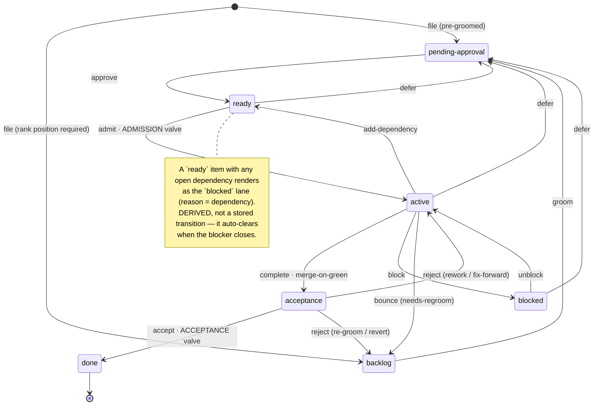
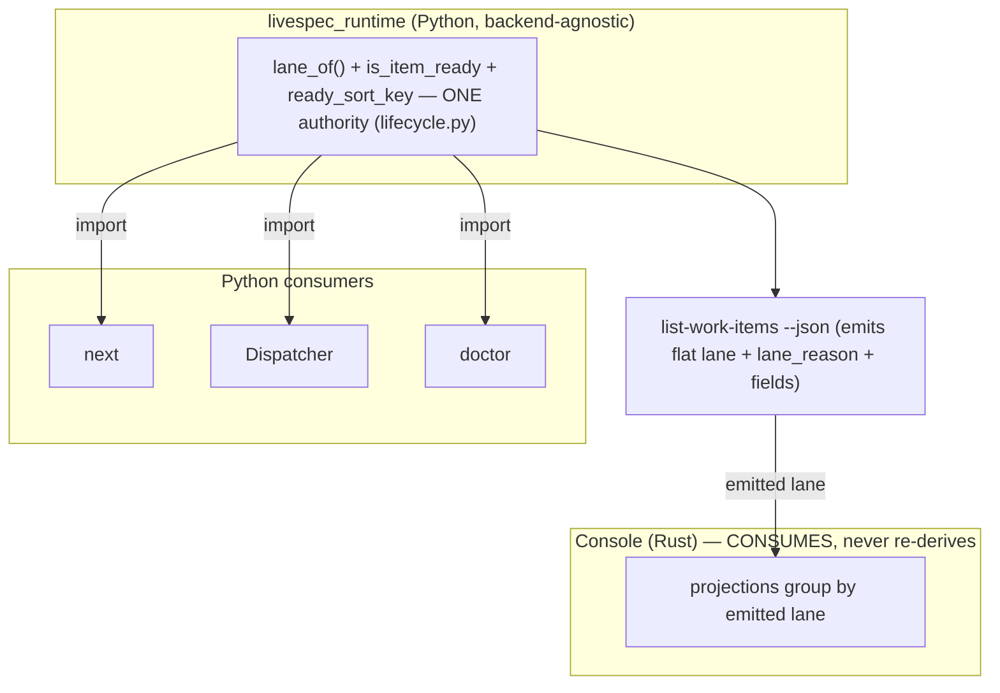
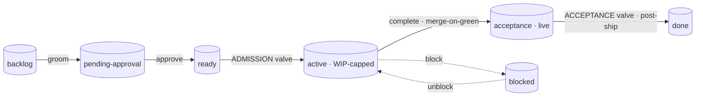
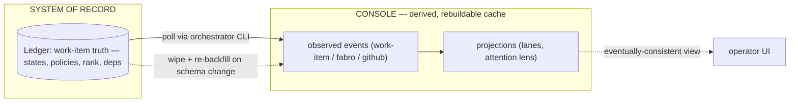

# Design — the deterministic work-item lifecycle state machine

This is the design of record for the thread. It is the synthesis of the
design session captured verbatim in `../conversation/transcript.md`; the
external grounding is in `01-prior-art.md`; the running decision trail and
open items are in `03-decision-log.md`.

> **Design of record — re-synthesized from `03-decision-log.md` decisions
> 1–43 (the A–H walk is COMPLETE).** Where this doc and the decision log
> ever differ, the **decision log is authoritative** — it carries the
> reasoning trail and the per-decision supersession history. The session-2
> "partly superseded" warning is retired: §§2–6 below now reflect the
> locked model. Net of what changed since the first draft:
> **seven stored states** (`deferred` removed, `pending-approval` added);
> **grooming = the `pending-approval` state** (a structural gate, not a
> boolean); **`admission_approved` dropped** (approval ≡ being in `ready`);
> the word **"receipt" retired** (named transitions only); the **only
> derived overlay** is `blocked:dependency`; **WIP cap is per-repo**;
> **acceptance is post-merge / in-production**; **beads uses 5 custom
> statuses + 2 built-in reuses**; **`rank` is a required non-null fractional
> key** (sole order; `priority` dropped); **owner ≡ the reused `assignee`
> field**; and **`lane_of` is the net-new single authority in
> `livespec_runtime/work_items/lifecycle.py`**.

## 1. Problem and thesis

Today the work-item lifecycle is **implicit and scattered** across at
least six places: intake tags (`ready`/`needs-regroom`/`not-yet-actionable`)
on `capture-*`; the structural readiness predicate `is_item_ready`
(which checks status + deps but *not* grooming); marker-based pre-launch
refusals (`host-only`, `human-gated`) in the Dispatcher; the `mode`
parameter (`shadow`/`autonomous`) as a crude all-or-nothing admission
lever; the janitor gate as a crude release lever; and the local
**overseer skill**, which hand-maintains a state table in a bash script.

**Thesis:** extract that implicit lifecycle into **one explicit,
deterministic state machine** — livespec's answer to Gas Town /
"Open Engine" — and **invert the architecture from operation-centric to
state-centric.** The state machine becomes the spine; the existing
skills become *transitions and readers* over it. Almost nothing is
deleted — `orchestrate` folds into the console, the standing overseer
loop retires — and the scattered, homeless lifecycle state gets one home.

Two human-delegable **policy valves** bracket the WIP-limited autonomous
middle: **admission** (into work) and **acceptance** (out to done). The
human holds ultimate authority at both but can delegate either to AI,
per-item or per-epic, with safe defaults.

## 2. The lifecycle state machine

Ubiquitous vocabulary (livespec's own — a storage backend never leaks
its terms in): the **seven stored** lifecycle states are

`backlog · pending-approval · ready · active · acceptance · blocked · done`

`deferred` is **not** a state (decisions 24 + 27): "defer" is just leaving
`ready`/`active`/`blocked` back to `pending-approval` (still decomposed,
just un-approved). A never-approved item and a deferred-after-work item
share the same stored shape (`pending-approval`); they are told apart by
**activity** — "was the item ever `active`?", read from the backend's
native history (decision 30), never a stored flag.



The locked transition table (every trigger, guard, and side-effect) lives
in `03-decision-log.md` §"Locked transition table (item A)", as amended for
post-merge acceptance by decision 34. Key properties:

- **Grooming is the `backlog → pending-approval` transition** (decision
  32), not a boolean. `pending-approval` is the **structural grooming
  gate**: you cannot reach `ready` (and therefore `active`) without
  transiting it. A pre-groomed item files straight INTO `pending-approval`
  (it never skips to `ready`), so the approval gate is universal.
  `needs-regroom` is a **bounce back to `backlog`** (re-decomposition);
  `defer` is the lighter move back to `pending-approval` (still groomed,
  just un-approved).
- **Approval is the `pending-approval → ready` transition** (decision 26):
  entering `ready` *is* approving; leaving `ready` back to
  `pending-approval` *is* un-approving. There is **no stored
  `admission_approved` flag** — approval ≡ `ready` membership.
  `admission_policy` governs only the routing: `manual` waits for a human's
  `approve`; `auto` auto-approves once, at groom time (so a later `defer`
  re-parks the item in `pending-approval` until it is resumed —
  the auto-defer hole is closed).
- **`acceptance` is the release/accept gate** (decision 5), distinct from
  Fabro's internal LLM review, and **post-merge / in-production** (decision
  33): entering it means the change is already merged + live (see §4).
- **`blocked` is the involuntary stop** — waiting on a specific unmet thing
  the system cannot auto-detect (`blocked_reason ∈ {needs-human,
  infra-external}`), so it needs an explicit `unblock`. The third reason,
  `dependency`, is **derived only** (the overlay below), never stored.
- **`done`** is terminal (a closure carrying `resolution` + the backend's
  native audit history).

## 3. Lane ≡ state, with one derived overlay

The board lane a UI shows **is** the state (decision 3) — there is no
separate stored "lane." The only place lane ≠ state is the dependency
overlay, and it *must* be derived because it depends on the external state
of OTHER items and auto-resolves when they close:

```
lane_of(item, index, manifest).name =
    done                  -> done
    blocked               -> blocked   (+ stored reason: needs-human | infra-external)
    acceptance            -> acceptance
    active                -> active
    ready  AND open dep    -> blocked   (reason = dependency)   <- the ONLY derived overlay
    ready  AND deps clear  -> ready
    pending-approval      -> pending-approval
    backlog               -> backlog
```

`blocked_reason` is partly stored, partly derived — and that split is
meaningful: stored `blocked` (`needs-human`, `infra-external`) needs an
*explicit* `unblock`; the derived `dependency` block auto-clears when the
blocker closes.

### `lane_of` — the single authority (decisions 40 + 42)

`lane_of` is **one pure function**, net-new (it exists in no repo today),
homed in a new module **`livespec_runtime/work_items/lifecycle.py`**:

```python
def lane_of(*, item: WorkItem, index: dict[str, WorkItem], manifest: CrossRepoManifest) -> Lane

@dataclass(frozen=True, slots=True, kw_only=True)
class Lane:
    name: LaneName                  # one of the 7 rendered lanes
    reason: BlockedReason | None    # non-None iff name == "blocked"
```

`LaneName = Literal["backlog","pending-approval","ready","active","acceptance","blocked","done"]`;
`BlockedReason = Literal["needs-human","infra-external","dependency"]` — the
*rendered* reason. Note the asymmetry: the STORED `blocked_reason` field is
only the 2-valued `{needs-human, infra-external}`; `dependency` appears
**only** as a rendered `Lane.reason`, never on disk. Overlay logic: stored
`ready` + any open dep → `Lane("blocked", "dependency")`; stored `blocked`
→ `Lane("blocked", <stored reason>)`; every other state →
`Lane(<status>, None)`. The `(item, index, manifest)` triple is exactly
what every `is_item_ready` caller already passes — zero new context
plumbing — and "open dep" reuses the existing `resolve_ref`/`RefStatus`
notion (a dep blocks iff it resolves to `OPEN`, or is unparseable →
fail-closed), so lane and readiness agree by construction.

`lifecycle.py` is the SINGLE home for the lifecycle logic: `lane_of`, the
`Lane`/`LaneName`/`BlockedReason` types, `is_item_ready` (re-expressed as
`lane_of(...).name == "ready"`), `ready_sort_key` (now keyed on **`rank`**,
not `priority` — decision 39), and the open/closed-dependency
determination. Per decision 42 the consolidation is **"move the pure core,
inject the backend I/O"**: `ready_sort_key` moves cleanly; `is_item_ready`
moves as a **pure predicate** with the beads-specific status-lookup
callables (`sibling_status_lookup`/`local_status_lookup`) **injected** — so
there is no `livespec_runtime → beads` back-edge — and `lane_of` is
net-new. The orchestrator's `next` / Dispatcher / `list-work-items` IMPORT
these from the runtime; the orchestrator's `_cross_repo.py` shrinks to
orchestrator-only bits.

- **Python consumers** (`next`, the Dispatcher, `doctor`) **import** it.
- **The console (Rust) CONSUMES the emitted lane, never re-derives it.**
  `list-work-items --json` emits two computed **flat** keys per item —
  **`lane`** and **`lane_reason`** — alongside the auto-emitted new
  `WorkItem` fields; the console groups by the emitted lane. Re-deriving a
  lane in Rust is the drift hazard (today's `bd ready --json` +
  `parse_beads_observation`'s `match status_text`) and is contractually
  retired (item E, §7).



**Why derived beats stored:** a derived lane *cannot lie* — it is
computed from the underlying fields, so it can never disagree with
reality. A stored lane can (a missed transition leaves a stale lane that
silently misrepresents the item — the "shadow state" the no-shadow-ledger
rule exists to kill). Derived trades a worse risk (stored-vs-truth,
silent, per-item) for a better one (consumer-vs-consumer consistency),
addressed by one function + one conformance golden test.

## 4. The two valves



**Admission valve** (`ready → active`). By the time an item is in `ready`
it is, by definition, **already approved** (decision 26 — approval ≡
`ready` membership; there is no separate `admission_approved` boolean to
check). So the valve's two remaining conditions are:

- **Permission** was settled upstream at the `pending-approval → ready`
  transition: `admission_policy == auto` auto-approves once at groom time;
  `admission_policy == manual` (the default) waits for a human's explicit
  `approve`. Risky/irreversible work is held here, at admission — never by
  a pre-merge acceptance gate (decision 33).
- **Capacity:** a free WIP slot under the **per-repo** cap
  (`count(active) < wip_cap`).

The **Dispatcher is the sole enforcer**: when a slot frees, it pulls the
**highest-`rank`** admission-eligible `ready` item (eligible = deps-clear
AND an assignee is resolvable), sets **`assignee`** (decision 35 — the
reused field; *not* a new `owner` field), and transitions it to `active`.
The console only *commands* (a human triggers `approve` for a manual item)
and *observes* — it never enforces. There is no "CLAIMED receipt": the
transition itself is the record, audited by the backend's native history
(decision 23 — "receipt" retired).

**Acceptance valve** (`acceptance → done`) — **post-merge / in-production**
(decision 33). The deterministic `just check` stays the HARD **pre-merge**
floor (the in-sandbox janitor gate, which already executes the suite);
acceptance verifies *fit + real behavior* against the **shipped** artifact:

- `complete` (`active → acceptance`) **merges-on-green** — the Fabro impl
  run keeps today's `gh pr merge --rebase --auto`; entering `acceptance`
  means the change is **merged + live + observable** (telemetry: OTel →
  Honeycomb, the OOB reflector reading `GROUP BY work.item.id`).
- `accept` (`acceptance → done`) is a **post-ship confirmation** against
  tests + telemetry, per `acceptance_policy`:
  - `ai-only` — the AI pass (read-and-judge against the merged ref + watch
    telemetry) confirms and accepts autonomously.
  - `human-only` — a human accepts from the console.
  - `ai-then-human` (**default**) — the AI verifies and surfaces findings,
    then the item **parks in `acceptance` on the ledger** (cheap, durable)
    until a human gives final acceptance from the console.
- There is no "release with zero verification" — every acceptance has at
  least one AI pass. **`reject`** carries a corrective side-effect because
  the change is already live: `reject (rework) → active` = **fix-forward**
  (patch on top of the live change); `reject (re-groom) → backlog` =
  **revert the merged change + re-decompose**.

This is the "verify in production" model (observability + reversibility),
the correct reading of the Gas Town cautionary tale — whose failure mode
was *un-observed + un-reversible* autonomous merge, not the absence of a
pre-merge human gate. There is exactly **one merge model (ship-on-green)**;
the risk dial sits at **admission + reversibility**, not at a pre-merge
acceptance hold. *(The AI-acceptance mechanism — telemetry-reading
reflector + a diff/criteria judge against the merged ref — is an
orchestrator-internal beads-fabro realization, NOT core contract; default
it to read-and-judge + watch telemetry, upgrade to sandboxed exploratory
execution only if a bug class is shown to slip through.)*

**WIP cap:** **per-repo** (decision 22), sourced from each repo's
`.livespec.jsonc` (default **5**) — *not* a single fleet-wide number. Total
fleet concurrency = the sum of the per-repo caps; a separate fleet ceiling
is a later knob if ever wanted.

**Policy inheritance:** `admission_policy` and `acceptance_policy` are
`… | None`; `None` = inherit from the nearest ancestor epic, else the
system safe default (`manual` admission, `ai-then-human` acceptance). So a
low-risk *epic* set to `auto`/`ai-only` propagates to its children,
overridable per item. **Safe-by-default:** a fresh factory does nothing
autonomously until a repo/epic/item is explicitly opted into `auto`.

## 5. Order — the `rank` primitive

Order is a first-class persisted primitive (without it, no UI can show a
deterministic line and no human can control sequence). It is **also
functional**: `rank` is the Dispatcher's pull order among eligible items.

- **`rank` is a fractional / lexicographic key** (LexoRank/Figma-style),
  **not** a linked list and **not** an integer. Rationale: order reads
  are a native `ORDER BY rank`; it is **merge-robust** in the
  append-only/git-merged/concurrent-agent world (self-contained keys,
  no pointers to dangle — a git merge just unions lines and sorts;
  concurrent inserts tie-break by `id`); it fits the existing
  supersession reducer (a re-rank is one superseding record); and an
  insert rewrites exactly **one** item.
- **`rank` is a strictly-required NON-NULL `str`** (decision 39) — no
  default, never `| None`. A field we own is always set on every record we
  write. The only records we don't control are the pre-`rank` legacy lines
  already on disk; because the store is append-only and `reduce.py`
  re-parses every historical record, the read path must answer "what rank
  does a rank-less legacy line read as?" — and that answer is a **shared
  bottom-sentinel supplied by the store ADAPTER** (a constant using a char
  outside the lib's base-62 alphabet, e.g. `"~"` > `z`, so it sorts strictly
  after every real key), not nullability in the domain type. Strict type +
  adapter fallback keeps the backend read-quirk where backend quirks belong.
- **Sole ordering authority** — the old integer `priority` is **removed**
  (decision 39; two priority sources = two conflicting truths).
  `ready_sort_key` switches its lead key from `priority` to `rank` (then
  `id` as the deterministic tie-break); the old `priority → gap-tied →
  captured_at` heuristics go away. Legacy physical lines keep `priority`
  harmlessly in append-only history; backfilled/new records omit it — **no
  data scrub**.
- **Unified across all states** — every item has a `rank`; each lane is a
  filter sorted by the same global key. One deterministic order for any UI.
- **Position is a REQUIRED create parameter — no default.**
  `capture-work-item` (and the order API) must take `position ∈ { top |
  bottom | before:<id> | after:<id> }` and reject a create without it.
  `top`/`bottom` are the global extremes (and the empty-list base case);
  `before`/`after` are relative. The **console's create policy** is
  `before:<current-top-backlog-item>` (falling back to `top` when backlog
  is empty), so a new item lands at the top of the *backlog frontier* and
  stays visible.
- **Library = PORT, not vendor** (decision 38, G-1). Inline a **verbatim
  CC0-1.0 copy** of the reference algorithm — `httpie/fractional-indexing-python`,
  the official Python port of `rocicorp/fractional-indexing` (the Figma /
  David-Greenspan scheme; stdlib-only; public API `generate_key_between` /
  `generate_n_keys_between` / `validate_order_key`) — at
  `livespec_runtime/work_items/_fractional_indexing.py` (attribution header
  + a `NOTICES` line) behind a thin `rank.py` wrapper (`key_between` /
  `n_keys_between`). PORT (not the usual prefer-vendoring rule) because the
  `rank` math must live in `livespec_runtime`, which has **no vendoring
  machinery** and is itself copied **source-only** into every consumer's
  `_vendor/` tree: PORTing drops **one file** into that tree that rides
  along automatically — one source of truth, no new machinery, no drift.
  This is not hand-rolling — it inlines *the* reference algorithm, and
  fractional indexing is finished math (negligible upstream drift).
- **Rebalancing** (the only cost) is a deterministic, order-preserving
  bulk re-key (`rebalance-ranks`): walk items in `rank` order, reassign
  evenly-spaced fresh keys → N superseding records. Order never changes, so
  it is transparent to readers. It fires **on-demand only** (decision 38,
  G-2) — never automatically; a generous key-length threshold drives a
  **`doctor` WARNING** ("rank keys exceed N chars — run `rebalance-ranks`")
  for discoverability + an actionable blessed path. Auto-firing would race
  concurrent inserts (the exact hazard item H reasons about), so keeping
  rebalance explicit also de-risks H.

**Race safety (item H, decision 43).** Rebalance-vs-insert can **never
corrupt**: the content-addressed append-only reducer (identity = sha256 of
canonical JSON; resolution order-independent; a concurrently-inserted item
is never superseded → no data loss), always-valid base-62 keys, and the
`(rank, id)` tie-break give a deterministic total order; a git-jsonl fork
is a *surfaced* divergent-head finding (and rebalance/insert touch
different ids anyway), and beads serializes on one SQL row. The only
residual effect is **bounded benign mispositioning** up to O(cohort size)
— a rebalance that rewrites an inserted item's old neighbors can land it
several slots from intent, still fully ordered and parseable, and it
**self-heals** on the next rebalance. On-demand-only rebalance keeps this
academic at the stated volume.

## 6. The schema — one abstract model, two realizations

The abstract `WorkItem` (`livespec_runtime/work_items/types.py`) is the
**source of truth**; Beads and `livespec-orchestrator-git-jsonl` are two
realizations. New fields use different evolution shapes by design:

- The **policy fields** (`admission_policy`, `acceptance_policy`,
  `blocked_reason`) follow the blessed `… | None` optional-on-read pattern
  (legacy records read back as the default; no in-place migration).
- **`rank`** is a deliberate departure: strict non-null `str` with a
  store-adapter bottom-sentinel for legacy lines (decision 39, §5) — it has
  no "absent" meaning, so a strict type beats a nullable one.
- **`assignee`** is **not a new field at all** — it is the existing
  `assignee` repurposed (decision 35), so there is zero schema migration
  for it.

Net change to the abstract `WorkItem`:

```
status: Literal["backlog","pending-approval","ready","active","acceptance","blocked","done"]
                                                            # was open/in_progress/blocked/closed/deferred

+ rank: str                                                 # fractional order key, sole ordering authority; REQUIRED non-null
+ admission_policy:  Literal["auto","manual"] | None        # None = inherit; default manual
+ acceptance_policy: Literal["ai-only","human-only","ai-then-human"] | None   # None = inherit; default ai-then-human
+ blocked_reason:    Literal["needs-human","infra-external"] | None  # STORED reasons only; `dependency` is DERIVED, never stored
~ assignee: str | None                                      # REUSED in place as claimed-by/owner; set by Dispatcher on admit; REQUIRED once active
- priority: int                                             # REMOVED (rank is the sole order)
  (no admission_approved)                                   # NOT added — approval ≡ `ready` membership (decision 26)
  (no owner)                                                # NOT added — `assignee` is reused; beads has no native `owner` (decision 35)
  (no groomed)                                              # NOT a field — grooming is the `pending-approval` state (decision 32)
```

**Invariants (doctor-checkable):** `active ⟹ assignee` set; stored
`blocked ⟹ blocked_reason ∈ {needs-human, infra-external}`; reaching
`ready` requires transiting `pending-approval` (the structural grooming
gate); and **every live (head, non-superseded) record has a real,
non-sentinel `rank`** (a stray sentinel-rank item sorts last and is *named*
by doctor, never crashes the listing).

### Backend mapping — the impedance layer (the ONLY place "beads" appears)

`status` maps to **beads custom statuses** (decision 36, verified against
the livespec-pinned beads v1.0.5 source): each livespec state gets its own
native status, named verbatim, queryable by name and visible in native
`bd history`. The four beads *categories* (`active/wip/done/frozen`) are an
orthogonal coarse display tag, not a status-collapsing mechanism.

| Abstract `status` | git-jsonl | Beads v1.0.5 | kind | category |
|---|---|---|---|---|
| `backlog` | status string | `backlog` | custom | unspecified |
| `pending-approval` | status string | `pending-approval` | custom | unspecified |
| `ready` | status string | `ready` | custom | **active** (→ native `bd ready` shows exactly the admission-eligible set) |
| `active` | status string | `active` | custom | wip |
| `acceptance` | status string | `acceptance` | custom | wip |
| `blocked` | status string | `blocked` | built-in reuse (name already matches) | wip |
| `done` | status string | `closed` | built-in reuse (native closure: `closed_at`, `bd close`, done-hiding) | done |

Net: **5 custom statuses** (`backlog`, `pending-approval`, `ready`,
`active`, `acceptance`) + **2 built-in reuses** (`blocked` name-matched;
`done`→`closed`). Only `done`↔`closed` needs an adapter name-mapping — the
one place a livespec term ≠ its beads term, exactly where decision 2 says
backend terms live. The non-status fields keep the existing convention
(scalar identity → native field; single-value enum → label; structured →
`metadata`):

| Abstract field | git-jsonl | Beads |
|---|---|---|
| `rank` | `rank` field | `metadata.rank` |
| `admission_policy` | field | label `admission:<auto\|manual>` |
| `acceptance_policy` | field | label `acceptance:<value>` |
| `blocked_reason` | field | label `blocked-reason:<value>` (stored values only) |
| `assignee` | `assignee` field | beads **native `assignee` field** |

**Migration consequences (decisions 36–37, 39).** (a) Each repo's bootstrap
registers the 5 custom statuses
(`bd config set status.custom "backlog,pending-approval,ready:active,active:wip,acceptance:wip"`)
— a per-tenant provisioning step. (b) Because `bd create` forces
`open`/`deferred`, the beads store wrapper's `append_work_item` becomes a
**2-step create+update** for every initial state (even a plain `file`,
since `backlog` is custom). (c) The `rank` backfill spans **all 9 beads
tenants** (the 8 fleet tenants + the OpenBrain adopter — decisions 37 + 46):
it sorts the whole set by `priority → captured_at → id` and calls
`n_keys_between(None, None, N)` for evenly-spaced keys, written per-backend
(git-jsonl = N superseding records carrying `rank` and omitting `priority`;
beads = `metadata.rank`) — the SAME deterministic bulk re-key as
`rebalance-ranks`, just seeded by the legacy order, so the backfill produces
one real-ranked head per id (the sentinel only ever surfaces for superseded
historical lines). (d) git-jsonl does NOT store status as a free string: it
validates status against the vendored `WorkItemStatus` Literal (so the enum
auto-tracks the runtime bump) AND carries a **closed record schema** in its
own `contracts.md` (`## Work-items JSONL record schema` — extra keys fire a
doctor `fail`), so it needs an L1b propose-change to grow that schema 16→17
keys (`+ rank`, `− priority`) and update its 7-state status-enum prose.

### Transitions and audit (no "receipt" structure)

The model has only **state**, **named transition**
(`from --trigger [guard] / side-effect--> to`), and the backend's **native
history** as the audit trail (decision 23 — "receipt" retired; all
transition names are lowercase verbs). The named transitions are the rows
of §2's locked table (`file`, `groom`, `approve`, `defer`, `admit`,
`complete`, `accept`, `block`, `unblock`, `add-dependency`, `reject`,
`bounce`). Each is realized as a git-jsonl appended superseding record (the
chain *is* the audit log) or a beads status change recorded in native
`bd history` — no separate receipt object.

## 7. The console — delegated to the console repo (contract boundary)

The console **redesign is delegated** to the console repo's own plan thread
(decision 41): the **livespec spec plane** owns the CONTRACT — and that
contract lives in the **`livespec-runtime` + orchestrator `SPECIFICATION`s**,
NOT in CORE's own spec (decision 44): the lifecycle state machine + the
`WorkItem` schema (`livespec-runtime/SPECIFICATION` + `livespec_runtime`
code), `lane_of` + the `list-work-items --json` emission shape
(`lane`/`lane_reason` + the new fields), `rank`, and the acceptance model
(the orchestrator `SPECIFICATION`s) — while
`livespec-console-beads-fabro` owns its HOW (the Rust redesign, the TUI,
ingestion, the attention lens, the conformance test, and any console-LOCAL
spec invariants). Console-specific design/research/work-items live in the
console repo, never in livespec core's spec or plan.

- **Console thread:** `plan/work-item-lifecycle-redesign/` in
  `livespec-console-beads-fabro`, anchored by console-tenant epic
  **`livespec-console-beads-fabro-vqh36l`**, cross-linked to this core epic
  `livespec-35s3zo` as a **prose reference** (not a typed cross-tenant
  `depends_on`, which would dangle in the flat same-tenant id list and
  pollute the `blocked:dependency` derivation). E-1..E-4 are resolved and
  landed on the console repo's master (its PR #60).

The contract core still states (and the console repo realizes) these hard
constraints — they are the seam, not console internals:

- **Zero Beads knowledge** (negative constraint) — the console's *only*
  external interface is the **orchestrator CLI**. It switches its
  work-item source from `bd ready --json` (a beads reach-around) to
  orchestrator **`list-work-items --json`** (all lanes), consuming the
  emitted `lane`/`lane_reason` + new fields and deleting its Rust 3-way
  lane re-derivation. This is also what the console's own Control-Plane
  contract demands ("observe through the plane's published surface, never
  reach around it").
- **Zero primary lifecycle state** — every lane and attention item is
  rebuildable from the ledger. **Attention is a derived LENS** over the
  lanes (not a stored inbox, not an 8th lane); **snooze/ack are killed**;
  "not now" = `defer`/re-rank via the orchestrator.
- **Harness abstraction lives in the driver layer**, reached *transitively
  through the orchestrator* — the console takes no direct driver
  dependency. Per decision 42 this **"Driver → orchestrator = zero deps"**
  invariant (and the console → orchestrator-CLI-only edge) was verified to
  HOLD fleet-wide, so the new `orchestrator → livespec_runtime.lifecycle`
  import edge introduces no violation.

## 8. Event sourcing — where state lives



The console is **eventually-consistent** with the ledger (it polls and
observes) and holds **no authoritative lifecycle state**. Its event log is
a rebuildable observation cache + a cross-source timeline; the ledger
(git-jsonl's append-only supersession chain / Beads' native history) is the
authority. Because the lifecycle log is fully rebuildable from the ledger,
a domain rename is handled by **wipe + re-backfill**, never heroic
upcasting. The console-local realization of this — a **rebuild-from-ledger
conformance test** (rebuild-determinism + a structural "no primary
lifecycle state" assertion, scoped to work-item projections) — is owned by
the console repo (decision 41, E-4), not specified here.

## 9. Skill fate and the overseer

Inverting to state-centric, almost everything is re-anchored, not deleted:

| Concept | Fate |
|---|---|
| `dispatcher` | **stays** — grows to enforce the two valves + the per-repo WIP cap (today it has neither) |
| `plan` | **stays** as the planning-lane interaction; its *tracking* is subsumed by the state machine |
| `next` | **stays** as the derived-query single ranking authority (now ranks by `rank`) |
| `groom` | **stays** — the `backlog → pending-approval` transition (the human decomposition gate) |
| `orchestrate` | **folds into the console** (the spec already calls the console "the standing, event-sourced realization of the orchestrate skill") |
| `overseer` (local skill) | **keeps running** to finish current work; **the epic's exit gate deletes it once the new system is dogfooded** |

The overseer's deterministic functions move into the console + state
machine; its judgment functions become the valves' policies + on-demand
skills. There is no permanent AI loop "above" the console — the console is
the operator's top of stack. **Overseer deletion is the epic's hard exit
gate** (`livespec-35s3zo` is not done until `.claude/skills/overseer/` is
removed).

## 10. Blast radius (one fleet-wide epic)

Anchored in **livespec core** (epic `livespec-35s3zo`) — the fleet anchor,
NOT the work site (decision 44: CORE's own spec is barely touched). Per
decisions 37 + 46. The execution decomposition (tracks, layers, per-repo
routing) is `research/04-slice-plan.md`.

- **Data migration — all 9 beads tenants:** the 8 fleet tenants under
  `/data/projects/livespec*` (`livespec`, `livespec-runtime`,
  `livespec-dev-tooling`, `livespec-console-beads-fabro`,
  `livespec-driver-claude`, `livespec-driver-codex`,
  `livespec-orchestrator-beads-fabro`, `livespec-orchestrator-git-jsonl`)
  **plus the `openbrain` adopter** — the status-enum + `rank` backfill +
  `priority` drop + custom-status registration, migrated in lockstep (the
  shared validator means a required-key change is a cross-repo epic).
- **Code/spec blast radius:**
  - `livespec-runtime` (`SPECIFICATION` + `livespec_runtime`) — the
    `WorkItem` schema (status enum, drop `priority`, add non-null `rank`,
    `assignee` invariant), the net-new `lifecycle.py` (`lane_of` + relocated
    `is_item_ready`/`ready_sort_key`), the ported `_fractional_indexing.py`
    + `rank.py`, and the shared bottom-sentinel constant.
  - `livespec-orchestrator-beads-fabro` (`SPECIFICATION` + code) —
    custom-status registration, the 2-step `append_work_item`, the
    `done↔closed` mapping, the Dispatcher valves + per-repo WIP,
    `list-work-items` lane emission, the `rebalance-ranks` command (with the
    legacy-seed backfill path), the doctor `rank` invariants.
  - `livespec-orchestrator-git-jsonl` (`SPECIFICATION` + code) — the
    `## Work-items JSONL record schema` 16→17 keys + status-enum prose; the
    `store.py` required-keys + sentinel adapter; `next` `priority → rank`.
  - `livespec-console-beads-fabro` — consume the new lane/fields (the HOW is
    the delegated console thread, §7).
- **Migration-only, NO code/spec change** (`livespec-driver-claude`,
  `livespec-driver-codex`, `livespec-dev-tooling`): the
  "Driver → orchestrator = zero deps" invariant holds (decision 42), so the
  lifecycle work adds no code edge — only their tenant is migrated (above).
  They get a **thin track** each so that migration is captured in their
  history (decision 46).

**Overseer deletion is the epic's exit criterion.**
