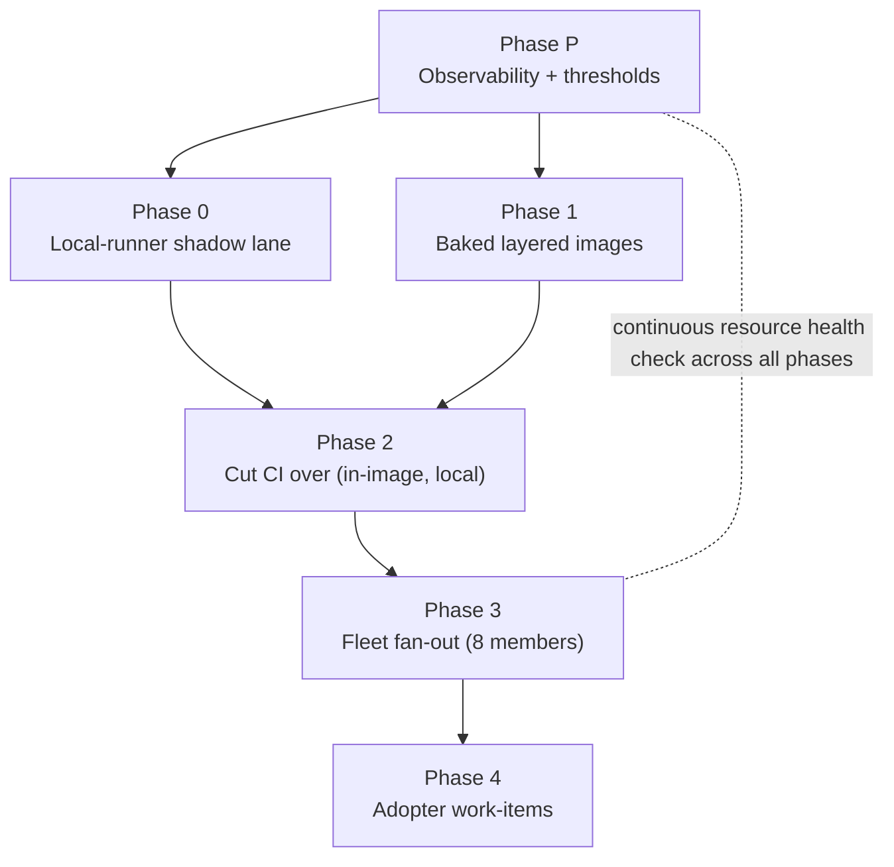

# Plan — Minimal baked sandbox images + local hot CI runners + resource-health-gated fleet rollout

**Status:** draft for maintainer review; incorporates an independent
Fable-model adversarial review AND maintainer corrections (2026-07-11).
**Scope languages:** Python + Rust now. Haskell explicitly deferred.
**Owning session:** livespec core, 2026-07-11.

**Maintainer corrections folded in (2026-07-11):**
- **Disk is resolved, not a constraint.** ~41 GB of stale, unrelated
  Docker images were swept (91 GB free now, 74% used), and a disk-size
  DOUBLING is on order. Caches live on the LOCAL disk — there is NO
  separate/"Contabo cache volume" requirement (that was an unverified
  assumption; removed).
- **Load framing corrected.** The "2.4 vs 23" figures were MEASUREMENTS of
  the host's existing work at two moments — NOT a prediction of what this
  plan causes. On 18 cores, a load of 23 is mild, transient
  oversubscription, not overload.
- **Factory untouched.** This plan was authored and updated entirely with
  local git; the Fabro factory was NOT used (another session is upgrading
  it in the orchestrator repo).

**Codex handling + collector rename folded in (2026-07-11, later):**
- **This plan is dual-runtime, not Claude-only.** The Fabro sandbox is
  runtime-agnostic (`acp.command={{ inputs.acp_adapter }}`); the
  Dispatcher routes each run to Claude OR Codex per provider. The baked
  image already carries BOTH ACP adapters + `bubblewrap` (a hard
  codex-acp requirement). Codex-specific obligations are now named
  explicitly below — image contents, adapter-version lockstep, and
  runtime-agnostic observability — rather than hidden behind the generic
  phrase "ACP adapters".
- **The `claude-collector` rename is a separate, self-contained task**
  (maintainer-approved 2026-07-11). The collector is functionally the
  host's shared OTel collector (Claude Agent-Timeline shaping is just one
  processor), so it will be renamed to a neutral name. Tracked in
  `plan/collector-otel-rename/handoff.md`; it does NOT block Phase P-host,
  which continues to target the current
  `/data/projects/claude-collector/config.yaml` until the rename lands.

---

## Session handoff — where to start

**State:** the design in this document is FINAL. Nothing is implemented
yet, and this is not yet a beads epic — formalizing it into an epic with
per-phase work-items is the first tracking step if you want the ledger to
drive it.

**Hard constraints for the next session:**
- **Do NOT use the Fabro factory** — it is being upgraded by another
  session in `livespec-orchestrator-beads-fabro`. Work locally in-session
  or via subagents that do NOT dispatch through the factory.
- All repo changes go through the worktree → PR → merge flow (docs use
  `docs(...)`; the Red-Green-Replay ritual applies only to product `.py`).

**First action — Phase P-host (factory-independent, startable now):**
1. Edit `/data/projects/claude-collector/config.yaml`: add a `hostmetrics`
   receiver (cpu, memory, disk, load, paging) + a `docker_stats` receiver,
   and wire both into the EXISTING `metrics` pipeline (it already exports
   via `otlp/honeycomb`). Reload the collector.
2. Confirm a new `livespec-host-metrics` metrics dataset appears in the
   `livespec` Honeycomb environment (team `thewoolleyweb`).
3. Capture a multi-day baseline, then freeze the health-check thresholds
   (disk is resolved — lead with CPU-utilization/PSI + memory + CI
   queue-wait, not bare load-avg).

Then proceed Phases 0 → 1 → 2 → 3 → 4 per the plan below.

**Already-settled facts (do not relitigate):** keep the CI matrix (tune
runner slots ≈18, do NOT collapse); full-history clones (no mirror, no
shallow); disk resolved (~91 GB free + a doubling on order — caches on the
local disk); the runner must be socket-less + secret-isolated +
fork-PR-routed (public repos).

## Bottom line

The livespec factory and CI still pay a **live-work tax on every run**:
`livespec-console-beads-fabro` installs `rustup` per Fabro run; every
repo's `uv sync` is only partially warmed (the baked image pre-warms the
uv cache from `livespec-dev-tooling`'s OWN lockfile, not each consumer's);
and CI on GitHub-hosted runners re-runs `mise` setup + restores/saves
`actions/cache` every job. We replace that with **minimal, layered,
pinned images** (compilers baked, caches on persistent LOCAL-disk volumes)
and move CI onto **local self-hosted runners co-located on this host**, so
images and caches are hot, local, and free — and CI runs the SAME image
the Fabro sandbox uses, collapsing "green in CI, red in sandbox" drift.
Because everything converges on one host, the plan adds **host-resource
observability that does not exist yet** and a **resource health check**;
if CPU/memory genuinely saturate during rollout it **pauses so the
maintainer can bump resources**. It then fans out to **all 8 fleet
members** and seeds **work-items in every adopter repo**.

The Fabro factory itself already runs locally (Dispatcher on host, docker
sandbox local) — GitHub-hosted CI is the one component that leaves the
box, so baked images help Fabro immediately and the CI move closes the
loop.

## Confirmed design decisions

1. **Per-repo images, not per-step.** Fabro runs the entire work-item
   graph in ONE sandbox container per run (verified in
   `fabro-sandbox/src/docker.rs`: single container, `cpu_quota`/
   `memory_limit`; console `workflow.toml` sets `cpu = 4`). The unit of
   minimization is the per-repo (per-language) image, composed from
   shared layers.
2. **Layered composition.** `base → python → python-rust`.
   `livespec-console-beads-fabro` uses `python-rust` (it needs Python
   too — its janitor reuses the Python baseline verifiers +
   commit-refuse installer). No "Rust-only" image now.
3. **Local runners are IN this epic.** A hot, free, persistent cache is
   only reachable by co-locating; on GitHub-hosted runners "persistent
   cache" means `actions/cache` (10 GB/repo cap, LRU eviction, network
   restore+save each run) or a paid external cache.
4. **Containment is mandatory and multi-layered** (see Threat model).
5. **Resource observability is a hard prerequisite** — built FIRST; the
   rollout is watched by a continuous health check, not a point-in-time
   glance.

## Host baseline (measured 2026-07-11)

| Resource | Value | Read |
|---|---|---|
| vCPU | 18 | Generous; Fabro budget is 4 CPU/run |
| RAM | 94 GiB (84 GiB available) | Not a binding constraint |
| Swap | 0 B | Any memory breach is a hard OOM — no cushion |
| Load avg (15m) | bursty: same-day samples ranged 0.8–23 | These are MEASUREMENTS of existing work, not predictions. On 18 cores, load 23 ≈ 5 processes briefly waiting — mild, transient, not overload. |
| Disk | 91 GB free (74% used) after sweeping ~41 GB of stale non-Fabro Docker images; a disk-size **doubling is on order** | **Resolved — no longer a constraint** |
| OTel collector | `otelcol-contrib` already running | Host metrics = a config add |

**Recalibration:** CPU, RAM, and disk all have comfortable headroom (disk
resolved by the Docker sweep + the ordered upgrade). Load is bursty but
the box is strong; resource thresholds still come from real measurement in
Phase P, framed as a **health check** — not a tripwire we expect to hit.

## Architecture — layered images

```
base          buildpack-deps:noble + system libs + mise/just/lefthook/gh/node + BOTH ACP adapters (Claude claude-agent-acp + Codex codex-acp) + bubblewrap (HARD codex-acp requirement)
  └─ python   + CPython + uv  (base tools only; deps come from persistent volumes, not baked pre-warm)
       └─ python-rust  + rustc/cargo (rust-toolchain pin)
       └─ (later) python-haskell   + GHC/cabal   [OUT OF SCOPE]
```

- **Dual-runtime (Claude + Codex) is baked, and MUST stay baked.** The
  sandbox runs whichever ACP adapter the Dispatcher selects per provider
  (`acp.command={{ inputs.acp_adapter }}`; default Claude, Codex via
  `fabro run --input acp_adapter=…`). So the `base` layer bakes BOTH
  `@agentclientprotocol/claude-agent-acp` AND `@zed-industries/codex-acp`
  globally, plus `bubblewrap` (the codex-acp adapter needs it for
  `require_escalated` exec AND `apply_patch`). A "minimal image" pass MUST
  NOT drop the Codex adapter or bubblewrap — that silently breaks
  Codex-driven runs. And the Codex command pins a version
  (`…codex-acp@0.16.0`), so the baked `CODEX_ACP_VERSION` must match it or
  `npx -y …@0.16.0` re-fetches at runtime — see the adapter-version
  lockstep in Phase 1.
- Built by the EXISTING image CI track
  (`livespec-dev-tooling/.github/workflows/fabro-sandbox-image.yml`,
  `runs-on: ubuntu-latest`), generalized to a matrix emitting the layered
  tags. Immutable `sha-<short>` / `v<X.Y.Z>` tags; BuildKit layer cache
  already `type=gha`.
- **Image BUILDS stay on GitHub-hosted (or a dedicated trusted-only
  builder); they do NOT move to the CI runner** — building images needs a
  privileged builder, and the local runner is deliberately unprivileged
  (see Threat model). The image build keeps `type=gha` for its own layer
  cache. (This corrects an earlier draft that scheduled a local BuildKit
  cache in Phase 1 — a GitHub-hosted builder cannot reach a host-local
  cache.)
- Consumers pull immutable tags; on a single host the **Docker daemon
  image store already keeps every pulled tag hot** for both Fabro and the
  runner — so no local registry is needed for hotness. A registry/mirror
  is added ONLY if GHCR-outage resilience is wanted, and then as an
  explicit skopeo/crane sync with a stated disk budget (not
  `registry-mirrors`, which only mirrors Docker Hub).

## Threat model & runner isolation (expanded per review)

The isolation problem is bigger than "untrusted dependency build
scripts" — it includes **untrusted actors**, because the repos are
**PUBLIC** (`livespec`, `livespec-dev-tooling`,
`livespec-console-beads-fabro` confirmed public).

1. **Fork-PR execution (highest risk).** GitHub explicitly warns against
   self-hosted runners on public repos: a fork PR can run
   attacker-controlled workflow code on the host. **Mitigation (Phase 0
   prerequisite):** route only TRUSTED events (push to `master`,
   same-repo PRs) to self-hosted; keep fork PRs on GitHub-hosted; require
   approval for all outside collaborators; verify a fork PR cannot
   trigger a self-hosted-labeled job. (Taking repos private is the
   alternative, but is a product decision, not assumed here.)
2. **No Docker socket.** The runner IS the baked toolchain image running
   steps directly — NO nested containers, NO `/var/run/docker.sock` mount
   (socket access is root-equivalent and would let any job read the host
   secrets and `/var/lib/doltdb`). Jobs that need to build images
   therefore cannot run on it — they stay on the privileged/trusted
   builder.
3. **Ephemeral execution + secret-free cache volumes** — fresh runner per
   job; caches are mounted local-disk dirs carrying no secrets (see
   Caching trust tiers).
4. **Host-resident secret inventory (Kind 2)** the runner user must NOT
   reach: the systemd-creds 1Password token, the Dolt tenant password,
   the GitHub App private key, `/var/lib/doltdb`, **and the new runner
   registration credential** (below).
5. **Runner registration credential (new Kind-2 secret).** The owner is a
   personal account, so these are repo-level, ephemeral runners; a
   supervisor re-registers after each job using short-lived registration
   tokens minted by a PAT/App with **repo-administration scope**. That
   credential is powerful and lives on the host — it goes in the isolation
   inventory and the supervisor design is a Phase 0 deliverable.
6. **`just check` is NOT fully hermetic (correction).** Some targets need
   GitHub auth — e.g. `check-master-ci-green`,
   `check-branch-protection-alignment` — and the factory `workflow.toml`
   documents `GH_TOKEN` reaching `just check` subprocesses. Phase 0 audits
   which targets need a token and grants the MINIMAL one (Actions
   `GITHUB_TOKEN` where it suffices); the drift check "CI == sandbox
   `just check`" must compare like-with-like given this.

## Caching strategy (comprehensive — local co-located)

Local runners + local disk let us cache aggressively and eliminate live
downloads (the main flakiness source). Every cache is a **persistent
local-disk directory** surviving across ephemeral jobs — NOT
`actions/cache`.

| Layer | Kills | Mechanism | Phase |
|---|---|---|---|
| Python deps | wheel download + build | persistent `~/.cache/uv` dir (primary — replaces reliance on baked pre-warm) | 0 |
| Rust deps | crate index + source fetch | persistent `~/.cargo/registry` dir | 0 |
| Git | shallow-clone history limits + re-fetch | **full-history clone every run** — drop the current shallow (depth=10) + `git fetch --unshallow` dance; ~10 MB packed for `livespec`, so it is cheap AND hands agents complete history. NO bare mirror (a `--reference` clone creates a fragile alternates dependency for near-zero gain) | 0 |
| Rust compilation | recompiling across runs/repos | `sccache` local backend + persistent `target/` — **trusted-tier only** | 2 |
| Tool caches | re-analysis | persistent pyright/mypy/ruff/pytest/coverage dirs | 2 |
| Package fetch (residual) | anything the volumes miss | **per-ecosystem mirrors** (devpi / a crates mirror / npm proxy) IF measured worthwhile — a transparent MITM proxy is REJECTED (HTTPS/TLS). Likely deferred; the uv/cargo caches already remove most fetches | (defer) |

**Trust-tiered caches (non-negotiable — a job writes its cache as a side
effect, so "populate only from trusted sources" is otherwise
unenforceable):**
- **PR / untrusted-lane jobs get READ-ONLY (or throwaway overlay) cache
  mounts.** Write-back happens ONLY from trusted-branch (post-merge)
  runs.
- **Per-repo namespaces** for `target/` and sccache — a poisoned object
  from one repo cannot flow into another's build or release artifact.
- **`sccache` is trusted-tier-only, or skipped initially** — its object
  cache has no input-integrity binding (unlike lockfile-keyed uv/cargo
  registry caches).

**Cache-integrity guardrails:** content-addressed keys (lockfile/toolchain
hashes) on read; **a scheduled cold-cache validation run** (no-cache `just
check`, cadence a Phase-P decision) to catch cache-masked "false green";
per-cache size cap + LRU eviction, watched by the resource health check.

**Image pre-warm demotion (staleness fix).** The current Dockerfile
pre-warms uv from `livespec-dev-tooling`'s lockfile only, and
`fabro-sandbox-image.yml`'s `paths:` triggers watch only dev-tooling
files — so consumer-lockfile changes never rebuild the image and warm
layers silently rot. Therefore: **persistent local-disk caches are the
primary dep cache; image layers carry base tools only** (no per-repo dep
pre-warm unless the lockfile plumbing + rebuild triggers are built
explicitly).

**Disk (resolved).** Caches live on the **local disk** — no separate
volume needed. Breathing room was already made by sweeping ~41 GB of
stale, unrelated Docker images (91 GB free now), and a disk-size doubling
is on order. The only guardrail needed is a **per-cache size cap + prune
automation** (docker image GC, cache LRU) as a named `livespec-dev-tooling`
tool, watched by the resource health check. Cargo `target/` dirs are the
largest single consumer (the fleet's one Rust repo, the console, is ~2.7
GB — modest; the 45 GB `fabro/target` is the Fabro TOOL's own build, not
something we cache).

## Resource health check (spec — continuous, baseline-derived)

A phase-end point-in-time glance is the wrong shape on a bursty host
(same-day load ranged 0.8–23 purely from existing work). Instead:

- **Baseline from data, not a sample.** Phase P collects a multi-day
  window in the new metrics dataset; thresholds are frozen from its
  percentiles BEFORE any gating, and read as a health check rather than a
  tripwire we expect to hit.
- **Continuous sustained-duration trigger** (Honeycomb trigger + burn
  window), not a one-shot report — a phase "passes" only if no sustained
  breach occurred across its active window.
- **Signals** (provisional; finalize in Phase P): CPU utilization + PSI
  pressure (NOT bare load-avg — load > vCPU is normal for I/O-heavy
  builds), memory available + any swap-in, **CI queue-wait time** (on a
  single host, queue latency saturates before CPU does), and a lighter
  disk watch (disk is already resolved, so it is a hygiene check, not the
  binding signal).
- **Runner-liveness/absence alert** — the check watches resource EXCESS;
  nothing yet watches runner ABSENCE (a down runner queues jobs silently
  up to 24h). Add liveness alerting in Phase P.
- **PAUSE action:** on a sustained CPU/memory saturation breach, emit a
  report + per-container attribution (Fabro vs runner vs Dolt; prefer the
  `docker_stats` receiver over process-name matching) and **pause so the
  maintainer can bump host resources**. This is the maintainer-requested
  stop-to-provision gate; disk is already handled, so the realistic
  trigger is CPU/memory, not disk.

---

## Phases

### Phase P — Observability prerequisite (blocks everything)

Split so the host-resource half needs **NO factory** and can start
**immediately**. The running `otelcol-contrib`
(`/data/projects/claude-collector/config.yaml`) ALREADY exports to
Honeycomb (`otlp/honeycomb` exporter + a `metrics` pipeline); it just has
no host/container-metrics receiver yet. So the host half is a
two-receiver config add + a collector reload — nothing touches the Fabro
factory.

**P-host — factory-INDEPENDENT (START HERE, now):**
- Add a `hostmetrics` receiver (cpu, memory, disk, load, paging) + a
  `docker_stats` receiver (per-container attribution) and wire them into
  the existing Honeycomb `metrics` pipeline → new `livespec-host-metrics`
  metrics dataset. Scope scrapers + interval to control per-PID
  cardinality/cost.
- Capture a multi-day baseline; freeze thresholds; implement the
  continuous health-check trigger + runner-liveness alert.
- Set the local-disk cache budget + prune automation + the cold-cache
  validation schedule. (Disk breathing room already made by the Docker
  sweep; a disk doubling is on order — no separate cache volume needed.)
- **Where:** `claude-collector` (config); resource tooling in
  `livespec-dev-tooling`. **No factory, no orchestrator repo.**

**P-factory — factory-COUPLED (deferred).** All changes here are in OUR
code — NOT the Fabro codebase (`/data/projects/fabro` is the third-party
runner we never modify):
- Verify/repair the OTel TRACE egress — OUR Dispatcher's OTel emission
  (`livespec-orchestrator-beads-fabro`'s `_otel_*` + `dispatcher.py`) plus
  the `claude-collector` config; factory datasets `livespec-dispatcher`,
  `fabro-sandbox`, `livespec-rgr` have been silent since ~2026-06-13.
- Prepare-step timing span shims — wrap the prepare-step `script =` lines
  in OUR `.fabro/workflows/implement-work-item/workflow.toml`.
- **Deferred for TWO reasons, neither about Fabro's code:** (1) validating
  either needs a real factory RUN (a dispatch), which we are told not to
  use; and (2) the orchestrator repo is being ACTIVELY edited by the
  in-flight factory-upgrade session, so editing it now risks a collision.
  P-host avoids both — it touches only `claude-collector` +
  `livespec-dev-tooling`.

**Runtime-agnostic by construction (Claude + Codex).** Everything Phase P
measures sits BELOW the ACP adapter, so it is identical for Claude- and
Codex-driven runs: `hostmetrics`/`docker_stats` observe the sandbox
container the same way whichever adapter runs inside (`docker_stats` gives
per-container attribution), and the Dispatcher/prepare-step timing spans
are emitted by OUR code regardless of provider. The one thing that DOES
differ — agent-INTERNAL telemetry — is out of scope here: Claude Code
emits rich OTel (shaped by the collector) while Codex
(`@zed-industries/codex-acp@0.16.0`) emits NONE. That gap is owned by the
separate `livespec-orchestrator-beads-fabro/plan/codex-factory-telemetry/`
thread; this plan does NOT address it, and the resource health gating does
NOT depend on it (it runs on host/container metrics + Dispatcher spans, so
it gates Codex runs fine even while Codex is internally dark).

**Exit (P-host — the actual blocker):** host metrics flowing to
`livespec-host-metrics`; baseline + thresholds frozen; health check +
liveness alert live; cache budget + prune set. P-factory can complete
later WITHOUT blocking Phases 0–1.

### Phase 0 — Local-runner shadow lane (non-gating)

**Deliverables**
- One ephemeral, unprivileged, secret-isolated runner (NO docker socket)
  running the baked image directly + a runner **supervisor** with the
  registration-credential design.
- **Trusted-event routing** so fork PRs cannot reach the runner.
- Persistent secret-free cache dirs (uv, cargo registry). Git:
  **full-history clones every run** (drop the current depth=10 shallow +
  `--unshallow`; ~10 MB packed — cheap, and hands agents complete
  history). No bare mirror.
- **CI runner-slot count (KEEP the matrix — do NOT collapse it):** the
  fleet's CI is a per-target MATRIX (~40 `just <target>` jobs) that gives
  per-check failure isolation + individual PR status checks + granular
  required-checks for FREE; collapsing into one job would force us to
  reinvent all of that (a real regression). Provision enough runner slots
  (≈18, ≈ core count) to run the matrix in parallel — the full matrix is
  only ~591 CPU-seconds/run (see Additional research), so 18 cores match
  GitHub's current wall-clock, and correct caching makes per-job setup
  near-free. Record the slot count the resource projections use.
- One repo's `just check` green on the runner as a NON-gating lane; verify
  the runner user cannot read the Kind-2 secret paths.

**Where:** `livespec-dev-tooling` (runner/supervisor/containment tooling);
pilot repo shadow lane.

**Exit:** green shadow run; isolation verified; concurrency number set;
**continuous resource signal shows no sustained breach**.

### Phase 1 — Baked layered images

**Deliverables**
- `base / python / python-rust` layered Dockerfiles + matrix build in
  `fabro-sandbox-image.yml` (builds STAY GitHub-hosted/trusted-builder).
- Pin/lockstep: extend `fabro_image_pin_lockstep.py` for the Rust `ARG`;
  add the **cross-repo** Rust pin lockstep against
  `livespec-console-beads-fabro/rust-toolchain.toml`; decide the
  `workflow.toml` autodiscovery gap (image pins are manual today — the
  console `workflow.toml` PIN SURFACE NOTE confirms this verbatim).
- **ACP-adapter version lockstep (Codex + Claude) — NEW.** The image's
  `CODEX_ACP_VERSION` ARG mirrors the orchestrator's hardcoded Codex
  adapter pin (`CODEX_IMPLEMENTER_ADAPTER = "npx -y
  @zed-industries/codex-acp@0.16.0"` in
  `livespec-orchestrator-beads-fabro`'s
  `.claude-plugin/scripts/livespec_orchestrator_beads_fabro/commands/_dispatcher_fabro_argv.py`).
  Today `fabro_image_pin_lockstep.py`'s docstring EXPLICITLY DISCLAIMS
  this ("the ACP adapter … carry no lockstep obligation"), so the two can
  silently drift. Extend the check with a **cross-repo**
  `CODEX_ACP_VERSION` ↔ orchestrator-pin lockstep (same shape as the Rust
  one). This is NOT cosmetic: the Codex command requests the version
  explicitly (`…@0.16.0`), so on drift `npx` re-fetches the adapter at
  runtime — reintroducing the per-run adapter tax the baked image exists
  to remove. Also decide the `CLAUDE_AGENT_ACP_VERSION` source: the
  default `workflow.toml` `acp_adapter` command carries NO version, so it
  resolves the baked global (lower drift risk) — name it either way for
  symmetry with Codex.
- Console `workflow.toml` → baked `python-rust` image; DELETE the per-run
  `rustup` step. Orchestrator `workflow.toml` → `python` image.

**Where:** `livespec-dev-tooling` (bulk); console + orchestrator (a
little).

**Exit:** images published + pinned + lockstep-green; console +
orchestrator dispatch green on baked images; no sustained resource breach.

### Phase 2 — Cut CI over to the local runner + baked image

**Deliverables**
- **Per-job disposition table for the pilot repo** — each `ci.yml` job
  labeled move / stay-GitHub-hosted / delete. Jobs that stay hosted:
  App-token minting (fleet-conformance), telemetry export, the
  release/auto-merge chain, and any GitHub-context-bound job. This table
  is the fan-out template ("switch `runs-on` + delete `actions/cache`" is
  NOT a per-file operation).
- Moved jobs run `just check` targets in the baked image on the runner;
  their `actions/cache` steps deleted (cache now local).
- **Merge-gate fallback mechanism designed** (not just named): a
  `workflow_dispatch`-switchable `runs-on` variable OR a gate meta-job
  that accepts either lane, so a down host does not silently stall merges
  for 24h. (Runner-liveness alerting from Phase P covers detection.)

**Exit:** pilot CI green on local runner in-image; drift check (CI ==
sandbox `just check`, like-with-like) passes; no sustained breach.

### Phase 3 — Fleet fan-out

**Members (8):** `livespec`, `livespec-dev-tooling`,
`livespec-driver-claude`, `livespec-driver-codex`,
`livespec-orchestrator-beads-fabro`, `livespec-orchestrator-git-jsonl`,
`livespec-runtime`, `livespec-console-beads-fabro`.

**Deliverables:** per repo — apply the Phase 1 image pin + the Phase 2
disposition table; verify green.

**Exit per repo:** green on local runner in-image, AND the continuous
resource signal holds as load accumulates (a sustained CPU/memory breach
here pauses for a resource bump). A mid-fan-out pause leaves the fleet
temporarily split across two CI models — an acceptable interim steady
state.

### Phase 4 — Adopter work-items

**Deliverables:** a ready work-item filed in each adopter ledger —
`openbrain`, `resume` — for the same conversion, executed by them
(adopters are independent: own credential wrappers, tenants, GitHub Apps),
citing this epic's reference implementation.

---

## Where the work lives (summary)

| Repo | Share | What |
|---|---|---|
| `livespec-dev-tooling` | **bulk** | layered images + matrix build (both ACP adapters — Claude + Codex — baked), pin-lockstep extensions incl. the cross-repo Codex adapter-version lockstep, runner/supervisor/containment tooling, resource health-check + liveness tooling, cache prune automation, fan-out automation |
| `claude-collector` (neutral-name rename pending → `plan/collector-otel-rename/`) | prerequisite | `hostmetrics` + `docker_stats` receivers + Honeycomb metrics pipeline |
| `livespec-orchestrator-beads-fabro` | a little | prepare-step span shims; own `workflow.toml` → `python`; shipped default |
| `livespec-console-beads-fabro` | a little | `workflow.toml` → `python-rust`; drop per-run `rustup` |
| each fleet repo | mechanical | image pin + per-job `ci.yml` disposition + `actions/cache` removal |
| `openbrain`, `resume` (adopters) | Phase 4 | work-items only |

## Measurement (before/after) — per repo class

Report savings PER CLASS, not one fleet-wide number (a 16-min P50 Fabro
run is dominated by agent/LLM time):
- **`livespec-console-beads-fabro` (Rust):** removes per-run `rustup`
  install + cold cargo builds — the real win.
- **Python repos:** the residual is the per-repo `uv sync` delta (already
  partially image-warmed) — likely well under 10%.
- **Both providers pay the same tax below the ACP layer.** The wins
  (baked toolchain, hot caches, no per-run `rustup`, warm `uv`) apply
  equally to Claude- and Codex-driven runs; the Codex adapter-version
  lockstep (Phase 1) is specifically what keeps the per-run `npx` adapter
  fetch eliminated for Codex. At the first live dual-provider dispatch,
  confirm the per-run-tax delta holds for both.
- Phase P's prepare-step spans set the headline number; do not justify the
  epic fleet-wide on the console's figures.

## Additional research (2026-07-11) — parallelism + janitor critical path

### Parallelism — keep the matrix; caching (not collapsing) removes the overhead

Measured over 30d (`github-ci`), per CI run on `livespec`:
- **~40 jobs/run** (24,108 job-spans ÷ 598 runs).
- **~591 CPU-seconds of work/run** (SUM of job durations ÷ runs), avg
  **13 s/job**, P95 21 s.
- GitHub packs that into **~70 s wall-clock — ~8× parallelism, not 40×**;
  the jobs are short and mostly not CPU-saturating.
- On this host's **18 cores: 591 ÷ 18 ≈ 33 s floor, ~40–70 s realistic** —
  matches/beats GitHub.

**Conclusion (corrects an earlier draft that floated matrix-collapse):
KEEP the per-target matrix.** Collapsing 40 checks into one job would
force us to reinvent the per-check failure isolation, individual PR
status checks, granular required-checks, and per-check logs the matrix
gives for FREE — a real regression. The only motivation to collapse was
avoiding 40× per-job setup, and correct caching removes that anyway:
baked image → `mise install` is a no-op (tools pre-baked); hot
`~/.cache/uv` volume → `uv sync` is a cache-hit; a full-history clone is
~10 MB packed (a couple seconds; no mirror needed). Per-job setup drops from ~20–40 s to a
few seconds (an `actions/checkout` + a fresh `.venv` link + runner
workspace setup remain — small, not literally zero). So the Phase 0
concurrency knob is **"how many runner slots" (≈18, core count), NOT
"collapse vs matrix."**

### Janitor `just check` is on the critical path ~5–6× per work-item

Measured (`livespec-dispatcher`, mid-June shakedown, ~44 dispatches — the
factory has been quiet since, so this is a real but dated snapshot):
- `dispatcher.stage.janitor-post-merge` (one `just check`): **93 s P50,
  175 s P95**, cold.
- `dispatcher.stage.fabro-run`: **17 min P50** (LLM-agent-dominated).

Per work-item, `just check` runs on the critical path: in-sandbox janitor
+ fix loop (**1–4×**, inferred from the graph's 3-fix-visit cap) +
Dispatcher post-merge (**1×**, measured) + CI on branch and master
(**2×**) ≈ **~8–10 min of `just check` per work-item, almost all cold**.
Baked images + hot caches shave ~30–50% off EACH →
**~3–5 min saved per work-item on the critical path** (non-overlapping
time, so it directly shortens the loop and speeds agent iteration — the
leverage the per-PR CI figure understates). Caveat: the in-sandbox
janitor count is INFERRED from the workflow graph, not measured — Fabro's
internal nodes don't emit to Honeycomb, which is exactly why Phase P adds
janitor-node spans to make it measured.

## Rollback (per phase)

Each phase is cheaply reversible and reversal is written into its
work-item: image-pin revert (via lockstep/pins), `ci.yml` `runs-on` →
`ubuntu-latest` + restore `actions/cache`, runner deregistration, cache
dir teardown. A Phase-3 partial state (some repos local, some hosted) is a
valid pause point.

## Risks & open decisions

- **Public repos + self-hosted runners** — highest risk; trusted-event
  routing is a Phase 0 prerequisite (above).
- **Docker-socket vs. image builds** — runner stays socket-less; image
  builds stay on a privileged/trusted builder.
- **Cache poisoning** — trust-tiered caches; sccache trusted-only/deferred.
- **Single-host merge-gate** — fallback mechanism designed in Phase 2 +
  liveness alert in Phase P.
- **No swap cushion** — treat any sustained swap-in as an immediate
  PAUSE-for-provision; consider a swap safety net.
- **Bursty load** (0.8–23 same day, all from existing work) — set
  thresholds from a multi-day measurement and read them as a health check,
  not a level we expect the plan to reach.
- **Disk (resolved)** — local-disk caches; ~41 GB swept from stale Docker
  images (91 GB free); disk doubling on order; keep a per-cache cap +
  prune.
- **CI matrix concurrency** — KEEP the matrix (free per-check failure
  isolation + reporting); tune the runner-slot count, NOT collapse (see
  Additional research).
- **Autodiscovery gap** — close now (auto-bump `workflow.toml` image tags)
  vs. keep manual per-repo pins guarded by lockstep.
- **Cache-warming strategy** — persistent local-disk cache (primary) vs.
  per-repo image pre-warm (demoted; needs lockfile plumbing + triggers if
  revived).
- **Codex adapter-version drift** — `CODEX_ACP_VERSION` (baked image) vs.
  the orchestrator's explicit `codex-acp@0.16.0` command pin: on drift,
  `npx` re-fetches the adapter every Codex run (the per-run tax returns).
  Close it via the Phase 1 cross-repo ACP-adapter lockstep.
- **Collector is Claude-named but host-shared** — the `hostmetrics`/
  `docker_stats` additions land in `claude-collector`, whose name
  undersells its host-wide OTel role; neutral-name rename tracked
  separately (`plan/collector-otel-rename/`), not folded into this epic.

## Dependency diagram


