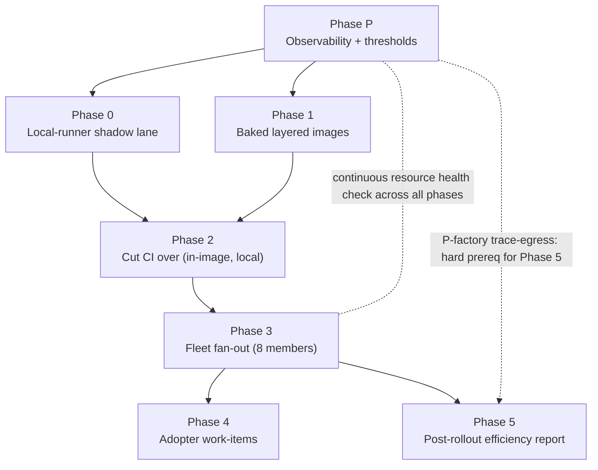

# Plan — Minimal baked sandbox images + local hot CI runners + resource-health-gated fleet rollout

**Status:** draft for maintainer review; incorporates an independent
Fable-model adversarial review AND maintainer corrections (2026-07-11).
**Scope languages:** Python + Rust now. Haskell explicitly deferred.
**Owning session:** livespec core, 2026-07-11.

**Maintainer corrections folded in (2026-07-11):**
- **Disk is resolved, not a constraint.** ~41 GB of stale, unrelated
  Docker images were swept (91 GB free now, 74% used), and a disk-size
  DOUBLING is on order. Caches live on the LOCAL disk — there is NO
  separate/"Contabo cache volume" requirement (that was an unverified
  assumption; removed).
- **Load framing corrected.** The "2.4 vs 23" figures were MEASUREMENTS of
  the host's existing work at two moments — NOT a prediction of what this
  plan causes. On 18 cores, a load of 23 is mild, transient
  oversubscription, not overload.
- **Factory untouched (during authoring).** This plan was authored and
  updated entirely with local git; the Fabro factory was NOT used at the
  time (another session was upgrading it). **Update 2026-07-11: the factory
  is back up and usable (maintainer-confirmed) — the earlier do-not-use
  constraint is LIFTED (see Hard constraints).**

**Codex handling + collector rename folded in (2026-07-11, later):**
- **This plan is dual-runtime, not Claude-only.** The Fabro sandbox is
  runtime-agnostic (`acp.command={{ inputs.acp_adapter }}`); the
  Dispatcher routes each run to Claude OR Codex per provider. The baked
  image already carries BOTH ACP adapters + `bubblewrap` (a hard
  codex-acp requirement). Codex-specific obligations are now named
  explicitly below — image contents, adapter-version lockstep, and
  runtime-agnostic observability — rather than hidden behind the generic
  phrase "ACP adapters".
- **The collector was renamed `claude-collector` → `otel-collector`**
  (maintainer-approved 2026-07-11; VPS side LANDED 2026-07-11). It is
  functionally the host's shared OTel collector (Claude Agent-Timeline
  shaping is just one processor). The live systemd service is now
  `otel-collector.service` against
  `/data/projects/otel-collector/config.yaml`, stamping the
  `collector.otel-collector` marker. The macOS-side migration is now DONE
  too (2026-07-18, `otel-collector` commit `aad8dd5`; both sides
  live-confirmed in Honeycomb) — the whole rename is COMPLETE. See the
  archived thread `plan/archive/collector-otel-rename/handoff.md`.

**Maintainer corrections (2026-07-12) — two framings below are WRONG; these supersede them:**
- **The "multi-day baseline" is DEAD — do not wait for days of data.** The
  resource health check is a **safety net**, not a precision instrument: its
  job is to PAUSE-and-bump only on *genuine* saturation, and those thresholds
  come from the **hardware**, not from a multi-day percentile window.
  Empirically confirmed by a load test (2026-07-12): 8 concurrent CI-style
  test-suite runs **on top of** a live factory dispatch held RAM-free at
  **65+ GiB throughout** (of 94 GiB), zero swap activity, zero OOM kills;
  CPU oversubscribed to run-queue 45 on 18 cores and handled it **gracefully**
  (jobs queue, nothing crashes). So: **memory (RAM) is a near-unreachable hard
  floor** (the swap=0 "OOM" fear is moot — RAM never approaches pressure), and
  the only signal that flexes is **sustained CPU-idle≈0% *duration*** (the
  "consider reducing concurrency" hint, which degrades softly). Set conservative
  hardware-derived thresholds NOW (RAM-available floor ≈ 8 GiB hard-stop;
  sustained-CPU-saturation duration as a soft hint; disk free floor as
  hygiene). **P-host is MET** (metrics flowing + headroom empirically shown);
  it **no longer gates Phases 0–1.** Everywhere below that says "capture a
  multi-day baseline / freeze percentiles / baseline-derived" is superseded by
  this.
- **The cross-repo pin lockstep as written is a CIRCULAR DEPENDENCY — do NOT
  build it.** Phase 1 below says to extend `livespec-dev-tooling`'s
  `fabro_image_pin_lockstep.py` to READ the orchestrator's Codex pin (and the
  console's `rust-toolchain.toml`). That is `dev-tooling → orchestrator/console
  → dev-tooling`: `livespec-dev-tooling` is the foundational enforcement-suite
  repo those consumers depend ON, so it must never reach INTO them. Fixes:
  (a) **Codex — design the drift away, no check:** make the orchestrator's Codex
  adapter command **version-less** (`npx -y @zed-industries/codex-acp`, dropping
  `@0.16.0`) so it resolves the baked global exactly as the Claude adapter
  already does — then the image's `CODEX_ACP_VERSION` is the single source of
  truth, nothing can drift, and there is no cross-repo read. (b) **Rust (and any
  belt-and-suspenders pin check):** the check lives on the **downstream/consumer
  side** (e.g. the console asserting its `rust-toolchain.toml` matches the baked
  image ARG — a legit consumer→producer read), **never** in `dev-tooling`. Both
  orchestrator/console edits wait behind the active `dispatcher.py` refactor
  (item `bd-ib-s7e`).

---

## Session handoff — where to start

**State (fresh-session entry point, updated 2026-07-18 — Phases 0–2 DONE; Phase 3 is 7/8 cut over;
console #250 MERGED + proven on its master run; T10 cache-tiering DONE).** The plan is anchored by the **beads epic
`livespec-3lev`** (`livespec` tenant). Phases 0–2 are complete + live-exercised.

---
## ▶ START HERE — updated 2026-07-19 (cont. 9, corrected)

## ▶▶ CORRECTION FIRST — the previous revision of this section was WRONG

**The cont. 9 revision of this handoff claimed "nothing on this track is
outstanding" and "THIS THREAD IS READY TO ARCHIVE". BOTH CLAIMS WERE FALSE** (PR
#1428). A first correction (PR #1430) said three children were open. **That was
ALSO wrong.** The epic has **EIGHT children**; seven were open when that
correction was written, and **six are open now** (`.2` was already closed; `.4` was
closed 2026-07-19 — see the table below). This is the measured picture.

> **RETRACTED — there is NO beads gap here, and `bd` is not at fault.** An earlier
> revision of this block asserted that `bd show <epic>` under-reports its own
> children, and recommended carrying that to `.ai/beads-gaps-workarounds.md`.
> **That was wrong.** `bd show livespec-3lev` reports all 8 children correctly and
> prints a `2/8 complete (25%)` tally. The truncation was **self-inflicted**: the
> original invocation was piped through `head -25`, and the CHILDREN block sits at
> the END of the output, so `head` cut it at exactly 4 entries. Reproduced
> deliberately — re-running with `head -25` yields the identical 4-entry list, and
> re-running without it yields all 8.
>
> **Do NOT add this to `.ai/beads-gaps-workarounds.md`.** A fabricated tool defect
> in a shared catalogue is worse than the original mistake: other agents would
> distrust a working command and carry a pointless workaround forever.
>
> **The real lesson, and it is the sharper one: when a tool looks wrong, suspect
> your own invocation first.** The evidence that it was self-inflicted was sitting
> in the command line the whole time. Blaming the tool was the more flattering
> explanation and it was reached for first, immediately after two status errors —
> which is exactly when the temptation to externalize a mistake is strongest.
> Pipelines that `head`/`tail`/`grep` a rich command's output are a standing source
> of this: **when a listing looks short, re-run it raw before drawing any conclusion
> from its length.**

### The epic's THREE stated goals, measured

The epic description names three. Only the first is delivered:

| # | Goal | State |
|---|---|---|
| 1 | Replace the per-Fabro-run "live-work tax" with minimal, layered, pinned sandbox images | ✅ **DELIVERED** and live-exercised |
| 2 | **Move CI onto local self-hosted runners** so images/caches are hot and free | ❌ **NOT DELIVERED** — see below |
| 3 | Gate the rollout on host-resource observability + a continuous resource health check | ⚠️ **PARTIAL** — metrics flow; no trigger is live |

**Goal 2 is the one to understand, because the handoff has been misleading about
it.** Every fleet repo's `ci.yml` carries a *flippable* form,
`runs-on: ${{ fromJSON(vars.CI_RUNNER_LABELS || '["self-hosted","local-ci"]') }}`
— so grepping for `self-hosted` finds 7–13 hits per repo and looks like adoption.
**It is not.** The live repo variable overrides it: `CI_RUNNER_LABELS =
["ubuntu-latest"]` in both repos checked. **The fleet is 8/8 on the baked image and
0/8 on the local runner.** The mechanism is built and the switch is OFF.

That narrowing is DELIBERATE and defensible (see the cont. 7 record: the baked
image delivers the headline on hosted runners, and the orchestrator's trust-tier
gate was explicitly not spent) — but it means Phases 2 and 3 are **not met as
written**, and the phrase "cut over" has been used for both image adoption and
runner adoption. **Always say which.**

### Every child, with measured status

Eight total. `.2` (P-factory) closed earlier; `.4` closed 2026-07-19. **Six open.**
Verify with an UNTRUNCATED `bd show livespec-3lev` — it prints an `N/8 complete`
tally, which is the quickest check that you are seeing the whole set.

| Child | Real status |
|---|---|
| `livespec-3lev.1` P-host | **OPEN, legitimately.** Gating role DISCHARGED per the 2026-07-12 correction, but exit criteria (live resource-health trigger, runner-liveness alert, cache budget/prune) are unmet, and the trigger needs a maintainer decision on an alert destination. |
| `livespec-3lev.3` Phase 0 | **OPEN, but essentially proven.** Dual Fable+Codex gate honored (4 rounds). **Isolation exit-tests 14/0/3**, and the **shadow lane re-run 2026-07-19: 14/14 on THREE consecutive runs** — including the full `just check` green on the runner in-image. The "6 vs ~18 runners" question is **SETTLED — 6 is deliberate** (see below); only the item's stale text needs amending. |
| `livespec-3lev.4` Phase 1 | ✅ **CLOSED 2026-07-19** — every deliverable verified against `origin/master`. Its `blocks` edge from `.1` was a stale proxy and was REMOVED (not `--force`d). Codex lockstep designed away (version-less adapter); Rust lockstep relocated → filed as `livespec-console-beads-fabro-mcj`. |
| `livespec-3lev.5` Phase 2 | **OPEN.** Disposition table + in-image CI done; the local-runner cutover is not. Now a maintainer DECISION, not implementation: flip `CI_RUNNER_LABELS`, or narrow the exit criterion to same-image-parity-on-hosted and close. |
| `livespec-3lev.6` Phase 3 | **OPEN.** Image half fully delivered — 8/8 members pinned, green, and now AUTO-reconciled (`xb7` + `5r3`). Local-runner half 0/8; resource signal not live. |
| `livespec-3lev.7` Phase 4 | **FILING DONE 2026-07-19** → `openbrain` `ob-4oku`. Scope correction: **`resume` has nothing to convert** (no `.fabro/workflows` at all; same for `homelab`), so only `openbrain` is a real Fabro consumer. Remaining is a maintainer POLICY decision — see below. |
| `livespec-3lev.8` Phase 5 | **GENUINELY OUTSTANDING** — the epic's own closing measurement gate. |

**DO NOT ARCHIVE THIS THREAD.** Phases 4 and 5 are real remaining scope.

**How the error happened, because the lesson generalizes.** The cont. 8 handoff said
"The original epic is DELIVERED... Nothing on the original plan is outstanding."
cont. 9 propagated that sentence forward while rigorously verifying everything
AROUND it — every pin, every CI run, every job log, re-measured from
`origin/master` rather than trusted — but never ran `bd show livespec-3lev` to check
the epic's own children. This repo's own discipline names the failure exactly:
*treat a plan's claims about sibling state as hypotheses to confirm.* An inherited
status sentence is exactly such a claim, and being scrupulous about the facts in
front of you is no defence against an unchecked premise underneath you.

**Standing rule this earns:** before writing any "track complete", "nothing
outstanding", or "archivable" line in ANY handoff, enumerate the anchoring epic's
children and check each status directly — and read the enumeration **untruncated**.
A closed track is a claim about the LEDGER, so it must be verified against the
ledger.

**The correction needed correcting — twice — and the second time is the sharper
lesson.** The first fix (PR #1430) ran `bd show livespec-3lev`, saw 4 children, and
confidently reported 3 open. There are 8 children, 7 then open. So a verification
step was performed, produced a number, and the number was still wrong.

The second fix (PR #1431) then diagnosed that as a `bd` defect — "`bd show`
under-reports its own children" — and recommended recording it in
`.ai/beads-gaps-workarounds.md`. **That diagnosis was also wrong, and worse than
the thing it explained.** `bd show` reports all 8 correctly, with a `2/8 complete`
tally. The 4-entry list came from piping it through **`head -25`** — the CHILDREN
block is at the end of the output, so `head` truncated it. Reproduced both ways to
be sure.

Three compounding lessons, in increasing order of how easily they generalize:

1. **Getting caught once and reaching for the nearest verification is not the same
   as verifying.** The tell was available and ignored both times: `bd close
   livespec-3lev.4` failed with "blocked by open issues [livespec-3lev.1]", naming
   a child the truncated listing never showed.
2. **When a listing looks short, re-run it raw.** `head`/`tail`/`grep` pipelines
   over a rich command are a standing source of phantom "missing data", and length
   is the one property they most obviously destroy.
3. **When a tool looks wrong, suspect your own invocation first.** Blaming `bd` was
   the more flattering explanation and it was reached for immediately after two
   status errors — precisely when the pull toward externalizing a mistake is
   strongest. Had it not been caught, a fabricated defect would have entered a
   shared catalogue and taught every future agent to distrust a working command.

**And a third layer, worth naming separately.** Even the corrected child list
understated things, because several children were open for a reason no status
field captures: Phases 2 and 3 were *narrowed in substance* — "cut over" silently
came to mean image adoption rather than local-runner adoption. A child can be
accurately reported as "open" and still mislead, if the delivered thing has quietly
diverged from the specified thing. **Read each child's own exit criterion and
compare it to what shipped; do not infer completion from surrounding progress.**

### What IS genuinely delivered (the narrower, true claim)

The **image-unification work and the three-defect follow-on family are complete and
live-exercised.** CI and the Fabro sandbox run the SAME image across all 8 fleet
repos — including, as of 2026-07-19, the PRODUCER — and every pin that keeps them
aligned is discovered and reconciled automatically with no hand-bumping anywhere.
That is a real result. It is just not the whole epic.

`livespec-dev-tooling-5r3` was closed with full live-exercise evidence: release
`v0.50.1` fired the new job unprompted, it opened PR #472 rewriting all six
self-sourced pins with the `python-` layer prefix preserved, that PR merged, and
`livespec-dev-tooling`'s master CI then re-ran **inside** the newly-pinned image —
**60 jobs, 60 success, zero skips**, with the container init and the pulled tag
`livespec-fabro-sandbox:python-v0.50.1` read from the job log rather than inferred
from a green tick. See "THE COMPLETED LOOP" below for the full chain.

### Shadow lane re-exercised, and the runner-count question SETTLED (2026-07-19)

The lane triggers ONLY on push to `ci-shadow/**` — manually driven **by design**, no
schedule, with `pull_request`/`merge_group`/`workflow_dispatch` deliberately excluded.
So "it stopped running" was the wrong reading; it is push-driven and nobody had pushed
since 07-14. That still matters, because its own header says it is the standing
regression harness for a RACE that *"once passed 12/12 before failing 8/12"*, and
therefore **"a single green run of this matrix proves nothing — re-run it several
times over."**

**Re-run 2026-07-19: THREE consecutive runs
(`ci-shadow/verify-2026-07-19-run{1,2,3}`), each 14/14 SUCCESS.** Each pass is 12
parallel slots + the live-isolation job + the full `just check`, clean — no clobbering, no podman network-prune race,
nothing stalled in `queued`.

**`just check (shadow)` passing is the single strongest datum for the goal-2
decision.** The workflow hedges that job — *"May need tuning (some targets need GitHub
auth)"* — but livespec's FULL check suite ran green in the baked image on the local
runner. That is Phase 2's exit criterion ("pilot CI green on the local runner
in-image") demonstrated in the shadow lane.

**The "6 runners vs the specified ~18" question is SETTLED: 6 is DELIBERATE.**
Measured from systemd, which is what actually launches agents — `runner@<slug>-N.service`
runs **6 instances for EACH of the 8 fleet repos = 48 agents**, all under
`ci-runner-supervisor.service`. The item's "~18 slots (~core count)" dates from when
Phase 0 contemplated a SINGLE PILOT REPO, where 18-on-18-cores is exactly right; after
the fan-out, 18-per-repo would be 144 agents on 18 cores. The provisioner's
`SLOTS=18` default only creates cheap hard-linked instance *dirs* — concurrency is
bounded by which units the supervisor runs. **Nothing to provision; amend the item's
stale text so this is not re-opened.**

Concurrency was proven from RUNNER IDENTITIES, not inferred from timing: run 1's 12
slots were taken by **12 distinct ephemeral registrations resolving to 6 slot
identities**, each recycling exactly twice (`ci-livespec-1` took slots 1 and 10, etc.),
matching the two-wave timing precisely. Run 2 used 5 identities for the same 12 slots —
so the ceiling is "up to 6, whichever are free", with the supervisor re-minting after
each single-job runner dies.

**Throughput, stated honestly** (an earlier revision of this handoff overstated it as a
blocker): per-repo, a ~60-job matrix at 6 slots serializes into roughly ten waves;
fleet-wide capacity is 48 slots and CI runs are not usually simultaneous across all
eight repos. Whether that per-repo latency is acceptable is a JUDGEMENT for the goal-2
decision — it is **not** evidence of misconfiguration.

### Phase 0 isolation — PROVEN on the live host (2026-07-19)

Ran `livespec-dev-tooling/ci-runner/isolation-exit-tests.sh` against the current
image. **14 pass / 0 fail / 3 skip.** The claims this phase exists to *prove*
rather than design now have evidence: `ci-runner` is in no privileged group and
has no sudoers entry; cannot read `/var/lib/doltdb` or the 1Password
`.env.local`; `sudo -n` denied; no `docker.sock` in the job container; podman
rootless with container-root mapping to host uid 1001 (not root); apparmor
sysctls `=1`; runtime not setuid; all host-loopback denied; no self-hosted job
reachable from a forbidden trigger; cache writes confined to a throwaway upper
layer; agent PID-ns isolated with no runner creds in the job filesystem.

**The 3 skips are not incidental — TWO are blocked by the goal-2 decision.** T5
(no Kind-2 secret in a live job env; `GITHUB_TOKEN` read-scoped) needs a job that
has ACTUALLY MOVED to the local runner, and T6 needs a real external fork PR.
With `CI_RUNNER_LABELS = ["ubuntu-latest"]` fleet-wide, no job has moved, so T5
**cannot run by construction**. Isolation is verified as far as it can be while
the lane is off; both unblock automatically if goal 2 is flipped. The third skip
(T10's forged-mount sub-check) is a missing node/hook, independent of that.

**Running it found a real bug, now fixed** (`livespec-dev-tooling` PR #476,
merged): the suite hardcoded its image at `python-v0.43.2` while the repo ran
`python-v0.50.1` — seven releases stale. Since the default only applies when
`LIVESPEC_CI_RUNNER_IMAGE` is unset, an unparameterized run tested a **stale
artifact and still printed a clean summary** — the one failure mode a containment
suite must not have, because "14 pass" on the wrong image looks exactly like
proof. It now DERIVES the tag from this repo's `ci.yml` pin, which the
`self-reconcile-pins` job keeps current, so it cannot re-rot; it fails loud
rather than falling back to a literal, and echoes the resolved image at startup.

### Phase 4 — filed, with a scope correction

Adopter state, measured via the GitHub API rather than assumed:

| Repo | Ledger | `.fabro/workflows` | Sandbox pin | `livespec-sibling` topic |
|---|---|---|---|---|
| `openbrain` | yes | `implement-work-item` | `sha-ea684ad` — **PRE-LAYER-SPLIT** | **none** |
| `resume` | yes | **none** | n/a | none |
| `homelab` | yes | **none** | n/a | none |

**`resume` has nothing to convert**, contrary to this child's title — no
`.fabro/workflows` at all, so no pin and no conversion. Same for `homelab`. Only
`openbrain` is a real Fabro consumer, so only it got a work-item (`ob-4oku`).
Amend the child's title rather than leaving a work-item implied for a repo that
needs none.

`openbrain`'s pin **cannot self-heal**, for three independent reasons each
sufficient alone: no `livespec-sibling` topic (it has NO topics, so the fan-out
never discovers it), no `bump-pin-from-dispatch.yml` shim (nothing would receive
a dispatch), and no `pin-freshness.yml` shim (the safety net does not run there).
No release-driven path AND no scheduled fallback. Its `ci.yml` also carries zero
sandbox references, so the epic's CI-equals-sandbox guarantee does not hold there
though it now holds for all 8 fleet repos. The old tag IS still pullable, so this
is latent rot, not an outage — and `openbrain`'s own `ob-nfwa` (factory dispatch
broken since 2026-07-03) means a bump there **cannot be live-exercised** until
that clears.

This is structurally the same bug class as `5r3`: a pin no dispatch can reach.
`5r3` was the producer, excluded from its own fan-out matrix by design; adopters
are the mirror image, excluded by never having been enrolled.

### ▶ NEXT ACTIONS, in order

**`livespec-3lev.4` is already done** (closed 2026-07-19). The rest, in order:

1. **MAINTAINER DECISION, and it gates Phases 2+3 — do this first.** Is goal 2
   (CI on local self-hosted runners) still wanted? The machinery is BUILT and the
   switch is OFF (`CI_RUNNER_LABELS = ["ubuntu-latest"]`).

   **The technical risk has been retired — decide on values, not feasibility.**
   Evidence gathered 2026-07-19, all measured rather than assumed: the containment
   suite passes 14/0/3; the shadow lane passes **14/14 on THREE consecutive runs**
   including livespec's **full `just check` green in the baked image on the local
   runner**; the two runner races the harness exists to catch did not recur; the
   48-agent fleet allocation is deliberate and the host has separately been shown
   to absorb heavy oversubscription gracefully. What remains is a JUDGEMENT about
   trust tiers and per-repo latency (~10 waves for a 60-job matrix at 6 slots), not
   an open question about whether it works.

   Two coherent answers,
   and no implementation is blocked on anything else:
   - **Flip it.** Set `CI_RUNNER_LABELS` to the local lane per repo, accepting the
     trust-tier consequence — notably that `livespec-orchestrator-beads-fabro`
     hosts the privileged on-demand gate-runner, which is exactly why its cutover
     deliberately left it hosted. Then `.5` and `.6` complete as written.
   - **Narrow the goal.** Declare same-image-parity-on-hosted the delivered
     outcome, rewrite `.5`/`.6` exit criteria to match, and close them. The epic's
     headline value is already banked either way.
   Everything downstream reads differently depending on this answer, so it is not
   a decision to defer while doing 2–4.
2. **`livespec-3lev.3` — nearly closeable; only bookkeeping and one judgement.**
   Isolation evidence SUPPLIED (14/0/3); shadow lane re-run **14/14 on three consecutive runs**
   including full `just check` green on the runner; the 6-vs-18 question SETTLED
   (6 is deliberate, 48 fleet-wide). What is left:
   - **Bookkeeping:** amend the item's stale "~18 runner slots (~core count)" text
     to the post-fan-out allocation, so it is not re-opened.
   - **Judgement:** the lane is push-triggered by design and only runs when someone
     pushes `ci-shadow/**`. Its own header demands repeated runs because the race it
     guards is intermittent. Decide whether that should become a schedule, or stay
     deliberate-and-manual with a note that it MUST be re-run before any flip.
   - T5/T6 remain unclearable until item 1 is decided — T5 needs a job that has
     actually moved to the local runner, which cannot happen while the lane is off.
3. **`livespec-3lev.7` — Phase 4: filing is DONE; a POLICY decision remains.**
   `openbrain` `ob-4oku` is filed; `resume`/`homelab` need nothing (amend the
   child's title). The open question is deliberately NOT self-resolved because it
   is a fleet-policy call, not a technical one: **should adopters be enrolled in
   the pin automation** (the `livespec-sibling` topic + the `bump-pin-from-dispatch`
   and `pin-freshness` shims + `APP_ID`/`APP_PRIVATE_KEY`), or is manual pinning
   the intended adopter policy? Enrolment is the durable fix; manual pinning is a
   legitimate choice for repos outside the fleet's release train. **Either way,
   RECORD the decision** — today's state is neither, so `openbrain` is enrolled in
   nothing while its pin silently ages, which is the worst of both.
4. **`livespec-3lev.8` — Phase 5, the closing measurement gate.** Before/after
   CPU-seconds and wall-clock for factory + CI over a real Honeycomb window. This
   is the evidence the rollout paid off, and nothing else on the epic substitutes
   for it. The `livespec-host-metrics` dataset (agent-activity Honeycomb env) has
   been receiving host + per-container metrics since P-host step 1 landed
   (`otel-collector` PR #3, commit `417e5d8`), so the "after" window is available;
   the "before" comparison needs a window predating the cutover. **Note the
   measurement means something different under each answer to item 1** — under
   "flip it" it measures hot local runners, under "narrow it" it measures baked-image
   savings on hosted runners. Settle item 1 first or the report measures the wrong thing.
5. **`livespec-3lev.1` — P-host remainder**, when its blockers clear: the
   continuous resource-health trigger (needs a maintainer decision on an alert
   recipient/destination), the runner-liveness alert, and the cache budget/prune.
6. **Non-blocking, maintainer-owned:** `livespec-dev-tooling-4j3` (release-please
   bumps `pyproject.toml` but not `uv.lock`, so every `uv run` dirties a clean
   checkout; `livespec-console-beads-fabro` has the identical stale `Cargo.lock`
   issue). Fix both together via a release-please post-bump re-lock. It belongs to
   release-please hygiene rather than this track.

**The family of THREE defects is the useful story.** A 16-release drift survived
DAILY GREEN freshness runs because three independent failures compounded, and any
one of them alone would have been enough to hide it.

### The three compounding defects — the important context

| Item | What it was | State |
|---|---|---|
| `livespec-dev-tooling-5r3` | The fan-out excludes the publishing repo (so a release does not echo back), which means the producer's OWN pins are structurally unreachable by dispatch. Nothing reconciled them, ever. | **CLOSED** — PR #469 merged; live-exercised on release `v0.50.1`; self-bump PR #472 merged; master run 29685792374 **60/60 in-image** |
| `livespec-dev-tooling-p73` | The freshness scan collapsed every record for a source to ONE representative (`.[0].current_value`), so a source whose first record was fresh emitted nothing even when its other pins were stale. | **FIXED** — PR #462 merged, master green |
| `livespec-dev-tooling-ews` | The scan's ordinal-distance capture was corrupted by SIGPIPE, so a stale pin was SILENTLY never flagged while the workflow reported success. | **FIXED** — PR #465 merged (`bd108ef`), master run 29681408422 green |

**`ews` in one paragraph, because it is the subtle one.** The scan piped the release
list into an `awk` that `exit`ed at the match, with a `|| echo "$STALENESS_THRESHOLD"`
fallback. The early exit SIGPIPEd `gh`; under `set -o pipefail` that made the whole
PIPELINE non-zero, so the fallback ALSO ran and the command substitution captured
BOTH values (`"9\n1"`). The `(( ordinal_distance >= STALENESS_THRESHOLD ))` then
syntax-errored, evaluated FALSE, and dropped the stale source. The failure mode is
INVERTED FROM SAFE: the early exit only fires when the tag IS found — the normal
stale case the scan exists to catch — while the paths that still worked are the ones
returning earlier ("already current", "could not query"). Hence green runs,
reassuring per-source notices, and no bump PR. Observed live in run
**29680040360** and reproduced locally byte-exact. **A small-input repro does NOT
show it** — the producer must still be writing when the consumer exits, which is why
it survived original review.

### ▶▶ THE COMPLETED LOOP — `5r3`, proven end to end

Recorded in full because "the pin was rewritten" is NOT the same claim as "the
producer is self-healing and the image it now points at actually works". All six
legs were checked; each one could have passed while a later one failed.

| # | Leg | Evidence |
|---|---|---|
| 1 | Contract ratified | `SPECIFICATION/contracts.md` §"Self-hosting", v027, PR #464 |
| 2 | Implementation merged | PR #469; master run 29684760714 green |
| 3 | A REAL release fired the job | `v0.50.1` at 11:37Z — cut by unrelated release-please work, **not** manufactured to test this. Run 29685459886: `build-fabro-sandbox-image` success → `self-reconcile-pins` success |
| 4 | Job opened the bump PR | PR #472, branch `chore/self-bump-livespec-dev-tooling-v0.50.1`, auto-merge armed |
| 5 | Rewrite CORRECT, not merely present | Both `ci.yml` lines → `python-v0.50.1` **with the layer prefix**; all four shims → bare `v0.50.1`. PR merged; re-read from `origin/master`, not from the PR |
| 6 | The image actually WORKS | Master run 29685792374: **60 jobs / 60 success / zero skips**. Container init confirmed and the pulled tag `livespec-fabro-sandbox:python-v0.50.1` read from the `check-types` job log |

Leg 6 is the one most easily skipped and the one that matters most: a textually
correct pin naming a broken image produces an identical-looking diff and a green
bump PR. Read the log, don't trust the tick.

**Leg 3 is worth internalizing too.** The job is `release`-gated, and the change
landed as `chore(ci):`, which cuts no release — so the exercise depended on
somebody else's release firing. It came 24 minutes later. Measured cadence at the
time was five releases in 2.5 hours, which is what made `chore(ci):` the right
call rather than mislabeling the commit `fix:` to force a release.

**Result: `livespec-dev-tooling` went from `python-v0.43.2` — seven releases behind
the image it BUILDS — to current, with NO hand-bumping.** That "no hand-bumping"
clause is the actual requirement, not a stylistic preference: a manual bump re-rots
on the very next release, which is the bug this whole family existed to end. If a
future session finds these pins stale again, fix the job; never hand-bump.

**Two known nits, deliberately not fixed** (both from the independent Fable review,
both exact parity with the pre-existing dispatch/freshness paths, neither corrupting
state): a rerun after the self-bump merged fails loud at "nothing to commit" rather
than no-oping; and two releases in rapid succession can leave the second PR
conflicting for a human, with the freshness cron and §"Fallback to known-good pin"
as the designed catch.

### Also open (non-blocking, not on the critical path)

- **`livespec-console-beads-fabro-mcj` (P3, filed cont. 9)** — an ORPHANED
  RESPONSIBILITY, and a good example of how "designed away" can quietly mean
  "dropped". Nothing binds the console's `rust-toolchain.toml` to the baked
  `python-rust` image's `RUST_VERSION`, because **each repo's comment defers the
  check to the other**: `livespec-dev-tooling`'s python-rust Dockerfile says any
  such check "lives on the CONSUMER (console) side … never in dev-tooling", while
  `livespec-console-beads-fabro`'s `workflow.toml` says "No repo-local consistency
  check is needed". The console's sentence is true about the image TAG (which
  bump-pin autodiscovery does keep current) but that is a different concern from
  the Rust VERSION *inside* the image. Exposure measured as ZERO today — both sides
  read `1.92.0` + `clippy` + `rustfmt` — so this is a missing guard, not live drift.
  It originates in `3lev.4`'s cross-repo Rust lockstep, which the 2026-07-12
  correction correctly RELOCATED to the consumer side and which was then never
  rebuilt there. A mismatch would produce exactly the "green in CI, red in sandbox"
  drift this epic exists to eliminate.

- **`livespec-dev-tooling-7m1` (P3) — FIXED AND MERGED cont. 9**, PR #473
  (`refactor(ci):`), merged 12:03Z, `just check` 60/60 green.
  The `bump-pin-rewrite` composite Action has
  nine shell steps; eight begin `set -euo pipefail` and the "Open auto-merge PR" step
  alone began `set -uo pipefail`. Without `-e` a failing `gh pr create` fell through
  to the auto-merge enablement, where it was either MASKED (a PR already existed, so
  `gh pr merge` succeeded and the step reported success) or MISDIAGNOSED (the
  `::error::` blamed auto-merge and sent the reader to the `allow_auto_merge` /
  branch-protection causes in that step's own comment, none of which were the fault).
  Verified empirically that `-e` does NOT break the step's `if merge_err=$(...)`
  capture idiom — POSIX exempts `if` conditions — so there was no design intent to
  preserve. Scope checked line by line: the change affects `gh pr create` ALONE.
  Typed `refactor:`, same reasoning as `3tu`.
- **`livespec-dev-tooling-3tu` (P3) — FIXED AND MERGED cont. 9**, PR #470
  (`refactor(cross-repo):`), master green. `reusable-pin-freshness.yml` resolved the
  SAME `pin_staleness` module two different ways inside one step. Enumerating all
  four `uv run` calls settled it — lines 115 / 214 / 278 used the master support
  checkout and line 147 alone did not, so it was an **oversight, not a design
  choice**: `p73` introduced both the module and the outlier call, and the later
  `ews` change added the second call with the correct form. Consumer-env resolution
  coupled the scan to the consumer having `livespec-dev-tooling >= v0.49.3`
  importable from its OWN environment; below that (or with no such Python
  dependency) the scan would have died on `ModuleNotFoundError` under
  `set -euo pipefail`, taking the whole freshness net down for that repo.
  **Exposure was ZERO** — verified four ways, not assumed — which is why it landed
  as `refactor:` and not `fix:`.
- **`livespec-dev-tooling-4j3` (P3, maintainer-owned)** — release-please bumps
  `pyproject.toml` but not `uv.lock`, so every `uv run` dirties a clean checkout.
  Observed repeatedly during cont. 9 (the lock regenerates 0.49.1 → 0.50.0 on any
  `just check`, and has to be reverted before staging).
  `livespec-console-beads-fabro` has the IDENTICAL stale `Cargo.lock` issue, so fix
  both together, recommended via a release-please post-bump re-lock.

### Method note worth carrying forward

Both `p73` and `ews` lived in UNTESTED workflow bash, and both were found by RUNNING
things rather than reading them — `p73` from a live sweep's job list, `ews` from a
syntax error buried inside a run that reported success. Both fixes moved the logic
OUT of bash into tested Python (`livespec_dev_tooling/cross_repo/pin_staleness.py`),
following the repo's own `fabro_image_pin_rewrite` precedent ("extracted from the
embedded heredoc, now behind a tested surface"). **The remaining untested shell in
`reusable-pin-freshness.yml` is where to look for the next one.**

**cont. 9 followed that note and it paid out — partially.** Re-reading that shell
surfaced `3tu` (the split `pin_staleness` resolution above). But the honest result
is that it is a LATENT inconsistency with zero current exposure, not another live
defect. Two lessons worth carrying:

- **Measure exposure before assigning severity.** The first read of `3tu` looked
  like a live P1 ("consumers pinned below v0.49.3 will crash the scan"). Four
  concrete checks — consumer workflow-vs-package pin lockstep, `livespec-runtime`
  running the older workflow, consumer `uv.lock` freshness, and adopter shim
  presence — each independently closed the exposure path. The finding survived; the
  severity did not. Do that measurement BEFORE filing, not after.
- **Do not let a desired side effect pick the commit type.** `3tu`'s fix would have
  cut a release, which would in turn have live-exercised `5r3` — a genuinely
  tempting two-birds move. But with no exposure, typing it `fix:` to obtain that
  release would be manufacturing a release under a false label. It landed as
  `refactor:` (PR #470), and `5r3`'s exercise was left to wait for real work.
- **Enumerate the whole family before judging one member.** `3tu` only became
  decisive when all FOUR `uv run` calls in the file were listed side by side: one
  outlier against three is an oversight, whereas two-and-two would have suggested a
  deliberate split worth preserving. The one-line diff was never the hard part —
  establishing there was no design intent to protect was.

**Where to look next.** The `open-bump-pr` job's shell (lines ~276–378) WAS read
during cont. 9 and produced **no finding** — recorded so the next session does not
re-spend the effort. It is mostly `jq -nc` with correct quoting; the codex-acp
dispatch block reconstructs the composite's branch name verbatim (`chore/freshness-bump-<source>-<tag>`)
and the slash inside `zed-industries/codex-acp` is legal in a git ref, so the two
sides agree. That is a "found nothing on one pass", NOT a clearance — the `ews`
defect also survived an original review.

Remaining untested-shell surface across the family, in rough order of suspicion:
the `bump-pin-rewrite` composite Action's own steps (the largest concentration of
untested bash left, and it runs in EVERY bump on EVERY repo), then
`reusable-release-dispatch.yml`, then `reusable-release-park.yml`.

Also: every proposed change on this track went through the mandatory independent
Fable review, and it found real blockers EVERY time — including one draft that would
have shipped a self-contradicting contract, and one that would have left four pins
ungoverned. Do not treat that review as ceremony.

---

## ✅ RESULT — cont. 7 is DONE. Both released follow-ups LANDED and live-exercised.

**Every step of the cont. 7 plan below is complete.** The plan text is retained
unchanged underneath as the record of what was intended; this block is what
actually happened. Two NEW findings were surfaced in the process and are filed,
NOT fixed — they are the only open work on this track.

### The epic's headline claim is now TRUE (measured on master, 2026-07-19)

CI and the Fabro sandbox run the SAME image. Verified by reading each repo's
`origin/master`, counting matching lines across ALL workflow files — not assumed:

| Repo | CI image pins | Tag |
|---|---|---|
| `livespec` | 5 (2 `ci.yml` + 3 `ci-selfhosted-shadow.yml`) | `python-v0.49.2` |
| `livespec-driver-claude` | 3 | `python-v0.49.2` |
| `livespec-driver-codex` | 3 | `python-v0.49.2` |
| `livespec-runtime` | 3 | `python-v0.49.2` |
| `livespec-orchestrator-git-jsonl` | 5 | `python-v0.49.2` |
| `livespec-orchestrator-beads-fabro` | 5 | `python-v0.49.2` |
| `livespec-console-beads-fabro` | 3 | `python-rust-v0.49.2` |
| **`livespec-dev-tooling`** | **2** | **`python-v0.43.2` — STILL STALE, see finding 1** |

Sandbox (`livespec-orchestrator-beads-fabro` `workflow.toml`): `python-v0.49.2`.
The console getting `python-rust-` proves the layer-prefix-preserving rewrite
works; a bare-version rewrite there would have broken its image.

### Track A — orchestrator `gh` hermeticity + cutover: DONE

| Step | Result |
|---|---|
| A1 work-item | `bd-ib-tyee` (P1) filed in the orchestrator's own tenant |
| A2/A3 fix | `livespec-orchestrator-beads-fabro` **#785 MERGED**, master green |
| A4 verify | Master run green — verified on the MASTER run, not the PR |
| A5 cutover | **#787 MERGED**; master run **64 jobs / 64 success / ZERO skips**, container jobs demonstrably in-image (`Initialize containers` ok, the `safe.directory` step fired, `just check-types` RAN) |

`ShellCommandRunner.run` now maps `FileNotFoundError` → `exit_code=127`, so a
missing `gh` degrades through the SAME `() → skip self-update` path as a `gh`
error instead of crashing the dispatch. That restores the documented fail-open
`0jxs` invariant. The hermetic tier puts a REAL scriptable `gh` stub at the head
of `PATH` defaulting to **exit 1** (not success), so the production spawn path is
still exercised and it is not a blanket always-succeeds stub.

**Deviation, deliberate — the orchestrator's `ci.yml` uses PLAIN `runs-on:
ubuntu-latest`, NOT the flippable `fromJSON(vars.CI_RUNNER_LABELS || …)` form the
other 7 repos use. Do NOT "restore uniformity".** `livespec-dev-tooling`'s
`self_hosted_routing` check is a fail-by-default SECURITY guard: if any job's
`runs-on` references the label `local-ci`, the workflow's trigger set must contain
none of six forbidden triggers. The flippable form writes the literal `local-ci`
into the file, dragging the ONE repo that hosts the privileged gate-runner into
that guard's scope and leaving a default that would route CI to self-hosted
runners if the variable were ever unset — this repo registers ZERO runners, so
that default would simply hang. Plain `ubuntu-latest` delivers the baked-image
payload with no self-hosted surface and no repo-variable mutation, which keeps
the two-trust-tier decision the maintainer's rather than half-making it by
default. Flip-back here is a deliberate PR, which is correct for this repo.

**Two cutover fallout repairs, both landed:**
- **#788** — the baked image ships NO shellcheck (verified against
  `python-v0.49.1`). `check-bd-guard` degrades to a loud WARNING when shellcheck
  is absent — a deliberate severity lever, correct as designed — but CI never
  took that path before, because `ubuntu-latest` ships it. Containerizing would
  have made CI take the warning path on EVERY run: an occasional lever becoming a
  permanently disabled lint, CI green throughout. Pinned `shellcheck = "0.11.0"`
  in `.mise.toml`, handling it at its source. Verified the lint is genuinely live
  (no WARNING emitted, 101 bd-guard tests pass).
- **#789** — the cutover turned the master run RED: `export-telemetry` died with
  `jq: Argument list too long` (exit 126). LATENT bug the cutover merely exposed —
  `run_json` (the full run INCLUDING every job and step) was passed as an
  `--argjson` **argv** value, and Linux caps a single argument at
  `MAX_ARG_STRLEN` (128KB). Adding a `safe.directory` and a `mise install` step to
  five jobs grew it past that. Mechanism confirmed directly, not inferred: 100KB
  argv OK, 128KB and 200KB both E2BIG, all sizes fine on stdin. **The post-hoc
  `gh run view` payload is only 84KB, so the failure is NOT reproducible from the
  completed run's JSON** — the runtime payload was larger than can be fetched now;
  the fix does not depend on that size. Both unbounded payloads moved to stdin
  (`run_json` AND `job_spans`, the latter would have hit the same wall a few jobs
  later); `run_span` stays argv as a single bounded span.

### Track B — `xb7` pin autodiscovery: DONE

| Step | Result |
|---|---|
| B1 propose-change | Filed with the replace-target lifted VERBATIM from the live file (never retyped) and verified to occur exactly once |
| B2 Fable review | Round 1 **BLOCKERS FOUND**; redraft; round 2 **NO BLOCKERS** |
| B3 ratify | `livespec-dev-tooling` **#459 MERGED** → `SPECIFICATION/history/v026/` |
| B4 implement | `livespec-dev-tooling` **#460 MERGED**, `just check` 60/60 |
| B5 fan-out | Ran on the REAL machinery — release `v0.49.2` fired the fan-out, consumers' bump-pin discovered the previously-invisible pins via the shipped walk, PRs merged. **No hand-bumping.** |

**Live-exercise proof the shipped walk works** (`discover()` against live clones):
`livespec` 0 → **5** fabro pins; `livespec-runtime` 0 → **3**;
`livespec-console-beads-fabro` 1 → **4** (1 `workflow.toml` + 3 `ci.yml`).

**Three ways this would have failed at fan-out time, all caught before landing** —
none of which merge-plus-CI-green would have surfaced:
1. **The rewriter could not match the YAML line form.** `rewrite_pin_in_text` was
   anchored to the TOML `docker = "..."` form and `main()` treats a zero match
   count as FATAL — so emitting the new records without extending it would have
   turned a silent drift into a HARD FAN-OUT FAILURE across every cut-over repo.
   Strictly worse than the status quo.
2. **Singular phrasing + a false `file_path` distinguishability claim.** Every
   real `ci.yml` carries SEVERAL matching lines (one per job `container:` block;
   measured 2–5). With the existing first-match-per-file walk, an implementer
   following the draft would have rewritten one line, passed single-job fixtures,
   merged green, and left jobs 2..N stale — recreating INTRA-FILE the exact drift
   the change exists to kill.
3. **A line form that exists nowhere.** There is no literal `container: image:`
   line; it is a `container:` block with a nested `image:` line.

`walk_fabro_workflow_docker` was also switched from `search` (first-match) to
`finditer`, since the ratified per-line rule binds the whole format — behaviourally
identical today, but it removes a latent single-match assumption.

---

## ⚠ OPEN — the only remaining work on this track (both FILED, NOT fixed)

**1. `livespec-dev-tooling-5r3` (P1) — the PRODUCER's own pin is structurally
unreachable by the fan-out.** `livespec-dev-tooling`'s own `ci.yml` is still at
`python-v0.43.2`, six releases behind the image it BUILDS. Root cause is not a
bug in `xb7`: `release-dispatch.yml` discovers siblings via the
`livespec-sibling` topic and, per its own header, "excludes this repo from the
dispatch matrix" — so this repo never receives a `sibling-released` dispatch and
no bump-pin run ever rewrites its pins. Every consumer is now self-healing; the
producer is not. It is the one repo where the epic's headline claim stays FALSE,
and the worst place for it. **DO NOT hand-bump** — a manual bump re-rots on the
next release, which is precisely the bug `xb7` was filed against. Recommended fix
(a): self-reconcile at release time, reusing the existing rewrite machinery to
open an auto-merge `chore:` PR (which cuts no release, so it cannot loop).

**2. `livespec-dev-tooling-p73` (P2) — pin-freshness judges staleness from ONE
representative record per source.** `reusable-pin-freshness.yml` takes
`.[0].current_value` per `source_repo`, while `contracts.md` says a bump PR is
opened per `(source_repo, current_pin, latest_tag)` triple. If the representative
is fresh, NO bump PR fires even when sibling pins for the same source are stale —
a blind spot exactly where `xb7`'s drift lived. `xb7` WIDENS it by adding 2–5
independently-staleable records per repo. The two together are why this class of
drift can persist silently.

---

## ▶▶ ORIGINAL cont. 7 EXECUTION PLAN (retained as the record of intent)

**The maintainer RELEASED both previously-gated follow-ups on 2026-07-19**, so the
"MAINTAINER-owned / do NOT self-start" wording everywhere below is SUPERSEDED for
these two items only. Everything else below remains prior trail.

Two independent tracks. They touch DIFFERENT repos and share no files, so they may
run concurrently; within a track the steps are strictly ordered.

**Notation used in this section:** a step marked `[ ]` is not started, `[x]` is
landed on master. "Verified" means a fact was re-derived from committed state in
this session, not carried over from an earlier note.

---

### Track A — orchestrator `gh` hermeticity, then the baked-image cutover

Repo: **`livespec-orchestrator-beads-fabro`** (the orchestrator plugin — NOT
`livespec-console-beads-fabro`, the operator console).

**Verified 2026-07-19 against `origin/master`, not assumed:**
- The fix has **NOT** landed. `ShellCommandRunner.run` in
  `.claude-plugin/scripts/livespec_orchestrator_beads_fabro/commands/_dispatcher_io.py`
  still passes `exceptions=(subprocess.TimeoutExpired,)` and maps only that to
  `exit_code=124`. There is no `FileNotFoundError` handling and nothing maps to 127.
- The repo is on **plain GitHub-hosted**: every `runs-on:` in
  `.github/workflows/ci.yml` is a bare `ubuntu-latest`, there is **no `container:`
  block**, and the **`merge_group:` trigger is still present** (line ~40).
- The repo's own beads tenant has **no open work-item** for this.

**The bug, in one sentence:** the dispatcher's post-verdict self-update is
documented FAIL-OPEN (the `0jxs` invariant — it may never change a verdict or crash
the dispatch), but when the `gh` executable is ABSENT `subprocess.run` raises
`FileNotFoundError`, which the `attempt(...)` wrapper does not catch, so it
propagates and crashes the dispatch instead of degrading. A `gh` that RUNS and
FAILS already degrades correctly; only a MISSING `gh` crashes. In the baked image
`gh` is a mise shim off the step PATH, which is why this is latent on plain hosted
(`gh` at `/usr/bin/gh`) and fatal in-container — it must be fixed BEFORE the
cutover, not after.

- [ ] **A1.** File a work-item in the `livespec-orchestrator-beads-fabro` tenant
  describing the fail-open violation, so the track is ledger-anchored rather than
  living only in this document.
- [ ] **A2.** Production fix, Red-Green-Replay ritual (product `.py`): add
  `FileNotFoundError` to the caught exceptions and map it to
  `CommandResult(exit_code=127, stderr="executable not found: …")` — 127 is the
  POSIX "command not found" convention and callers already treat any non-zero as
  failure. `TimeoutExpired`→124 stays unchanged. This routes gh-absent through the
  SAME `() → skip self-update` path as gh-error, restoring `0jxs`. Red stages
  exactly ONE test file asserting the call returns 127 and does not raise.
- [ ] **A3.** Make the ~30 dispatcher integration tests hermetic at the Green amend:
  inject a fake runner through a SHARED seam (`self_update_after_verdict` already
  takes an injectable `runner`; `main` / `run_dispatch_command` / `run_loop_command`
  build the real one), and cover every `gh` path — success, non-zero (255), and
  absent (127) — with focused tests. **Not** a blanket always-succeeds stub: the
  maintainer was explicit that real `gh` calls have value and the fix is robustness,
  not hiding. Coverage stays at 100; no gate weakened, no test skipped.
- [ ] **A4.** PR → auto-merge → **verify the MASTER run**, not just the PR. In this
  fleet a PR's green does not prove a cutover; the post-merge master run is the
  live-exercise evidence.
- [ ] **A5.** Re-apply the cutover as a SEPARATE PR: baked `container:` image at the
  CURRENT sandbox tag, the flippable
  `runs-on: ${{ fromJSON(vars.CI_RUNNER_LABELS || '["self-hosted","local-ci"]') }}`,
  the `git config --global --add safe.directory '*'` step after `actions/checkout`
  in every container job, and drop the dead `merge_group:` trigger. Watch GOTCHA #4
  (a job that already has an `env:` block gets a DUPLICATE `env:` key that
  `yaml.safe_load` hides and GitHub rejects with zero jobs) — validate with a
  duplicate-key-STRICT loader.

**The trust-tier gate is NOT spent by this plan, deliberately.** The gate exists
because this repo hosts the PRIVILEGED on-demand gate-runner, so giving it a
contained `local-ci` lane would put two trust tiers on one repo's runners. The
cutover's actual payload is the BAKED IMAGE, which delivers the epic's headline
("CI runs the same image the Fabro sandbox uses") perfectly well on GitHub-hosted —
that is exactly what the other 7 repos do today. So A5 registers **NO self-hosted
runners** and leaves `CI_RUNNER_LABELS` pointed at hosted, keeping this repo at its
current **0 registered runners**. The two-tier question therefore becomes real only
on a future flip-back, and is flagged there rather than silently decided here.

---

### Track B — `xb7`: teach pin autodiscovery the `ci.yml` image tag

Repos: **`livespec-dev-tooling`** (the fix), then a fan-out over every cut-over repo.

**The problem:** the `container: image:` tag in each consumer's
`.github/workflows/ci.yml` is a pin that bump-pin autodiscovery cannot see, so the
release fan-out never rewrites it and it rots. CI and the Fabro sandbox drift apart,
which defeats the sentence this epic exists to deliver. The drift is **LATENT** —
the CI-relevant toolchain is identical across the drifted tags — so this is "stop the
rot", not an emergency. **Do NOT hand-bump the repos as a workaround**; a manual bump
re-rots on the next release, which IS the bug.

**Ordering deviation from the earlier scoping, deliberate.** cont. 4 scoped this
code-first (add the scan, then amend the contract). That is backwards.
`SPECIFICATION/contracts.md` §"Pin autodiscovery rules" in `livespec-dev-tooling`
currently defines the fabro-sandbox format as scanning ONLY the `docker =` line in
Fabro `workflow.toml` files, and separately scopes `.github/workflows/*.yml` to
`uses:` refs alone. Landing the scan first would ship code that CONTRADICTS the live
contract. Spec-leads-implementation is the normal direction and the one gap-detection
exists to handle, so the spec cycle runs FIRST.

- [ ] **B1.** `/livespec:propose-change` against `livespec-dev-tooling`'s
  `SPECIFICATION/contracts.md` §"Pin autodiscovery rules", extending the
  **fabro-sandbox docker image tag** bullet to ALSO cover the
  `container: image: ghcr.io/thewoolleyman/livespec-fabro-sandbox:<tag>` line in
  `.github/workflows/*.yml`. The amendment must state that a single repo may now
  yield MULTIPLE records sharing one `pin_key` (the image reference without the tag)
  distinguished by `file_path`, since the normalized record is
  `(pin_format, file_path, pin_key, current_value)`. Enumerate that spec-target's
  own `proposed_changes/` queue first — if a pending proposal already covers this,
  revise it rather than filing a duplicate.
- [ ] **B2.** Independent **Fable-model** adversarial review, READ-ONLY, before any
  ratification — required for every proposed change in every fleet repo. A
  NO-BLOCKERS verdict is a precondition; a blocker routes to the maintainer with a
  recommended fix and is never self-waived.
- [ ] **B3.** `/livespec:revise` to ratify. If the `## ` heading set changes,
  co-edit `tests/heading-coverage.json` in the same payload (it should NOT change
  here — this amends prose within an existing section).
- [ ] **B4.** Implement, Red-Green-Replay ritual: add a
  `walk_github_workflow_container_image` scan to
  `livespec_dev_tooling/cross_repo/_pin_directory_scan_formats.py` mirroring
  `walk_github_workflow_uses`, with the regex scoped to the
  `livespec-fabro-sandbox` image so no unrelated `container: image:` is captured;
  emit `pin_format=fabro_sandbox_docker_image` so the EXISTING prefix-preserving
  `fabro_image_pin_rewrite` reconciles it unchanged (it already rewrites only
  `vX.Y.Z` and preserves the `python-` / `python-rust-` prefix the layer split
  depends on); wire it into `pin_autodiscovery.discover()`. Source repo stays
  HARDCODED to `livespec-dev-tooling`, as the existing format does.
- [ ] **B5.** One fan-out reconciles every cut-over repo's `ci.yml` tag, after which
  the surface stays reconciled automatically. Verify by re-running discovery against
  a live clone and confirming the previously-invisible pin is now found.

**Not a No-Circular-Dependency violation.** bump-pin is the fan-out tool and ALREADY
scans consumers' `.github/workflows/*.yml` (`uses:`) and their `workflow.toml`
(`docker =`). This is the same producer-rewrites-consumer-pin pattern on one more
line of a file it already reads — it adds no new upstream-reads-downstream edge.

---

### Sequencing risk

The account's weekly usage limit resets **2026-07-21 02:00 Europe/Berlin**. Both
tracks are therefore cut into INDEPENDENTLY LANDABLE steps: no step leaves
half-applied cross-repo state, and the fan-out (B5) is last precisely because it is
the only step that touches many repos at once. If work is curtailed mid-track, the
checkboxes above record exactly where to resume.

---

> **⚡⚡ RESOLVED 2026-07-18 (cont. 4) — fleet CI is BACK ON GITHUB-HOSTED and GREEN across ALL 8 repos. This SUPERSEDES cont. 3's "reverted to self-hosted" state AND the WIND-DOWN NOTE's open actions (this file is now committed; PR #1335 was already closed).** The maintainer directed getting jobs back on GitHub-hosted as the top priority. The blocker that forced cont.3's revert was ROOT-CAUSED and FIXED — it was NOT shallow-history/missing-hooks as cont.3 guessed (`fetch-depth: 0` and the in-job hook-install step were already present). The REAL cause: the baked `container:` runs git **as ROOT over a uid-1001 checkout**, so every git call AFTER `actions/checkout` fails `fatal: detected dubious ownership` (exit 128) — reddening `check-red-green-replay`, `check-commit-pairs-source-and-test`, `check-primary-checkout-commit-refuse-hook-installed`, and every `resolve_repo_root()`-based check (`check-comment-line-anchors`, `check-partition-completeness`, `check-check-coverage-incremental`). `actions/checkout`'s own `safe.directory` is scoped to a TEMP HOME it discards in Post Checkout, AND `livespec_dev_tooling/config.py:resolve_repo_root()` strips all `GIT_*` env before shelling git (so an env-var `GIT_CONFIG_*` safe.directory is invisible to it — an env-var attempt was TRIED and caught failing on the pilot).
> **THE FIX (proven, fleet-wide): a step `git config --global --add safe.directory '*'` after `actions/checkout` in EVERY container job** — writes to `$HOME/.gitconfig` (HOME=/github/home is preserved across the GIT_* scrub), so every git call, scrubbed or not, reads it. No-op on non-container `ubuntu-latest` jobs; inert on the self-hosted lane. Landed:
> - **`livespec`** PR #1338 (pilot; proven green on hosted incl. the post-merge master run)
> - **5 Python members** via parallel agents, all master-green on hosted: `livespec-driver-claude` #195, `livespec-driver-codex` #179, `livespec-dev-tooling` #439, `livespec-orchestrator-git-jsonl` #314, `livespec-runtime` #249
> - **`livespec-console-beads-fabro`** (Rust) #274 — safe.directory in all 3 container jobs (`check`, `check-doctor-static`, `check-e2e-tmux`); green on hosted
> - **`livespec-orchestrator-beads-fabro`**: already on PLAIN hosted (no `container:`, revert #754) → no fix needed, already green
>
> **State now:** all 7 container-using repos carry `CI_RUNNER_LABELS='["ubuntu-latest"]'` + the safe.directory fix; orchestrator-beads-fabro is plain-hosted. **FLIP BACK** = unset the 7 variables (`gh variable delete CI_RUNNER_LABELS --repo thewoolleyman/<repo>`). The self-hosted VPS lane is DORMANT (supervisor still running at `--slots 6`; runners idle — no job targets `local-ci`). The single-VPS capacity fragility that motivated the flip is now moot on hosted (elastic runners); a bigger/second host remains the maintainer's stated end goal.
> **KNOWN FOLLOW-UPS (non-blocking):** (a) ~~console cold builds / restore cache~~ **DISPROVEN — see POST-MIGRATION VERIFICATION below: console is FAST on hosted; do NOT restore actions/cache.** (b) The orchestrator baked-image cutover + gh-hermeticity fix (prior item 3) remain separately deferred + maintainer-gated. (c) **`livespec-dev-tooling-xb7`** (ci.yml `container: image:` still pins `python-v0.43.2` while the sandbox uses `python-v0.48.x` / console `python-rust-v0.48.x`) is a **SPEC-CYCLE EPIC, not a quick fix** — precise surface: add a `walk_github_workflow_container_image` scan to `livespec-dev-tooling/livespec_dev_tooling/cross_repo/_pin_directory_scan_formats.py` (mirror `walk_github_workflow_uses`, scope the regex to the `livespec-fabro-sandbox` image, emit `pin_format=fabro_sandbox_docker_image` so the existing `fabro_image_pin_rewrite` reconciles it), wire it into `pin_autodiscovery.discover()`, THEN a `SPECIFICATION/contracts.md` §"Pin autodiscovery rules" propose-change → Fable-review → revise (the contract CURRENTLY states the format does NOT scan `container: image:`, so this is a real contract change), then one fan-out reconciles every repo's ci.yml tag. Toolchains are identical across the drifted tags (latent), so it is "stop the rot", not urgent.
>
> **✅ POST-MIGRATION VERIFICATION (2026-07-18, cont. 4 addendum):**
> - **No self-hosted routing holes.** Swept every `.github/workflows/*.yml` across all 8 repos: every GATED `ci.yml` job routes via the flippable `runs-on: ${{ fromJSON(vars.CI_RUNNER_LABELS || '["self-hosted","local-ci"]') }}` (now hosted). The ONLY hardcoded self-hosted lanes are intentional and do NOT fire on normal CI events: (i) `livespec-orchestrator-beads-fabro`'s privileged on-demand gate-runner (`runs-on: [self-hosted, livespec-orchestrator]` — a DIFFERENT label, maintainer-owned); (ii) `livespec/ci-selfhosted-shadow.yml` (runner-pool diagnostic; triggers ONLY on `ci-shadow/**` pushes — never master/PR/merge_group). So nothing routes to the VPS on ordinary pushes/PRs.
> - **console cold builds are FAST — the (a) follow-up is DISPROVEN.** MEASURED on console PR #274 (cold, hosted): heaviest Rust jobs (check-coverage/check-nextest) ~90s each; whole-matrix wall-clock ~138s (long pole is `check-e2e-tmux`'s apt-install, not Rust) — FASTER than the old ~430s warm baseline. The 883s figure was PURELY self-hosted CONTENTION (10 cold builds sharing 18 cores); on hosted each matrix job has its OWN runner → no contention, no cache needed.
> - **SECURITY CONTINUITY — the fork-PR approval gate is STILL load-bearing.** The self-hosted runners remain REGISTERED (supervisor still running at `--slots 6`), so a fork PR can still edit its OWN ci.yml to hardcode `[self-hosted, local-ci]` and reach the host REGARDLESS of the `CI_RUNNER_LABELS` default. All 8 repos remain at `all_external_contributors` — KEEP that until the runners are DEREGISTERED. Fully de-risking + freeing the VPS = stop `ci-runner-supervisor.service` + remove registered runners (a HOST mutation; it breaks flip-back and the `ci-shadow` harness → maintainer's call).
>
> **▶▶ NEXT DIRECTION — 2026-07-18 (cont. 5): parallelism model + concurrency rollback (MAINTAINER-DIRECTED).** Strategic goal: switch self-hosted CI back on LATER but on **MULTIPLE OTHER DEDICATED HOSTS — never again on this one shared VPS**; GitHub-hosted stays the current lane + elastic fallback. Four decisions:
> 1. **Keep the self-hosted supervisor.** No change — `ci-runner-supervisor.service` stays running. Preserves instant flip-back + the `ci-shadow` harness; the fork-PR `all_external_contributors` gate contains the exposure.
> 2. **Test parallelism — `--auto` on GitHub-hosted, 25%-of-cores on local (self-hosted).** REPLACES the crisis cap (`pytest -n 4` fleet-wide). Computed in the justfile (single source of truth): if `RUNNER_ENVIRONMENT == github-hosted` → `pytest -n auto` (ephemeral dedicated runners, use all cores); ELSE → `pytest -n ${LIVESPEC_TEST_PARALLELISM:-<25% of nproc, min 1>}`. Applies to the 4 xdist repos (livespec, livespec-dev-tooling, livespec-orchestrator-git-jsonl, livespec-runtime — each has `pytest -n 4` in TWO recipes: `check-coverage` + the incremental-coverage recipe). **Rust (livespec-console-beads-fabro):** same principle — the static caps (`.cargo/config.toml jobs=4`, `.config/nextest.toml test-threads=4`, `RUST_TEST_THREADS=4`) become env-conditional (hosted → uncapped/auto; local → 25% cores via `LIVESPEC_TEST_PARALLELISM`, applied as nextest `--test-threads` / `CARGO_BUILD_JOBS`). **Drivers (driver-claude, driver-codex): tests run SERIAL — no `-n`, unchanged.**
> 4. **Local job limit = ENV-var configurable.** The local (self-hosted) default 25% is overridable per host via `LIVESPEC_TEST_PARALLELISM` — this IS the "multiple other hosts" mechanism: a DEDICATED self-hosted box sets the env var high (or `auto`) for its core count; THIS shared VPS keeps the 25% default. **⚠ INTERPRETATION FLAGGED:** implemented as the `-n` (test-worker) knob above. If "job limit" ALSO meant the supervisor's concurrent-JOB **slot** count (`--slots`, currently hardcoded `6` in the systemd unit), that is a SEPARATE dial that can also be made env-driven (`${LIVESPEC_CI_RUNNER_SLOTS:-N}`) — needs maintainer confirmation.
> 3. **No concurrency auto-cancel on master — master runs must ALL complete** so a regression is attributable to the exact merge that caused it. STATE: NO `concurrency:` block was ever merged into any gated `ci.yml` (verified fleet-wide) — master already behaves this way; nothing to revert IN master. The "concurrency fixes" are 6 DANGLING un-merged PRs that would ADD `concurrency: cancel-in-progress` — **CLOSE all 6, do not merge:** livespec #1330, driver-claude #194, driver-codex #178, dev-tooling #437, git-jsonl #309, runtime #247. (Trade-off accepted: superseded runs are NOT auto-cancelled → more runs execute; fine on GitHub-hosted's elastic capacity, and on a shared host it is mitigated by the 25% parallelism cap.)
>
> **Status of implementation — DONE 2026-07-19 (all 4 maintainer directives complete; nothing pending on this track).** Maintainer chose "-n workers only" (supervisor `--slots` left at 6). Lane-aware `pytest -n` MERGED in all 4 xdist Python repos — **livespec #1372, livespec-dev-tooling #456, livespec-orchestrator-git-jsonl #330, livespec-runtime #263** (all MERGED). Design: `ci.yml` sets `LIVESPEC_CI_LANE=${{ contains(vars.CI_RUNNER_LABELS,'ubuntu') && 'hosted' || 'local' }}` (RUNNER_ENVIRONMENT does NOT reach container jobs) → justfile `test_nprocs := if hosted {"auto"} else {LIVESPEC_TEST_PARALLELISM or 25%-of-nproc}` drives both coverage recipes. **PROVEN on livespec master: `check-coverage` logged `created: 4/4 workers` via `-n auto`.** Point 3 (concurrency) DONE — 6 dangling PRs CLOSED, master already all-completes. Point 1 (supervisor) unchanged. **Console (Rust): NO change** — static `jobs=4`/`test-threads=4` already = all cores on the 4-core hosted runner (auto) + ≈22% on the 18-core VPS; dynamic lane-awareness is a follow-up for when a dedicated Rust host is provisioned. This paragraph reached master via PR #1377 (the prior session's dirty wind-down write on the primary, committed from the `fabro-cont5-status` worktree).
> **Next-session verify — DONE 2026-07-19 (cont. 6), all green as expected.** The post-merge MASTER runs were confirmed: **`livespec-dev-tooling` SUCCESS**, **`livespec-orchestrator-git-jsonl` SUCCESS** (both on the `chore(ci): lane-aware pytest -n` commit). **`livespec-runtime` SUCCESS** too, on run [29671314359](https://github.com/thewoolleyman/livespec-runtime/actions/runs/29671314359) for that same commit — so ALL THREE legs are confirmed green and NOTHING on this verification remains open. `livespec` master is green through release 0.17.9, and a fleet-wide sweep of all 8 repos' master CI found NO red. Worktree hygiene: DONE — the sibling repos carried no leftover `fabro-lane-parallelism` worktrees, and livespec's `fabro-cont5-status` worktree + branch were removed after PR #1377 merged. **Open follow-ups are MAINTAINER-owned:** (a) `xb7` CI-image-pin drift = spec-cycle epic (scoped turnkey in cont.4/cont.5 above); (b) when dedicated OTHER hosts are provisioned, wire `LIVESPEC_TEST_PARALLELISM` (e.g. `auto`/high) into each host's runner env — a `self-hosted` box defaults to 25%. **CAVEAT: the account hit its weekly usage limit (resets 2026-07-21 02:00 Europe/Berlin) mid-fan-out — it killed 3 helper agents; the main session finished by hand. Further large work may be curtailed until reset.**
>
> **⚠ Everything below (the WIND-DOWN NOTE, cont. 3, and items 1–4) is PRIOR TRAIL — cont. 4 above supersedes their "current state" claims.**

> **WIND-DOWN NOTE (session end, context full — 2026-07-18) — RECONCILED by cont. 4 above (this file is now committed; #1335 closed):** this `handoff.md` is UNCOMMITTED on the primary checkout (a direct dirty write — the commit-refuse hook blocks committing on the primary, and the flip broke the PR path). It IS the authoritative resume state — commit it via a fresh worktree→PR. Livespec PR **#1335** is STALE (its committed body still says "flipped to hosted", pre-revert) and RED on hosted CI — **close it**. Self-hosted CI is GREEN; the `ci-runner-supervisor` is still running at `--slots 6`. FIRST ACTION next session: reconcile this dirty file (commit its content), then work the next-actions below.
>
> **⚡⚡ UPDATE 2026-07-18 (cont. 3) — CURRENT STATE = fleet CI is on SELF-HOSTED (`-n 4` capped fleet-wide, `--slots 6`, GREEN). A FLIP to GitHub-hosted was ATTEMPTED and REVERTED.** The flip (set `CI_RUNNER_LABELS='["ubuntu-latest"]'` per repo → hosted, keeping the baked `container:`) BROKE environment/git-history-dependent checks: `check-primary-checkout-commit-refuse-hook-installed` (hosted's ephemeral checkout lacks the installed commit-refuse hook), `check-red-green-replay` + `check-commit-pairs-source-and-test` (hosted does a SHALLOW `actions/checkout`, no full history). The self-hosted runner's persistent workspace + provisioned hooks satisfied these; hosted does not. **REVERTED by unsetting the 7 `CI_RUNNER_LABELS` variables → back to self-hosted (green).** To use hosted later, FIRST make CI hosted-compatible (`actions/checkout` with `fetch-depth: 0`; install the commit-refuse hook inside the job; drop any workspace-persistence assumptions), THEN re-set the variables. **⚠ Item 1 immediately below still narrates the flip as ACTIVE — that is SUPERSEDED by THIS line: the flip is UNSET, CI is self-hosted.** The single-VPS capacity fragility (why the flip was attempted) is MITIGATED by the `-n 4` cap + slots=6, not eliminated; a bigger/second host is still the real answer (maintainer's stated intent). This block is CURRENT; everything below is prior trail.
>
> **1. Fleet CI now runs on GITHUB-HOSTED (maintainer decision 2026-07-18: hosted "for now, until we can provision runners on a different host").** All 7 cut-over repos have repo variable **`CI_RUNNER_LABELS='["ubuntu-latest"]'`** set — which the cutover's `runs-on: ${{ fromJSON(vars.CI_RUNNER_LABELS || '["self-hosted","local-ci"]') }}` fallback flips to hosted. The **baked `container:` image STAYS**, so jobs run in the same sandbox image on GitHub's elastic runners — no drift, no revert PRs, instant + reversible. **FLIP BACK** = unset those 7 variables (`gh variable delete CI_RUNNER_LABELS --repo thewoolleyman/<repo>`) once a bigger host is provisioned. The **self-hosted VPS lane is DORMANT** (supervisor still running idle at `--slots 6`; runners idle since no job targets `local-ci`). The 7 repos: livespec, livespec-driver-claude, livespec-driver-codex, livespec-dev-tooling, livespec-orchestrator-git-jsonl, livespec-runtime, livespec-console-beads-fabro. (8th, orchestrator-beads-fabro, is on PLAIN hosted via revert #754 — see below.)
>
> **2. WHY we flipped: a single 18-core VPS could not carry 8 repos' CI under burst.** Root cause: `pytest -n auto` = 18 workers/job (cores-derived) × multi-repo overlap → load 102–121 gridlock. FIXED the root cause fleet-wide — **`-n auto` → `-n 4`** (all 5 Python repos: livespec #1332, dev-tooling #438, git-jsonl #311, runtime #248, orchestrator-beads-fabro #757 — ALL MERGED; console #266 capped cargo `jobs=4`+`RUST_TEST_THREADS=4`+nextest `test-threads=4`; both drivers verified serial, no change). Slots were tuned 9→4→2→**6** during the crisis. **These caps are committed and stay** — they help on hosted too and are ready for flip-back. Even so, the maintainer chose hosted for elasticity. **Lessons (do not re-learn):** memory is the real safety signal (RAM stayed 60+ GiB avail / zero swap through load 121 — CPU oversubscription just makes jobs crawl, nothing crashes); **cancelling runs BACKFIRES** (freed runners refill from the backlog); reducing runner **slots** is the only non-backfiring lever but over/under-corrects easily; the **`-n` cap is the real fix**, slots are secondary. Also fixed a JIT runner-NAME 64-char overflow (dev-tooling **#436**, `43602c5`: drop the org prefix → `ci-${repo##*/}-${slot}-$$-${RANDOM}`; hand-installed to `/usr/local/lib/ci-runner/ci-runner-supervisor.sh`).
>
> **3. ⚠ ORCHESTRATOR 8/8 IS NOT DONE — cutover #751 was REVERTED (#754); a REAL bug blocks it.** The orchestrator ci.yml cutover merged, and its master run exposed a genuine pre-existing bug: the dispatcher's post-verdict self-update (`self_update_after_verdict` → `resolve_merged_paths` in `.claude-plugin/scripts/livespec_orchestrator_beads_fabro/commands/`) shells out to `gh pr view master --json files`; `ShellCommandRunner.run` (`_dispatcher_io.py`) catches only `subprocess.TimeoutExpired`, so **`gh` being ABSENT raises FileNotFoundError and CRASHES the documented FAIL-OPEN self-update (0jxs invariant)** — 30+ dispatcher integration tests fail IN-CONTAINER (gh is a mise shim not on the step PATH) but pass hosted (gh at /usr/bin). **MAINTAINER-DIRECTED FIX (not yet implemented — the fix agent was interrupted by the CI crisis):** (a) production — `ShellCommandRunner.run` ALSO catch `FileNotFoundError` → `CommandResult(exit_code=127)` so a missing executable degrades like any command failure (restores 0jxs); (b) tests — mock `gh` HERMETICALLY via the existing injectable `runner` seam, exercising ALL gh paths (success / non-zero / absent), NOT a blanket stub (maintainer was explicit: real gh calls have value; the fix is robustness, not hiding). RGR ritual applies (product .py). **Full brief: scratchpad `gh-hermeticity-fix-brief.md`.** After the fix lands, RE-APPLY the orchestrator cutover (content proven: routing all `local-ci`, image `python-v0.48.1`, drop `merge_group`, GOTCHA #4 e2e-cli env-merge; reverted commit `ea4e410`, cutover-brief in scratchpad). Its master run then passes. NB the bug lives in the BAKED IMAGE, so it must be fixed before the orchestrator can run on the baked image whether hosted-with-`container:` or self-hosted.
>
> **4. NEXT ACTIONS (in the HOSTED world):** (a) **Land the gh-hermeticity fix + re-cutover the orchestrator (item 3)** — the one substantive open piece; it applies regardless of hosted/self-hosted. (b) **Verify the flip is green** — confirm a fresh CI run on 1–2 repos runs on ubuntu-latest and passes in the baked container. (c) **Optional cleanup:** stop the idle self-hosted supervisor to free the VPS (`sudo systemctl stop ci-runner-supervisor.service`; flip-back needs it restarted); reap the 6 `cap-test-parallelism` + 6 `ci-concurrency-group` worktrees (`just reap-stale-worktrees`); sweep offline runner registrations. (d) **DORMANT / self-hosted-only (only matters on flip-back):** the 6 dangling `ci-concurrency-group` PRs (add `concurrency: {cancel-in-progress}` — auto-cancel superseded runs; CI was cancelled mid-crisis) and the recreatability gap (`livespec-dev-tooling-s2t`, now WIDER: hand-edited supervisor unit `--slots 6 --repos <8>` + hand-installed supervisor script diverge from source; backups `…pre-orchestrator.bak`/`…pre-slots4.bak`/`…pre-slots2.bak`/`…sh.pre-namefix.bak`). (e) **Side notes:** console master `Cargo.lock` stale (crates 0.2.0, lock 0.1.0 → dirties on build); `livespec-dev-tooling-xb7` (ci.yml `container: image:` tag not auto-bumped) still open.

> **Update 2026-07-18 (cont.): console #250 MERGED → 7 of 8 cut over.** The console cutover landed
> (`c7b0cc15`) and is proven green on its self-hosted master run (`29630716803`) — after ONE transient
> podman "Stop containers" teardown flake under peak load that re-ran clean (see the SESSION
> 2026-07-18 (cont.) note below; all test steps had passed). The wind-down PRs — livespec **#1315** and
> dev-tooling **#434** (T10 hook hardening) — merged and their worktrees are cleaned. **Only the
> orchestrator (8th repo) remains, and it is MAINTAINER-GATED (§2 below) — do NOT self-start.** The
> T10/console diagnosis below is retained as the trail.

**T10 cache-tiering is DONE and the console's 2× regression is SOLVED (proven live). Full diagnosis +
evidence is on `livespec-dev-tooling-9mp` — read its comments first.** Summary:
- **The original T10 premise was WRONG.** The console's regression was NOT dep-compilation (which the
  warm cache fixes) — warm cache alone still left the matrix at 984s. It was
  `ensure-rust-quality-tools` **source-building** cargo-nextest/llvm-cov/deny/machete per job (~740s
  each; the taiki-e prebuilt installs were gated per `matrix.target`, so each job source-built the
  other three). `check-coverage`'s REAL work is **38s** warm; the rest was source-builds + contention.
- **The fix = T10 warm cache + prebuild all 4 tools** → matrix **984s → 370s (≤430s target MET)**, even
  under host load 60–76. The "18 cores can't match hosted" fear was purely the source-build
  contamination — capping cargo cores is UNNECESSARY.
- **Shipped:** T10 hook = **`livespec-dev-tooling` #429 MERGED** (independent Fable review: no blockers;
  hardening follow-up **#434** auto-merging). Tool-fix = console commit **`07a88eb`** on the
  `phase3-selfhosted-cutover` branch (#250) — ungates the taiki-e installs.
- **Live host:** T10 hook installed (backup `…/sanitize-hook.js.pre-t10.bak`); console cache tree seeded
  from the branch (cargo+target+uv, warm). `provision-ci-runner.sh` (creates the tree +
  `CI_RUNNER_RUST_REPOSLUGS`) and `warm-ci-cache.sh` (the trusted host-side write-back seed) are the
  recreatable artifacts.

**Next actions, in order:**
1. **SURFACE the orchestrator trust-tier decision** (`livespec-orchestrator-beads-fabro`, the last repo,
   MAINTAINER-GATED — see §2 below). Do NOT self-start. This is the ONLY remaining repo — the other 7
   are cut over + merged + proven on their master runs (console #250 MERGED 2026-07-18, `c7b0cc15`).
2. **Follow-ups (non-blocking, tracked on 9mp):** (a) root-cause the tool-fix — bake
   nextest/llvm-cov/deny/machete into the `python-rust` image (or make `ensure-rust-quality-tools` use
   prebuilt), replacing the per-workflow ungate; (b) write-back automation (timer/supervisor re-seed via
   `warm-ci-cache.sh`) to keep the cache warm as the console evolves; (c) recreatability — re-provision
   the host from merged source so the cache tree + hardened hook are reproducible, not hand-built.

Also open, neither blocking: **`livespec-dev-tooling-xb7`** (P1 — the `ci.yml` image tag is an
unmanaged pin; CI is 5 releases behind the sandbox. **De-risked: the drift is LATENT** — toolchains
are identical — **and the fan-out is validated**, so this is "stop the rot", not an emergency) and
**`livespec-dev-tooling-s2t`** (P1 — the supervisor's repo list is hand-edited systemd state).

**Pool: 7 of 8 repos served — 63 runners (9 × 7), all online, zero orphans.** All 8 fleet repos are
at `all_external_contributors` (the strictest fork-PR approval tier) — **no repo has runners without
the hardened gate.** The console's ci.yml cutover is now MERGED + proven on master; the orchestrator
(0 runners by design) is the only repo not cut over.

---

**Phase 3 per-repo results — 7 of 8 CUT OVER + MERGED + proven on their MASTER runs:**

| Repo | PR | Live proof |
|---|---|---|
| `livespec` (pilot) | #1255 | master 29393042872 — 63/66 in-image |
| `livespec-driver-claude` | #183 | 59 pass / 0 fail |
| `livespec-driver-codex` | [#168](https://github.com/thewoolleyman/livespec-driver-codex/pull/168) | **master [29483319101](https://github.com/thewoolleyman/livespec-driver-codex/actions/runs/29483319101) — 60/60**, 58 self-hosted / 2 hosted |
| `livespec-dev-tooling` | [#419](https://github.com/thewoolleyman/livespec-dev-tooling/pull/419) | **master 29486162624 — 58/58, ZERO skips**; `check-types`/`check-coverage`/`check-lint` all RAN in-container; 54 self-hosted / 4 hosted |
| `livespec-runtime` | [#237](https://github.com/thewoolleyman/livespec-runtime/pull/237) | **master 29487092182 — 57/57, ZERO skips**; `check-lint`/`check-types`/`check-coverage` all RAN in-container |
| `livespec-orchestrator-git-jsonl` | [#297](https://github.com/thewoolleyman/livespec-orchestrator-git-jsonl/pull/297) | **master 29488086244 — 59/59, ZERO skips**; `check-types`/`check-coverage`/`e2e-cli`/`acceptance` all RAN in-container; 56 self-hosted / 3 hosted. Green only after the GOTCHA #4 duplicate-`env` fix (below) |
| `livespec-console-beads-fabro` (RUST) | [#250](https://github.com/thewoolleyman/livespec-console-beads-fabro/pull/250) | **master [29630716803](https://github.com/thewoolleyman/livespec-console-beads-fabro/actions/runs/29630716803) — 13/13 green on rerun** (T10 acceptance MET; PR run 347s < ~430s baseline). First master run flaked ONLY on the post-job podman "Stop containers" teardown under peak load (all test steps passed); re-ran clean once #1315's 68 checks + the dispatcher drained. See SESSION 2026-07-18 (cont.) |

driver-codex's live run surfaced one real defect that merge + CI-green + review could not (below).
**`livespec-runtime` ships NO auto-enable-merge workflow** (unlike the drivers, where
`livespec-pr-bot` arms auto-merge) and allows **rebase only** — so its PR needed an explicit
`gh pr merge --rebase`. Expect the same wherever that workflow is absent. The maintainer-only App-installation gate
is CLEARED for ALL 8 fleet repos (granted via the authenticated browser 2026-07-16), and the
2026-07-16 (cont.) session CONFIRMED the grants work end-to-end: all 4 newly-added repos minted
JIT runners with zero 403s. The runner-slot model is **9 per repo** (maintainer-chosen
2026-07-16). See SESSION 2026-07-16 (cont.) below for the fork-PR approval SECURITY REPAIR (a
live gap on the already-cut-over driver-claude), the stale-base worktree gotcha, and the
per-repo disposition facts already gathered for the remaining repos.

**⚠ THE EPIC'S HEADLINE CLAIM IS CURRENTLY FALSE: CI does NOT run the sandbox's image.
Filed as `livespec-dev-tooling-xb7` (P1).** The cutover introduced a NEW pin surface — the
`container: image:` tag in `.github/workflows/ci.yml` — that **bump-pin autodiscovery cannot see**,
so it never fan-outs and silently rots. Measured 2026-07-16:

| Surface | Image | Auto-bumped? |
|---|---|---|
| Python repos' **sandbox** (`livespec-orchestrator-beads-fabro` `.claude-plugin/.fabro/workflows/implement-work-item/workflow.toml`) | `python-v0.48.1` | **YES** |
| Python repos' **CI** (`ci.yml` `container: image:`, all 6 cut-over repos) | `python-v0.43.2` | **NO** |
| Console's **sandbox** (`.fabro/workflows/implement-work-item/workflow.toml`) | `python-rust-v0.48.2` | **YES** |

CI and the sandbox are **FIVE releases apart**, and the gap WIDENS every release. That directly
defeats the sentence this epic exists to deliver ("CI runs the SAME image the Fabro sandbox uses,
collapsing the green-in-CI / red-in-sandbox drift") — today the drift is not collapsed, only
RELOCATED.

**Nuance that sets the urgency correctly (verified 2026-07-16): the drift is LATENT, not active —
and the fix's first fan-out is LOW RISK.** The CI-relevant toolchain has NOT moved across those five
releases: `python-v0.43.2` and `python-v0.48.1` both ship **Python 3.12.3 | uv 0.9.26 | just 1.36.0 |
node v26.3.0** — identical. So nothing is silently broken TODAY; that is luck, not design, since
nothing stops the next release from moving a tool and making it real. The urgency is therefore the
AUTOMATION (stop the rot), NOT an emergency hand-bump. And the bump itself is already validated: run
live in the sandbox tag against a real repo (`livespec-runtime` in `python-v0.48.1`), `mise install`
returns exit 0 with **ZERO downloads** (so the `MISE_DATA_DIR` no-op property that redded livespec's
first cutover still holds), `uv sync --all-groups` is clean, and `just check-lint` passes. **Do NOT
hand-bump the six repos as a workaround** — once the pin format covers the `ci.yml` line the normal
fan-out reconciles them and KEEPS them reconciled; a manual bump just re-rots on the next release,
which is the actual bug. **Root cause verified empirically, not inferred** (`pin_autodiscovery.discover()` run
against the live clones): `livespec` pins=5 **fabro-image pins found=0**; `livespec-runtime` pins=4
**found=0**; `livespec-console-beads-fabro` pins=3 found=1 (its `workflow.toml` only). Per
`contracts.md` §"Pin autodiscovery rules" the `fabro_sandbox_docker_image` format scans ONLY
`workflow.toml`'s `docker =` line; in `.github/workflows/*.yml` it scans ONLY `uses:` refs — never a
`container: image:` line. **Fix:** extend that pin format to also discover the `ci.yml` image line,
reusing the existing prefix-preserving `fabro_image_pin_rewrite` (it already rewrites only `vX.Y.Z`
and keeps the `python-`/`python-rust-` prefix the layer split depends on), then one fan-out
reconciles every repo. NOT a No-Circular-Dependency violation: bump-pin is the fan-out tool and
ALREADY scans consumers' `.github/workflows/*.yml` (`uses:`) and their `workflow.toml` (docker) —
same producer-rewrites-consumer-pin pattern, no new upstream→downstream edge. This closes the plan's
long-standing "Autodiscovery gap" open decision.

**Detail on the two remaining actions (summarised in ▶ START HERE at the top):**
- **T10 cache-tiering — FILED as `livespec-dev-tooling-9mp` (P1), with the 2× measurement, the
  non-negotiable trust-tiering constraint, AND a design investigation written into it.** The
  console's cutover is BUILT, GREEN and WAITING on it (PR #250, held DRAFT). Highest-value remaining
  piece of Phase 3. Acceptance is concrete: un-draft #250 and get its self-hosted wall-clock ≤ the
  hosted warm-cache baseline (~430s), with the PR lane proven unable to write the trusted cache. It
  also closes the known per-container-cold `uv` follow-on on `.5` — the provisioning script ALREADY
  creates `/home/ci-runner/.cache/uv` and `/home/ci-runner/.cargo/registry` on the host; they are
  simply never mounted into the containers.
  - **Design investigated 2026-07-16 — the obvious tiering design is UNSAFE; do not build it.**
    Enforcement belongs in `ci-runner/sanitize-hook.js` (it already intercepts container creation and
    strips the docker socket from `userMountVolumes`), NEVER in a workflow's `container: volumes:` —
    that is attacker-controlled, since a fork PR edits its own `ci.yml`. The hook must also STRIP any
    workflow-declared mount of the cache path, exactly as it strips `BAD_SOURCES` today.
  - **The trap: the hook has NO trustworthy trust signal.** Verified on the live host — the
    `Runner.Worker` process env carries only ONE `GITHUB_*` var, NOT `GITHUB_EVENT_NAME`/`REF`
    (read `/proc/<worker>/environ` directly); and the `prepare_job` payload's
    `args.environmentVariables` is the CONTAINER env the runner builds, which a workflow can
    influence via job-level `env:` — so it is forgeable. Deriving a tier from it would hand a fork PR
    a writable cache feeding master builds. **This is the same trap the privileged gate-runner
    already documented: "a discrimination the runner LABEL alone cannot make."**
  - **Recommended: a throwaway OVERLAY for EVERY job — no trust decision at create time, safe by
    construction.** lowerdir = the persistent warm cache (READ-ONLY); upperdir = a per-job throwaway
    discarded at `cleanup_job`; bind-mount the MERGED dir. Every job (trusted or not) reads the warm
    cache and can only write to its own upper, so cargo still gets the writable registry it needs
    while a PR job physically cannot mutate the shared lower. The plan already sanctions the wording
    ("READ-ONLY **or throwaway overlay**"), and `fuse-overlayfs` is ALREADY installed by
    `provision-ci-runner.sh`, so rootless overlay works today. Write-back becomes a separate TRUSTED
    path (refresh the lower from a post-merge run or the supervisor) — never from the job container.
  - **PROVEN ON THE LIVE HOST 2026-07-16 — this is verified, not theoretical.** An unprivileged probe
    run AS `ci-runner` (the real job user, in none of docker/sudo/dolt) demonstrated every required
    property end-to-end: overlay **mounted unprivileged**; the job **read the warm lower**; the job
    **could write** (cargo needs this) and the write landed in the **upper**; the **lower was
    UNCHANGED** — so a fork/PR job physically cannot poison the shared cache; unmount discarded the
    upper. **Write-back-only-from-trusted-branch therefore holds BY CONSTRUCTION rather than by
    policy**, which is exactly why this design has no forgeable signal: it makes no tier decision at
    all. (`fusermount3 3.17.4`, already on the host — no new dependency.)
  - **Implementation shape** (recorded on `9mp`): `prepare_job` → per-repo-namespaced
    `lower=/home/ci-runner/cache/<reposlug>/{cargo,uv}` + per-job upper/work → `fuse-overlayfs` →
    INJECT the merged dir into `args.container.userMountVolumes`, and STRIP any workflow-declared
    mount under the cache root (same shape as the existing `BAD_SOURCES` filter, so a fork PR cannot
    mount it itself); `cleanup_job` → `fusermount -u` + discard upper. Point `CARGO_HOME`/
    `UV_CACHE_DIR` at the target EXPLICITLY — do not rely on `~` expansion, given the documented HOME
    misalignment (steps run with `HOME=/github/home` while the image bakes tools under `/root`).
    If a real tier decision is ever wanted, it must be made by the SUPERVISOR (which authenticates to
    GitHub and verifies the event server-side) and passed out-of-band — the queue-watching mint
    pattern the gate-runner already implements — not read from job env. Per-repo namespacing still
    required; sccache stays trusted-tier-only or skipped initially (no input-integrity binding).
- **The orchestrator's trust-tier decision** (item 2 below) — maintainer-owned.

**Pool state: ALL 7 non-gated repos served — 63 runners (9 × 7), all online, zero orphans.** The
console's runners are provisioned and its fork-PR approval tightened, so **all 8 fleet repos are now
at `all_external_contributors`** — no repo has runners without the hardened gate.

1. **`livespec-console-beads-fabro` (RUST) — cutover BUILT + GREEN but BLOCKED on T10; PR #250 held
   DRAFT. NOT mechanical repetition. Investigated + executed 2026-07-16; keep as the Rust
   reference.**
   - **Image: pin it to `python-rust-v0.48.2`** — the tag its OWN sandbox `workflow.toml` uses.
     Do NOT copy the Python repos' `python-v0.43.2` (that would bake in the `xb7` drift above).
     Verified in-image: rustc/cargo/clippy/rustfmt **1.92.0**, matching its `rust-toolchain.toml`.
   - **Its 4 extra cargo tools are NOT baked** — `cargo-nextest`, `cargo-llvm-cov`, `cargo-deny`,
     `cargo-machete` are absent from the image (verified), so the three `taiki-e/install-action`
     steps MUST STAY. They are a per-run download tax the image does not remove (a candidate for
     baking into `python-rust` later — worth its own item).
   - **⛔ THE CARGO CACHE IS A REAL BLOCKER — the console is GATED ON T10 cache-tiering. Its
     cutover PR ([#250](https://github.com/thewoolleyman/livespec-console-beads-fabro/pull/250)) is
     GREEN (12/12) but is held as a DRAFT because it is a 2× REGRESSION. Do not merge it until T10
     lands.** This entry documents a wrong turn in full, because the wrong answer is seductive:
     - The console's `actions/cache` covers `~/.cargo/registry`, `~/.cargo/git` AND `target`, and
       its hosted jobs are the fleet's priciest (`check-coverage` 418s, `check-deps` 288s,
       `check-nextest` 281s, `check-clippy` 53s), with clippy fast only because the cache is warm.
     - **The seductive (WRONG) measurement.** A cold `cargo clippy --workspace` in the real
       `python-rust-v0.48.2` image on this host took **37s vs 53s** warm-cached on GitHub; cold
       `cargo test` **35s vs 48s**. Conclusion drawn: "a cold build on 18 cores beats a warm-cached
       build on a 2–4 core runner, so delete the cache like everywhere else." That number was REAL
       but UNREPRESENTATIVE — it had all 18 cores to ITSELF.
     - **The live run refuted it.** The matrix runs **10 CONCURRENT jobs, each cold-rebuilding the
       SAME dependency graph**. Redundant compiles contend and everything slows:

       | | Wall-clock |
       |---|---|
       | Hosted, warm cache (last 3 master runs) | 427s / 424s / 448s |
       | Self-hosted, cold (PR #250) | **883s — 2.06× SLOWER** |

       | Job | hosted warm | self-hosted cold |
       |---|---|---|
       | `check-coverage` | 418s | **874s** |
       | `check-nextest` | 281s | **779s** |
       | `check-deps` | 288s | **682s** |
       | `check-clippy` | 53s | **223s** |
       | `check-format` | 21s | **211s** |

       Note `check-format` runs NO build at all and still went 21s → 211s: it was simply STARVED by
       the nine concurrent cargo builds. **The cache's value was never "skip ONE dep build" — it was
       "skip TEN".** A single-build benchmark is the wrong experiment for a fan-out matrix; that is
       the lesson to carry, and it is why this is the ONE repo where the Python playbook does not
       transfer (a Python repo's cold `uv` costs seconds, so ×10 is still nothing).
     - **Correct fix = T10, the plan's actual design** ("Rust deps → persistent `~/.cargo/registry`
       dir"; "Rust compilation → sccache + persistent `target/` — **trusted-tier only**"): a
       persistent local cargo/`target` dir mounted into the job container removes the redundant
       compiles AND the network. **Rejected:** keeping `actions/cache` on the self-hosted lane — it
       works, but network restore/save of a multi-GB cache FROM this host every run is precisely the
       cost co-locating exists to remove, and it fights the 10 GB/repo cap. **T10 is not free:** the
       plan calls trust-tiering **non-negotiable**, so a naive mount would let a fork/PR job poison
       the cache feeding master builds — it needs the read-only/overlay-for-PR,
       write-back-only-from-trusted-branch split.
     - **Everything else in #250 is proven and rides along once T10 lands** — baked
       `python-rust-v0.48.2`, routing (+ negative control), `merge_group` drop, the `taiki-e` steps,
       `$GITHUB_WORKSPACE`. Its 9 runners are provisioned + online and its fork-PR approval is
       tightened, so ONLY the cache question is open.
   - **Security step is REAL work here:** it is the ONE fleet repo still at
     **`first_time_contributors`** — tighten to `all_external_contributors` BEFORE registering its
     runners (no exposure today precisely because it has 0 runners).
   - Other disposition facts verified: no merge queue, `ci-green` the sole required context,
     `merge_group` present in its ci.yml and therefore DEAD → drop; jobs are one `check` matrix
     (8 Rust targets + `check-baseline` (pure-Python/uv) + `check-plugin-resolution`) plus
     `check-doctor-static` (carries the `github.workspace` HOST-path bug → use `$GITHUB_WORKSPACE`).
2. **`livespec-orchestrator-beads-fabro` — MAINTAINER GATE, do NOT self-start.** It hosts the
   PRIVILEGED on-demand gate-runner lane, so adding a contained `local-ci` lane puts TWO trust
   tiers on one repo's runners. That is a security-boundary decision the maintainer owns. NB its
   fork-PR approval is already `all_external_contributors` and it currently registers **0 runners**
   — correct-by-design (no privileged runner idles; the supervisor mints one single-use JIT runner
   only for a queued gate run on a write-gated event).

Loose ends: (a) the LEDGER-HYGIENE one — `.3`/`.4` blocked-by the intentionally-open `.1`
(P-host), `.5` blocked-by `.3`/`.4`; all functionally done but ledger-OPEN; nothing technical
blocked; (b) two NON-blocking Phase-2 perf follow-ons on `.5` (per-container-cold uv cache;
durable mise-data-dir HOME fix); (c) the recreatability gap is now FILED as
**`livespec-dev-tooling-s2t`** (P1) — the installed supervisor `--repos`/`--slots` diverge from
the committed source unit. See NEXT ACTIONS.

**A PR's green does NOT prove a cutover — the MASTER run does (learned this session; applies to
every remaining repo).** In the `setup`/`check-python`/`check-metadata` repos the cutover PR
carries no `.py`, so `setup` sets `py_changed=false` and the ENTIRE `check-python` matrix
short-circuits to skips on the PR. Those legs only ever run in-container on the **master run after
merge**, where `setup` forces `py_changed=true` for push events. So verify the MASTER run, not just
the PR — this is exactly how livespec's own Phase-2 cutover was proven (63/66 in-image on master),
and dev-tooling's master run (58/58, `check-types`/`check-coverage`/`check-lint` all RUNNING not
skipping) is what actually closed its live-exercise bar.

**Per-repo disposition facts verified live (2026-07-16 cont.) — reuse, do not re-derive.**
All of `livespec-dev-tooling`, `livespec-orchestrator-git-jsonl`, `livespec-runtime`,
`livespec-console-beads-fabro`: **no merge queue** (zero rulesets, `required_merge_queue: null`)
and **`ci-green` is the SOLE required context** — so in every one, the `merge_group:` trigger is
DEAD and must be dropped (keeping it is the exact routing hole the T9 audit forbids), and
`ci-green` MUST stay `ubuntu-latest` so the gate is reportable host-down.

**THE FLEET IS GENUINELY NON-UNIFORM — the disposition doc is a TEMPLATE, not a fill-in, and this
session proved it four times.** Every repo needed its shape read from its OWN workflow:
- **`livespec-dev-tooling`** mirrors livespec's split (`setup` + `check-python` +
  `check-metadata`), PLUS a **`check-fleet-conformance` job that mints an App token via
  `actions/create-github-app-token@v1` — that job STAYS HOSTED** (App-token minting is on the
  disposition template's stay-hosted list) and KEEPS its `mise-action` + `actions/cache` steps. A
  blanket "replace every mise-action" edit would have been WRONG here.
- **`livespec-orchestrator-git-jsonl`** adds two jobs beyond the usual set: `e2e-cli` (runs the
  hermetic `LIVESPEC_E2E_HARNESS: mock` tier) and `acceptance` (`just acceptance`). Both are
  SECRET-FREE (verified by reading their steps), so both move. It also has **TWO** py-gated jobs
  (`check-python` + `e2e-cli`) where the others have one, and 5 `mise-action` / 4 `actions/cache`
  blocks.
- **`livespec-runtime`** is the plainest (`setup` / `check-python` / `check-metadata` /
  `check-doctor-static` / `export-telemetry` / `ci-green`) — but its `check-metadata` carries a
  `needs: setup` that dev-tooling's does NOT, and it has 2 ungated `mise-action` but only 1
  ungated `actions/cache` (its `check-doctor-static` has no cache step).
- **`livespec-driver-codex`** has a single `check` matrix (like driver-claude) plus
  `check-codex-skill-picker`, which **moves cleanly** — the recipe self-skips in CI unless
  `LIVESPEC_REQUIRE_CODEX_TUI_PICKER=1`, so it needs no Codex CLI on the runner.

**Method that worked (recommended for the remaining repos):** apply the cutover with a script that
**asserts an expected occurrence count per replacement** and writes only at the end. It caught two
of the shape differences above by FAILING LOUDLY (`FAIL [check-metadata runs-on]: expected 1, found
0`) instead of silently half-applying a workflow. The reusable scripts are at
`scratchpad/apply_cutover.py` (single-`check`-matrix repos) and `apply_cutover_split.py`
(`setup`/`check-python`/`check-metadata` repos; takes ungated-mise / ungated-cache / py-mise /
py-cache counts as argv).

**GOTCHA #4 (NEW — a defect I SHIPPED to a branch; check for it on every remaining repo): a job
that ALREADY has an `env:` block gets a DUPLICATE `env:` key, and `yaml.safe_load` HIDES it.**
Inserting the standard `container:`/`env:` preamble after `runs-on:` is correct only for a job
with no job-level `env:`. `livespec-orchestrator-git-jsonl`'s **`e2e-cli` already carried
`env: {LIVESPEC_E2E_HARNESS: mock}`**, so the insert produced TWO `env:` keys in one job.
Consequences, both bad:
- **GitHub REJECTS the whole workflow at startup** — the run completes as `failure` with **ZERO
  jobs** (`jobs=0`, no logs, `log not found`). That is the signature of a startup/parse failure,
  NOT a job failure; do not go hunting for a failing check.
- **A permissive parser silently keeps only the LAST block.** So `yaml.safe_load`-based validation
  reports a perfectly healthy workflow — and had GitHub accepted it, `LIVESPEC_E2E_HARNESS: mock`
  would have been DROPPED, silently turning the hermetic e2e tier into a live-harness run.
**Fix:** MERGE the job's pre-existing keys into the single `env:` block (done, with a comment
pinning why). **Validate with a DUPLICATE-KEY-STRICT loader, not `yaml.safe_load`** — a
`SafeLoader` subclass whose mapping constructor rejects repeated keys. Swept all four of this
session's cutovers with it: only `e2e-cli` was affected. Any future repo with a job-level `env:`
(or any other key the preamble injects) needs the same care.

**SESSION 2026-07-18 (cont.) — console #250 MERGED → 7 of 8 cut over; wind-down PRs reconciled.**
- **`livespec-console-beads-fabro` #250 (RUST) MERGED (merge commit `c7b0cc15`).** With T10 done, the
  only real blocker was cleared; the maintainer approved the merge after the "content" worry was shown
  to be a FALSE ALARM. **The "~8382-line divergence from console master" was a MEASUREMENT ARTIFACT, not
  a refactor:** `origin/master...phase3-selfhosted-cutover` was `14 2` — master had moved **14 commits
  ahead** of the branch's merge-base, so the 2-dot `git diff master..branch` rendered master's own
  forward progress as phantom "deletions". The PR's actual content (3-dot / GitHub "Files changed") was
  a **clean 1-file `ci.yml` cutover, +97/−42**, across its 2 commits (`c852f230` cutover + `07a88eb2`
  prebuild-all-4-tools). Rebase was clean (master's only `ci.yml` change since base was a 1-line
  `- check-completeness` matrix add, in a region the cutover doesn't touch). **Lesson: judge a PR by its
  3-dot diff, never the 2-dot branch-tip-vs-master-tip diff — the latter conflates the base repo's
  advancement with branch content.**
- **T10 acceptance PROVEN on the PR run** (`29629237878`): all 13 jobs green, `check-coverage`/
  `check-nextest` at **347s** (< the ~430s hosted-warm baseline). So `livespec-dev-tooling-9mp`'s
  acceptance ("un-draft #250; self-hosted wall-clock ≤ hosted warm baseline; PR lane proven unable to
  write the trusted cache") is **MET**.
- **⚠ The console's FIRST self-hosted MASTER run (`29630716803`) initially went RED — but on a TRANSIENT
  INFRA FLAKE, not a cutover/code defect.** The sole failed step was the post-job **"Stop containers"**
  teardown: `Error response from daemon: cannot remove container … timed out waiting for file
  /run/user/1001/libpod/tmp/exits/…` → dockershim exit 1 → `ci-green` failed downstream. **Every actual
  test/build step (1–13) passed.** Root cause: rootless-podman container teardown timing out under
  EXCEPTIONAL concurrent container churn — that master run overlapped livespec **#1315's 68 checks** plus
  the `livespec-dev-tooling` dispatcher, all hammering the same host. First-and-only occurrence (the
  console's self-hosted PR runs — 13 jobs green repeatedly — never flaked on teardown). **Re-ran the
  failed jobs once load dropped (#1315 done) → GREEN (13/13).** Carry as a WATCH-ITEM: if the "Stop
  containers" podman timeout recurs on any repo's self-hosted lane, it's a real runner-runtime
  reliability item (podman cleanup under load), not a test bug — root-cause the teardown, never
  retry-mask a genuine test failure.
- **Wind-down PRs reconciled + worktrees cleaned:** `livespec-dev-tooling` **#434** (T10 hook hardening)
  merged → worktree `~/.worktrees/livespec-dev-tooling/t10-harden` + branch removed. `livespec` **#1315**
  (the previous session's handoff wind-down write) merged (`5369034d`) → primary reconciled
  (`checkout -- handoff.md && pull --ff-only`; the 12-line transient wind-down note was discarded as
  designed), worktree `~/.worktrees/livespec/t10-handoff-update` + branch removed. Both primaries clean
  on master. Left the active `livespec-dev-tooling` dispatch loop (item `i5barz`, another session) and
  all other tracks' dirty working-tree files strictly untouched.
- **Live hook note:** the installed `sanitize-hook.js` remains the pre-hardening #429 version
  (functionally sound; #434's review found no blockers). Optionally re-install #434's hardened hook so
  live matches source: `sudo install -o ci-runner -g ci-runner -m 0644 <merged ci-runner/sanitize-hook.js>
  /home/ci-runner/actions-runner/container-hooks/sanitize-hook.js`.

**SESSION 2026-07-16 (cont.) — pool extended to 6 repos + a fork-PR approval SECURITY REPAIR +
driver-codex cut over.**
- **SECURITY REPAIR (the load-bearing finding of this session) — fork-PR approval was NOT at the
  strictest tier on repos that already had, or were about to get, self-hosted runners.** The
  2026-07-15 security decision records that "the approval gate is the load-bearing boundary" for
  self-hosted runners on PUBLIC repos (forking cannot be disabled on public repos). Audit found
  `all_external_contributors` on only `livespec` + `livespec-orchestrator-beads-fabro`; the rest
  sat at **`first_time_contributors`** — including **`livespec-driver-claude`, which was ALREADY
  CUT OVER on 2026-07-16 with 9 live runners**. That was a REAL live gap, not a theoretical one:
  once runners are registered to a repo, a fork PR can **edit its own `ci.yml` to target
  `[self-hosted, local-ci]`** and reach the host REGARDLESS of what master's workflow says — the
  approval gate is the only thing in the way, and `first_time_contributors` lets a RETURNING
  contributor run without a maintainer click. **Tightened to `all_external_contributors` on all 5
  runner-bearing repos** (driver-claude + the 4 newly-provisioned), verified server-side. **This
  is now a MANDATORY step of the add-a-repo procedure — do it BEFORE registering runners** (see
  the 4-STEP procedure below). `livespec-console-beads-fabro` is still `first_time_contributors`
  but has NO runners (no exposure); tighten it AS PART OF its cutover.
- **The add-a-repo procedure is really FOUR steps, not three** (the 3-step version in the session
  below is superseded — it omitted the security step):
  1. **App-installation scope** — `github.com/settings/installations/146033367` (browser;
     owner-only). DONE for all 8; CONFIRMED working (all 4 new repos minted with zero 403s).
  2. **Tighten fork-PR approval to `all_external_contributors`** —
     `gh api -X PUT repos/thewoolleyman/<repo>/actions/permissions/fork-pr-contributor-approval
     -f approval_policy=all_external_contributors`. **Before runners exist**, since registration
     is what creates the exposure.
  3. **Provision per-instance runner roots** — `sudo env
     CI_RUNNER_REPOSLUGS="<space-separated slugs>" CI_RUNNER_SLOTS=9 bash
     /data/projects/livespec-dev-tooling/ci-runner/provision-ci-runner.sh` (idempotent; accepts
     MULTIPLE slugs in one pass — all 4 were provisioned in a single invocation).
  4. **Supervisor `--repos`** — edit `/etc/systemd/system/ci-runner-supervisor.service`,
     `daemon-reload`, `restart`; verify 9 online per repo. **You do NOT need to wait for
     quiescence — that earlier instruction was WRONG (disproved 2026-07-16, see below).**

**CORRECTION — "restart the supervisor only when the host is quiescent" is FALSE; a restart does
NOT red in-flight jobs.** Every earlier session (and the 3-step procedure above) carried the claim
that a restart with `KillMode=control-group` would kill running jobs, so the fan-out kept waiting
for a quiet host. On a shared box running other sessions' PRs plus release fan-outs, that quiet
moment may never come — it was blocking real work for no reason. **Two independent proofs:**
- **Structural:** the supervisor's cgroup is `/system.slice/ci-runner-supervisor.service`; the
  runner units live at `/system.slice/system-runner.slice/runner@<inst>.service` — **siblings**, so
  `KillMode=control-group` cannot reach them. The supervisor script has no `ExecStop` and never
  stops a runner: `run_one()` only ever `systemctl start "$unit"` then
  `while systemctl is-active …; do sleep 5; done`.
- **Empirical:** captured three busy runners' MainPIDs (3380859 / 3381008 / 3380607), restarted the
  supervisor, and re-read them — **identical PIDs, still `active`**. The in-flight jobs were
  untouched, and the 3 queued livespec runs finished normally.
**What a restart DOES cost: exactly one wasted mint per ALREADY-ACTIVE slot.** `systemctl start` on
an active unit is a no-op, so the freshly-minted JIT config is never consumed and lands as an
`offline` orphan. That is the real explanation of the "9 online + 9 offline per repo" pattern the
earlier session logged as a mystery: **the 9 online were the SURVIVING listeners; the 9 offline were
the wasted mints** — not a kill-and-remint. Observed again exactly on adding the console: every
pre-existing repo went to 9 online + 9 offline, while the console (units never started, so
`systemctl start` really started them) came up **9 online / 0 offline**. So: restart freely, then
sweep the offline registrations (54 swept this time). This does NOT contradict GOTCHA #1 (the
mint-leak) — that leak came from missing instance dirs making units FAIL instantly in a tight
re-mint loop, which is a different mechanism and still requires steps 3→4 in order.
- **Pool went to 6 repos × 9 = 54 runners at this point in the session** (the console was added
  later the same day, taking it to the current 7 × 9 = 63) — all online, zero orphans. Added
  `livespec-driver-codex`, `livespec-dev-tooling`, `livespec-orchestrator-git-jsonl`,
  `livespec-runtime` in ONE provisioning pass + ONE supervisor restart (host was quiescent: 0
  in-progress runs). No mint-leak — steps 3→4 in order, exactly as the gotcha below prescribes.
  **Restart-orphan note (a MILDER cousin of GOTCHA #2):** the restart killed the 9 in-flight
  listeners for `livespec` + `livespec-driver-claude`, orphaning their registrations as
  `offline`; the supervisor immediately re-minted 9 fresh online ones each. Harmless to job
  assignment, but 18 stale registrations were deleted to keep the pool clean. **Expect this on
  EVERY supervisor restart** — sweep offline registrations afterward.
- **Host health under the first 6-repo load: NO breach.** 67 GiB RAM available (floor is 8 GiB),
  351 GB disk free (floor 20 GiB — note the ordered disk doubling has LANDED: 678 GB total),
  swap 0, load ~32 on 18 cores = the graceful oversubscription the 2026-07-12 load test predicted.
- **A REAL 3-REPO-OVERLAP MEASUREMENT — the 9-slot model's headroom claim is now OBSERVED, not
  projected.** Later in the session an unplanned 3-repo overlap arose on its own (the v0.14.0
  release fan-out firing `chore/bump-livespec-v0.14.0` CI on driver-claude + driver-codex, plus
  another session's livespec branch): **27 concurrent jobs on 18 cores, load peaking ~80** — nearly
  DOUBLE the 45 the 2026-07-12 load test reached. The host held exactly as the plan predicts:
  **RAM 64 GiB available** (floor 8 — never approached), **swap si=0 so=0**, 345 GB disk free, and
  **ZERO job failures across all three repos**. This directly confirms the maintainer's 9-slot
  reasoning ("rarer 3+ overlaps briefly oversubscribe and the resource-health gate throttles") and
  the superseding 2026-07-12 framing (RAM is a near-unreachable hard floor; CPU oversubscription
  degrades softly — jobs queue, nothing crashes). **No PAUSE was warranted**: the hard signal
  (memory) never moved; only the soft signal (sustained CPU saturation) did. Incidentally the
  fan-out's bump PRs were themselves a free validation of the driver cutovers on their own runners.
  - **Serialization caveat learned:** "fire one matrix at a time" is a rule for what YOU start; it
    canNOT be enforced against the fan-out or other sessions, which fire matrices whenever a
    release lands. Per `.ai/agent-disciplines.md` §"shared concurrency surface — never gate on
    other runs", do NOT block your own cutover indefinitely waiting for an unrelated overlap to
    drain; check the HARD signal (RAM/swap) and proceed. Also NB `busy` runner counts FLUCTUATE
    (ephemeral runners deregister + re-mint between jobs), so a momentary dip is not a drained
    pool — read run job-progress, not the busy count.
- **FOUR repos cut over this session** (`livespec-driver-codex`, `livespec-dev-tooling`,
  `livespec-runtime`, `livespec-orchestrator-git-jsonl`) — completing ALL 5 Python fleet members.
  Each was derived from its OWN workflow (see the non-uniformity list above), routing-audited, and
  verified on its MASTER run, not just its PR. Cleanup done: every cutover worktree removed, every
  primary checkout refreshed to `origin/master` and clean. (Other sessions' worktrees under
  `~/.worktrees/livespec/` and the `janitor-*` ones were left strictly alone.)
- **`livespec-driver-codex` cut over — MERGED + PROVEN GREEN LIVE
  ([#168](https://github.com/thewoolleyman/livespec-driver-codex/pull/168); 59 pass / 0 fail / 1
  skipped on its own 9 self-hosted runners, incl. the npm-sensitive `check-types`).** Moved: the `check`
  matrix (~56 targets), `check-doctor-static`, `check-red-green-replay` → `[self-hosted,
  local-ci]` in `python-v0.43.2`. Stayed hosted: `ci-green` (sole branch-protection context) +
  `export-telemetry` (Honeycomb ingest secret). Dropped the dead `merge_group`. Carried the full
  live-learned template (`MISE_DATA_DIR`, `github.token` on every moved job, `$GITHUB_WORKSPACE`
  for `LIVESPEC_CORE_PLUGIN_ROOT`, node-on-PATH npm prelude, `mise trust`, `actions/cache`
  deleted). Repo-specific finding: **`check-codex-skill-picker` moves cleanly** — its recipe
  self-skips in CI unless `LIVESPEC_REQUIRE_CODEX_TUI_PICKER=1`, so it needs no Codex CLI on the
  runner.
- **The routing audit was NEGATIVE-CONTROLLED, not just run.** `check-self-hosted-routing` passes
  on the cutover (exit 0) AND re-adding `merge_group` alongside the self-hosted jobs fails it
  (exit 1, `"workflow routes a forbidden trigger to a local-ci self-hosted job"`) — so the guard
  is genuinely validating rather than vacuously passing. Worth repeating on each remaining repo.
- **ONE latent defect found by actually running the matrix (the "done means exercised live"
  discipline earning its keep AGAIN — this is the 2nd cutover in a row where the live run found a
  bug that merge + CI-green + review could not).** driver-codex's first cutover run came back
  **55 pass / 4 fail**: `check-hooks`, `check-coverage`, `check-per-file-coverage` (all three run
  `pytest tests/hooks/`) + `ci-green` reporting them. All three shared ONE root cause, and it was
  **a real pre-existing test defect the container merely EXPOSED — not a cutover bug** (it passes
  on driver-codex's GitHub-hosted master).
  - **Root cause:** `tests/hooks/test_block_auto_memory.py`'s `_run_guard_subprocess` scrubbed the
    subprocess env to `{"PATH": ...}` — **no HOME**. The guard
    (`livespec/hooks/block_auto_memory.py`) derives the directory it protects from `Path.home()`,
    which falls back to the **passwd entry** when `HOME` is absent, while the module's
    `_MEMORIES_PATH` expectation is built from the TEST process's `$HOME`. When those disagree the
    guard watches a different directory than the test targets, matches nothing, and emits NO
    decision — the deny assertion then fails on empty stdout.
  - **Why it hid:** the two agree wherever `HOME` == the passwd home — GitHub-hosted runners
    (`/home/runner`), a plain `docker run` as root (`/root`), and a maintainer laptop. The CI
    **container hooks run steps with `HOME=/github/home` while passwd still says `/root`**, so the
    mismatch only becomes real on the self-hosted lane.
  - **Fixed at the source, not bypassed** (`chore(test):` commit on the cutover PR): pass
    `HOME=str(Path.home())` into the subprocess env. Verified IN THE BAKED IMAGE with a clean
    before/after — `HOME=/github/home`: unfixed **1 failed/107 passed** → fixed **108 passed**;
    `HOME=/root`: **108 passed** both ways. NB the temptation was to set `HOME` in the workflow
    (a second env-var workaround beside `MISE_DATA_DIR`); that would have masked a genuine
    test-isolation bug that bites anyone whose `HOME` != passwd home. **Confirmed on the real
    runner:** the re-run took all three formerly-failing jobs to `success` and the whole PR to
    59 pass / 0 fail.
  - **Fleet sweep done — this one is driver-codex-SPECIFIC.** The defect needs BOTH ingredients (a
    scrubbed subprocess env AND a home-derived expectation); grepping all 6 clones found the pair
    only in driver-codex. (`livespec-dev-tooling` has a `env = {"PATH"...}` string hit, but it is a
    plain dict literal in a unit test about env scrubbing — no subprocess, no HOME dependence.)
    The CLASS is still worth watching on each remaining cutover: **any test whose behavior depends
    on `HOME` can pass hosted and fail in-container.** This is the same HOME misalignment the
    `MISE_DATA_DIR` workaround exists for, and further evidence for the `.5` follow-on to align
    HOME at the image/hook layer.
- **RGR gotcha for test-only fixes (worth knowing before the next repo):** a tests-only staged tree
  whose tests PASS is rejected as `test-passed-at-red` **if the subject is `feat:`/`fix:`** — those
  prefixes DECLARE a behavior change, so the test must fail first. A passing test-only cleanup must
  use a non-`feat:`/`fix:` prefix (`chore(test):`) to take the green-verified leg — branch 3 of the
  `red_green_replay` decision tree. This is the designed taxonomy, not a bypass.
- **GOTCHA #3 (NEW — cost real rework this session): never branch a worktree from LOCAL `master`.**
  `git fetch` + `git worktree add -b <br> <path> master` branches from the STALE LOCAL ref, not
  the fetched one. driver-codex's local master was **9 commits behind** origin, so the first
  cutover was authored against a base whose CI matrix LACKED `check-self-hosted-routing` and
  whose justfile lacked the recipe (the confusing symptom: "the matrix lists the check but `just`
  says no such recipe"). **Always `git worktree add -b <branch> <path> origin/master`** (and
  `git pull --ff-only origin master` on the primary first). This is the worktree-flow corollary of
  the repo's existing "read canonical committed state via `git show origin/master`" discipline.
- **RECREATABILITY GAP now FILED: `livespec-dev-tooling-s2t`** (P1 bug). The divergence WIDENED
  this session — installed unit is now `--repos "<6 repos>" --slots 9` while the committed source
  (`ci-runner/supervisor/ci-runner-supervisor.service`) still says `--repos thewoolleyman/livespec
  --slots 18`, so a host rebuilt from source would serve ONE repo at 18 slots. The item proposes
  one committed host-config (repo list + slot count) driving BOTH the instance-dir provisioning
  and the supervisor `--repos`, making the step-3→4 ordering structural instead of a documented
  gotcha. The installed unit's slot-model comment was refreshed in place (it still claimed a
  "2-repo overlap"), but that is a band-aid on hand-edited state, not the fix.

**SESSION 2026-07-16 — Phase 3: all 8 App grants + driver-claude cut over LIVE + slots→9.**
- **ALL 8 fleet repos granted in the `thewoolleyman-ci-runners` App installation (one pass,
  via the authenticated browser — no more clicks for any Phase-3 repo).** The API path is
  owner-only (the `repo`-scoped `gh` token 403s "You do not have permission to modify this
  app"), so this is genuinely a browser/UI action. Verified server-side: `GET
  /installation/repositories` → `repository_selection=selected`, 8 repos.
- **driver-claude cutover MERGED + PROVEN GREEN LIVE (livespec-driver-claude #183; 59 pass /
  0 fail).** Its `check` matrix + `check-doctor-static` + `check-red-green-replay` ran in
  `ghcr.io/thewoolleyman/livespec-fabro-sandbox:python-v0.43.2` on driver-claude's own
  self-hosted runners; `ci-green` + `export-telemetry` stayed `ubuntu-latest`; `merge_group`
  dropped. One container-safety fix beyond the livespec template: `check-doctor-static`
  derives `LIVESPEC_CORE_PLUGIN_ROOT` from `$GITHUB_WORKSPACE` (the in-container mount), NOT the
  `github.workspace` context (a HOST path in container jobs). Routing verified PASS by
  `check-self-hosted-routing` (driver-claude's pin caught up to v0.12.0, so the check is in its
  matrix and self-validated the cutover).
- **PROVEN 3-STEP ADD-A-REPO PROCEDURE (adding a repo to the self-hosted pool needs all three —
  the App grant ALONE is NOT enough):**
  1. **App-installation scope** — add the repo at `github.com/settings/installations/146033367`
     (browser; owner-only). DONE for all 8.
  2. **Provision per-instance runner roots** —
     `sudo env CI_RUNNER_REPOSLUGS="thewoolleyman-<repo>" CI_RUNNER_SLOTS=9 bash
     /data/projects/livespec-dev-tooling/ci-runner/provision-ci-runner.sh` (idempotent; creates
     `/home/ci-runner/runners/<reposlug>-<n>/` with hard-linked bin/externals). **SKIPPING THIS
     IS WHAT CAUSED THE MINT-LEAK** (below).
  3. **Supervisor `--repos`** — edit `/etc/systemd/system/ci-runner-supervisor.service`
     ExecStart `--repos "<space-separated repos>"`, `daemon-reload`, `restart` WHEN the host is
     quiescent (no CI jobs running — a restart with `KillMode=control-group` would red in-flight
     jobs). Then verify the repo's 9 runners come `online` (journal: "√ Connected to GitHub").
- **GOTCHA #1 — the mint-leak.** Adding driver-claude to `--repos` WITHOUT step 2 made the
  runner units fail instantly (`ExecStartPre rm -rf .../_work` → `status=200/CHDIR`, the
  instance dir did not exist), and the supervisor's tight re-mint loop registered **752
  offline runners in ~30s** (each `generate-jitconfig` registers before the process dies).
  Fix: revert `--repos`, `reset-failed` the units, delete the 752 via
  `DELETE /repos/<repo>/actions/runners/<id>` (paginate + `xargs -P 5`), run step 2, re-add.
  Offline registrations are harmless to job assignment (jobs go to `online` runners) but must
  be cleaned. **Prevention: always run steps 2→3 in order.**
- **GOTCHA #2 — slot reduction orphans high-numbered runners.** Reducing `--slots` 18→9 and
  restarting does NOT stop the old slots 10–18 units (they are independent systemd units, not
  supervisor children). After a reduction, `systemctl stop runner@<reposlug>-{10..18}.service`
  for each repo, then `reset-failed`. (Adding a repo has no such issue — its slots 1–9 start
  fresh.)
- **SLOT MODEL → 9 per repo (maintainer-chosen).** The 2-repo overlap (livespec +
  driver-claude, both firing full matrices) hit 36 concurrent jobs on 18 cores (load ~71;
  survived — 0 failures, memory fine). GitHub PERSONAL-account runners are repo-scoped (no
  shared pool without a GitHub org), so "18 slots × N repos" can't fit 18 cores as the fan-out
  grows. `--slots 9` caps the COMMON 2-repo overlap at 18 = one-per-core; rarer 3+ overlaps
  briefly oversubscribe and the resource-health gate throttles. Cost: each repo's matrix
  parallelism halves (CI ~2× slower per repo), livespec included. Applied + both lanes verified
  at 9 online runners each (18 total); all stale registrations cleaned.
- **RECREATABILITY GAP (follow-up).** The installed supervisor unit now carries a growing
  `--repos` list + `--slots 9` that DIVERGE from the dev-tooling source
  (`ci-runner/supervisor/ci-runner-supervisor.service`, still `--repos livespec --slots 18`),
  and the 3-step add-repo procedure is not captured as ONE recreatable artifact. Proper fix: a
  committed host-config (repos + slots) that drives BOTH the instance-dir provisioning and the
  supervisor `--repos`, so "which repos this host serves" is recreatable — not hand-edited
  systemd state. File as a `livespec-dev-tooling` work-item citing this session.

**SESSION 2026-07-15 (cont.) — Phase 3 START (driver-claude) + routing-check hardening
[SUPERSEDED by SESSION 2026-07-16 — the App-installation click is DONE and driver-claude is cut
over; kept for the reasoning trail]:**
- **Phase 3 fan-out began at `livespec-driver-claude` (first target). HARD-GATED on a
  maintainer click; disposition fully re-derived.** The driver-claude cutover is ready to
  drive the moment its runners exist, but runner provisioning is blocked: the
  `thewoolleyman-ci-runners` GitHub App (the one the supervisor uses to mint JIT runner
  tokens) is **"selected repositories"** scope, covering only `thewoolleyman/livespec` +
  `thewoolleyman/livespec-orchestrator-beads-fabro` (verified read-only via
  `GET /installation/repositories`). `generate-jitconfig` would 403/404 for driver-claude
  until it is added. I attempted the API path (`PUT /user/installations/146033367/repositories/1265579339`)
  and it 403'd — "You do not have permission to modify this app" — so this is genuinely an
  **owner-only UI click** (same gate the codex-acp provisioning hit). **→ THE CLICK:**
  https://github.com/settings/installations/146033367 → "Repository access" → add
  `livespec-driver-claude` → Save.
  - **driver-claude's disposition (non-uniform vs livespec — re-derived from its OWN ci.yml):**
    it has a SINGLE `check` matrix (~54 targets) rather than livespec's split python/metadata,
    plus two dedicated own-jobs (`check-doctor-static`, which checks out livespec CORE at the
    pinned ref inside the container; `check-red-green-replay`, full history). **MOVE → self-hosted:**
    the `check` matrix (incl. `check-e2e-cli`, which runs the hermetic `LIVESPEC_E2E_HARNESS=mock`
    tier — NO API key, so it moves cleanly), `check-doctor-static`, `check-red-green-replay`.
    **STAY-HOSTED:** `ci-green` (sole branch-protection context; verified — only required check)
    and `export-telemetry` (Honeycomb ingest secret, push-only). **Drop** the vestigial
    `merge_group:` trigger (verified `required_merge_queue: null` — no merge queue). Carry the
    live-learned template forward: `MISE_DATA_DIR=/root/.local/share/mise`, `github.token` on
    every moved job, the `CI_RUNNER_LABELS` fallback var (unset ⇒ defaults to self-hosted — NB
    neither livespec NOR driver-claude has the var set, which is correct), node-on-PATH npm
    prelude, `mise trust`.
  - **POST-CLICK SEQUENCE (autonomous):** (1) edit the supervisor systemd unit's `--repos` to
    `"thewoolleyman/livespec thewoolleyman/livespec-driver-claude"` and restart WHEN livespec CI
    is quiescent (host mutation, authorized); (2) verify driver-claude runners register; (3) open
    the cutover PR and verify green LIVE on the fresh runners (the "done means live-exercised"
    bar); (4) advance the ledger + this handoff.
- **Routing-check hardening — `livespec-dev-tooling` #413 (auto-merge REBASE armed, 55/57 green
  at hand-off).** The fleet-wide `check-self-hosted-routing` guard (0.48.0) parsed the top-level
  trigger key only as an unquoted `on:`, so a workflow quoting the key (`"on":` / `'on':` —
  legitimate, YAML 1.1 reads bare `on` as boolean `true`) had its triggers read as EMPTY: a
  forbidden trigger under a quoted key + a `local-ci` runner went UNDETECTED (a false negative in
  a security-adjacent guard). The T9 shell backstop already handled the quoted forms; this brings
  the static Python check to parity. Fix: broadened `_TOP_ON_LINE` to
  `^(?P<q>["']?)on(?P=q):(?P<value>.*)$` (re.IGNORECASE) — optionally-quoted, matching-quote,
  case-insensitive. Red-Green-Replay: one check-level + two parser-level tests, all failing pre-fix.
  NB driver-claude's dev-tooling pin PREDATES 0.48.0, so `check-self-hosted-routing` is not yet in
  its CI matrix — it will land on the next pin bump (auto-reconciled); until then T9 at the
  supervisor is driver-claude's routing backstop.

**SESSION 2026-07-15 LANDED — read first:**
- **Phase 2 (`.5`) — livespec `ci.yml` CUT OVER to the self-hosted runner + baked image —
  DONE + PROVEN GREEN END-TO-END ON MASTER.** Master run
  [29393042872](https://github.com/thewoolleyman/livespec/actions/runs/29393042872): overall
  success; **63/66 jobs ran in `ghcr.io/thewoolleyman/livespec-fabro-sandbox:python-v0.43.2`
  on `[self-hosted, local-ci]`** (both the `check-python` and `check-metadata` matrices,
  including the npm-sensitive `check-types`), while `setup` / `export-telemetry` / `ci-green`
  correctly stayed `ubuntu-latest` (the gate stays reportable host-down; export-telemetry
  keeps the ingest secret off the runner). Landed in livespec **#1255** (auto-merged on green;
  two commits — the cutover, then the rate-limit fix below).
  - **Routing shape:** `runs-on: ${{ fromJSON(vars.CI_RUNNER_LABELS || '["self-hosted","local-ci"]') }}`
    on both matrices — the self-hosted label is literally visible (so the audit can see it) and
    the repo variable is the **merge-gate fallback**: set `CI_RUNNER_LABELS='["ubuntu-latest"]'`
    to reroute both matrices to GitHub-hosted (still in the public baked image) when the host is
    down; unset restores self-hosted. Runner-liveness detection is P-host's job (`.1`).
  - **Dropped the dead `merge_group:` trigger** (no merge queue is configured — empty rulesets,
    branch protection requires only `ci-green`; verified live). Keeping it would have been the
    exact routing hole T9 forbids. Re-add it WITH hosted routing only if a merge queue is adopted.
  - **Deleted the `actions/cache` uv steps + replaced `mise-action` with `mise trust`/`install`**
    (baked tools); added the node-on-PATH npm-shim prelude.
- **The security decision that reshaped this (maintainer, 2026-07-15): the approval gate is the
  load-bearing boundary; the routing audit is defense-in-depth.** Forking canNOT be disabled on
  public repos (GitHub offers it for private repos only); the fork-PR approval policy is already
  at the strictest tier (`all_external_contributors`), so a stranger's fork PR runs NOTHING on
  the runner without a maintainer click. So the T9 routing audit was fixed the **cheap** way now
  and the **fleet-wide per-PR CI check is deferred to Phase 3** (where the surface multiplies).
  Going private was rejected: the plugin is distributed via the public `livespec` repo
  (marketplace source), so private would break `/plugin install`.
- **T9 routing audit CORRECTED first (blocked the cutover) — `livespec-dev-tooling` #401
  (merged).** T9 (`ci-runner/isolation-exit-tests.sh`, the trusted-event routing audit) grepped
  the WHOLE workflow file as flat text, so (a) it FALSE-FAILED the shadow lane on a *comment*
  mentioning `merge_group`, and (b) no correctly-routed `ci.yml` could pass it. Fixed to strip
  comments and evaluate the real `on:` trigger block; verified the live shadow lane passes, a
  routed `ci.yml` passes, and a negative control (merge_group kept on a self-hosted job) still
  fails. Per `.ai/ci-gate-discipline.md` the gate was fixed, not bypassed.
- **ONE live-exercise defect found by actually running the matrix (the "done means exercised
  live" discipline earning its keep):** the FIRST cutover run RED-failed all `check-metadata`
  jobs uniformly — `mise install` re-fetched lefthook/just/uv and ~71 concurrent UNauthenticated
  jobs blew GitHub's anon API rate limit (403 on `uv@0.9.26`). Root cause: the baked tools (which
  MATCH livespec's `.mise.toml` exactly) live under `/root/.local/share/mise` (build HOME=/root),
  but container-hooks run steps with a different HOME, so mise's data dir is empty. The shadow
  lane hid it (ONE job + a `GH_TOKEN`); the 12-slot harness only slept. Fix: `MISE_DATA_DIR=
  /root/.local/share/mise` on both matrices → `mise install` is a true no-op (verified in-image,
  no downloads, no API calls). **Follow-on on `.5`:** the uv cache is STILL per-container-cold
  (a real hot cache needs `UV_CACHE_DIR` at a persistent mount — T10 cache-tiering), and the
  durable fix is an image/hook-layer HOME alignment so the workaround env var can be dropped.
- **Anonymous-rate-limit CLASS closed (livespec #1258, 2026-07-15).** The `MISE_DATA_DIR`
  no-op removed the *specific* trigger, but the CLASS remained: GitHub's anonymous REST limit
  is **60/hr PER IP**, invisible on GitHub-hosted runners (each job a fresh IP) but a landmine
  on the self-hosted matrix, which shares ONE host IP across all concurrent jobs — so ANY
  future unauthenticated GitHub-API call (a mise cache miss, a `gh` in some target, a new
  check) would re-arm it. Defense-in-depth: both matrices now carry
  `GITHUB_TOKEN`/`GH_TOKEN: ${{ github.token }}` — the per-run, auto-revoked, read-scoped
  Actions token (NOT a Kind-2 secret; read-only for fork PRs; the same token hosted jobs get),
  lifting any GitHub-API call to the authenticated (~1000/hr per-repo) limit. `MISE_DATA_DIR`
  stays the primary (call nothing); the token is the belt-and-suspenders so the shared IP can
  never hit the anon wall again. **Do NOT** bake a static token into the image/runner — that
  would be a persistent credential on a public-repo runner. Carried into the Phase 3 template.

**SESSION 2026-07-14 LANDED — read first:**
- **codex-acp FULL automation accept — GREEN + EXERCISED LIVE. PHASE 1 IS FUNCTIONALLY DONE.**
  Gate run
  [29312105686](https://github.com/thewoolleyman/livespec-orchestrator-beads-fabro/actions/runs/29312105686):
  all 7 steps green. The whole chain, end to end — `repository_dispatch` → the gate supervisor mints
  ONE single-use PRIVILEGED runner (none idled before; back to `total_count=0` after) → overlay
  `testing @0.16.0 (build-image)` → **credential projection proven** (`CODEX auth.json present (4714
  bytes)` + projection into the sandbox, re-verifying `bd-ib-ss7rkr`) → Codex drove the throwaway repo
  `livespec-e2e-z18clnco` to a MERGED PR #1 → `asserted greeting: Hello, Ada!` → `=== live
  golden-master PROOF COMPLETE ===` → cross-repo status `codex-acp-golden-master=success` posted to
  dev-tooling → **the FAIL-CLOSED merge gate proved itself**: the vehicle PR carried `do-not-merge`
  (the auto-enable-merge workflow's opt-out) so the GATE was the only thing that could enable
  auto-merge — and it did, and the PR merged. Journaled on `livespec-3lev.4`.
  **FOUR latent defects were found by ACTUALLY RUNNING IT** — the gate shipped in #574, was reviewed,
  released, and had NEVER ONCE EXECUTED (no runner existed), so all four were invisible to
  merge + CI-green + review. This is the "done means exercised live" discipline earning its keep:
  (1) orchestrator **#605** — `with-livespec-env.sh -- just …` dies `env: 'just': No such file or
  directory` (exit 127) on ANY host: the wrapper's `env -i` scrub pins PATH to secure_path and `just`
  is mise-managed (its `OPENV_PRESERVE_VARS` hook cannot help — it captures AFTER sudo resets the
  env); (2) orchestrator **#607** — same family: the scrub also drops `MISE_TRUSTED_CONFIG_PATHS`, so
  the host-side greeting assertion failed `not trusted` even though the merged program was CORRECT;
  (3) dev-tooling **#389** — the gate's root-running Docker containers leave root-owned `__pycache__`
  in the runner workspace, so the NEXT run's `actions/checkout` (unprivileged) dies EACCES — a reused
  workspace on a privileged runner poisons itself; fixed at the source (ephemeral runner ⇒ ephemeral
  workspace); (4) dev-tooling **#391** — NOT a defect but a TRAP, now documented where it bites: the
  repo's blanket `auto-enable-merge` workflow enables auto-merge for any non-draft PR authored by
  `thewoolleyman`, so the FIRST (PAT-authored) accept vehicle #388 merged on green CI while the gate's
  status was `failure`. That was an unrepresentative TEST VEHICLE, **not** a design hole — the real
  bump PR is App-authored (`livespec-pr-bot[bot]`) on `chore/freshness-bump-*`, matching neither
  enable path (the App path is scoped to `release-please--*`), so only the gate can enable its
  auto-merge. The design **is** fail-closed (verified by reading both workflows) and #391 records the
  invariant in `auto-enable-merge.yml` so widening the allowlist cannot silently defeat the gate.
  **HONEST GAP:** npm `latest` for codex-acp is `0.16.0` — exactly what the image bakes — so no real
  bump existed to ride and the overlay's version-OVERRIDE arithmetic is still unproven (it installed
  the version already baked). The unproven surface was the AUTOMATION, and that is now fully proven;
  the override gets exercised by the first genuine bump.
  **`.4` STILL CANNOT `bd close`** — blocked-by the intentionally-open `.1` (P-host). NOT forced. See
  NEXT ACTIONS.
- **The PRIVILEGED gate-runner lane (second trust tier) — BUILT + PROVISIONED + PROVEN
  (2026-07-14, maintainer-authorized).** Investigating NEXT ACTION #1 found it was
  UNIMPLEMENTABLE as written: the golden-master gate needs Docker (root-equivalent), the host
  Codex credential + `fabro` binary, and the operator's 1Password secrets — all DENIED by the
  Phase 0 containment, so the `local-ci` runner can never run it and relabelling would have been
  unsafe. Maintainer chose the **on-demand privileged runner**: NO privileged runner idles; a
  supervisor mints ONE single-use JIT runner only for a queued run of the gate workflow on a
  write-gated event (`repository_dispatch`/`workflow_dispatch`) on master — so a fork PR never gets
  one (a discrimination the runner LABEL alone cannot make). LIVE: `gate-runner-supervisor.service`
  active + watching; trust-boundary exit tests **11 pass / 0 fail / 0 skip** (incl. a fork PR whose
  head branch is literally `master`, and zero registered runners when nothing is queued); the
  contained CI lane untouched + healthy. Orchestrator fork-PR approval tightened
  `first_time_contributors` → `all_external_contributors` (it is a PUBLIC repo). Landed in
  `livespec-dev-tooling` **#387** (`ci-runner/gate-runner/`), which also repairs a Phase 0
  **recreatability defect**: the committed `ci-runner-supervisor.service` carried
  `NoNewPrivileges=true` (+ a kernel/namespace block the host does not run) and **could not boot** —
  that flag blocks the 1Password wrapper's `sudo -n` escalation; the committed file now matches what
  actually runs. **BLOCKED on ONE maintainer click** to close `.4` — see NEXT ACTION #1.
- **Phase 0 (local-runner shadow lane) — AUTHORIZED, FINISHED, PROVEN LIVE + LANDED (2026-07-14) —
  THE LINCHPIN IS CLEARED.** Maintainer authorized the host mutation 2026-07-14; ~90% was pre-built on
  the dormant `phase0-selfhosted-shadow-lane` branch, and this session finished + proved + landed it
  (via a scoped, supervised sub-agent). LIVE PROOF: run
  https://github.com/thewoolleyman/livespec/actions/runs/29302201778 — both jobs green; an ephemeral
  `[self-hosted, local-ci]` runner mints via JIT → online → runs IN-CONTAINER on the baked image
  (agent/job PID+user-ns isolated) → AUTO-DEREGISTERS (id rotation 38→44); isolation suite
  **13 pass / 0 fail / 3 skip**; fork-PR approval gate = `all_external_contributors` (strictest);
  `just check` green on the runner. LANDED: livespec **#1223** (non-gating shadow workflow —
  `push:[ci-shadow/**]` only, read-scoped token, container via hooks, sibling repos cloned INSIDE the
  container, NOT a host mount) + livespec-dev-tooling **#385** (runner/supervisor/exit-test tooling
  relocated to its permanent `ci-runner/` home) — both merged green; **#386** (parameterize the
  exit-test IMG → `python-v0.43.2`) pending. Host end-state: `ci-runner-supervisor.service`
  active+enabled, one idle ephemeral runner. Journaled on `livespec-3lev.3` (functionally COMPLETE;
  stays ledger-OPEN only because `.1` P-host is open — same gate as `.4`). Phase-2 follow-ons on `.5`
  (durable npm-shim/HOME fix at the image/hook layer; bump the shadow/CI image tag
  `v0.38.1`→`python-v0.43.2`; runner-slot count ~18; T10 cache-tiering). **This UNBLOCKS the codex-acp
  FULL automation accept AND Phase 2→3→5.**
- **codex-acp LOCAL partial accept (Option 2) — DONE + GREEN + journaled on `.4`.**
  Ran `just acceptance-live-golden-master -- --run --build-image --codex-acp-version
  0.16.0` (orchestrator, under the 1Password wrapper): `=== live golden-master PROOF
  COMPLETE ===`. Fabro run `01KXEX4S6QP4PGV845A4TDZA9V`, item `e2egreet-nmr`, throwaway
  repo `livespec-e2e/livespec-e2e-lck60tcq` (created → Codex implemented → PR #1 merged →
  `greet("Ada")=="Hello, Ada!"` asserted from merged master → deleted). Proven live: the
  version-less `npx --no-install @zed-industries/codex-acp` adapter (PR-A #572) + the
  `codex-acp@0.16.0` runtime overlay + host Codex `auth.json` credential projection
  (`bd-ib-ss7rkr`). NOT proven (workflow-only, still Phase-0-gated): the cross-repo
  `repository_dispatch → codex-acp-golden-master gate → status callback → bump-PR
  auto-merge` automation.
- **`.4` NOT closed — ledger-gated on the intentionally-open `.1` (P-host); do NOT
  force.** `bd close livespec-3lev.4` refuses with "blocked by open issues
  [livespec-3lev.1]". `.1` is deliberately OPEN (its own note: "P-host functionally MET…
  gating role over Phases 0-1 DISCHARGED," but retained-open for the Phase-0-coupled
  follow-ons — resource trigger, runner-liveness alert, cache prune — and the `.1→.4`
  edge is explicitly retained). So Phase 1's FINAL closure is entangled with Phase 0
  regardless (via the open `.1` gate AND the Phase-0-gated automation live-exercise). Left
  `.4` OPEN — the earlier "journal, then close it" (NEXT ACTION #2) was written without the
  ledger gate. Resolution options for the maintainer: leave `.4` open pending Phase 0
  (default); OR split `.4` so the image/adapter part closes and only the
  automation-live-exercise part stays open; OR drop the now-moot `.1→.4` edge (its cited
  rationale — the `dispatcher.py` refactor `bd-ib-s7e` — has since closed).
- **Two ride-along landings:** (a) livespec **#1207** (merged, release 0.11.0) —
  `.ai/agent-disciplines.md` §"The Fabro factory is a shared concurrency surface — never
  gate on other runs" (a shared factory's unrelated / idle / human-blocked runs never gate
  your own dispatch/accept; a different axis from the anti-clobber rule, which protects
  persistent shared STATE, not multiplexed compute); (b) orchestrator **#593** (merged) —
  drained `fabro version | head -1` in `acceptance-live-golden-master.sh` through `$()` so
  the Rust fabro binary can't SIGPIPE-panic (exit 101) the whole accept when the host fabro
  server's version RPC is slow (it was blocking THIS accept deterministically under the
  busy shared server).
- **P-host `.1`(a) — resource-health triggers WIRED (bonus; NOT Phase-0-gated).** Continuing
  the plan while Phase 0 stays banked: the one P-host follow-on that was NOT Phase-0-blocked —
  the Honeycomb resource-health trigger — is now live. Its only open input (the alert-destination
  decision) resolved trivially: the team has just 2 notification recipients, both email, so it
  routes to the maintainer email (`jKw2EyfLJ3W`). Created in the **agent-activity** env /
  **`livespec-host-metrics`** dataset, hardware-derived thresholds, each 2×15-min sustained,
  wired to the maintainer email, both **Not Triggered**: **`bEVsU9BQw22`** RAM-available floor
  (`AVG(system.memory.usage state=free) < 8 GiB` — the BINDING signal, swap=0; free RAM runs
  56-69 GiB so it can't spuriously fire) + **`HheaBTJgKBz`** disk-free floor
  (`AVG(system.filesystem.usage.free mountpoint=/) < 20 GiB` — hygiene). DEFERRED: the sustained
  CPU-idle-near-0 signal (needs a derived host-CPU-util%; the dataset carries only cumulative
  `system.cpu.time.*` + load-avg, and bare load-avg is rejected by the plan) — lowest priority
  (the load test showed CPU oversubscription degrades gracefully). Journaled on `livespec-3lev.1`.
  CLEANUP: one disabled junk trigger **`D6EmkCAF8DM`** remains (the Honeycomb MCP surface has NO
  delete_trigger) — inert (disabled, no recipients), renamed "ABANDONED … safe to delete via UI".

**THIS SESSION (2026-07-13) LANDED — read before picking up:**
- **Phase 1 PR2/PR3 (consumer image switches) DONE + ACCEPTED LIVE (later 2026-07-13).**
  Prereq **`livespec-dev-tooling` #358** shipped the **prefix-preserving** fabro docker
  pin rewrite as a typed, unit-tested module
  (`livespec_dev_tooling.cross_repo.fabro_image_pin_rewrite`, dispatched from the
  `bump-pin-rewrite` composite action), released in **v0.43.2** — so release fan-outs
  now PRESERVE the `<layer>-` prefix (rewrite only `vX.Y.Z`) instead of flattening to a
  bare tag. Then **PR-2** (`livespec-orchestrator-beads-fabro` #564) →
  `docker = …:python-v0.43.2`, and **PR-3** (`livespec-console-beads-fabro` #196) →
  `…:python-rust-v0.43.1` + **DELETED** the per-run `rustup` prepare step. ACCEPTS:
  PR-2 via a real **golden-master factory dispatch** (item `e2egreet-1xv`, run
  `01KXCVM7PBRF7X8PWZWK0T3G41`) whose sandbox plan+instance pulled
  `ghcr.io/thewoolleyman/livespec-fabro-sandbox:python-v0.43.2` and ran
  implement→review→pr→janitor green in-sandbox, merged PR #1, asserted
  `greet("Ada")=="Hello, Ada!"`; PR-3 via an in-image build proving the baked
  `python-rust` image runs as **root** with `cargo`/`clippy`/`rustfmt` 1.92.0 at
  `/root/.cargo/bin` and `cargo fmt --check` + `cargo clippy --workspace` clean on the
  real console workspace with NO rustup (the golden-master fixture is Python, so this
  is the console's dedicated Rust-path proof). En route: repaired the live `:v0.43.x`
  **bare-tag 404** on both consumers (the bump-pin fan-out had flattened them onto a
  never-published bare tag — layered releases publish only `<layer>-` tags) and healed
  a blocking ledger drift (`bd-ib-2q0 open→backlog`). Journaled on `livespec-3lev.4`,
  which stays OPEN pending the codex-acp auto-bump live accept (below).
- **codex-acp version auto-bump — BUILT + MERGED + RELEASED (later 2026-07-13); only
  the live accept remains, blocked on Phase 0.** After the design was drafted, a later
  session built the whole automation: `livespec-orchestrator-beads-fabro` **0.30.0**
  (PR-A #572 version-less `npx --no-install` adapter; PR-C #574 gate workflow with
  `repository_dispatch` + `--codex-acp-version` overlay + `codex-acp-golden-master`
  status callback; #579 green-gate → enable bump-PR auto-merge) and
  `livespec-dev-tooling` **0.45.0** (PR-B #371: `contracts.md` **v025** + the 6th
  autodiscovery pin format + `codex_acp_pin_rewrite` + the npm freshness scan). App
  `statuses:write` granted; independent Fable review **NO-BLOCKERS**. The ONLY
  unfinished piece is the **live accept**, BLOCKED on a
  `[self-hosted, livespec-orchestrator]` runner (`gh api …/actions/runners` →
  `total_count: 0`) — i.e. **Phase 0**. The former standalone sub-plan is now
  **archived** at `plan/archive/codex-acp-auto-bump/` (design + full build/decision
  record incl. the three accept options + ready resume commands); its remainder is
  folded into NEXT ACTIONS below.
- **Item 3 (Observability track — in-sandbox prepare-step timing) DONE + ACCEPTED
  LIVE.** `livespec-step-timer` wrapper (WI-A `livespec-dev-tooling-bot`,
  `livespec-dev-tooling` #352, in image v0.42.0) + 8 `workflow.toml` shims (WI-B
  `bd-ib-l7c`, orchestrator #554). A real golden-master dispatch emitted all 8
  `prepare.*` spans to the `fabro-sandbox` dataset (empty before) with real
  durations. WI-A, WI-B, and P-factory `livespec-3lev.2` are CLOSED. See the
  Observability completion track section.
- **Item 4a (Codex agent-activity telemetry) GROOMED + FILED; build GATED.**
  Children `bd-ib-98c.1` (fabro ACP node/turn emitter — OUTWARD-FACING upstream
  Fabro) + `bd-ib-98c.2` (receiver-side dataset/scrub — ours). Scoped against the
  code: wire format = `http/json` (CONFIRMED by reading the stale `otel.rs`), so
  the speculated receiver-protobuf step is DROPPED. Build is fully gated on the
  outward-facing upstream Fabro exporter (`bd-ib-i4r`) + `fabro-token-refresh`
  coordination — surface before opening any PR. Detail:
  `livespec-orchestrator-beads-fabro` `plan/codex-factory-telemetry/handoff.md`.
- **Phase 1 PR1 (baked layered images) DONE + MERGED.** `base → python →
  python-rust` layer split + digest-pinned FROM-chain matrix build + layer-set-aware
  pin-lockstep parser (`livespec-dev-tooling` #354, release 0.43.0). Chain verified
  building locally + in CI. Full state + the PR2/PR3 coupling are in the Phase 1
  section.

**NEXT ACTIONS (ranked) — REWRITTEN 2026-07-14 after the codex-acp accept went green;
NEXT ACTION #1 REWRITTEN AGAIN 2026-07-14 after the runner pool was made concurrency-safe:**

1. **Phase 2b (`.5`) — livespec `ci.yml` cutover — DONE + PROVEN GREEN ON MASTER
   (2026-07-15; do not redo).** Landed in livespec **#1255**; master run
   [29393042872](https://github.com/thewoolleyman/livespec/actions/runs/29393042872) green
   with 63/66 jobs in-image on `[self-hosted, local-ci]`. See SESSION 2026-07-15 above for
   the routing shape, the `CI_RUNNER_LABELS` fallback var, the merge_group removal, and the
   T9 fix (`livespec-dev-tooling` #401). **NON-blocking follow-ons journaled on `.5`:** (a)
   the uv cache is per-container-COLD — a real hot cache needs `UV_CACHE_DIR` at a persistent
   mount (T10 cache-tiering); (b) the `MISE_DATA_DIR=/root/...` workaround wants a durable
   image/hook-layer HOME alignment so it can be dropped.

   **NEW actionable next step — Phase 3 (fleet fan-out).** Apply the Phase-1 image pin + the
   Phase-2 cutover to the other 7 fleet members, RE-DERIVING each repo's per-job disposition
   from ITS OWN workflows (the fleet is non-uniform — different matrices, secrets, release
   wiring). `phase2-ci-disposition-livespec.md` is the TEMPLATE, not a fill-in; carry the
   live-learned pieces forward: `MISE_DATA_DIR=/root/.local/share/mise` (else concurrent
   `mise install` blows the anon API rate limit), `GITHUB_TOKEN`/`GH_TOKEN: ${{ github.token }}`
   on every moved matrix job (the shared-IP anon-limit defense-in-depth), the `CI_RUNNER_LABELS`
   fallback var, the node-on-PATH npm prelude, `mise trust`, drop `merge_group` where it is
   dead. **Runner-provisioning prerequisite (TWO parts, learned live at the driver-claude
   start — SESSION 2026-07-15 (cont.)):** (i) a **maintainer-only App-installation click** —
   the `thewoolleyman-ci-runners` App is "selected repositories" scope, so EACH target repo
   must first be added to it at https://github.com/settings/installations/146033367 (the
   `repo`-scoped `gh` token 403s on the API path; it is owner-only UI), else
   `generate-jitconfig` 403/404s for that repo; THEN (ii) the supervisor/systemd host change —
   the self-hosted runners are registered for `thewoolleyman/livespec` ONLY (supervisor
   `--repos thewoolleyman/livespec`); add each target repo to `--repos` (+ bump slots if
   needed) and restart WHEN livespec CI is quiescent — a HOST MUTATION on the shared host that
   needs explicit maintainer authorization, like Phase 0 did. The routing
   audit's fleet-wide per-PR CI form (deferred from Phase 2) belongs HERE — the surface now
   multiplies across 8 repos, so a per-PR check catches a routing mistake at PR time in every
   repo (its `"on":`-quoted-key false negative is now fixed — `livespec-dev-tooling` #413). NB:
   the `check-doctor-static` sibling-clone row is **corrected** in the disposition
   doc — do NOT point it at the on-host `/data/projects` (the job container has no host mount,
   by design — keep cloning the public siblings inside the container).

   **Phase 2a — DONE 2026-07-14 (do not redo).** Raising the pool from 1 slot to 18 exposed
   THREE bugs, every one of them invisible at a single slot, all now fixed and merged in
   `livespec-dev-tooling` (#393, #397):
   - the credential wrapper's `env -i` scrub **silently discarding** the supervisor unit's
     systemd `Environment=` config (so the slot count never left its default of 1) — config
     now passes as ARGUMENTS, which survive the scrub;
   - every runner sharing ONE runner root, so they clobbered each other's session files and
     jobs stalled in `queued` — each instance now has its own root, with `bin`/`externals`
     **hard-linked** (they must NOT be symlinks: `Runner.Listener` resolves its root from its
     own executable path, so a symlink sends it back to the shared install);
   - concurrent container **teardown** racing: all slots share one rootless podman, and
     `podman network prune` scans the GLOBAL container DB, so one job's `docker rm` made
     another job's prune fail. Fixed by a `docker` shim
     (`livespec-dev-tooling` `ci-runner/dockershim/`) that readers-writer-locks prune against
     removal while leaving pull/start/exec unlocked.
   Also done: the shadow/CI image tag bumped `v0.38.1` → `python-v0.43.2` (the factory's own
   tag — without it "CI == sandbox" is simply false), and `just check` **passes in-image on
   that tag on the local runner**. Proof: 12 jobs, 12 distinct runners, same start second;
   48/48 green across four consecutive matrix rounds (it was 8/12 and 10/12 RED before the
   shim). The 12-job matrix is committed in `ci-selfhosted-shadow.yml` as the standing
   regression harness — **re-run it several times, not once**: the teardown bug is a race that
   passed 12/12 once before failing 8/12.

2. **LEDGER HYGIENE (not technical) — unblock `.3` + `.4` so they can close.** Both are
   functionally COMPLETE and live-exercised, but `bd close` refuses: "blocked by open issues
   [livespec-3lev.1]". `.1` (P-host) is deliberately open for its remaining follow-ons, and
   its own note already says its "gating role over Phases 0-1 [is] DISCHARGED". Both of `.1`'s
   remaining items are now Phase-0-UNBLOCKED (a runner exists): `.1`(b) runner-liveness alert,
   `.1`(c) cache budget/prune. Clean close path: finish `.1`(b)+(c) → close `.1` → `.3` and `.4`
   close with it. OR drop the now-spurious `.1→.3/.4` edges. **Do NOT `bd close --force`** —
   the edges are the record of why these were sequenced, and the maintainer owns that call.

3. **Item 4a exporter** — surface the OUTWARD-FACING upstream Fabro exporter re-derivation
   (`bd-ib-i4r` + `bd-ib-98c.1`, re-derive `otel.rs` vs current Fabro `0.289.0`) to the
   maintainer; coordinate wire-format/naming with the `fabro-token-refresh` thread. NOT
   autonomously buildable past the PR gate. (Phase 5's factory half still depends on it.)

4. **Known, separate issue surfaced by the green gate run — NOT fixed, NOT blocking.**
   The in-sandbox post-merge janitor reported `janitor-env-degraded`: it could not run because
   the golden-master's e2e target justfile has no `install-commit-refuse-hooks` recipe. It is
   reported `warn`, the merge was confirmed on the remote, and the item still closed green — so
   the factory's post-merge janitor gate is silently NOT executing inside the golden-master
   sandbox. Worth its own look (orchestrator-side).

**(historical — superseded by the above, kept for the reasoning trail)**
1. **Phase 0 — DONE (2026-07-14): local self-hosted runner PROVEN LIVE + LANDED.** The linchpin is
   cleared (see SESSION 2026-07-14 above + `livespec-3lev.3`). No host mutation remains — the runner
   supervisor + JIT + agent/job-isolation + shadow lane are live and merged. The two newly-unblocked
   fronts (both were gated ONLY on Phase 0):
   - **codex-acp FULL automation accept** (`.4`'s remaining item). **CORRECTED 2026-07-14 — the
     earlier instruction here was WRONG and is superseded.** It said to adapt the orchestrator's
     `acceptance-live-golden-master.yml` gate onto the `[self-hosted, local-ci]` runner class
     ("register a matching label, or reuse the same supervisor"). **That is not implementable, and
     relabelling would have been unsafe.** The gate drives Docker (root-equivalent here), reads the
     host Codex credential + `fabro` binary, and needs the operator's 1Password secrets — every one
     of which the Phase 0 containment deliberately DENIES (`ci-runner` is in none of
     `docker`/`sudo`/`dolt`; the sanitize hook strips the docker socket). A label cannot grant a
     runner privileges it was built not to have.
     **What was actually built (maintainer-authorized 2026-07-14): a SECOND, PRIVILEGED trust tier
     — the on-demand gate runner.** No privileged runner idles; a supervisor mints ONE single-use
     JIT runner only for a queued run of the gate workflow on a write-access-gated event
     (`repository_dispatch`/`workflow_dispatch`) on master, so a fork PR can never obtain one — a
     discrimination the runner LABEL alone cannot make. Live: `gate-runner-supervisor.service`
     active + watching; trust-boundary exit tests **11 pass / 0 fail / 0 skip**; orchestrator
     fork-PR approval tightened `first_time_contributors` → `all_external_contributors`. Design:
     `phase0-runner-containment-design.md` §"Second trust tier — the privileged gate runner";
     implementation: `livespec-dev-tooling` **#387** (`ci-runner/gate-runner/`).
     **REMAINING to close `.4`:** (a) a MAINTAINER CLICK — add
     `livespec-orchestrator-beads-fabro` to the `thewoolleyman-ci-runners` App installation
     (`https://github.com/settings/installations/146033367`) so `generate-jitconfig` works there
     (`administration: write`; no other grant needed — public-repo run polling already works); then
     (b) fire the throwaway bump-PR → `codex-acp-golden-master` dispatch → gate → status →
     auto-merge (ready resume commands in `plan/archive/codex-acp-auto-bump/handoff.md`
     §REMAINING).
   - **Phase 2 (`.5`) — cut CI over to the local runner + baked image** (per-job disposition table +
     drop `actions/cache` + merge-gate fallback), carrying the Phase-2 follow-ons journaled on `.5`
     (durable npm-shim/HOME fix at the image/hook layer; image-tag bump `v0.38.1`→`python-v0.43.2`
     for the drift-collapse goal; runner-slot count ~18 for the full matrix; T10 cache-tiering).
   NOTE: `.3` (Phase 0) + `.4` (Phase 1) are functionally COMPLETE but stay ledger-OPEN because both
   are blocked-by the intentionally-open `.1` (P-host). `.1`'s own remaining items (runner-liveness
   alert `.1`(b); cache prune `.1`(c)) are now Phase-0-UNBLOCKED (a runner exists). Clean close path:
   finish `.1`(b)+(c) → close `.1` (unblocks `.3`+`.4`), OR drop the now-spurious `.1→.3/.4` edges.
2. **codex-acp auto-bump — FULL automated accept (blocked on Phase 0; last Phase 1 `.4`
   item).** The **LOCAL partial accept is now DONE + GREEN** (SESSION 2026-07-14 above) —
   the `npx --no-install` adapter + `@0.16.0` overlay + credential projection are
   live-proven and journaled on `.4`. What REMAINS for `.4` is (a) the cross-repo
   automation's live-exercise, which needs the Phase 0 runner (throwaway bump PR →
   `codex-acp-golden-master` dispatch → gate → status → auto-merge; ready resume commands
   in the archived handoff), and (b) resolving the ledger gate — `.4` cannot `bd close`
   while `.1` (P-host) is open, so on Phase 1 closure either close `.1`, split `.4`, or drop
   the `.1→.4` edge. NOTE the earlier "journal, then close it" was written before the ledger
   gate was known — the journal is done; the close is Phase-0-entangled. Detail:
   `plan/archive/codex-acp-auto-bump/handoff.md` §REMAINING.
3. **Item 4a exporter** — surface the OUTWARD-FACING upstream Fabro exporter
   re-derivation (`bd-ib-i4r` + `bd-ib-98c.1`, re-derive `otel.rs` vs current Fabro
   `0.289.0`) to the maintainer; coordinate wire-format/naming with the
   `fabro-token-refresh` thread. NOT autonomously buildable past the PR gate.

**Prior state (still current):**
- **P-host (`.1`) — MET.** Host + per-container metrics (`hostmetrics` +
  `docker_stats`) flow to the **`livespec-host-metrics`** dataset (`agent-activity`
  Honeycomb env) via `otel-collector` PR #3 (commit `417e5d8`, marker `0.6`),
  verified live. The "multi-day baseline" was over-engineered and is **dead** (a
  load test confirmed the headroom); P-host **no longer gates Phases 0–1**.
  Follow-ons: the Honeycomb resource triggers are now **WIRED** (2026-07-14) —
  RAM-available floor `bEVsU9BQw22` + disk-free floor `HheaBTJgKBz`, hardware
  thresholds, maintainer-email recipient, both Not Triggered (see SESSION
  2026-07-14 above + `livespec-3lev.1` journal). Still non-blocking-pending:
  the sustained-CPU signal (deferred — needs a derived host-CPU-util%),
  runner-liveness alert (waits for Phase 0), cache budget/prune (Phase-0-coupled).
- **Designs drafted** (read these companion docs before implementing a phase):
  `phase0-runner-containment-design.md`, `phase1-layered-image-design.md`,
  `phase2-ci-disposition-livespec.md`.
- **`bd-ib-s7e` (the blocking `dispatcher.py` refactor) is now CLOSED**
  (L2-f ratified, PR #504, release 0.17.21, master CI green; verified
  2026-07-12) — so P-factory (`.2`), the Codex version-less fix, and the
  Phase 1 consumer-switch are **no longer blocked by that item**. CAVEAT:
  `livespec-orchestrator-beads-fabro` still has other active worktrees
  (`retire-fabro-image-pin-lockstep`,
  `fix-embedded-ledger-credential-precheck`, `plan-codex-factory-telemetry`),
  so re-check for a LIVE dispatch before editing that repo or
  `livespec-console-beads-fabro`.
- **Phase 5 (`.8`) added 2026-07-12** — the closing post-rollout efficiency
  report (factory + CI, CPU + wall-clock). It hard-depends on P-factory
  (`.2`), which makes repairing the factory trace egress a precondition for
  the final report rather than an indefinitely-deferred follow-on. P-factory
  is itself now unblocked (its verification was waiting on `bd-ib-s7e`).
- **P-factory (`.2`) code LANDED + Defect A accepted LIVE (2026-07-13).** PR
  #539 (`livespec-orchestrator-beads-fabro`) fixed both defects; a real
  golden-master dispatch proved the dispatcher's own timing now flows
  (`livespec-dispatcher` 0→5 spans). The sandbox-agent side (`fabro-sandbox`)
  stayed dark because the factory runs Codex, which emits nothing — that is the
  Observability completion track below, NOT a P-factory failure.

## Observability completion track (front-loaded; maintainer-directed 2026-07-13)

**Decision (2026-07-13):** finish ALL factory observability, driven by the
maintainer's Claude session (not handed to the maintainer to run), front-loaded
and running in PARALLEL with the image work (they no longer touch the same
files). The closing efficiency report (Phase 5 / `.8`) DEPENDS on items 3 + 4a
below being done — we never claim to have measured a factory we cannot see.

Plain-English: "observability" = being able to open Honeycomb and see, per
factory run, which steps ran, how long each took, and what it cost. Four pieces:

1. **Machine + container resource usage** (CPU/mem/disk per container) — **DONE**
   (P-host; powers the resource-health safety gate).
2. **The orchestrator's own step timing** (dispatcher stages: post-merge check
   pass, total run wall-clock) — **DONE + PROVEN LIVE** (P-factory Defect A;
   `livespec-dispatcher` dataset).
3. **Setup/check timing INSIDE each sandbox run** ("install tools → sync deps →
   run the check suite") — **DONE + ACCEPTED LIVE (2026-07-13).** The
   prepare-step timing shims shipped as a stdlib-only `livespec-step-timer`
   wrapper baked into the fabro-sandbox image (WI-A `livespec-dev-tooling-bot`,
   `livespec-dev-tooling` PR #352, in image `v0.42.0`) + the 8
   `implement-work-item/workflow.toml` prepare-step shims (WI-B `bd-ib-l7c`,
   `livespec-orchestrator-beads-fabro` PR #554). A real golden-master dispatch
   emitted all 8 `prepare.*` spans to the `fabro-sandbox` dataset (was empty)
   with real durations — `uv-sync` 4219 ms (dominant), `mise-install` 214 ms
   (near-noop, confirming the baked toolchain), `sandbox-exempt` 4 ms. Both
   WI-A/WI-B and the P-factory anchor `livespec-3lev.2` are CLOSED. The
   in-sandbox setup timing is now MEASURED, not inferred.
4. **The AI agent's own activity + cost** — the real hole. The factory drives
   with Codex, which emits NO telemetry. Two layers:
   - **4a. Basic agent activity + rough token counts** — **TODO, medium.** Emit
     from the Fabro harness (not from Codex), via the fabro-side OTLP exporter
     that today exists only as unfinished/uncommitted work on a stale Fabro
     version (must be re-derived vs current Fabro), plus teaching the host
     receiver (`_otel_receive.py`) Fabro's protobuf wire format. This is the
     Codex-telemetry track's "Approach 2." Its receiver-side prerequisite (the
     `172.17.0.1` bind) is ALREADY landed by P-factory.
   - **4b. True per-run dollar cost** (`total_usd_micros`) — **UPSTREAM-BLOCKED,
     NO FORK (maintainer-declared 2026-07-13).** Requires a change to Codex
     itself + per-sandbox config + disabling Codex's default Statsig metrics
     egress to OpenAI. The maintainer explicitly does NOT want to carry a Codex
     fork. File/keep as an OPEN, BLOCKED tracking issue against upstream Codex
     spend-tracking support; the coarse token counts from 4a cover the near-term
     need. Do not build 4b until upstream lands.

**Build order — progress + remaining:**
1. ~~Groom items 3 and 4a into ready work-items.~~ Item 3 groomed + BUILT +
   ACCEPTED LIVE (2026-07-13; WI-A `livespec-dev-tooling-bot`, WI-B `bd-ib-l7c`,
   both closed). **DONE.** Item 4a still needs grooming under the Codex-telemetry
   epic `bd-ib-98c` (orchestrator ledger), reconciled with the existing
   fabro-OTLP-exporter item `bd-ib-i4r`.
2. ~~Build item 3 first.~~ **DONE** — see item 3 above; 8 `prepare.*` spans
   verified live in `fabro-sandbox`.
3. **NEXT — Build item 4a** (the real hole; medium): re-derive the fabro-side
   OTLP exporter against current Fabro + teach the receiver (`_otel_receive.py`)
   Fabro's protobuf wire format so Codex-driven runs emit agent node/turn spans
   + coarse token counts; accept by confirming agent-activity spans land on a
   real Codex dispatch. Its receiver prerequisite (`172.17.0.1` bind) is already
   landed. Groom `bd-ib-98c`'s Approach-2 spine (steps 1–4) first.
4. Ensure the 4b upstream-blocked tracking issue (`livespec-impl-beads-zbl`) is
   filed and cross-linked; do NOT fork.
5. The **setup-path** half of Phase 5 is now measurable (item 3 done); the full
   Phase 5 factory report still waits on item 4a (agent-activity spans) to
   measure the Codex-driven half end-to-end.

Full plain-English rationale is in the maintainer conversation of 2026-07-13; the
Codex-side technical detail is in
`livespec-orchestrator-beads-fabro/plan/codex-factory-telemetry/research/codex-otel-support.md`.

**Hard constraints:**
- **No-Circular-Dependency Directive** (`.ai/no-circular-dependency.md`,
  maintainer-declared 2026-07-12): a foundational/upstream repo
  (`livespec-dev-tooling`, `livespec` core) must NEVER read INTO a downstream
  consumer. Cross-repo checks live on the consumer side, or the coupling is
  designed away. This is why the Codex/Rust "cross-repo lockstep" was scrapped.
- The Fabro factory is up and usable; the next session MAY dispatch this track's
  implementation through it.
- All repo changes go through worktree → PR → merge (docs use `docs(...)`; the
  Red-Green-Replay ritual applies only to product `.py`).

**Phase 0 design gate — PASSED (2026-07-12); implementation BANKED / PAUSED
pending maintainer authorization.** The `phase0-runner-containment-design.md`
dual adversarial-review gate (maintainer-declared 2026-07-12) ran to completion:
FOUR rounds, each a fresh Fable-model agent + a fresh Codex agent, independent +
READ-ONLY, hunting serious blockers. Trajectory: r1 both SBF → r2 both SBF →
r3 Fable-clean/Codex-1 → **r4 BOTH NO-SERIOUS-BLOCKERS = GATE PASSED**. Every
round's findings + resolutions are on `livespec-3lev.3` (comments), and the
design landed as `docs(plan)` PRs **#1084** (r1) → **#1085** (r2) → **#1086**
(r3) → **#1087** (r4 gate-pass + non-blocking polish), all merged. **NO host was
mutated across the entire gate.** The design now carries a "GATE PASSED at round
4" status + all four §"Round N dual-review record" sections, and names the
concrete containment surfaced by the reviews: the host SHIPS the enabling
AppArmor userns profiles (`bwrap-userns-restrict`/`podman` — no bespoke profile
needed; sysctls stay `=1`); a provisioned rootless stack; `ci-runner` in none of
docker/sudo/dolt; a JIT runner with **agent/job UID+PID-ns separation via
`ACTIONS_RUNNER_CONTAINER_HOOKS`**; a supervisor polkit/systemd bridge;
all-host-loopback network isolation; and 11 isolation exit-tests.

**The maintainer chose to BANK the design here (2026-07-12) — NOT to authorize
implementation.** Phase 0 implementation is a HOST MUTATION on this shared,
multi-tenant host, so it needs an explicit maintainer go; do **not** self-start
it. Next-session options (surface as a decision to the maintainer):
1. **Phase 1 (baked images) next** — its `base`/`python`/`python-rust`
   image-split + Rust-bake + console-`rustup`-removal core is UNBLOCKED and needs
   NO host mutation (carries the concrete per-run wins). Consumer-switch + the
   Codex version-less fix wait on `bd-ib-s7e`.
2. **Authorize Phase 0 implementation** — run the pre-gate (verify shipped
   AppArmor → provision rootless stack) → `ci-runner` + supervisor + JIT runner
   with agent/job separation → trusted-event routing + network isolation → one
   repo's `just check` green as the non-gating shadow lane; each step gated by its
   exit tests. Reversible.
3. **Reconsider the local-runner track's cost/benefit** — the gate revealed the
   containment is non-trivial while Phase 0's payoff is mostly cost/hotness
   (Phase 1 carries the concrete wins).

**Already-settled facts (do not relitigate):** keep the CI matrix (tune
runner slots ≈18, do NOT collapse); full-history clones (no mirror, no
shallow); disk resolved (the doubling that was "on order" appears to have
LANDED — the live collector now measures ~157 GB free on the largest
filesystem vs the earlier ~91 GB; caches on the local disk — worth a
confirming glance); the runner must be socket-less + secret-isolated +
fork-PR-routed (public repos).

## Bottom line

The livespec factory and CI still pay a **live-work tax on every run**:
`livespec-console-beads-fabro` installs `rustup` per Fabro run; every
repo's `uv sync` is only partially warmed (the baked image pre-warms the
uv cache from `livespec-dev-tooling`'s OWN lockfile, not each consumer's);
and CI on GitHub-hosted runners re-runs `mise` setup + restores/saves
`actions/cache` every job. We replace that with **minimal, layered,
pinned images** (compilers baked, caches on persistent LOCAL-disk volumes)
and move CI onto **local self-hosted runners co-located on this host**, so
images and caches are hot, local, and free — and CI runs the SAME image
the Fabro sandbox uses, collapsing "green in CI, red in sandbox" drift.
Because everything converges on one host, the plan adds **host-resource
observability that does not exist yet** and a **resource health check**;
if CPU/memory genuinely saturate during rollout it **pauses so the
maintainer can bump resources**. It then fans out to **all 8 fleet
members** and seeds **work-items in every adopter repo**.

The Fabro factory itself already runs locally (Dispatcher on host, docker
sandbox local) — GitHub-hosted CI is the one component that leaves the
box, so baked images help Fabro immediately and the CI move closes the
loop.

## Confirmed design decisions

1. **Per-repo images, not per-step.** Fabro runs the entire work-item
   graph in ONE sandbox container per run (verified in
   `fabro-sandbox/src/docker.rs`: single container, `cpu_quota`/
   `memory_limit`; console `workflow.toml` sets `cpu = 4`). The unit of
   minimization is the per-repo (per-language) image, composed from
   shared layers.
2. **Layered composition.** `base → python → python-rust`.
   `livespec-console-beads-fabro` uses `python-rust` (it needs Python
   too — its janitor reuses the Python baseline verifiers +
   commit-refuse installer). No "Rust-only" image now.
3. **Local runners are IN this epic.** A hot, free, persistent cache is
   only reachable by co-locating; on GitHub-hosted runners "persistent
   cache" means `actions/cache` (10 GB/repo cap, LRU eviction, network
   restore+save each run) or a paid external cache.
4. **Containment is mandatory and multi-layered** (see Threat model).
5. **Resource observability is a hard prerequisite** — built FIRST; the
   rollout is watched by a continuous health check, not a point-in-time
   glance.

## Host baseline (measured 2026-07-11)

| Resource | Value | Read |
|---|---|---|
| vCPU | 18 | Generous; Fabro budget is 4 CPU/run |
| RAM | 94 GiB (84 GiB available) | Not a binding constraint |
| Swap | 0 B | Any memory breach is a hard OOM — no cushion |
| Load avg (15m) | bursty: same-day samples ranged 0.8–23 | These are MEASUREMENTS of existing work, not predictions. On 18 cores, load 23 ≈ 5 processes briefly waiting — mild, transient, not overload. |
| Disk | 91 GB free (74% used) after sweeping ~41 GB of stale non-Fabro Docker images; a disk-size **doubling is on order** | **Resolved — no longer a constraint** |
| OTel collector | `otelcol-contrib` already running | Host metrics = a config add |

**Recalibration:** CPU, RAM, and disk all have comfortable headroom (disk
resolved by the Docker sweep + the ordered upgrade). Load is bursty but
the box is strong; resource thresholds still come from real measurement in
Phase P, framed as a **health check** — not a tripwire we expect to hit.

## Architecture — layered images

```
base          buildpack-deps:noble + system libs + mise/just/lefthook/gh/node + BOTH ACP adapters (Claude claude-agent-acp + Codex codex-acp) + bubblewrap (HARD codex-acp requirement)
  └─ python   + CPython + uv  (base tools only; deps come from persistent volumes, not baked pre-warm)
       └─ python-rust  + rustc/cargo (rust-toolchain pin)
       └─ (later) python-haskell   + GHC/cabal   [OUT OF SCOPE]
```

- **Dual-runtime (Claude + Codex) is baked, and MUST stay baked.** The
  sandbox runs whichever ACP adapter the Dispatcher selects per provider
  (`acp.command={{ inputs.acp_adapter }}`; default Claude, Codex via
  `fabro run --input acp_adapter=…`). So the `base` layer bakes BOTH
  `@agentclientprotocol/claude-agent-acp` AND `@zed-industries/codex-acp`
  globally, plus `bubblewrap` (the codex-acp adapter needs it for
  `require_escalated` exec AND `apply_patch`). A "minimal image" pass MUST
  NOT drop the Codex adapter or bubblewrap — that silently breaks
  Codex-driven runs. And the Codex command pins a version
  (`…codex-acp@0.16.0`), so the baked `CODEX_ACP_VERSION` must match it or
  `npx -y …@0.16.0` re-fetches at runtime — see the adapter-version
  lockstep in Phase 1.
- Built by the EXISTING image CI track
  (`livespec-dev-tooling/.github/workflows/fabro-sandbox-image.yml`,
  `runs-on: ubuntu-latest`), generalized to a matrix emitting the layered
  tags. Immutable `sha-<short>` / `v<X.Y.Z>` tags; BuildKit layer cache
  already `type=gha`.
- **Image BUILDS stay on GitHub-hosted (or a dedicated trusted-only
  builder); they do NOT move to the CI runner** — building images needs a
  privileged builder, and the local runner is deliberately unprivileged
  (see Threat model). The image build keeps `type=gha` for its own layer
  cache. (This corrects an earlier draft that scheduled a local BuildKit
  cache in Phase 1 — a GitHub-hosted builder cannot reach a host-local
  cache.)
- Consumers pull immutable tags; on a single host the **Docker daemon
  image store already keeps every pulled tag hot** for both Fabro and the
  runner — so no local registry is needed for hotness. A registry/mirror
  is added ONLY if GHCR-outage resilience is wanted, and then as an
  explicit skopeo/crane sync with a stated disk budget (not
  `registry-mirrors`, which only mirrors Docker Hub).

## Threat model & runner isolation (expanded per review)

The isolation problem is bigger than "untrusted dependency build
scripts" — it includes **untrusted actors**, because the repos are
**PUBLIC** (`livespec`, `livespec-dev-tooling`,
`livespec-console-beads-fabro` confirmed public).

1. **Fork-PR execution (highest risk).** GitHub explicitly warns against
   self-hosted runners on public repos: a fork PR can run
   attacker-controlled workflow code on the host. **Mitigation (Phase 0
   prerequisite):** route only TRUSTED events (push to `master`,
   same-repo PRs) to self-hosted; keep fork PRs on GitHub-hosted; require
   approval for all outside collaborators; verify a fork PR cannot
   trigger a self-hosted-labeled job. (Taking repos private is the
   alternative, but is a product decision, not assumed here.)
2. **No Docker socket.** The runner IS the baked toolchain image running
   steps directly — NO nested containers, NO `/var/run/docker.sock` mount
   (socket access is root-equivalent and would let any job read the host
   secrets and `/var/lib/doltdb`). Jobs that need to build images
   therefore cannot run on it — they stay on the privileged/trusted
   builder.
3. **Ephemeral execution + secret-free cache volumes** — fresh runner per
   job; caches are mounted local-disk dirs carrying no secrets (see
   Caching trust tiers).
4. **Host-resident secret inventory (Kind 2)** the runner user must NOT
   reach: the systemd-creds 1Password token, the Dolt tenant password,
   the GitHub App private key, `/var/lib/doltdb`, **and the new runner
   registration credential** (below).
5. **Runner registration credential (new Kind-2 secret).** The owner is a
   personal account, so these are repo-level, ephemeral runners; a
   supervisor re-registers after each job using short-lived registration
   tokens minted by a PAT/App with **repo-administration scope**. That
   credential is powerful and lives on the host — it goes in the isolation
   inventory and the supervisor design is a Phase 0 deliverable.
6. **`just check` is NOT fully hermetic (correction).** Some targets need
   GitHub auth — e.g. `check-master-ci-green`,
   `check-branch-protection-alignment` — and the factory `workflow.toml`
   documents `GH_TOKEN` reaching `just check` subprocesses. Phase 0 audits
   which targets need a token and grants the MINIMAL one (Actions
   `GITHUB_TOKEN` where it suffices); the drift check "CI == sandbox
   `just check`" must compare like-with-like given this.

## Caching strategy (comprehensive — local co-located)

Local runners + local disk let us cache aggressively and eliminate live
downloads (the main flakiness source). Every cache is a **persistent
local-disk directory** surviving across ephemeral jobs — NOT
`actions/cache`.

| Layer | Kills | Mechanism | Phase |
|---|---|---|---|
| Python deps | wheel download + build | persistent `~/.cache/uv` dir (primary — replaces reliance on baked pre-warm) | 0 |
| Rust deps | crate index + source fetch | persistent `~/.cargo/registry` dir | 0 |
| Git | shallow-clone history limits + re-fetch | **full-history clone every run** — drop the current shallow (depth=10) + `git fetch --unshallow` dance; ~10 MB packed for `livespec`, so it is cheap AND hands agents complete history. NO bare mirror (a `--reference` clone creates a fragile alternates dependency for near-zero gain) | 0 |
| Rust compilation | recompiling across runs/repos | `sccache` local backend + persistent `target/` — **trusted-tier only** | 2 |
| Tool caches | re-analysis | persistent pyright/mypy/ruff/pytest/coverage dirs | 2 |
| Package fetch (residual) | anything the volumes miss | **per-ecosystem mirrors** (devpi / a crates mirror / npm proxy) IF measured worthwhile — a transparent MITM proxy is REJECTED (HTTPS/TLS). Likely deferred; the uv/cargo caches already remove most fetches | (defer) |

**Trust-tiered caches (non-negotiable — a job writes its cache as a side
effect, so "populate only from trusted sources" is otherwise
unenforceable):**
- **PR / untrusted-lane jobs get READ-ONLY (or throwaway overlay) cache
  mounts.** Write-back happens ONLY from trusted-branch (post-merge)
  runs.
- **Per-repo namespaces** for `target/` and sccache — a poisoned object
  from one repo cannot flow into another's build or release artifact.
- **`sccache` is trusted-tier-only, or skipped initially** — its object
  cache has no input-integrity binding (unlike lockfile-keyed uv/cargo
  registry caches).

**Cache-integrity guardrails:** content-addressed keys (lockfile/toolchain
hashes) on read; **a scheduled cold-cache validation run** (no-cache `just
check`, cadence a Phase-P decision) to catch cache-masked "false green";
per-cache size cap + LRU eviction, watched by the resource health check.

**Image pre-warm demotion (staleness fix).** The current Dockerfile
pre-warms uv from `livespec-dev-tooling`'s lockfile only, and
`fabro-sandbox-image.yml`'s `paths:` triggers watch only dev-tooling
files — so consumer-lockfile changes never rebuild the image and warm
layers silently rot. Therefore: **persistent local-disk caches are the
primary dep cache; image layers carry base tools only** (no per-repo dep
pre-warm unless the lockfile plumbing + rebuild triggers are built
explicitly).

**Disk (resolved).** Caches live on the **local disk** — no separate
volume needed. Breathing room was already made by sweeping ~41 GB of
stale, unrelated Docker images (91 GB free now), and a disk-size doubling
is on order. The only guardrail needed is a **per-cache size cap + prune
automation** (docker image GC, cache LRU) as a named `livespec-dev-tooling`
tool, watched by the resource health check. Cargo `target/` dirs are the
largest single consumer (the fleet's one Rust repo, the console, is ~2.7
GB — modest; the 45 GB `fabro/target` is the Fabro TOOL's own build, not
something we cache).

## Resource health check (spec — continuous, hardware-threshold-derived)

A phase-end point-in-time glance is the wrong shape on a bursty host
(same-day load ranged 0.8–23 purely from existing work). Instead:

- **Thresholds from the hardware, not a multi-day baseline (2026-07-12
  correction).** A safety net does not need normal-P95; it needs conservative
  absolute limits near the hardware ceiling. Set them from the box's specs +
  a quick load test (done), not a days-long window: RAM-available floor
  (≈ 8 GiB hard stop; swap=0 so there is no soft zone below it), sustained
  CPU-saturation *duration*, disk free floor. These sit far above real
  working load, so they will not false-fire.
- **Continuous sustained-duration trigger** (Honeycomb trigger + burn
  window), not a one-shot report — a phase "passes" only if no sustained
  breach occurred across its active window.
- **Signals** (provisional; finalize in Phase P): CPU utilization + PSI
  pressure (NOT bare load-avg — load > vCPU is normal for I/O-heavy
  builds), memory available + any swap-in, **CI queue-wait time** (on a
  single host, queue latency saturates before CPU does), and a lighter
  disk watch (disk is already resolved, so it is a hygiene check, not the
  binding signal).
- **Runner-liveness/absence alert** — the check watches resource EXCESS;
  nothing yet watches runner ABSENCE (a down runner queues jobs silently
  up to 24h). Add liveness alerting in Phase P.
- **PAUSE action:** on a sustained CPU/memory saturation breach, emit a
  report + per-container attribution (Fabro vs runner vs Dolt; prefer the
  `docker_stats` receiver over process-name matching) and **pause so the
  maintainer can bump host resources**. This is the maintainer-requested
  stop-to-provision gate; disk is already handled, so the realistic
  trigger is CPU/memory, not disk.

---

## Phases

### Phase P — Observability prerequisite (blocks everything)

Split so the host-resource half needs **NO factory** and can start
**immediately**. The running `otelcol-contrib`
(`/data/projects/otel-collector/config.yaml`) ALREADY exports to
Honeycomb (`otlp/honeycomb` exporter + a `metrics` pipeline); it just has
no host/container-metrics receiver yet. So the host half is a
two-receiver config add + a collector reload — nothing touches the Fabro
factory.

**P-host — factory-INDEPENDENT (START HERE, now):**
- Add a `hostmetrics` receiver (cpu, memory, disk, load, paging) + a
  `docker_stats` receiver (per-container attribution) and route them to a
  named metrics dataset via an explicit `x-honeycomb-dataset` header (NOT
  the bare `otlp/honeycomb` metrics export, which auto-routes — see the
  First-action routing caveat: the collector exports to the
  `agent-activity` env today; decide env + dataset). Scope scrapers +
  interval to control per-PID cardinality/cost.
- Capture a multi-day baseline; freeze thresholds; implement the
  continuous health-check trigger + runner-liveness alert.
- Set the local-disk cache budget + prune automation + the cold-cache
  validation schedule. (Disk breathing room already made by the Docker
  sweep; a disk doubling is on order — no separate cache volume needed.)
- **Where:** `otel-collector` (config); resource tooling in
  `livespec-dev-tooling`. **No factory, no orchestrator repo.**

**P-factory — factory-COUPLED (deferred).** All changes here are in OUR
code — NOT the Fabro codebase (`/data/projects/fabro` is the third-party
runner we never modify):
- Verify/repair the OTel TRACE egress — OUR Dispatcher's OTel emission
  (`livespec-orchestrator-beads-fabro`'s `_otel_*` + `dispatcher.py`) plus
  the `otel-collector` config; factory datasets `livespec-dispatcher`,
  `fabro-sandbox`, `livespec-rgr` have been silent since ~2026-06-13.
- Prepare-step timing span shims — wrap the prepare-step `script =` lines
  in OUR `.fabro/workflows/implement-work-item/workflow.toml`.
- **Deferral reasons (2026-07-11 update).** Originally deferred because (1)
  validating either needs a real factory RUN (a dispatch), which we were
  told not to use, and (2) the orchestrator repo was being actively edited
  by the factory-upgrade session. Both have eased: the factory is back up
  and usable, so a validating dispatch is now possible; confirm the
  orchestrator upgrade has landed before editing that repo. P-host remains
  the cleaner starting point — it touches only `otel-collector` +
  `livespec-dev-tooling`.

**Runtime-agnostic by construction (Claude + Codex).** Everything Phase P
measures sits BELOW the ACP adapter, so it is identical for Claude- and
Codex-driven runs: `hostmetrics`/`docker_stats` observe the sandbox
container the same way whichever adapter runs inside (`docker_stats` gives
per-container attribution), and the Dispatcher/prepare-step timing spans
are emitted by OUR code regardless of provider. The one thing that DOES
differ — agent-INTERNAL telemetry — is out of scope here: Claude Code
emits rich OTel (shaped by the collector) while Codex
(`@zed-industries/codex-acp@0.16.0`) emits NONE. That gap is owned by the
separate `livespec-orchestrator-beads-fabro/plan/codex-factory-telemetry/`
thread; this plan does NOT address it, and the resource health gating does
NOT depend on it (it runs on host/container metrics + Dispatcher spans, so
it gates Codex runs fine even while Codex is internally dark).

**Exit (P-host — the actual blocker):** host metrics flowing to the
chosen named dataset + env (per the First-action routing caveat); baseline
+ thresholds frozen; health check +
liveness alert live; cache budget + prune set. P-factory can complete
later WITHOUT blocking Phases 0–1.

### Phase 0 — Local-runner shadow lane (non-gating)

> **Full design + the mandatory dual adversarial-review gate:**
> `phase0-runner-containment-design.md`. Implementation MUST NOT begin until a
> Fable agent AND a Codex agent each find no *serious* security blockers.

**Deliverables**
- One ephemeral, unprivileged, secret-isolated runner (NO docker socket)
  running the baked image directly + a runner **supervisor** with the
  registration-credential design.
- **Trusted-event routing** so fork PRs cannot reach the runner.
- Persistent secret-free cache dirs (uv, cargo registry). Git:
  **full-history clones every run** (drop the current depth=10 shallow +
  `--unshallow`; ~10 MB packed — cheap, and hands agents complete
  history). No bare mirror.
- **CI runner-slot count (KEEP the matrix — do NOT collapse it):** the
  fleet's CI is a per-target MATRIX (~40 `just <target>` jobs) that gives
  per-check failure isolation + individual PR status checks + granular
  required-checks for FREE; collapsing into one job would force us to
  reinvent all of that (a real regression). Provision enough runner slots
  (≈18, ≈ core count) to run the matrix in parallel — the full matrix is
  only ~591 CPU-seconds/run (see Additional research), so 18 cores match
  GitHub's current wall-clock, and correct caching makes per-job setup
  near-free. Record the slot count the resource projections use.
- One repo's `just check` green on the runner as a NON-gating lane; verify
  the runner user cannot read the Kind-2 secret paths.

**Where:** `livespec-dev-tooling` (runner/supervisor/containment tooling);
pilot repo shadow lane.

**Exit:** green shadow run; isolation verified; concurrency number set;
**continuous resource signal shows no sustained breach**.

### Phase 1 — Baked layered images

**Progress (2026-07-13):**
- **PR1 — the layer split — DONE + MERGED** (`livespec-dev-tooling` #354, in
  release 0.43.0). Split the single Dockerfile into `base → python →
  python-rust` layer Dockerfiles; `fabro_image_pin_lockstep.py` now reads the
  obligated ARG pins across the SET of layer files (RGR); `fabro-sandbox-image.yml`
  builds the chain `FROM` the digest-pinned prior layer via an ephemeral local
  registry, publishing layer-prefixed immutable tags
  (`base-`/`python-`/`python-rust-` `sha-<short>` + `-v<X.Y.Z>`); dropped the stale
  uv pre-warm; the `livespec-step-timer` (item-3) COPY moved to `base`. Verified:
  full chain built locally + in CI (toolchain resolves), `just check` green.
- **Prefix-preserving bump-pin rewrite — DONE + MERGED** (`livespec-dev-tooling`
  #358, in release v0.43.2). The `fabro_sandbox_docker_image` pin IS covered by the
  release fan-out's bump-pin automation, and `.github/actions/bump-pin-rewrite/action.yml`
  previously rewrote the pin's tag to the BARE release `$TAG`, DROPPING the new
  `python-`/`python-rust-` layer prefix and breaking the pin on every release. The
  rewrite tag logic was **extracted into a typed, unit-tested module**
  (`livespec_dev_tooling.cross_repo.fabro_image_pin_rewrite`, mirroring the
  `justfile_canonical_reconcile` precedent; the composite action's docker case
  dispatches it via `uv run … python -m …`) that preserves the `<layer>-` prefix and
  rewrites only `vX.Y.Z`. Resolves the "autodiscovery-vs-manual-pin" open decision as
  KEEP-autodiscovery-make-it-layer-prefix-aware, and closes the testing gap.
- **PR2/PR3 — consumer switches — DONE + MERGED + ACCEPTED LIVE (later 2026-07-13).**
  **PR-2** (`livespec-orchestrator-beads-fabro` #564): `workflow.toml` `docker=` →
  `…:python-v0.43.2`; accepted by a real golden-master factory dispatch (sandbox
  pulled `python-v0.43.2`, green implement→review→pr→janitor, merged PR, greeting
  asserted — run `01KXCVM7PBRF7X8PWZWK0T3G41`). **PR-3** (`livespec-console-beads-fabro`
  #196): `docker=` → `…:python-rust-v0.43.1` + **DELETED** the per-run `rustup` step;
  accepted by an in-image build (baked `python-rust` runs as root with
  cargo/clippy/rustfmt 1.92.0 at `/root/.cargo/bin`; `cargo fmt --check` + `cargo
  clippy --workspace` clean on the real console workspace, no rustup — the console's
  Rust-path proof, since the golden-master fixture is Python). Both switched from the
  broken **bare** `:v0.43.x` (HTTP 404) tags — the bump-pin fan-out had flattened them
  onto never-published bare tags before the prefix-preserving rewrite landed; the
  rebased switches now carry the `<layer>-` prefix that future fan-outs preserve.
  **STILL REMAINING for Phase 1 (`.4`):** the orchestrator Codex version-less adapter
  fix — drop `@0.16.0` from `CODEX_IMPLEMENTER_ADAPTER` in `_dispatcher_fabro_argv.py`
  so `npx` resolves the baked `codex-acp@0.16.0` global (verified baked). Product `.py`
  → RGR; accept via a Codex-provider dispatch. Close `.4` once it lands. See NEXT
  ACTION #1.

**Deliverables**
- `base / python / python-rust` layered Dockerfiles + matrix build in
  `fabro-sandbox-image.yml` (builds STAY GitHub-hosted/trusted-builder).
- Pin/lockstep — **CORRECTED per the 2026-07-12 note; the original
  "cross-repo lockstep in `dev-tooling`" bullets were a circular dependency.**
  `livespec-dev-tooling` is upstream of the consumers, so its checks must NOT
  read the consumers' pins. Instead:
  - **Codex — design the drift away, no check.** Make the orchestrator's Codex
    adapter command **version-less** (`npx -y @zed-industries/codex-acp`,
    dropping the `@0.16.0` in `CODEX_IMPLEMENTER_ADAPTER`) so it resolves the
    baked global exactly as the Claude adapter command already does. Then the
    image's `CODEX_ACP_VERSION` is the single source of truth, nothing drifts,
    and no cross-repo read exists. (Edit is in the orchestrator; waits behind
    the `dispatcher.py` refactor, item `bd-ib-s7e`.)
  - **Rust — downstream-side check only.** If a guard is wanted that the baked
    rust matches `livespec-console-beads-fabro/rust-toolchain.toml` (channel
    1.92.0 + clippy/rustfmt), it lives in the **console** repo reading the
    image ARG (consumer→producer, cycle-free) — never in `dev-tooling`.
  - `CLAUDE_AGENT_ACP_VERSION`: its `workflow.toml` command already carries no
    version (resolves the baked global), so it is already drift-free by the
    same principle — nothing to add.
  - Still decide the `workflow.toml` image-tag autodiscovery gap (image pins
    are manual today — the console `workflow.toml` PIN SURFACE NOTE confirms
    this); that is a pin-bump-automation question, independent of the (now
    removed) cross-repo lockstep.
- Console `workflow.toml` → baked `python-rust` image; DELETE the per-run
  `rustup` step. Orchestrator `workflow.toml` → `python` image.

**Where:** `livespec-dev-tooling` (bulk); console + orchestrator (a
little).

**Exit:** images published + pinned + lockstep-green; console +
orchestrator dispatch green on baked images; no sustained resource breach.

### Phase 2 — Cut CI over to the local runner + baked image

**Deliverables**
- **Per-job disposition table for the pilot repo** — each `ci.yml` job
  labeled move / stay-GitHub-hosted / delete. Jobs that stay hosted:
  App-token minting (fleet-conformance), telemetry export, the
  release/auto-merge chain, and any GitHub-context-bound job. This table
  is the fan-out template ("switch `runs-on` + delete `actions/cache`" is
  NOT a per-file operation).
- Moved jobs run `just check` targets in the baked image on the runner;
  their `actions/cache` steps deleted (cache now local).
- **Merge-gate fallback mechanism designed** (not just named): a
  `workflow_dispatch`-switchable `runs-on` variable OR a gate meta-job
  that accepts either lane, so a down host does not silently stall merges
  for 24h. (Runner-liveness alerting from Phase P covers detection.)

**Exit:** pilot CI green on local runner in-image; drift check (CI ==
sandbox `just check`, like-with-like) passes; no sustained breach.

### Phase 3 — Fleet fan-out

**Members (8):** `livespec`, `livespec-dev-tooling`,
`livespec-driver-claude`, `livespec-driver-codex`,
`livespec-orchestrator-beads-fabro`, `livespec-orchestrator-git-jsonl`,
`livespec-runtime`, `livespec-console-beads-fabro`.

**Deliverables:** per repo — apply the Phase 1 image pin + the Phase 2
disposition table; verify green.

**Exit per repo:** green on local runner in-image, AND the continuous
resource signal holds as load accumulates (a sustained CPU/memory breach
here pauses for a resource bump). A mid-fan-out pause leaves the fleet
temporarily split across two CI models — an acceptable interim steady
state.

### Phase 4 — Adopter work-items

**Deliverables:** a ready work-item filed in each adopter ledger —
`openbrain`, `resume` — for the same conversion, executed by them
(adopters are independent: own credential wrappers, tenants, GitHub Apps),
citing this epic's reference implementation.

### Phase 5 — Post-rollout efficiency report (closing measurement gate)

The epic's headline claim — baked images + local hot runners shave the
per-run and per-work-item tax — is a **projection** until measured on the
rolled-out fleet. Phase 5 is the closing gate that turns it into a
**measured** before/after report of how much the factory AND CI actually
improved, in **CPU-seconds and wall-clock time**.

**Depends on:** Phase 3 (the fleet's factory + CI are actually running the
baked-image + local-runner model) **AND P-factory (`.2`) as a HARD
prerequisite** (maintainer-decided 2026-07-12). The factory OTel trace
datasets (`livespec-dispatcher`, `fabro-sandbox`, `livespec-rgr`) have been
silent since ~2026-06-13, so without the P-factory egress repair the
factory half of this report is unmeasurable; the CI half (`github-ci`) is
independent of P-factory. **Independent of Phase 4** — adopter work-items
do not affect this fleet's own factory/CI efficiency.

**Measurement window — count-based, not clock-based.** Accumulate a real
post-rollout load window ("a day or two, or however long it takes") until
there are enough samples to be meaningful — a floor of some N factory
dispatches and M CI runs across the repo-classes, NOT a fixed calendar
duration. The factory has been quiet, so the window may need deliberate
load (real dispatches), not passive waiting.

**Deliverables**
- A comprehensive before/after report at
  `plan/fabro-ci-image-factoring/phase5-efficiency-report.md`, reported
  **PER repo-class** (Rust console vs Python repos), never one fleet-wide
  number (a 16-min P50 Fabro run is agent/LLM-dominated — see the
  Measurement section).
- **Factory** (from `livespec-dispatcher` / `fabro-sandbox` /
  `livespec-rgr`, now that P-factory restored egress + added prepare-step
  janitor spans): per-work-item critical-path `just check` time (in-sandbox
  janitor + fix loop — now MEASURED, not inferred — plus Dispatcher
  post-merge), `fabro-run` wall-clock, per-run CPU-seconds. Validate against
  the projection: ~3–5 min saved per work-item on the critical path,
  ~30–50% off each cold `just check`.
- **CI** (from `github-ci`): per-run wall-clock, per-run CPU-seconds (SUM
  of job durations), per-job setup tax (`mise install` → no-op, `uv sync` →
  cache-hit, full-history clone), and CI queue-wait — compared against the
  frozen before-baseline (30d snapshot: ~591 CPU-s/run, ~70 s wall-clock,
  ~40 jobs/run, avg 13 s/job).
- **Host trade-off** (from `livespec-host-metrics`): the HONEST cost side.
  Co-locating CI + factory on one host RAISES host CPU utilization; report
  that delta so the outcome reads as "wall-clock + $-cost per run DOWN vs
  host CPU utilization UP," never a one-sided win. Confirm the 2026-07-12
  load-test headroom held under real accumulated load (no sustained
  resource-health breach).
- **Both providers:** confirm the per-run-tax delta holds for BOTH Claude-
  and Codex-driven runs at a live dual-provider dispatch (the Phase 1 Codex
  version-less adapter fix is what keeps the per-run `npx` adapter fetch
  eliminated for Codex).

**Before baseline (already captured — reuse, do not re-derive):** the
"Additional research (2026-07-11)" numbers below ARE the frozen "before"
(30d `github-ci`: ~591 CPU-s/run, ~70 s wall-clock; `livespec-dispatcher`
janitor 93 s P50 / 175 s P95). Phase 5 re-runs the SAME Honeycomb queries
over the post-rollout window and diffs.

**Where:** measurement + report authoring in this plan thread (`livespec`
core); queries read Honeycomb (`github-ci`, `livespec-dispatcher`,
`fabro-sandbox`, `livespec-rgr`, `livespec-host-metrics`). No repo code
change beyond the report artifact.

**Exit:** the report is merged into the plan thread and summarized on the
epic; the headline efficiency claim is now MEASURED (with honest
CPU-vs-wall-clock framing), not projected — the epic's closing gate. The
epic can close once it lands.

---

## Where the work lives (summary)

| Repo | Share | What |
|---|---|---|
| `livespec-dev-tooling` | **bulk** | layered images + matrix build (both ACP adapters — Claude + Codex — baked), pin-lockstep extensions incl. the cross-repo Codex adapter-version lockstep, runner/supervisor/containment tooling, resource health-check + liveness tooling, cache prune automation, fan-out automation |
| `otel-collector` (renamed from `claude-collector`; VPS side landed 2026-07-11, Mac migration pending) | prerequisite | `hostmetrics` + `docker_stats` receivers + Honeycomb metrics pipeline |
| `livespec-orchestrator-beads-fabro` | a little | prepare-step span shims; own `workflow.toml` → `python`; shipped default |
| `livespec-console-beads-fabro` | a little | `workflow.toml` → `python-rust`; drop per-run `rustup` |
| each fleet repo | mechanical | image pin + per-job `ci.yml` disposition + `actions/cache` removal |
| `openbrain`, `resume` (adopters) | Phase 4 | work-items only |
| this plan thread (`livespec` core) + Honeycomb | Phase 5 | post-rollout efficiency report: before/after CPU-seconds + wall-clock for the factory (`livespec-dispatcher`/`fabro-sandbox`/`livespec-rgr` — needs P-factory) + CI (`github-ci`) + the host trade-off (`livespec-host-metrics`) |

## Measurement (before/after) — per repo class

Report savings PER CLASS, not one fleet-wide number (a 16-min P50 Fabro
run is dominated by agent/LLM time):
- **`livespec-console-beads-fabro` (Rust):** removes per-run `rustup`
  install + cold cargo builds — the real win.
- **Python repos:** the residual is the per-repo `uv sync` delta (already
  partially image-warmed) — likely well under 10%.
- **Both providers pay the same tax below the ACP layer.** The wins
  (baked toolchain, hot caches, no per-run `rustup`, warm `uv`) apply
  equally to Claude- and Codex-driven runs; the Codex adapter-version
  lockstep (Phase 1) is specifically what keeps the per-run `npx` adapter
  fetch eliminated for Codex. At the first live dual-provider dispatch,
  confirm the per-run-tax delta holds for both.
- Phase P's prepare-step spans set the headline number; do not justify the
  epic fleet-wide on the console's figures.
- **Phase 5 is where this becomes measured, not projected** — the closing
  gate re-runs these before/after comparisons over a real post-rollout
  window and produces the comprehensive report (see Phase 5).

## Additional research (2026-07-11) — parallelism + janitor critical path

### Parallelism — keep the matrix; caching (not collapsing) removes the overhead

Measured over 30d (`github-ci`), per CI run on `livespec`:
- **~40 jobs/run** (24,108 job-spans ÷ 598 runs).
- **~591 CPU-seconds of work/run** (SUM of job durations ÷ runs), avg
  **13 s/job**, P95 21 s.
- GitHub packs that into **~70 s wall-clock — ~8× parallelism, not 40×**;
  the jobs are short and mostly not CPU-saturating.
- On this host's **18 cores: 591 ÷ 18 ≈ 33 s floor, ~40–70 s realistic** —
  matches/beats GitHub.

**Conclusion (corrects an earlier draft that floated matrix-collapse):
KEEP the per-target matrix.** Collapsing 40 checks into one job would
force us to reinvent the per-check failure isolation, individual PR
status checks, granular required-checks, and per-check logs the matrix
gives for FREE — a real regression. The only motivation to collapse was
avoiding 40× per-job setup, and correct caching removes that anyway:
baked image → `mise install` is a no-op (tools pre-baked); hot
`~/.cache/uv` volume → `uv sync` is a cache-hit; a full-history clone is
~10 MB packed (a couple seconds; no mirror needed). Per-job setup drops from ~20–40 s to a
few seconds (an `actions/checkout` + a fresh `.venv` link + runner
workspace setup remain — small, not literally zero). So the Phase 0
concurrency knob is **"how many runner slots" (≈18, core count), NOT
"collapse vs matrix."**

### Janitor `just check` is on the critical path ~5–6× per work-item

Measured (`livespec-dispatcher`, mid-June shakedown, ~44 dispatches — the
factory has been quiet since, so this is a real but dated snapshot):
- `dispatcher.stage.janitor-post-merge` (one `just check`): **93 s P50,
  175 s P95**, cold.
- `dispatcher.stage.fabro-run`: **17 min P50** (LLM-agent-dominated).

Per work-item, `just check` runs on the critical path: in-sandbox janitor
+ fix loop (**1–4×**, inferred from the graph's 3-fix-visit cap) +
Dispatcher post-merge (**1×**, measured) + CI on branch and master
(**2×**) ≈ **~8–10 min of `just check` per work-item, almost all cold**.
Baked images + hot caches shave ~30–50% off EACH →
**~3–5 min saved per work-item on the critical path** (non-overlapping
time, so it directly shortens the loop and speeds agent iteration — the
leverage the per-PR CI figure understates). Caveat: the in-sandbox
janitor count is INFERRED from the workflow graph, not measured — Fabro's
internal nodes don't emit to Honeycomb, which is exactly why Phase P adds
janitor-node spans to make it measured.

## Rollback (per phase)

Each phase is cheaply reversible and reversal is written into its
work-item: image-pin revert (via lockstep/pins), `ci.yml` `runs-on` →
`ubuntu-latest` + restore `actions/cache`, runner deregistration, cache
dir teardown. A Phase-3 partial state (some repos local, some hosted) is a
valid pause point.

## Risks & open decisions

- **Public repos + self-hosted runners** — highest risk; trusted-event
  routing is a Phase 0 prerequisite (above).
- **Docker-socket vs. image builds** — runner stays socket-less; image
  builds stay on a privileged/trusted builder.
- **Cache poisoning** — trust-tiered caches; sccache trusted-only/deferred.
- **Single-host merge-gate** — fallback mechanism designed in Phase 2 +
  liveness alert in Phase P.
- **No swap cushion** — treat any sustained swap-in as an immediate
  PAUSE-for-provision; consider a swap safety net.
- **Bursty load** (0.8–23 same day, all from existing work) — RESOLVED as a
  non-issue: a 2026-07-12 load test (8 concurrent CI suites + a live factory
  dispatch) held RAM > 65 GiB free and merely oversubscribed CPU gracefully.
  Set conservative hardware thresholds (not a multi-day baseline); load is not
  a level the plan is expected to reach.
- **Disk (resolved)** — local-disk caches; ~41 GB swept from stale Docker
  images (91 GB free); disk doubling on order; keep a per-cache cap +
  prune.
- **CI matrix concurrency** — KEEP the matrix (free per-check failure
  isolation + reporting); tune the runner-slot count, NOT collapse (see
  Additional research).
- **Autodiscovery gap** — close now (auto-bump `workflow.toml` image tags)
  vs. keep manual per-repo pins guarded by lockstep.
- **Cache-warming strategy** — persistent local-disk cache (primary) vs.
  per-repo image pre-warm (demoted; needs lockfile plumbing + triggers if
  revived).
- **Codex adapter-version drift** — `CODEX_ACP_VERSION` (baked image) vs.
  the orchestrator's explicit `codex-acp@0.16.0` command pin: on drift,
  `npx` re-fetches the adapter every Codex run (the per-run tax returns).
  Close it by making the orchestrator's Codex command **version-less** (drop
  `@0.16.0` → resolves the baked global, like Claude already does) — NOT via a
  cross-repo lockstep in `dev-tooling`, which would be a circular dependency
  (2026-07-12 correction).
- **Collector renamed to `otel-collector` (was `claude-collector`).** The
  `hostmetrics`/`docker_stats` additions land in the host's shared OTel
  collector; the VPS-side rename landed 2026-07-11 (service
  `otel-collector.service`, `/data/projects/otel-collector/`), and the Mac
  migration landed 2026-07-18 — rename COMPLETE, both sides live-confirmed.
  Tracked in the archived thread `plan/archive/collector-otel-rename/`.

## Dependency diagram


