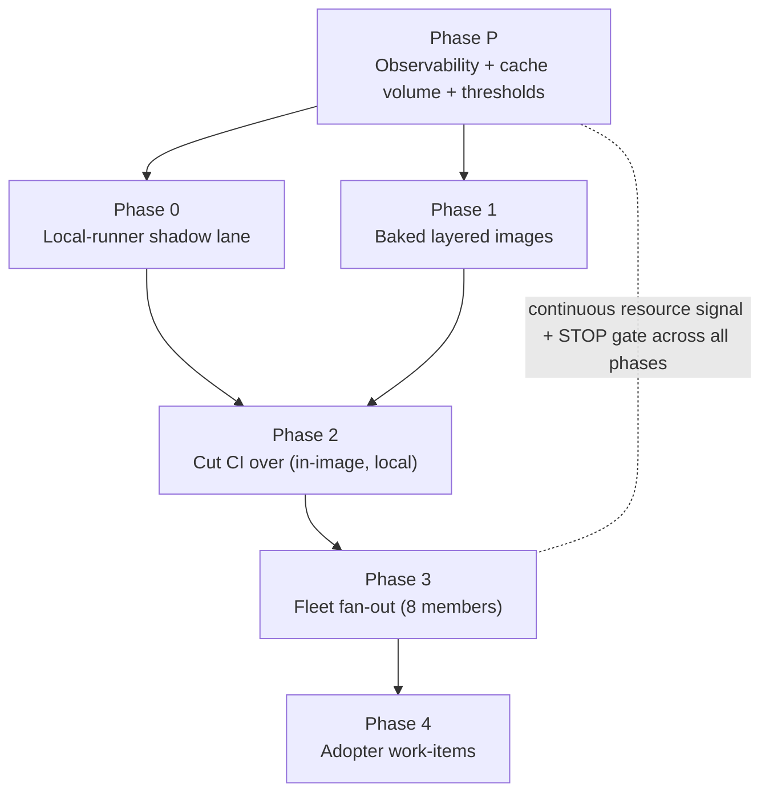

# Plan — Minimal baked sandbox images + local hot CI runners + resource-gated fleet rollout

**Status:** draft for maintainer review; incorporates an independent
Fable-model adversarial review (2026-07-11).
**Scope languages:** Python + Rust now. Haskell explicitly deferred.
**Owning session:** livespec core, 2026-07-11.

---

## Bottom line

The livespec factory and CI still pay a **live-work tax on every run**:
`livespec-console-beads-fabro` installs `rustup` per Fabro run; every
repo's `uv sync` is only partially warmed (the baked image pre-warms the
uv cache from `livespec-dev-tooling`'s OWN lockfile, not each consumer's);
and CI on GitHub-hosted runners re-runs `mise` setup + restores/saves
`actions/cache` every job. We replace that with **minimal, layered,
pinned images** (compilers baked, caches on persistent local volumes) and
move CI onto **local self-hosted runners co-located on this host**, so
images and caches are hot, local, and free — and CI runs the SAME image
the Fabro sandbox uses, collapsing "green in CI, red in sandbox" drift.
Because everything converges on one host, the plan gates every phase on
**host-resource observability that does not exist yet**, and **stops for a
Contabo provision** when the host is overloaded. It then fans out to
**all 8 fleet members** and seeds **work-items in every adopter repo**.

The Fabro factory itself already runs locally (Dispatcher on host, docker
sandbox local) — GitHub-hosted CI is the one component that leaves the
box, so baked images help Fabro immediately and the CI move closes the
loop.

## Confirmed design decisions

1. **Per-repo images, not per-step.** Fabro runs the entire work-item
   graph in ONE sandbox container per run (verified in
   `fabro-sandbox/src/docker.rs`: single container, `cpu_quota`/
   `memory_limit`; console `workflow.toml` sets `cpu = 4`). The unit of
   minimization is the per-repo (per-language) image, composed from
   shared layers.
2. **Layered composition.** `base → python → python-rust`.
   `livespec-console-beads-fabro` uses `python-rust` (it needs Python
   too — its janitor reuses the Python baseline verifiers +
   commit-refuse installer). No "Rust-only" image now.
3. **Local runners are IN this epic.** A hot, free, persistent cache is
   only reachable by co-locating; on GitHub-hosted runners "persistent
   cache" means `actions/cache` (10 GB/repo cap, LRU eviction, network
   restore+save each run) or a paid external cache.
4. **Containment is mandatory and multi-layered** (see Threat model).
5. **Resource gating is a hard prerequisite** — built FIRST; every phase
   is gated by a continuous resource signal, not a point-in-time glance.

## Host baseline (measured 2026-07-11 — SINGLE SAMPLE, do not freeze on it)

| Resource | Value | Read |
|---|---|---|
| vCPU | 18 | Generous; Fabro budget is 4 CPU/run |
| RAM | 94 GiB (84 GiB available) | Not the binding constraint |
| Swap | 0 B | Any memory breach is a hard OOM — no cushion |
| Load avg (15m) | **highly variable** — sampled 2.4 early, but 10.6–19.9 during the review pass | Bursty; a one-off sample is NOT a baseline |
| **Disk** | **338 GB, ~84% used, ~54–58 GB free (single shared `sda1`; `/` and `/data` are the same volume)** | **The real constraint** |
| OTel collector | `otelcol-contrib` already running | Host metrics = a config add |

**Honest recalibration:** CPU/RAM have large headroom; **disk is the
constraint that bites**, and load is bursty enough that thresholds MUST
come from a multi-day percentile window (Phase P), not this sample.

## Architecture — layered images

```
base          buildpack-deps:noble + system libs + mise/just/lefthook/gh/node/bubblewrap/ACP adapters
  └─ python   + CPython + uv  (base tools only; deps come from persistent volumes, not baked pre-warm)
       └─ python-rust  + rustc/cargo (rust-toolchain pin)
       └─ (later) python-haskell   + GHC/cabal   [OUT OF SCOPE]
```

- Built by the EXISTING image CI track
  (`livespec-dev-tooling/.github/workflows/fabro-sandbox-image.yml`,
  `runs-on: ubuntu-latest`), generalized to a matrix emitting the layered
  tags. Immutable `sha-<short>` / `v<X.Y.Z>` tags; BuildKit layer cache
  already `type=gha`.
- **Image BUILDS stay on GitHub-hosted (or a dedicated trusted-only
  builder); they do NOT move to the CI runner** — building images needs a
  privileged builder, and the local runner is deliberately unprivileged
  (see Threat model). The image build keeps `type=gha` for its own layer
  cache. (This corrects an earlier draft that scheduled a local BuildKit
  cache in Phase 1 — a GitHub-hosted builder cannot reach a host-local
  cache.)
- Consumers pull immutable tags; on a single host the **Docker daemon
  image store already keeps every pulled tag hot** for both Fabro and the
  runner — so no local registry is needed for hotness. A registry/mirror
  is added ONLY if GHCR-outage resilience is wanted, and then as an
  explicit skopeo/crane sync with a stated disk budget (not
  `registry-mirrors`, which only mirrors Docker Hub).

## Threat model & runner isolation (expanded per review)

The isolation problem is bigger than "untrusted dependency build
scripts" — it includes **untrusted actors**, because the repos are
**PUBLIC** (`livespec`, `livespec-dev-tooling`,
`livespec-console-beads-fabro` confirmed public).

1. **Fork-PR execution (highest risk).** GitHub explicitly warns against
   self-hosted runners on public repos: a fork PR can run
   attacker-controlled workflow code on the host. **Mitigation (Phase 0
   prerequisite):** route only TRUSTED events (push to `master`,
   same-repo PRs) to self-hosted; keep fork PRs on GitHub-hosted; require
   approval for all outside collaborators; verify a fork PR cannot
   trigger a self-hosted-labeled job. (Taking repos private is the
   alternative, but is a product decision, not assumed here.)
2. **No Docker socket.** The runner IS the baked toolchain image running
   steps directly — NO nested containers, NO `/var/run/docker.sock` mount
   (socket access is root-equivalent and would let any job read the host
   secrets and `/var/lib/doltdb`). Jobs that need to build images
   therefore cannot run on it — they stay on the privileged/trusted
   builder.
3. **Ephemeral execution + secret-free cache volumes** — fresh runner per
   job; caches are mounted volumes carrying no secrets (see Caching trust
   tiers).
4. **Host-resident secret inventory (Kind 2)** the runner user must NOT
   reach: the systemd-creds 1Password token, the Dolt tenant password,
   the GitHub App private key, `/var/lib/doltdb`, **and the new runner
   registration credential** (below).
5. **Runner registration credential (new Kind-2 secret).** The owner is a
   personal account, so these are repo-level, ephemeral runners; a
   supervisor re-registers after each job using short-lived registration
   tokens minted by a PAT/App with **repo-administration scope**. That
   credential is powerful and lives on the host — it goes in the isolation
   inventory and the supervisor design is a Phase 0 deliverable.
6. **`just check` is NOT fully hermetic (correction).** Some targets need
   GitHub auth — e.g. `check-master-ci-green`,
   `check-branch-protection-alignment` — and the factory `workflow.toml`
   documents `GH_TOKEN` reaching `just check` subprocesses. Phase 0 audits
   which targets need a token and grants the MINIMAL one (Actions
   `GITHUB_TOKEN` where it suffices); the drift check "CI == sandbox
   `just check`" must compare like-with-like given this.

## Caching strategy (comprehensive — local co-located)

Local runners + local disk let us cache aggressively and eliminate live
downloads (the main flakiness source). Every cache is a **persistent
mounted volume** surviving across ephemeral jobs — NOT `actions/cache`.

| Layer | Kills | Mechanism | Phase |
|---|---|---|---|
| Python deps | wheel download + build | persistent `~/.cache/uv` volume (primary — replaces reliance on baked pre-warm) | 0 |
| Rust deps | crate index + source fetch | persistent `~/.cargo/registry` volume | 0 |
| Git | full re-clone per job | local **bare mirror** per repo; clone via `--reference` | 0 |
| Rust compilation | recompiling across runs/repos | `sccache` local backend + persistent `target/` — **trusted-tier only** | 2 |
| Tool caches | re-analysis | persistent pyright/mypy/ruff/pytest/coverage dirs | 2 |
| Package fetch (residual) | anything the volumes miss | **per-ecosystem mirrors** (devpi / a crates mirror / npm proxy) IF measured worthwhile — a transparent MITM proxy is REJECTED (HTTPS/TLS). Likely deferred; the uv/cargo volumes already remove most fetches | (defer) |

**Trust-tiered caches (non-negotiable — a job writes its cache as a side
effect, so "populate only from trusted sources" is otherwise
unenforceable):**
- **PR / untrusted-lane jobs get READ-ONLY (or throwaway overlay) cache
  mounts.** Write-back happens ONLY from trusted-branch (post-merge)
  runs.
- **Per-repo namespaces** for `target/` and sccache — a poisoned object
  from one repo cannot flow into another's build or release artifact.
- **`sccache` is trusted-tier-only, or skipped initially** — its object
  cache has no input-integrity binding (unlike lockfile-keyed uv/cargo
  registry caches).

**Cache-integrity guardrails:** content-addressed keys (lockfile/toolchain
hashes) on read; **a scheduled cold-cache validation run** (no-cache `just
check`, cadence a Phase-P decision) to catch cache-masked "false green";
disk budget + LRU eviction per cache, watched by the resource gate.

**Image pre-warm demotion (staleness fix).** The current Dockerfile
pre-warms uv from `livespec-dev-tooling`'s lockfile only, and
`fabro-sandbox-image.yml`'s `paths:` triggers watch only dev-tooling
files — so consumer-lockfile changes never rebuild the image and warm
layers silently rot. Therefore: **persistent volumes are the primary dep
cache; image layers carry base tools only** (no per-repo dep pre-warm
unless the lockfile plumbing + rebuild triggers are built explicitly).

**Disk reality.** ~54–58 GB free on ONE shared volume — NOT "lots of
room." Cargo `target/` + sccache + registry volumes + image variants +
per-run sandbox clones (each Fabro run clones the repo + up to 7 depth-1
siblings inside the container) consume it fast. **Resolution: a dedicated
Contabo cache volume is a Phase P DELIVERABLE (not an open decision)**, so
cache growth cannot starve `/`; prune automation (docker image GC,
BuildKit GC, cache LRU) is a named dev-tooling tool.

## Resource gate (spec — corrected to continuous, baseline-derived)

A phase-end point-in-time "checkpoint" is wrong on this bursty host — it
would randomly pass in troughs and STOP in spikes (the review measured
load 23 mid-pass). Instead:

- **Baseline from data, not a sample.** Phase P collects a multi-day
  window in the new metrics dataset; thresholds are frozen from its
  percentiles BEFORE any gating.
- **Continuous sustained-duration trigger** (Honeycomb trigger + burn
  window), not a one-shot report — a phase "passes" only if no sustained
  breach occurred across its active window.
- **Signals** (provisional; finalize in Phase P): disk free (primary),
  CPU utilization + PSI pressure (NOT bare load-avg — load > vCPU is
  normal for I/O-heavy builds), memory available + any swap-in, **and CI
  queue-wait time** (on a single host, queue latency saturates before CPU
  does — a first-class signal).
- **Runner-liveness/absence alert** — the gate watches resource EXCESS;
  nothing yet watches runner ABSENCE (a down runner queues jobs silently
  up to 24h). Add liveness alerting in Phase P.
- **STOP action:** emit report + per-process/per-container attribution
  (Fabro vs runner vs Dolt; prefer the `docker_stats` receiver over
  process-name matching) + a recommended Contabo target (vCPU/RAM tier, or
  storage for a disk breach), and halt. Provisioning is a manual
  maintainer action in the Contabo panel.

---

## Phases

### Phase P — Observability + provisioning prerequisite (blocks everything)

**Deliverables**
- `hostmetrics` receiver (cpu, memory, disk, load, paging) + a
  `docker_stats` receiver (per-container attribution) added to the
  running collector → new `livespec-host-metrics` metrics dataset. Scope
  scrapers + interval to control per-PID cardinality/cost.
- Verify/repair the OTel trace egress (factory datasets
  `livespec-dispatcher`, `fabro-sandbox`, `livespec-rgr` appear silent
  since ~2026-06-13; re-verify and restore).
- Prepare-step timing spans — emitted by wrapping the step SCRIPTS with
  span shims (Fabro is third-party; we instrument the scripts we own or
  consume Fabro's telemetry), so before/after is measured.
- Multi-day baseline captured; thresholds + the continuous trigger +
  runner-liveness alert implemented.
- **Provision the dedicated Contabo cache volume** and the cold-cache
  validation schedule.

**Where:** `claude-collector` (collector config); resource tooling in
`livespec-dev-tooling`; span shims in `livespec-orchestrator-beads-fabro`.

**Exit:** metrics + traces flowing; baseline + thresholds frozen; cache
volume mounted; STOP-gate + liveness alert live.

### Phase 0 — Local-runner shadow lane (non-gating)

**Deliverables**
- One ephemeral, unprivileged, secret-isolated runner (NO docker socket)
  running the baked image directly + a runner **supervisor** with the
  registration-credential design.
- **Trusted-event routing** so fork PRs cannot reach the runner.
- Persistent secret-free cache volumes (uv, cargo registry) + per-repo
  git bare mirrors.
- **CI concurrency model decision:** the fleet's CI is a per-target
  MATRIX (~45 canonical `just <target>` jobs in `livespec-dev-tooling`) —
  choose matrix-collapse (one aggregate `just check` job on local) vs. N
  runner slots; record the concurrency number the resource projections
  will use.
- One repo's `just check` green on the runner as a NON-gating lane; verify
  the runner user cannot read the Kind-2 secret paths.

**Where:** `livespec-dev-tooling` (runner/supervisor/containment tooling);
pilot repo shadow lane.

**Exit:** green shadow run; isolation verified; concurrency number set;
**continuous resource signal shows no sustained breach**.

### Phase 1 — Baked layered images

**Deliverables**
- `base / python / python-rust` layered Dockerfiles + matrix build in
  `fabro-sandbox-image.yml` (builds STAY GitHub-hosted/trusted-builder).
- Pin/lockstep: extend `fabro_image_pin_lockstep.py` for the Rust `ARG`;
  add the **cross-repo** Rust pin lockstep against
  `livespec-console-beads-fabro/rust-toolchain.toml`; decide the
  `workflow.toml` autodiscovery gap (image pins are manual today — the
  console `workflow.toml` PIN SURFACE NOTE confirms this verbatim).
- Console `workflow.toml` → baked `python-rust` image; DELETE the per-run
  `rustup` step. Orchestrator `workflow.toml` → `python` image.

**Where:** `livespec-dev-tooling` (bulk); console + orchestrator (a
little).

**Exit:** images published + pinned + lockstep-green; console +
orchestrator dispatch green on baked images; **no sustained resource
breach (disk-watch)**.

### Phase 2 — Cut CI over to the local runner + baked image

**Deliverables**
- **Per-job disposition table for the pilot repo** — each `ci.yml` job
  labeled move / stay-GitHub-hosted / delete. Jobs that stay hosted:
  App-token minting (fleet-conformance), telemetry export, the
  release/auto-merge chain, and any GitHub-context-bound job. This table
  is the fan-out template ("switch `runs-on` + delete `actions/cache`" is
  NOT a per-file operation).
- Moved jobs run `just check` targets in the baked image on the runner;
  their `actions/cache` steps deleted (cache now local).
- **Merge-gate fallback mechanism designed** (not just named): a
  `workflow_dispatch`-switchable `runs-on` variable OR a gate meta-job
  that accepts either lane, so a down host does not silently stall merges
  for 24h. (Runner-liveness alerting from Phase P covers detection.)

**Exit:** pilot CI green on local runner in-image; drift check (CI ==
sandbox `just check`, like-with-like) passes; no sustained breach.

### Phase 3 — Fleet fan-out

**Members (8):** `livespec`, `livespec-dev-tooling`,
`livespec-driver-claude`, `livespec-driver-codex`,
`livespec-orchestrator-beads-fabro`, `livespec-orchestrator-git-jsonl`,
`livespec-runtime`, `livespec-console-beads-fabro`.

**Deliverables:** per repo — apply the Phase 1 image pin + the Phase 2
disposition table; verify green.

**Exit per repo:** green on local runner in-image, AND the continuous
resource signal holds as load accumulates (the STOP fires here if the host
saturates → Contabo provision). A mid-fan-out STOP leaves the fleet
temporarily split across two CI models — an acceptable interim steady
state.

### Phase 4 — Adopter work-items

**Deliverables:** a ready work-item filed in each adopter ledger —
`openbrain`, `resume` — for the same conversion, executed by them
(adopters are independent: own credential wrappers, tenants, GitHub Apps),
citing this epic's reference implementation.

---

## Where the work lives (summary)

| Repo | Share | What |
|---|---|---|
| `livespec-dev-tooling` | **bulk** | layered images + matrix build, pin-lockstep extensions, runner/supervisor/containment tooling, resource + STOP-gate + liveness tooling, cache prune automation, fan-out automation |
| `claude-collector` | prerequisite | `hostmetrics` + `docker_stats` receivers + Honeycomb metrics pipeline |
| `livespec-orchestrator-beads-fabro` | a little | prepare-step span shims; own `workflow.toml` → `python`; shipped default |
| `livespec-console-beads-fabro` | a little | `workflow.toml` → `python-rust`; drop per-run `rustup` |
| each fleet repo | mechanical | image pin + per-job `ci.yml` disposition + `actions/cache` removal |
| `openbrain`, `resume` (adopters) | Phase 4 | work-items only |

## Measurement (before/after) — per repo class

Report savings PER CLASS, not one fleet-wide number (a 16-min P50 Fabro
run is dominated by agent/LLM time):
- **`livespec-console-beads-fabro` (Rust):** removes per-run `rustup`
  install + cold cargo builds — the real win.
- **Python repos:** the residual is the per-repo `uv sync` delta (already
  partially image-warmed) — likely well under 10%.
- Phase P's prepare-step spans set the headline number; do not justify the
  epic fleet-wide on the console's figures.

## Rollback (per phase)

Each phase is cheaply reversible and reversal is written into its
work-item: image-pin revert (via lockstep/pins), `ci.yml` `runs-on` →
`ubuntu-latest` + restore `actions/cache`, runner deregistration, cache
volume teardown. A Phase-3 partial state (some repos local, some hosted)
is a valid pause point.

## Risks & open decisions

- **Public repos + self-hosted runners** — highest risk; trusted-event
  routing is a Phase 0 prerequisite (above).
- **Docker-socket vs. image builds** — runner stays socket-less; image
  builds stay on a privileged/trusted builder.
- **Cache poisoning** — trust-tiered caches; sccache trusted-only/deferred.
- **Single-host merge-gate** — fallback mechanism designed in Phase 2 +
  liveness alert in Phase P.
- **No swap cushion** — treat any sustained swap-in as an immediate STOP;
  consider a swap safety net.
- **Bursty load / threshold baseline** — freeze thresholds from a
  multi-day window, not a sample.
- **CI matrix concurrency** — matrix-collapse vs. N runner slots (Phase 0).
- **Autodiscovery gap** — close now (auto-bump `workflow.toml` image tags)
  vs. keep manual per-repo pins guarded by lockstep.
- **Cache-warming strategy** — persistent volume (primary) vs. per-repo
  image pre-warm (demoted; needs lockfile plumbing + triggers if revived).

## Dependency diagram


