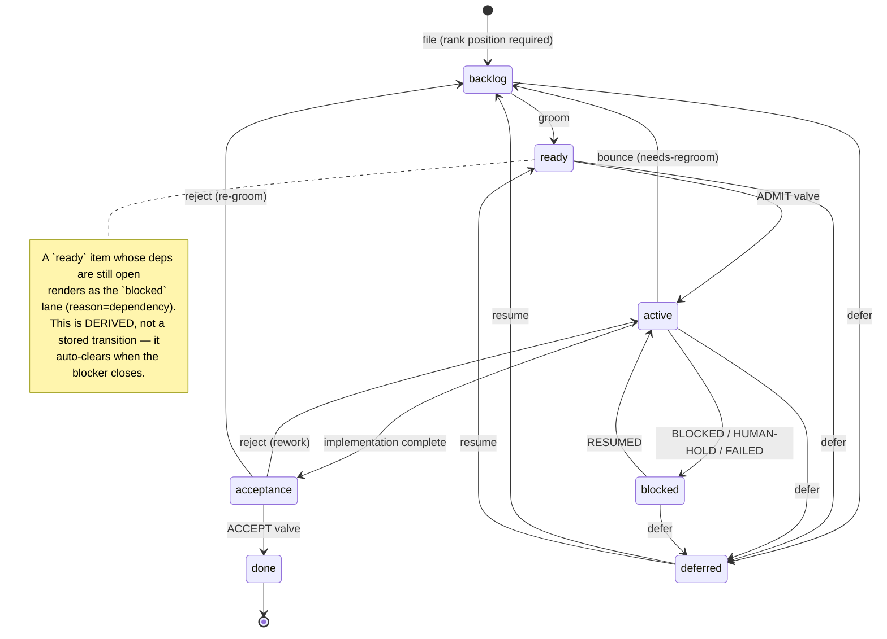
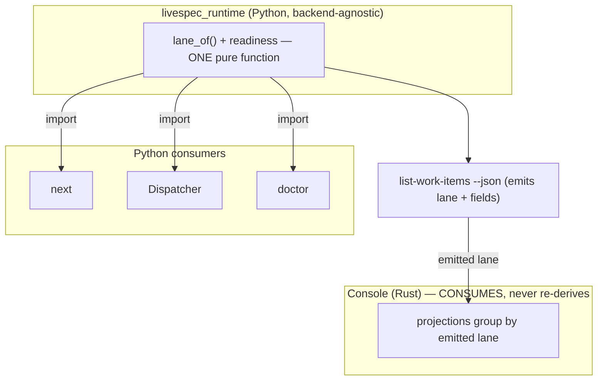
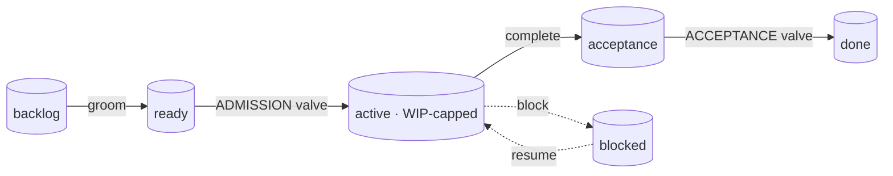
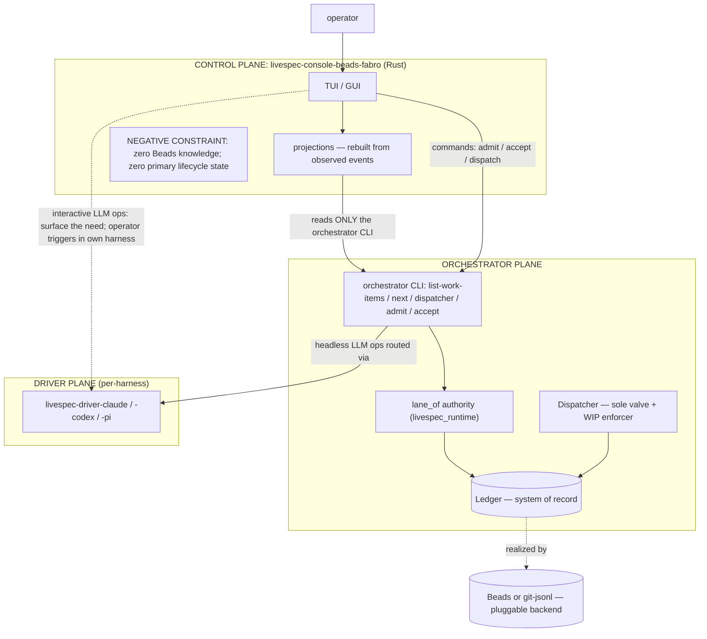
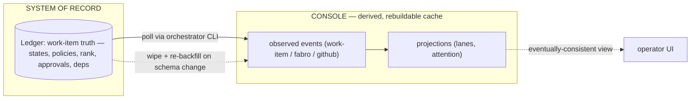

# Design — the deterministic work-item lifecycle state machine

This is the design of record for the thread. It is the synthesis of the
design session captured verbatim in `../conversation/transcript.md`; the
external grounding is in `01-prior-art.md`; the running decision trail and
open items are in `03-decision-log.md`.

> ⚠️ **SESSION-2 REVISIONS — read `03-decision-log.md` "Locked decisions —
> session 2" first.** §§2, 4, 6 below are **partly superseded** and will be
> re-synthesized at the end of the A–H walk. Net changes already locked:
> **7 stored states** (`deferred` removed, `pending-approval` added);
> **`groomed` is the `pending-approval` state**, not a property;
> **`admission_approved` dropped** (approval ≡ being in `ready`); the word
> **"receipt" retired** (transitions only); the **only derived overlay** is
> `blocked:dependency`; **WIP cap is per-repo**; **beads uses custom
> statuses (1:1)**. The locked transition table lives in `03-decision-log.md`.

## 1. Problem and thesis

Today the work-item lifecycle is **implicit and scattered** across at
least six places: intake tags (`ready`/`needs-regroom`/`not-yet-actionable`)
on `capture-*`; the structural readiness predicate `is_item_ready`
(which checks status + deps but *not* grooming); marker-based pre-launch
refusals (`host-only`, `human-gated`) in the Dispatcher; the `mode`
parameter (`shadow`/`autonomous`) as a crude all-or-nothing admission
lever; the janitor gate as a crude release lever; and the local
**overseer skill**, which hand-maintains a state table in a bash script.

**Thesis:** extract that implicit lifecycle into **one explicit,
deterministic state machine** — livespec's answer to Gas Town /
"Open Engine" — and **invert the architecture from operation-centric to
state-centric.** The state machine becomes the spine; the existing
skills become *transitions and readers* over it. Almost nothing is
deleted — `orchestrate` folds into the console, the standing overseer
loop retires — and the scattered, homeless lifecycle state gets one home.

Two human-delegable **policy valves** bracket the WIP-limited autonomous
middle: **admission** (into work) and **acceptance** (out to done). The
human holds ultimate authority at both but can delegate either to AI,
per-item or per-epic, with safe defaults.

## 2. The lifecycle state machine

Ubiquitous vocabulary (livespec's own — a storage backend never leaks
its terms in): the lifecycle **states** are

`backlog · ready · active · acceptance · blocked · deferred · done`



Key properties:

- **Grooming is a state transition** (`backlog → ready`), not a boolean.
  You **structurally cannot reach `active` without passing through
  `ready`** — the grooming gate is enforced by the machine, and
  "was groomed?" is implied by being anywhere past `backlog`.
  `needs-regroom` is just a **bounce back to `backlog`** (with a reason).
- **`acceptance`** is the release/accept gate — *distinct* from the LLM
  review that happens *inside* Fabro during implementation.
- **`deferred`** is the *voluntary* stop (you chose to set it aside;
  resumes when **you** decide). **`blocked`** is the *involuntary* stop
  (waiting on a specific unmet thing; resumes when an external event
  resolves it). They are different and both first-class.
- **`done`** is terminal (a closure with `resolution` + `audit`).

## 3. Lane ≡ state, with one derived overlay

The board lane a UI shows **is** the state — there is no separate stored
"lane." The only place lane ≠ state is the dependency overlay, and it
*must* be derived because it depends on the external state of other
items and auto-resolves when they close:

```
lane_of(item, ctx) =
    done                       -> done
    deferred                   -> deferred
    blocked                    -> blocked   (+ blocked_reason)
    acceptance                 -> acceptance
    active                     -> active
    backlog                    -> backlog
    ready  AND deps-open       -> blocked   (reason = dependency)   <- the ONLY derived overlay
    ready  AND deps-clear      -> ready
```

`blocked_reason` is partly stored, partly derived — and that split is
meaningful: stored `blocked` (`needs-human`, `infra-external`) needs an
*explicit* unblock; derived `dependency` block auto-clears.

### The single-authority / consume-don't-recompute rule

`lane_of` is **one pure function** in the shared backend-agnostic
`livespec_runtime.work_items` package — the same single-authority
discipline already proven by `is_item_ready`/`ready_sort_key` (imported
by both `next` and the Dispatcher so "the Dispatcher's drain order never
diverges from what `next` advertises").

- **Python consumers** (`next`, the Dispatcher, `doctor`) **import** it.
- **The console (Rust) must CONSUME the emitted lane, never re-derive
  it.** The work-items query surface (`list-work-items --json`, extended
  to emit `lane` + the new fields) is the single cross-language
  authority; the console groups by the emitted lane. Re-deriving a lane
  in Rust is the drift hazard and is contractually forbidden.



**Why derived beats stored:** a derived lane *cannot lie* — it is
computed from the underlying fields, so it can never disagree with
reality. A stored lane can (a missed transition leaves a stale lane that
silently misrepresents the item — the "shadow state" the no-shadow-ledger
rule exists to kill). Derived trades a worse risk (stored-vs-truth,
silent, per-item) for a better one (consumer-vs-consumer consistency),
addressed by one function + one conformance golden test.

## 4. The two valves



**Admission valve** (`ready → active`). Two independent conditions:

- **Permission:** `admission_policy == auto`, OR (`admission_policy ==
  manual` AND a human has set `admission_approved`). A human's approval
  is *primary information* (a decision), legitimately stored — **not** a
  shadow. Approval lets a human pre-approve and walk away. A
  bounce-to-`backlog` **resets** `admission_approved`.
- **Capacity:** a free WIP slot (`count(active) < wip_cap`).

The **Dispatcher is the sole enforcer**: when a slot frees, it pulls the
**highest-`rank`** admission-eligible `ready` item (eligible = permission
satisfied AND deps-clear), sets `owner`, transitions to `active`, writes
the `CLAIMED` receipt. The console only *commands* (a human approves a
manual item) and *observes* — it never enforces.

**Acceptance valve** (`acceptance → done`), per `acceptance_policy`:

- `ai-only` — AI runs acceptance verification / exploratory testing and
  accepts autonomously.
- `human-only` — a human accepts.
- `ai-then-human` (**default**) — AI verifies and surfaces findings,
  then a human gives final acceptance.

There is no "release with zero verification" — every acceptance has at
least an AI pass. Reject routes back to `active` (rework) or `backlog`
(re-groom).

**WIP cap:** a single **global** cap (default **5**), in orchestrator
config (`.livespec.jsonc`), **not** a per-item field. Per-lane/per-epic
granularity is a later refinement.

**Policy inheritance:** policy fields are `… | None`; `None` = inherit
from the nearest ancestor epic, else the system safe default (`manual`
admission, `ai-then-human` acceptance). So a low-risk *epic* set to
`auto`/`ai-only` propagates to its children, overridable per item.
**Safe-by-default:** a fresh factory does nothing autonomously until a
repo/epic/item is explicitly opted into `auto`.

## 5. Order — the `rank` primitive

Order is a first-class persisted primitive (without it, no UI can show a
deterministic line and no human can control sequence). It is **also
functional**: `rank` is the Dispatcher's pull order among eligible items.

- **`rank` is a fractional / lexicographic key** (LexoRank/Figma-style),
  **not** a linked list and **not** an integer. Rationale: order reads
  are a native `ORDER BY rank`; it is **merge-robust** in the
  append-only/git-merged/concurrent-agent world (self-contained keys,
  no pointers to dangle — a git merge just unions lines and sorts;
  concurrent inserts tie-break by `id`); it fits the existing
  supersession reducer (a re-rank is one superseding record); and an
  insert rewrites exactly **one** item.
- **Sole ordering authority** — the old integer `priority` is **removed**
  (two priority sources = two conflicting truths). `next` ranks by
  `rank` (then `id` as the deterministic tie-break); the old
  `priority → gap-tied → captured_at` heuristics go away (explicit order
  replaces implicit heuristics).
- **Unified across all states** — every item has a `rank`; each lane is a
  filter sorted by the same global key. One deterministic order for any UI.
- **Position is a REQUIRED create parameter — no default.** `capture-work-item`
  (and the order API) must take `position ∈ { top | bottom | before:<id>
  | after:<id> }` and reject a create without it. `top`/`bottom` are the
  global extremes (and the empty-list base case); `before`/`after` are
  relative. The **console's create policy** is `before:<current-top-backlog-item>`
  (falling back to `top` when backlog is empty), so a new item lands at
  the top of the *backlog frontier* and stays visible.
- **Rebalancing** (the only cost) is a deterministic, order-preserving
  bulk re-key (`rebalance-ranks`): walk items in `rank` order, reassign
  evenly-spaced fresh keys → N superseding records. Order never changes,
  so it is transparent to readers; run on demand or when a key exceeds a
  length threshold. Use a proven algorithm (vendor a small pure-Python
  fractional-indexing implementation), not a hand-roll.

## 6. The schema — one abstract model, two realizations

The abstract `WorkItem` (`livespec_runtime/work_items/types.py`) is the
**source of truth**; Beads and `livespec-orchestrator-git-jsonl` are two
realizations. New fields follow the blessed evolution pattern already
used twice (`spec_commitment_hint`, `supersedes`): **optional-on-read
with a default, written explicitly on append** (legacy records read back
as the default; no in-place migration).

Net change to the abstract `WorkItem`:

```
status: Literal["backlog","ready","active","acceptance","blocked","deferred","done"]   # was open/in_progress/blocked/closed/deferred

+ rank: str                                                  # fractional order key, sole ordering authority
+ admission_policy: Literal["auto","manual"] | None          # None = inherit; default manual
+ admission_approved: bool                                   # manual items; reset on bounce
+ acceptance_policy: Literal["ai-only","human-only","ai-then-human"] | None   # None = inherit; default ai-then-human
+ blocked_reason: Literal["needs-human","infra-external","dependency"] | None # non-null iff blocked; dependency is derived
+ owner: str | None                                          # agent allowed; REQUIRED once active
- priority: int                                              # REMOVED (rank is the sole order)
- groomed                                                    # never existed as a field; now the `ready` state
```

### Backend mapping — the impedance layer (the ONLY place "beads" appears)

| Abstract | git-jsonl | Beads (native enum is fixed; never forked) |
|---|---|---|
| `status` backlog | `status` field | `status=open` |
| `status` ready | `status` field | `status=open` + label `ready` |
| `status` active | `status` field | `status=in_progress` |
| `status` acceptance | `status` field | `status=in_progress` + label `lane:acceptance` |
| `status` blocked | `status` field | `status=blocked` |
| `status` deferred | `status` field | `status=deferred` |
| `status` done | `status` field | `status=closed` |
| `rank` | `rank` field | `metadata.rank` |
| `admission_policy` | field | label `admission:<auto\|manual>` |
| `admission_approved` | field (bool) | label `admission-approved` (present/absent) |
| `acceptance_policy` | field | label `acceptance:<value>` |
| `blocked_reason` | field | label `blocked-reason:<value>` |
| `owner` | field | beads native `owner` field |

This extends the existing convention (scalar identity → native field;
single-value enum → label; structured → `metadata`). It also resolves
the contract's open question — **`needs-regroom` / `ready` are labels on
a Beads `open` item, never a status** — and the readiness predicate grows
to require the `ready` state (excluding ungroomed/backlog items), the
same change the admission valve needs.

### Receipts = named transitions (no new structure)

The receipt vocabulary maps to named `(from → to, reason)` transitions
over the states. git-jsonl records each as an appended superseding record
(the chain *is* the audit log); Beads as a status change +
`EventStatusChanged` + a `Comment`.

| Receipt | Transition |
|---|---|
| `CLAIMED` | ready → active (admission passed) |
| `BLOCKED` | active → blocked (reason ∈ infra-external, dependency) |
| `HUMAN-HOLD` | active → blocked (reason = needs-human) |
| `RESUMED` | blocked → active |
| *(complete)* | active → acceptance |
| `ACCEPTED` | acceptance → done (resolution=completed + audit) |
| `FAILED` | active → blocked (reason in `reason`, last safe step) |
| `DEFER` | backlog/ready/active/blocked → deferred |

## 7. The console — a deterministic projection of the ledger



Hard constraints on the console:

- **Zero Beads knowledge** (negative constraint) — no `bd`, no Dolt, no
  beads references anywhere. The console's *only* external interface is
  the **orchestrator CLI**. Today it shells `bd ready --json` and
  re-derives a Rust status taxonomy (`BeadsWorkItemStatus`) — both are
  deleted. Reading work-items through `list-work-items --json` is also
  what the console's *own* Control-Plane contract already demands
  ("observe through the plane's published surface, never reach around
  it"); scraping `bd` *is* reaching around the plane.
- **Zero primary lifecycle state** — every lane, attention item, and
  projection is **rebuildable from the ledger**. **Snooze/ack are
  killed**: the attention inbox is a *pure derivation* of the state
  machine (an item needs attention iff its state requires a human);
  resolving the underlying state *is* the dismissal; "not now" is
  `defer` (a ledger state) or re-rank (a ledger field). This collapses
  the event-versioning problem — a domain rename is handled by **wipe +
  re-backfill**, never heroic upcasting. (Cross-source enrichments —
  live Fabro progress, GitHub checks — are explicitly non-authoritative
  disposable cache, never a lifecycle truth.)
- **Harness abstraction lives in the driver layer**, reached
  *transitively through the orchestrator* — the console takes no direct
  driver dependency (respecting the load-bearing "Driver → orchestrator
  = zero deps" invariant). Interactive LLM ops (`groom`, `plan`) are
  **surfaced** (the operator triggers them in their own harness);
  headless LLM ops are **commanded to the orchestrator**, which routes
  to the right harness via its existing driver + Fabro machinery.
- A **significant console rewrite is expected and acceptable** — it is
  greenfield. The new fields/lane are additive; the SQLite store
  (opaque `payload_json`/`metadata_json`) needs no migration.

## 8. Event sourcing — where state lives



The console is **eventually-consistent** with the ledger (it polls and
observes), and holds **no authoritative lifecycle state**. Its event log
is a rebuildable observation cache + a cross-source timeline; the ledger
(git-jsonl's append-only supersession chain / Beads' events) is the
authority. The only event-sourcing discipline that survives: event types
are append-only (never rename/remove); but because the lifecycle log is
fully rebuildable from the ledger, that discipline matters only for the
small set of genuinely console-local events — which the zero-primary-state
constraint drives toward empty.

## 9. Skill fate and the overseer

Inverting to state-centric, almost everything is re-anchored, not deleted:

| Concept | Fate |
|---|---|
| `dispatcher` | **stays** — grows to enforce the two valves + WIP (today it has neither) |
| `plan` | **stays** as the planning-lane interaction; its *tracking* is subsumed by the state machine |
| `next` | **stays** as the derived-query single ranking authority (now ranks by `rank`) |
| `groom` | **stays** — the `backlog → ready` transition (human decomposition gate) |
| `orchestrate` | **folds into the console** (the spec already calls the console "the standing, event-sourced realization of the orchestrate skill") |
| `overseer` (local skill) | **keeps running** to finish current work; **the epic's exit gate deletes it once the new system is dogfooded** |

The overseer's deterministic functions move into the console + state
machine; its judgment functions become the valves' policies + on-demand
skills. There is no permanent AI loop "above" the console — the console
is the operator's top of stack.

## 10. Blast radius (one fleet-wide epic)

- `livespec` core — the schema/contract + `lane_of` home + the diagram set.
- `livespec_runtime` (shared) — the `WorkItem` additions + `lane_of` + rank.
- both orchestrators — `livespec-orchestrator-beads-fabro` (Beads
  mapping, Dispatcher valves/WIP, `list-work-items` lane emission) and
  `livespec-orchestrator-git-jsonl` (native fields).
- readers — `next` / `dispatcher` / `doctor`.
- `livespec-console-beads-fabro` — the rewrite (orch-CLI-only, lane
  consumption, valve/order UI, kill snooze/ack).
- probably drivers + dev-tooling.

Anchored in livespec core; **overseer deletion is an exit criterion.**
