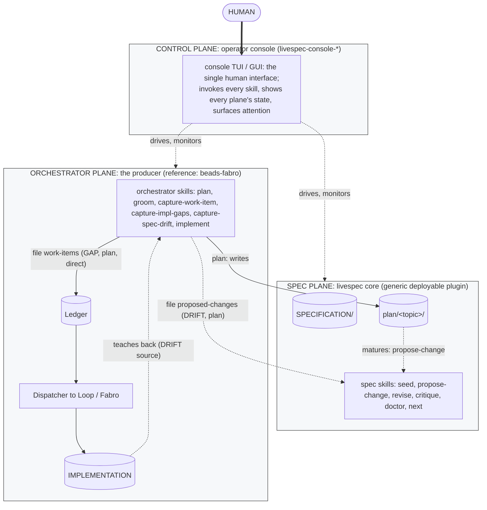
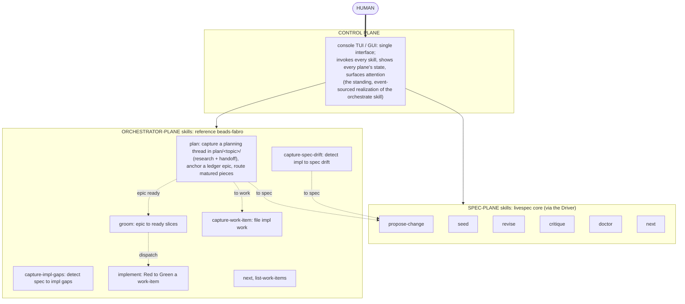
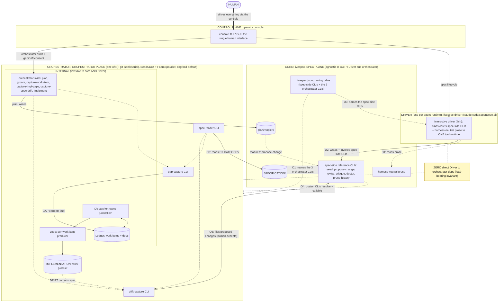

# Planning Lane design — decisions and plan

Captured 2026-06-25 from the `workflow-planning` design session. **This
is research, not specification text.** Nothing here is normative until it
moves through `/livespec:propose-change` → `/livespec:revise`. This doc
is the durable reasoning + plan; the runnable handoff is
`prompts/livespec-zs22-handoff-planning-lane.md`; the queryable plan is
ledger epic **`livespec-zs22`**.

Companions:
[[missing-planning-workflow-thread]] (the original 2026-06-23 gap note),
`research/factory-conformance/cross-repo-conformance-pattern.md` (the
Conformance Pattern — a major concern that files its milestones through
this lane), and
`research/dark-factory-operability/work-breakdown.md` (the Grooming
thread — orthogonal and downstream).

## Bottom line

livespec has a codified, supported workflow for the spec lifecycle
(`/livespec:*`) and for tracked implementation work (the orchestrator
skills + the beads ledger). It has **no** codified surface for the
durable, multi-session **planning** work that decides what should *become*
spec vs. implementation vs. research — that work has lived in the
maintainer's head and in hand-written prompts. This is not new scope: the
abandoned bootstrap design (approach-1) specified a `plan` artifact, an
`explore` thinking-partner, and a `journal`, and dropped all three when
the project narrowed to "pure spec governance." The field (spec-kit,
Kiro, BMAD, Cline, beads) has since converged on the same three-lane
model livespec already half-runs. The move is to **re-adopt livespec's
own deferred design as a disciplined, codified convention**, place each
piece on the plane that owns what it touches, and mechanically enforce the
one rule the field has not solved: a planning artifact must never become a
second tracker.

## The three planes

The planning work spans planes; conflating them is the error. There are
three:

| Plane | Owns | Concerned with |
|---|---|---|
| **Spec Plane** (livespec core) | `SPECIFICATION/`, `research/`, the `/livespec:*` lifecycle | *what* the system should do |
| **Orchestrator Plane** (the producer) | the beads ledger, the Dispatcher, the Loop/Fabro | *producing* implementation from ripe work |
| **Control Plane** (the console — `livespec-console-*`) | the operator experience: observe all planes, coordinate the human through multi-session work | *running* the overall workflow |

Naming hazard, resolved: the console is **not** a "Driver." "Driver"
already means the per-agent-runtime binding (`livespec-driver-claude`,
`livespec-driver-codex`). The console is the **Control Plane / operator
cockpit**. Keep those distinct in all prose and diagrams.

## The Planning Lane

The Planning Lane is the durable, multi-session planning convention. It
has two artifacts, which map to two planes:

- `research/<topic>/*.md` — durable **reasoning** ("why this shape").
  Spec-Plane; matures into a `propose-change` when it becomes
  contractual. Analogue: spec-kit `plan.md` / Kiro `design.md`.
- `prompts/<topic>-handoff.md` — resumable **execution coordination**
  ("resume track T in a fresh session"). It references ledger ids and
  drives implementation, so it sits at the seam (below). Analogue: Cline
  `activeContext.md` + `progress.md`.

The discipline (the openbrain convention livespec copied the shape of but
dropped — see `/data/projects/openbrain/prompts/AGENTS.md`):

- **status is derived from the ledger as the first action, never stored
  in the prompt** (the no-shadow-ledger rule);
- a handoff's checklist items are each a session-local step **or** a
  pointer to a real ledger id — never a parallel work queue;
- refresh the handoff at ~context budget; archive on close via `git mv`
  with a completion banner;
- a per-repo `prompts/AGENTS.md` defines the convention locally.

### The two seams (the Spec/Orchestrator overlap)

The Planning Lane is Spec-Plane, but it touches the Orchestrator Plane at
exactly two explicit, one-directional seams — the same cross-boundary
discipline as the existing gap/drift flows:

1. **Prompt → ledger:** a handoff cites ledger ids **read-only**; it never
   writes the ledger. Status is composed from the orchestrator's
   `list-work-items`/`next`, never stored.
2. **Plan → work:** routing ripe work into the ledger is a cross-boundary
   handoff **through the orchestrator's `capture-work-item` CLI** — never a
   direct cross-plane write.

## Refinements (session continued, 2026-06-25): the `plan` skill, `plan/<topic>/`, archive-on-close

These refine the Planning Lane above and **supersede the earlier
`research/<topic>/` + `prompts/<topic>-handoff.md` split**. They also
sharpen locked-decision 1 below: research IS captured by the `plan` skill,
not by a no-skill convention.

### The `plan` skill

The codified Orchestrator-Plane skill is **`plan`** (not `capture-plan`):
the `capture-*` family is one-shot, but a planning thread is stateful and
re-entered for the same topic, like `groom`. API:

- **`plan` (no argument):** the interactive entry. Lists the open threads
  (from the ledger plus `plan/` dirs) to resume, or you describe a new
  thread and the skill **proposes a short canonical dash-cased slug** (the
  same canonicalization `propose-change` uses: lowercase, hyphenate runs of
  non-alphanumerics, strip, truncate to 64), confirms it, and creates
  `plan/<slug>/` plus a ledger epic anchor. The human never hand-crafts the
  identifier, so there are no spaces, no over-long strings, deterministic output.
- **`plan <slug>` (argument):** deterministic and strict. Must match an
  existing `plan/<slug>/` exactly, or it fails hard with an error listing
  the existing slugs. No fuzzy match, no accidental create-on-typo;
  creation happens only through the no-argument interview path.

Each invocation can update reasoning, refresh the handoff, route a now-ripe
piece (to `propose-change` for spec, or `capture-work-item` for ledger
work, filed as epic children), or archive on completion. The skill is
Orchestrator-Plane, so core's functional surface stays pure.

### `plan/<topic>/`: one directory, optional facets

A planning thread is a first-class directory **`plan/<topic>/`** holding:

- **At most one handoff:** the reserved filename `plan/<topic>/handoff.md`.
  A fail-closed check rejects any second handoff (any other `handoff*.md`),
  because only one resumption point can be active per topic. Optional: a
  young thread can be research-only.
- **Zero or more research files:** everything else under `plan/<topic>/`.
  Multiple sub-topic files live in a `plan/<topic>/research/` subdir
  (`research/auth-flow.md`, `research/data-model.md`); no count limit, and
  no topic in the filenames since the dir carries it.

This co-locates the two facets under one topic dir (no drift) and matches
the skill one-to-one. The broader `research/` dir stays for standalone
analysis that is not an active planning thread.

### Archive-on-epic-close (a conformance concern)

A plan thread's lifecycle binds to its ledger epic:

- **Invariant:** `plan/<topic>/` is active if and only if its epic is open,
  and archived to `plan/archive/<topic>/` if and only if the epic is closed.
- **Mechanism:** whatever closes the epic also archives the dir (manual
  `bd close`, the `plan` skill's close path, or the Dispatcher's
  close-on-merge); reopening the epic unarchives it (bidirectional).
- **Backstop:** a fail-closed check asserts `archived` matches
  `epic-closed`, making this a five-slot conformance concern paired with
  Ledger-closure (the work-item and its artifacts close together).
- **Keep-it escape:** nothing is lost (the archived thread stays in
  `plan/archive/` and git history); to keep a research file as living
  reference, copy it to `research/` deliberately.

In spirit this is `prune-history` for planning threads: the active view
stays clean, completed threads move aside rather than getting deleted.

## Locked decisions (2026-06-25)

1. **The codified handoff/coordination skill lives Orchestrator-side**,
   beside `capture-work-item`/`groom` — not as a core spec-side
   `/livespec:plan`. Rationale: its job is execution coordination over the
   ledger (which the orchestrator owns), it re-homes the retired
   orchestrator handoff-prompt chain, and it keeps core's public
   *functional* surface pure. The *pattern* is non-functional core
   guidance (general, any orchestrator); the *realization* is the
   reference orchestrator's skill — the same split as Grooming. The
   reasoning-capture half (`research/`) stays a lightweight Spec-Plane
   convention; a planning thread that should become spec just becomes a
   `propose-change` (no new core op).
2. **Ubiquitous language:** `fleet` and `adopter` and `governed repo` are
   kept (`governed repo` is already established spec language). `factory
   profile` is renamed **`baseline` profile** — "factory" is already
   bound to the autonomous execution engine (the dark factory), and the
   baseline conformance floor applies even to repos not using that engine.
   Additive profiles layer on top (`fleet-infra`, `orchestrator-plugin`,
   `app`).
3. **`just` is mandated non-functionally only** — for the livespec fleet's
   own NFRs, adopters, and the reference orchestrators (which are
   reference implementations, not public plugins). It MUST NEVER appear in
   livespec core's *functional* spec, the `/livespec:*` plugin skills core
   ships, or the core↔orchestrator CLI contract. This dissolves the
   `just`-keystone vs. `ob-0x5` conflict along the functional/
   non-functional line and simplifies `ob-0x5` to a single-runner design
   (the runner is always `just`; only the per-ecosystem hydrate/verify
   recipes differ).
4. **The console is the Control Plane / runner.** "Scaffold + route +
   check, never run" for the skills is coherent because the console runs
   the overall workflow. The console must not become a dependency yet —
   the orchestrator-side handoff skill works standalone today; the console
   enriches it later. The Control-Plane *role* is general guidance; the
   beads-fabro console is its reference realization.

Posture update absorbed from the concurrent release-pinning work
(`livespec-bwyj`, 2026-06-25): the fleet now tracks **latest RELEASE, not
master HEAD** (releases carry mutation + full-heading + no-LLOC validation
that per-commit `just check` skips; release-please keeps latest-release
close to master). All new artifacts use the "track latest RELEASE"
posture; the old "always pull HEAD" guidance is superseded.

## Relationship to the other workstreams

- **Conformance Pattern** (companion doc): the cross-repo five-slot
  mechanism (Contract / Mechanism / Installer / Verifier / Exemption) that
  keeps shared policy consistent and provable. It *files its milestones
  through* the Planning Lane. Its concerns absorb the two defects this
  session surfaced (the Codex-missing-hook / cross-Driver DRY → the
  **Plugin-resolution** concern; the impl→orchestrator terminology
  leftover → the **Terminology-guard** concern) plus **Worktree-discipline**
  (reconciles `ob-0x5`), **No-shadow-ledger** (the Planning Lane's own
  enforcement), **Ledger-closure** (the merge-closes-item / 0-of-23 fix),
  and **Pin-freshness** (release fan-out + the `4v7v.6` deadlock guard +
  adopter auto-bump). Do NOT fix the defects tactically ahead of the
  pattern — a bespoke per-defect fix recreates the drift the pattern
  exists to kill.
- **Grooming / Work-Breakdown** (`research/dark-factory-operability/`):
  the epic → ready-slices decomposition. Orchestrator-internal, downstream,
  orthogonal to this — not in scope here.
- **Release-pinning** (`livespec-4v7v.6`, `livespec-besm`,
  `livespec-bwyj`): runs concurrently; it is a live preview of the
  **Pin-freshness** concern. **Adopter auto-bump** is recorded as a
  downstream piece of Pin-freshness (depends on the fan-out being fixed +
  the Conformance Pattern's `adopters` manifest section + a `posture`
  field per adopter: `released` / `pinned` / `none`; and it must ship with
  the `4v7v.6` deadlock guard, since more fan-out edges multiply the
  deadlock surface).

## Dependency direction

```
Planning Lane  →  Conformance Pattern  →  the named concerns
   (the medium)      (the framework)        (the instances)
```

Planning Lane is the thin upstream unblocker (the Conformance Pattern's
M0 names it as a soft prerequisite). Grooming is separate/downstream.
Release-pinning runs concurrently and previews the Pin-freshness concern.

## Increment sequence (the overall plan)

Small, cohesive, independently mergeable, nothing-breaks. Tracked under
epic `livespec-zs22`; children filed as each ripens (drafted here for
maintainer approval first — the human owns the cut).

0. **Capture** (this PR, `livespec-zs22`): this reasoning doc + the
   handoff prompt + the Conformance Pattern reconcile (`livespec-zs22.1`).
   Dogfoods the lane.
1. **README + `spec.md` architecture diagram:** the three planes, the
   Planning Lane, the two seams, the Control Plane — defensible and
   consistent with this design. (Maintainer requirements a + b.)
2. **Planning Lane → core `non-functional-requirements.md` guidance**
   (`propose-change`): the three-lane separation, the two seams, the
   no-shadow-ledger invariant, the openbrain discipline. The *pattern*
   only; no command in core's functional surface.
3. **Handoff skill (orchestrator-side) + shape-aware no-shadow-ledger
   hook**, DRY across both Drivers (this also discharges the
   Plugin-resolution concern's first slice — the hook must ship identically
   in both Drivers via single-sourced neutral logic + thin per-runtime
   adapters).
4. **Console control-plane contract** in both `livespec` and
   `livespec-console-beads-fabro` specs (+ mermaid both sides): what the
   console reads, composes, and coordinates; what it never owns.
5. **Conformance Pattern:** the five-slot anatomy, `baseline` profile +
   additive profiles, the declarative `adopters` manifest, the four-tier
   enforcement, the `just` NFR mandate, and the named concerns. Itself an
   epic (M0–M6 in the companion doc), filed when increment 2–3 land.

## Open / future

- Rename `research/factory-conformance/` → `research/cross-repo-conformance/`
  for consistency with the `baseline` rename (the dir reuses "factory").
  Light follow-up; check references first.
- Adopter auto-bump (under Pin-freshness): needs the fan-out fixed, the
  `adopters` manifest, the `posture` field, and the `4v7v.6` deadlock
  guard. Downstream.
- Whether `research/`-only threads (reasoning with no handoff) ever need
  more than the `plan` skill already provides. Lean: no, `plan` covers it
  (see Refinements above).

## Architecture diagrams (increment-1 framing)

The three diagrams below are the final set agreed in the 2026-06-25 design
session (full skill names; `IMPLEMENTATION` inside the Orchestrator Plane;
filesystem/data stores as cylinders; every skill uniform with no temporal
markers; `plan/` a plain store node). Increment 1 lands them in
`SPECIFICATION/spec.md` via `propose-change` then `revise`; once there, the
spec's canonical diagram is the single source of truth and this section
becomes a reference to it.

### Diagram 1: Planes



### Diagram 2: Skills



### Diagram 3: Canonical contract (existing spec.md diagram, modified)


