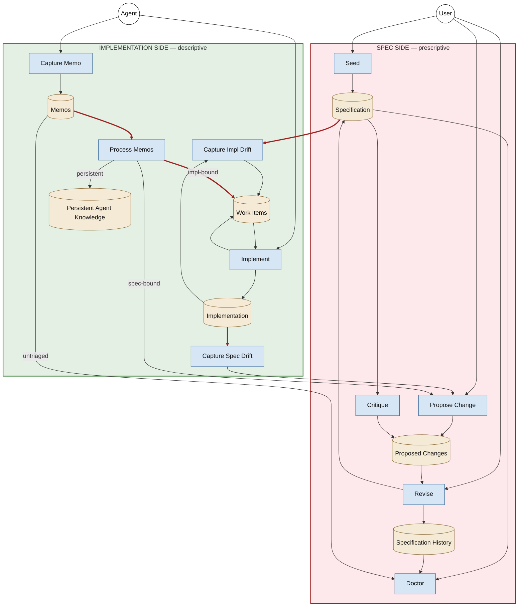

# Draft — tool-agnostic workflow diagram

**Status:** DRAFT for review (v3, switched to Mermaid). Not yet
integrated into the canonical
[`2026-05-11-architecture-summary.html`](./2026-05-11-architecture-summary.md);
expected to iterate based on review feedback before promotion.

**Tooling note:** v1 and v2 used PlantUML deployment-style
diagrams; both rendered with the SPEC and IMPLEMENTATION
packages laid out side-by-side regardless of `top to bottom
direction`, hidden edges, and the smetana layout engine. This
is a known PlantUML deployment-diagram limitation: top-level
packages with bidirectional cross-package edges are placed
side-by-side. **v3 switches to Mermaid** to get vertical
package stacking, which is what the reference
[`archive/.../2026-04-19-nlspec-lifecycle-diagram.md`](../../archive/brainstorming/approach-2-nlspec-based/2026-04-19-nlspec-lifecycle-diagram.md)
also uses. GitHub renders Mermaid natively in markdown — no
separate SVG file needed.

**Purpose:** represent the fundamental spec ↔ implementation
workflow with **tool-agnostic, generic domain terminology**
(NOT bound to `livespec`, `/livespec:*` skill names, or any
specific implementation plugin).

**Layout conventions:**

- **Top → bottom** vertical stacking. SPEC SIDE on top, IMPLEMENTATION SIDE on bottom.
- Lines crossing the subgraph boundary are **hard contracts** between the two sides; rendered in red.
- **Arrow direction = data flow.** A read goes `artifact → skill`; a write goes `skill → artifact`.
- **Shape vocabulary:**
  - light blue rounded rectangle = skill / operation (verb)
  - tan cylinder = artifact / store / queue (noun)
  - circle = user / agent (actor)
- Arrow labels are sparse — only where genuinely ambiguous (Process Memos disposition branches; Doctor's untriaged-memo query).

## Diagram

## Cross-boundary contracts (the load-bearing red edges)

| # | Direction | Edge | Meaning |
|---|---|---|---|
| 1 | spec ⇣ impl | `Specification → Capture Impl Drift` | The prescription. Capture Impl Drift reads the spec to detect what impl is missing. |
| 2 | impl ⇡ spec | `Capture Spec Drift → Propose Change` | Drift findings (impl observed correct, spec lagging) feed into the spec lifecycle as proposals. |
| 3 | impl ⇡ spec | `Process Memos → Propose Change` (spec-bound) | Spec-bound memo dispositions become proposals. |
| 4 | impl ⇡ spec | `Memos → Doctor` (untriaged) | Doctor reads untriaged-memo inventory for its hygiene invariant check. |

## Changes from v2

- **Switched from PlantUML to Mermaid.** PlantUML deployment
  diagrams refused to stack the two top-level packages
  vertically despite `top to bottom direction`, hidden edges,
  and the smetana layout engine. Mermaid's `flowchart TB` with
  `subgraph` enforces vertical stacking reliably.
- **Diagram now embedded inline in this markdown file.** GitHub
  renders Mermaid natively, so no separate SVG file is needed.
  The previous `diagrams/draft-tool-agnostic-workflow.plantuml`
  and `.svg` files are kept for now as historical reference of
  the failed PlantUML attempts; they may be removed after v3
  is reviewed.

## Open questions for review

- **Tool choice — PlantUML vs. Mermaid going forward.** This
  draft switches to Mermaid for the vertical-stacking issue,
  but breaks the established pattern (other diagrams in
  `diagrams/` are all PlantUML, rendered to separate `.svg`
  files). Options: (a) stick with Mermaid for new diagrams
  too; (b) keep PlantUML for the existing diagrams and only
  use Mermaid where layout demands it; (c) port the existing
  PlantUML diagrams to Mermaid for consistency.
- The verb-in-node convention (skill names like "Capture Impl
  Drift" carry the verb, arrows are mostly unlabeled) — does
  this read clean enough, or do specific arrows need verb
  labels added back?
- `List Memos` and `Prune History` still dropped (tangential
  to the spec ↔ impl drift story); re-add if they belong on
  the canonical diagram.
