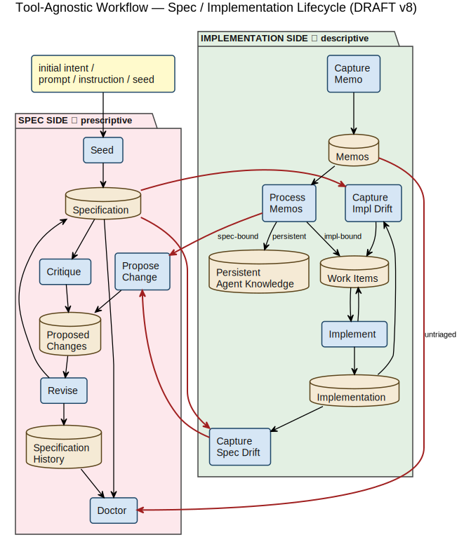

# Draft — tool-agnostic workflow diagram

**Status:** DRAFT for review (v8). Not yet integrated into the
canonical
[`2026-05-11-architecture-summary.html`](./2026-05-11-architecture-summary.md);
expected to iterate based on review feedback before promotion.

**Purpose:** represent the fundamental spec ↔ implementation
workflow with **tool-agnostic, generic domain terminology**
(NOT bound to `livespec`, `/livespec:*` skill names, or any
specific implementation plugin).

**Layout conventions:**

- **SPEC SIDE** (pink package, left) ▏ **IMPLEMENTATION SIDE** (green package, right). Side-by-side rather than vertically stacked — see *PlantUML layout constraints* below for why.
- **Arrow direction = data flow.** A read goes `artifact → skill`; a write goes `skill → artifact`.
- **Shape vocabulary:**
  - light blue rounded rectangle = skill / operation (verb is in the node name)
  - **gold cylinder = store** (canonical, monolithic intent accumulation — Specification, Implementation, Persistent Agent Knowledge)
  - **tan cylinder = queue/archive** (collection of discrete items with lifecycle — Proposed Changes, Specification History, Work Items, Memos)
  - **pale lavender component shape = impl-side API / adapter** (the Spec Reader: provides unified spec access to impl-side operations; implementation-dependent in its internal mechanics)
  - yellow rectangle = external input (the single entry point)
- No actor figures. Any action can be taken by a human or an agent; the actor distinction isn't load-bearing. A single yellow input rectangle ("initial intent / prompt / instruction / seed") represents the external entry point into Seed.
- **Cross-boundary edges** between the two packages are **hard contracts**; rendered as thick red lines.
- All arrows are pure black for contrast; all node text is dark.
- Arrow labels are sparse — only where genuinely ambiguous (Process Memos disposition branches; Doctor's untriaged-memo query).

## Diagram

[PlantUML source](./diagrams/draft-tool-agnostic-workflow.plantuml)

## Glossary

Common terms used throughout this document and the LiveSpec
specification. Definitions are workflow-relevant; some terms
have meanings here that differ from generic usage. Listed
alphabetically.

**Change** (or **proposed change**) — A structured proposal to
modify the Specification. Lives in the **Proposed Changes** box
*(queue/archive: pure queue)* until processed by Revise.
Authored directly via Propose Change, or promoted from Critique
findings, Process Memos (spec-bound disposition), or Capture
Spec Drift findings. The plural form (`propose-changes`) reflects
that one authoring action can produce multiple proposals
atomically. Processed proposed-changes relocate from the
Proposed Changes queue into Specification History (paired with a
revision file documenting the disposition) — they do not
accumulate in Proposed Changes, which holds only pending items.

**Closure** — The act of marking a work item as done. Two paths
based on the item's origin: gap-tied items require verification
(re-running gap detection to confirm the gap is gone) plus
audit fields; freeform items close with a simple reason and no
verification step.

**Critique** — A spec-side LLM-driven analytical pass that
observes the Specification in isolation and surfaces findings
about spec quality (contradictions, undefined terms, dangling
references, BCP14-keyword issues, prose quality). Findings can
promote to proposed changes. Does NOT compare spec against
implementation — that direction is Capture Spec Drift's job.

**Cross-boundary contract** — A deliberate, audited handoff
between the spec side and the implementation side. Rendered as
red edges in the diagram and enumerated in the *Cross-boundary
contracts* table. The hard wall between sides means these edges
are the only sanctioned relationship between spec and
implementation; everything else stays inside its own side.

**Disposition** — A user's per-item routing decision during a
triage operation. Most notably in Process Memos, where each
memo is dispositioned as spec-bound, impl-bound,
persistent-knowledge, or discard.

**Doctor** — Spec-side hygiene and invariant check. Two layers:
a static phase (mechanical structural checks) and an LLM-driven
phase (spec-quality findings). Also enforces cross-cutting
invariants such as memo hygiene by querying impl-side stores
through the published contract.

**Drift** — Evolutionary lag in the spec: the implementation has
done something load-bearing that the spec does not yet describe.
The asymmetric counterpart to **gap** on the impl side.
Detection is heuristic and LLM-driven — the impl side has no
enumerable rule set the way the spec does, so finding "what
looks load-bearing but isn't documented" is inherently fuzzy.
Closes via routing to Propose Change. The bilateral framing
("impl drift" vs "spec drift") was tried and rejected: the two
directions are categorically different problems and benefit from
the asymmetric naming **gap** / **drift** rather than symmetric
naming that obscures the difference.

**Freeform (work item)** — A work item with no gap-id marker;
its existence is not tied to a detected spec gap. Comes from
Capture Work Item (direct user filing) or Process Memos
(impl-bound disposition). Closes with a simple `--reason` text;
no verification step required.

**Gap** — A deficit in the implementation: something the spec
prescribes that the implementation does not yet reflect. The
asymmetric counterpart to **drift** on the spec side. Detection
is mechanical (enumerate spec rules; check impl for each). Each
detected gap corresponds to exactly one tracked work item across
all statuses — the 1:1 gap-tracking invariant — and is marked
with a `gap-id:gap-NNNN` label on the resulting gap-tied work
item. Closure requires verifying the gap is no longer detected
(see **Verification**).

**Gap-tied (work item)** — A work item carrying a gap-id marker,
derived from automated detection by Capture Impl Gaps. Its
existence is justified by a specific spec rule the impl does
not yet satisfy. Closure requires verification (re-run
detection; confirm gap-id absent) plus audit fields (resolution
method, verification timestamp, commits, files changed, etc.).
Participates in the 1:1 gap-tracking invariant.

**History** (or **Specification History**) — *(queue/archive:
pure archive)* Versioned, immutable snapshots of the Specification
at each successful Revise pass. Each snapshot lives in a
`history/vNNN/` directory containing byte-identical copies of
every template-declared spec file **plus the processed
proposed-change files (with revision files documenting each
disposition)** that produced that version. Therefore History is
the complete audit trail of how each version was reached, not
just a snapshot store. Items only enter (via Revise); they never
become "pending" and never drain — bounded only by Prune.

**Implementation** — *(store)* The actual code, tests,
configuration, and infrastructure that realize the spec — what
actually exists, in contrast to what the spec says should exist.
Distinct from **Persistent Agent Knowledge**, which is the
separate store for long-term agent guidance (harness instruction
files, long-lived memory stores, etc.).

**Implementation plugin** (or **impl plugin**) — A concrete
realizer of the implementation-side contract published by
LiveSpec Core. Each plugin owns its own storage backend
(in-repo files, embedded database, third-party tracker, etc.)
but exposes the same skill surface and the same machine-readable
contract. Concrete examples: `livespec-impl-plaintext`,
`livespec-impl-beads`, `livespec-impl-gitlab`,
`livespec-impl-gascity`, `livespec-impl-darkfactory-kilroy`.

**Intent** — Incoming change pressure that drives spec or
implementation work: an initial seed, an observation, a
requirement change, a bug report, an external constraint, a
refactor pressure, etc. The Specification is itself the
ratified accumulated form of intent; the term "intent" in this
glossary refers to incoming pressure that has not yet been
ratified.

**LiveSpec Core** — The spec-side software stack: the published
cross-boundary contract, the spec lifecycle skills (seed,
propose-changes, critique, revise, doctor, prune-history), and
the structural invariant checks. One side of the spec /
implementation split; adopters install LiveSpec Core plus one
implementation plugin of their choice.

**Load-bearing** — Describes a piece of structure — a rule, a
contract, an artifact, an invariant, an edge in the diagram —
on which other parts of the workflow depend. Removing or
altering a load-bearing element causes downstream breakage;
incidental elements can be changed freely. Used throughout the
design to distinguish "must preserve" elements from cosmetic
or aesthetic ones. Example: the cross-boundary contracts are
load-bearing because the spec / impl split would collapse
without them; the arrow color in the diagram is not.

**Memo** — A transient free-text observation captured for later
triage. Lives in the **Memos** box *(queue/archive: queue +
archive)* — items get a disposition state marker on processing
and remain in the store for audit. Captured via Capture Memo and
processed via Process Memos. **Transient by construction** —
every memo must eventually flow to a proposed change
(spec-bound), a work item (impl-bound), persistent agent
knowledge (lasting tactical knowledge), or discard. Doctor
enforces a hygiene threshold to prevent unprocessed memo
accumulation; this rejects the "permanent memory store" pattern
from tools like `bd remember`.

**Persistent agent knowledge** — *(store)* Long-term agent
knowledge in whatever form the implementation chooses to store
it. Common forms: **harness instruction files** (CLAUDE.md,
AGENTS.md, `.ai/<topic>.md` files referenced progressively from
those harness files); a **long-lived memory store** queried by
the agent at relevant points; or any other mechanism a plugin
opts into. The landing place for memos that graduate via the
persistent-knowledge disposition in Process Memos. Solves the
placement problem (where does this knowledge live if it does not
fit as a spec requirement or as inline code?) and — in the
file-based realizations — the context-window-blowup problem
(progressive loading rather than always-loaded).

**Proposed change** — See **Change**.

**Queue/archive** — A box in the diagram that holds a collection
of discrete items with lifecycle state. Items enter, change state
through processing, and either leave the box (toward another
destination) or remain with a state marker. Four exist in the
workflow: **Proposed Changes** (pure queue — processed items
relocate to Specification History via Revise), **Specification
History** (pure archive — versions accumulate without a pending
state), **Work Items** (queue + archive — closed items remain
with a status marker), **Memos** (queue + archive — dispositioned
items remain with a disposition marker). Visually rendered as
tan cylinders. Doctor's hygiene invariants target the pending-item
subset (queue role); the archived portion is unbounded except by
Prune.

**Revise** — The spec-side skill that processes pending proposed
changes, applies accept / modify / reject decisions per proposal
in dialogue with the user, and cuts a new Specification History
snapshot (vNNN). Selective per-proposal — the user can address
a subset and leave the rest pending for a future pass.

**Seed** — One-time spec-side skill that bootstraps a new
project's Specification from initial intent. After the Seed
commit lands, all subsequent spec mutations MUST flow through
Propose Change → Revise.

**Spec** — See **Specification**.

**Spec drift** — See **Drift**.

**Spec Reader** — *(impl-side API / adapter)* A unifying access
layer between the spec side's canonical artifacts (Specification,
Specification History) and the impl-side operations that consume
them. The spec side's only contract for read access is exposing
the canonical file locations; the Spec Reader is the impl-side
construct that reads those locations and presents spec content to
other impl-side operations. **Implementation-dependent in its
internals**: a plugin may implement it as a thin pass-through
(plain-text file reads), as a richer adapter with caching,
indexes, embeddings, denormalized graphs, RAG-style retrieval, or
anything in between. **Excludes Proposed Changes** — only ratified
canonical content is exposed (pending proposals are not yet
intent). **Required capabilities**: (1) read the current
Specification directly; (2) read the Specification History
directly; (3) report the current spec version (`vNNN`); (4) read
or summarize differences between specified versions. **Consumed
by**: Capture Impl Gaps (gap-rule enumeration; also uses the
version query to detect what has changed since its own
last-checked marker), Capture Spec Drift (comparison baseline),
Implement (work-item context resolution), Process Memos
(spec-bound vs impl-bound disposition decisions). May be consumed
by other impl-side operations as needed.

**Specification** (or **spec**) — *(store)* The canonical,
ratified source of truth for project intent — what the system
MUST / SHOULD / MAY do or be. Mutates only through the
Propose Change → Revise loop after the initial Seed.

**Store** — A box in the diagram that holds the current canonical
state of accumulated intent. Three exist in the workflow:
**Specification** (the spec itself), **Implementation** (the
realized artifact), **Persistent Agent Knowledge** (procedural
agent knowledge). Stores are monolithic evolving artifacts — no concept
of discrete items with lifecycle; the artifact IS what it
currently is. Workflow operations mutate stores in place
(Revise → Spec, Implement → Impl, Process Memos
persistent-knowledge disposition → Persistent Agent Knowledge).
Visually rendered as gold cylinders. These are the "source of
truth" boxes a reader consults when asking what the project
currently wants, has, or knows.

**Verification** — The closure-time step that confirms a
gap-tied work item's underlying gap is actually resolved.
Implemented by re-running Capture Impl Gaps in dry-run mode
and checking that the gap-id is no longer present in the
detection output. Does not apply to freeform work items.

**Work item** — An actionable, tracked task on the implementation
side. Lives in the **Work Items** box *(queue/archive: queue +
archive)* — closed items remain with `status:closed` for audit.
Awaits processing by Implement. Comes from three sources:
Capture Impl Gaps (gap-tied), Capture Work Item (freeform direct
filing), or Process Memos (impl-bound disposition, freeform).
See **Gap-tied** vs **Freeform** for closure semantics, and
**Closure** for the verification step that gap-tied closures
require.

## Summary

This section describes every node in the diagram, organized by
node type. Each node carries one paragraph summarizing its role
and the nuances established during the design conversation.

### Spec / implementation split

**Why this is needed:** spec captures *what should be true* and implementation captures *what is*; treating them as one artifact makes it impossible to verify the relationship, evolve them at independent paces, or substitute one implementation for another while keeping intent stable.

A foundational invariant falls out of this split: every piece of
project state must live on one side or the other — not both, not
neither. Memos, work items, and persistent agent knowledge are
all anchored on the implementation side because they describe
realization concerns; proposed changes and history are anchored
on the spec side because they describe intent evolution.

The wall between the two sides is hard. Neither side reads the
other directly except through the **cross-boundary contracts**
rendered as red edges in the diagram (and enumerated in the
*Cross-boundary contracts* table below). Every cross-boundary
edge is a deliberate, audited handoff rather than an implicit
coupling — the wall forces the relationship between spec and
implementation to be explicit and load-bearing rather than
ambient.

The implementation side is **pluggable**. LiveSpec Core (the
spec side) publishes the contract; any implementation that
fulfills it is interchangeable. The implementation can take
any form — files in the repo (markdown, JSONL, YAML, HTML,
etc.), an embedded database, a third-party issue tracker, or
a hybrid — as long as it satisfies the published contract
obligations (the cross-boundary edges plus the machine-readable
query / mutation APIs that Doctor and the disposition handoffs
rely on). Concrete implementations already in scope:
`livespec-impl-plaintext` (files in repo, configurable format),
`livespec-impl-beads` (Dolt-backed graph database),
`livespec-impl-gitlab` (GitLab work items), `livespec-impl-gascity`
(Gas City's tracker), `livespec-impl-darkfactory-kilroy`
(Darkfactory's Kilroy tracker). New implementations slot in by satisfying
the same contract; LiveSpec Core does not need to know about
them in advance, and adopters pick whichever implementation
matches their concurrency profile, existing tooling, and
operational preferences.

### External input

#### initial intent / prompt / instruction / seed

**Why this is needed:** workflows do not start themselves; the system needs one explicit external entry point that admits intent from a human, an agent, or an automated trigger without privileging which.

The single external entry point into the workflow. Represents
whatever sparks a workflow action — a human's initial ask, an
agent's recurring prompt, an instruction from elsewhere in the
team. The diagram uses exactly one external input box (rather
than separate User and Agent actors) to convey that any
operation can be invoked by a human or an agent and the workflow
is not sensitive to which — actor identity is not load-bearing.
The arrow from this node goes only to `Seed` because every other
skill is invoked from within an already-running project; they
are internal entry points, not external ones, even when a human
or agent triggers them directly. In practice this is realized as
a human typing a slash-command, an agent firing a scheduled
skill, an automated job dispatching work, or any other
mechanism by which external intent enters the system.

### Skills / operations

#### Spec side

##### Seed

**Why this is needed:** a new project's spec cannot exist without an initial materialization step; the rest of the workflow assumes a spec tree it can read, mutate, and version against.

One-time bootstrap of a new project's Specification. Reads the
initial intent and materializes the initial state of the
Specification tree (the template-declared spec files plus a
`v001` History snapshot). Runs once at project birth; after the
Seed commit lands, all subsequent spec mutations MUST flow
through `Propose Change → Revise` — direct edits to the spec
are forbidden from that point on. Seed is exempt from the
pre-step doctor check (there is no prior state to check) but
does run a post-step check to verify the materialized state is
consistent.

##### Propose Change

**Why this is needed:** once Seed has run, spec mutations need a structured, audited entry point — otherwise every change becomes either an unrecorded direct edit or heavyweight ceremony that gets bypassed.

User-initiated authoring of one or more proposed changes to the
Specification. Accepts either a free-text rough deposit
(lightweight, no structure required) or a full interactive
structured dialogue, producing a proposed-change file in the
Proposed Changes queue. This is the **direct** path for
spec mutations — invoked when the user or agent knows they want
to change the spec. Plural in name (`propose-changes`) because
a single invocation can author multiple proposals atomically in
one file with one or more `## Proposal:` sections; cardinality
1-to-N. Proposed-changes wait in the queue for a `Revise` pass
to process them.

##### Critique

**Why this is needed:** spec quality issues (contradictions, undefined terms, dangling anchors) accumulate silently as the spec grows; a casual read will not surface them, so a systematic analytical pass is required to catch them before they erode the spec's authority.

LLM-driven analytical pass over the Specification — observes the
spec in isolation and surfaces findings about **spec quality**:
internal contradictions, ambiguities, undefined terms, dangling
references, BCP14-keyword issues, prose-quality concerns. Each
finding can promote to a proposed change in the Proposed Changes
queue. Critique deliberately does NOT compare spec against
implementation; that is `Capture Spec Drift`'s job and lives on
the impl side. Cardinality is 1-to-N: one invocation produces
many findings, each potentially becoming its own proposal.
Posture differs from `Propose Change`: Critique does not require
prior user intent — it can walk the spec without being told what
to look for.

##### Revise

**Why this is needed:** proposed changes do not apply themselves; the queue needs a controlled process that walks each proposal with the user, applies accepted ones, snapshots the result, and produces an audit trail.

Processes pending entries in the Proposed Changes queue, applies
accept / modify / reject decisions per proposal in dialogue with
the user, and cuts a new Specification History snapshot
(`vNNN`). Selective per-proposal — the user can address a subset
and leave the rest pending for a future pass. Every successful
Revise cuts a new version even when every decision is `reject`,
preserving the rejection audit trail with byte-identical spec
files. Applies any `resulting_files` updates from accepted
proposals to the Specification in place before snapshotting.

##### Doctor

**Why this is needed:** spec and store invariants drift silently — broken anchors, missing sections, untriaged memos accumulating past their hygiene window — and without a regular hygiene check those failures fester until they cause harder downstream breakage.

Health and invariant check across the Specification, the
Proposed Changes queue, and the Specification History. Also
queries impl-side stores (notably the Memos queue) via the
machine-readable impl-plugin contract for cross-cutting hygiene
invariants. Runs in two layers: a **static phase** that
mechanically detects structural failures (file shape, schema
conformance, anchor reference resolution, contiguous-version
invariant, etc.), and an **LLM-driven phase** that surfaces
findings about spec quality and inter-store hygiene. Memo
hygiene — "no untriaged memo MUST remain unresolved beyond N
days" — is one such invariant; Doctor does not know how memos
get resolved (that is the impl plugin's responsibility), only
that they should be. Invokes as a pre-step and post-step around
every other spec-side skill (except Seed pre-step, which has no
prior state to check).

#### Implementation side

##### Capture Impl Gaps

**Why this is needed:** without mechanical detection of which spec requirements are missing in impl, the gap-tracking discipline cannot be enforced and work either falls through the cracks or gets duplicated against the same underlying gap.

Detects implementation gaps where the spec prescribes something
the implementation does not yet reflect. Reads spec content via
the **Spec Reader** (and uses its version query to detect what
has changed since this skill's own last-checked marker — the
marker is internal state of the impl plugin, not a separate
diagram entity). Walks the spec and the impl, runs gap-detection
predicates, and per detected gap files an appropriately labeled,
categorized work item into the Work Items queue (with per-gap
user consent). Work items it creates carry a marker (e.g. a
`gap-id:gap-NNNN` label) tying them back to the originating gap,
which makes closure verifiable: re-running this skill in dry-run
mode and confirming the gap-id is no longer detected is the
verification step. Collapses what used to be two separate
operations (`refresh-gaps` + `plan`) into one consent-driven
skill; the previous persistent JSON intermediate artifact is
eliminated — detection state is ephemeral and in-memory.
Implementation-specific in nature: each implementation plugin
(`livespec-impl-plaintext`, `livespec-impl-beads`,
`livespec-impl-gitlab`, `livespec-impl-darkfactory-kilroy`, etc.)
defines its own predicate set and storage backend.

##### Capture Work Item

**Why this is needed:** not every piece of impl work derives from a spec rule or an in-flight memo; bugs, refactors, and tactical tasks need a low-ceremony direct path to track them without pretending to be gap or drift detection or observation triage.

User-initiated direct path to file a work item, bypassing both
gap detection and memo ceremony. The third deposit channel —
alongside `Propose Change` (spec-bound work) and `Capture Memo`
(uncertain observations) — invoked when the user is certain the
work is impl-bound, well-formed, and ready to track. Items it
creates are **freeform**: they carry no gap-id marker, do not
participate in the 1:1 gap-tracking invariant, and close via
the freeform path (simple `--reason` text, no verification
step). This is the restoration of the old observation-flow's
"Path B — manual create, freeform issue" pattern, which was
lost in the tool-agnostic refactor and is necessary for
everyday workflows like filing a discrete bug, queuing a
refactor, or capturing a tactical cleanup task that does not
trace back to any spec rule.

##### Implement

**Why this is needed:** work items do not realize themselves; once filed, they need a driver that authors a failing test, produces the impl that turns it green, verifies closure correctly per the item's origin, and updates the tracker.

Generic work-item processor — pulls items from the Work Items
queue (typically leaf-level, no blockers), drives a Red → Green
code cycle (a failing test first, then the implementation that
turns it green), and closes the item. Reads spec content via the
**Spec Reader** when a work item references spec rules (work
items frequently anchor on spec sections, so resolving that
context is part of normal execution). Agnostic to the work item's
origin (gap-tied from `Capture Impl Gaps`, impl-bound from
`Process Memos`, or freeform from `Capture Work Item`).
Branches on closure based on the gap-id marker: **gap-tied**
items require verification (re-run `Capture Impl Gaps` in
dry-run, confirm the gap-id is no longer detected, record audit
fields including verification timestamp); **freeform** items
close with a simple reason and no verification step. The
`implement` verb is deliberate — the skill stays a clean
processor and is not renamed for symmetry with the `capture-*`
family, because work items can legitimately originate from
sources other than spec gaps.

##### Capture Spec Drift

**Why this is needed:** sometimes the impl is observably correct and the spec is wrong; without explicit detection of this direction of drift, the spec slowly atrophies as ground truth shifts beneath it and no skill is responsible for catching the divergence.

Detects impl-to-spec drift — places where the implementation has
done something that looks load-bearing but is not reflected in
the spec. Reads spec content via the **Spec Reader** (using its
history + diff capabilities to anchor "what should this version
of impl correspond to in the spec?") and the impl directly, runs
LLM-driven analytical detection, and per finding (with user
consent) routes to `Propose Change` to create a proposal that
updates the spec.
**Asymmetric counterpart** to `Capture Impl Gaps`, not a mirror
image: the two directions have categorically different detection
characteristics, and the asymmetric `gap` / `drift` naming
reflects that. Spec → impl is mechanically tractable (enumerate
spec rules, check impl for each); impl → spec is heuristic and
fuzzy (every line of impl is "doing something"; signal-to-noise
is brutal). The two are separate skills rather than one
bidirectional skill because merging would hide the reliability
gap between mechanical and LLM-driven detection.

##### Capture Memo

**Why this is needed:** in-flight observations that are not yet ready for spec or impl classification will be lost or force-fit into the wrong channel unless there is a low-friction transient deposit that preserves them for later triage.

Low-friction free-text deposit of an in-flight observation that
the user or agent is not yet ready to classify as spec-bound,
impl-bound, or persistent agent knowledge. Writes the memo into
the Memos queue for later triage via `Process Memos`. The verb
is `capture` (rather than `remember`) deliberately — generic
across backends and avoiding tool-specific vocabulary. Memos are
**transient by construction**: the LiveSpec philosophy says every
piece of intent must eventually flow to either the Specification
or the Implementation (or be discarded as no longer relevant);
memo is not a permanent store. Doctor enforces this with an
invariant warning when memos accumulate beyond a configured
hygiene threshold. This is a fundamental paradigm shift from
tools like `bd remember` where memories accumulate indefinitely
as a persistent agent context store; LiveSpec rejects that
pattern as a junk drawer that erodes the canonical stores.

##### Process Memos

**Why this is needed:** captured memos must eventually flow to spec, impl, persistent knowledge, or discard — otherwise the memo store devolves into a junk drawer that erodes the canonical stores and that LLMs cannot reliably consume.

Per-memo handholding skill that walks pending memos and disposes
each via user dialogue. Reads spec content via the **Spec Reader**
to inform the spec-bound vs impl-bound disposition decision
(without spec context, "does this memo's content correspond to a
spec rule or to implementation territory?" cannot be answered).
Four dispositions: **(1) spec-bound** → routes to `Propose Change`
(cross-boundary handoff into the spec-side workflow);
**(2) impl-bound** → files a freeform work item into Work Items;
**(3) persistent agent knowledge** → graduates the memo into the
Persistent Agent Knowledge store (the specific form is
implementation-dependent — harness instruction files such as
CLAUDE.md / AGENTS.md / `.ai/<topic>.md`, a long-lived memory
store, or another mechanism chosen by the plugin);
**(4) discard** → removes the memo with no follow-on artifact.
The handholding principle is load-bearing: users do not manually
invoke `Propose Change` for spec-bound memos; `Process Memos`
drives them through the appropriate downstream skill. Doctor's
hygiene warning about untriaged memos points to `Process Memos`
as the resolution mechanism. **Structurally distinctive**:
`Process Memos` is the only operation whose disposition cascades
into multiple downstream destinations — Proposed Changes
(spec-bound), Work Items (impl-bound), Persistent Agent Knowledge
(persistent-knowledge), or nothing (discard). Every other
processor (Revise, Implement) drains a queue into exactly one
canonical store.

### Impl-side API

#### Spec Reader

**Why this is needed:** spec content needs to be readable from many impl-side operations (gap detection, drift detection, work-item context resolution, memo disposition decisions), but each implementation plugin may want to consume that content very differently — plaintext file reads for simple plugins, indexed / embedded / RAG-style retrieval for richer ones. A single named adapter on the impl side unifies the consumption surface without constraining the consumption mechanism.

**Impl-side API.** A unifying access layer between the spec side's
canonical artifacts (Specification, Specification History) and the
impl-side operations that consume them. The spec side's only
contract for read access is exposing the canonical file locations;
the Spec Reader is the impl-side construct that reads those
locations and presents spec content to other impl-side operations.
Implementation-dependent in its internals: a plugin may implement
it as a thin pass-through (plain-text file reads), as a richer
adapter with caching, indexes, embeddings, denormalized graphs,
RAG-style retrieval, or anything in between. Excludes Proposed
Changes — only ratified canonical content is exposed (pending
proposals are not yet intent).

**Required capabilities:**

1. Read the current Specification directly.
2. Read the Specification History directly.
3. Report the current spec version (`vNNN`).
4. Read or summarize differences between specified versions.

**Consumed by:** Capture Impl Gaps (gap-rule enumeration; also
uses the version query to detect what has changed since its own
last-checked marker), Capture Spec Drift (comparison baseline),
Implement (work-item context resolution), Process Memos
(spec-bound vs impl-bound disposition decisions). May be consumed
by other impl-side operations as needed.

### Stores and queue/archives

#### Spec side

##### Specification

**Why this is needed:** a project needs a single canonical source of truth for intent that humans and agents can consult, reference, and align against; without it, intent fragments across hallway conversations, code comments, and tribal knowledge that LLMs cannot reliably consume.

**Store.** The canonical, ratified source of truth for the project's intent
— what the system MUST / SHOULD / MAY do or be. Typically a tree
of markdown files (`spec.md`, `contracts.md`, `constraints.md`,
`scenarios.md`, `non-functional-requirements.md`, `README.md`)
at a known root resolved via `.livespec.jsonc`. Mutates only
through the `Propose Change → Revise` loop after the initial
Seed; direct edits are forbidden from the Seed commit onward.
Read by `Capture Impl Gaps` (as the rule source),
`Capture Spec Drift` (for the comparison baseline), `Critique`
(for analysis), and `Doctor` (for invariant checks). When the
Specification and the Implementation disagree, **the side that
is correct depends on the situation** — the impl may have a
gap relative to the spec, or the spec may have drifted from
observed-correct impl — which is why `Capture Impl Gaps` and
`Capture Spec Drift` are asymmetric counterparts handling
structurally different problems rather than symmetric mirrors.

##### Proposed Changes

**Why this is needed:** spec mutations cannot land atomically without an intermediate staging area; the queue holds in-flight proposals so they can be reviewed, modified, and selectively dispositioned rather than applied piecemeal.

**Queue/archive — pure queue.** Holds pending proposed-change
files that have been authored but not yet processed by `Revise`.
Each file is a structured markdown document with YAML frontmatter
and one or more `## Proposal:` sections. Populated by
`Propose Change` (direct user authoring), `Critique` (findings
promoted from the analytical pass), `Process Memos` (spec-bound
disposition handoff), and `Capture Spec Drift` (drift findings
promoted to proposals). Drains through `Revise` — after a
successful pass, processed proposals (whether accepted, modified,
or rejected) relocate to the corresponding
`history/vNNN/proposed_changes/` directory paired with revision
files documenting the disposition. So Proposed Changes holds
*only currently-pending items* — completed items leave the box
entirely and live in Specification History as part of the audit
trail. Selective per-proposal disposition means the queue can
carry a mix of in-flight work; entries that survive a Revise
pass without being addressed remain pending for the next pass.

##### Specification History

**Why this is needed:** without immutable versioned snapshots, the spec's evolution cannot be audited and there is no way to answer "what did the spec say at version N?" against a current claim.

**Queue/archive — pure archive.** Versioned, immutable snapshots
of the Specification at each successful Revise pass —
`history/vNNN/` directories containing byte-identical copies of
every template-declared spec file as it stood when revision NNN
was finalized. Each `vNNN/` also receives the processed
proposed-change files (with paired revision files documenting
each disposition) that produced that version, so Specification
History is the **complete audit trail of how each version was
reached**, not just a snapshot store. Read by `Doctor` for
invariant checks (contiguous-version invariant,
version-directories-complete, etc.). Items only enter (via
`Revise`); they never become "pending" and never drain — bounded
only by an explicit Prune History operation that collapses old
`vNNN` directories into a pruned-marker once they are no longer
load-bearing for audit. New entries appear after every successful
Revise — even all-reject Revise passes cut a new version,
preserving the rejection audit trail.

#### Implementation side

##### Implementation

**Why this is needed:** the spec states what should be, but value only flows when something actually realizes it; the implementation is the running, testable, deployable embodiment of the spec's intent.

**Store.** The actual code, tests, configuration, and
infrastructure that realize the spec. Mutates through `Implement`
(driven by Work Items). Read by `Capture Impl Gaps` (current
state for gap detection) and `Capture Spec Drift` (observed truth
for spec-drift detection). What actually exists in the running,
testable, deployable artifact, in contrast to what the spec says
should exist. Includes everything that is not the Specification
itself and is not Persistent Agent Knowledge: source code, tests,
infrastructure, build and CI configuration, dev tooling, and any
other artifact the project ships or operates. The separate store
for long-term agent guidance — harness instruction files, memory
stores, or other forms — is **Persistent Agent Knowledge**, not
this one.

##### Work Items

**Why this is needed:** work must be tracked durably between filing and completion; without a queue, items get lost, duplicated against the same gap, or worked out of dependency order with no way to verify closure.

**Queue/archive — queue + archive.** Holds actionable tasks
awaiting `Implement`, plus closed items that remain with a
`status:closed` (or equivalent) marker for audit. Items come from
three sources: `Capture Impl Gaps` (gap-tied items with
gap-id markers), `Process Memos` (impl-bound dispositions,
freeform), and `Capture Work Item` (direct user filing,
freeform). Implementation-specific format — beads issues for
`livespec-impl-beads`, JSONL records for `livespec-impl-plaintext`,
GitLab work items for `livespec-impl-gitlab`, etc. — but
uniform external behavior. Closure semantics branch on the
gap-tied vs. freeform distinction: **gap-tied items require
verification** (re-run gap detection, confirm gap-id is gone,
record audit fields including resolution method and verification
timestamp); **freeform items close with a simple reason**. The
1:1 gap-tracking invariant applies only to gap-tied items: every
current gap in the spec MUST correspond to exactly one tracked
work item across all statuses.

##### Memos

**Why this is needed:** during another piece of work, an agent or human often notices something worth capturing — an observation, an idea, a half-formed thought, a possible problem — that does not warrant interrupting the current flow to go through the ceremony of authoring a structured proposed change, filing a work item, or directly editing agent knowledge. Memos are the low-friction in-flight capture channel that lets such signal land in the moment, deferring the formal-or-discard decision to a later focused triage pass.

**Queue/archive — queue + archive.** Holds pending free-text
observations awaiting `Process Memos` triage, plus dispositioned
items that remain with a disposition marker for audit (spec-bound,
impl-bound, persistent-knowledge, discarded). Populated by
`Capture Memo`. Implementation-specific storage (the beads memory
store, a JSONL log file, etc.) but uniform external query API
via the impl-plugin machine-readable contract — Doctor queries
`--untriaged --json` for hygiene checks. Memos are **transient by
construction**: every memo must eventually flow to a
proposed-change, a work item, persistent agent knowledge, or
discard — the "transient" rule constrains the *queue* role, not
the archive role (processed memos remain visible). Doctor
enforces this with an invariant warning when unprocessed memos
accumulate beyond a configured hygiene threshold. Replaces the
open-ended "memory store" pattern from tools like `bd remember`
— LiveSpec rejects permanence-by-default because it leads to a
junk drawer that LLMs cannot reliably consume and that erodes
the discipline of the canonical spec and implementation stores.

##### Persistent Agent Knowledge

**Why this is needed:** some long-term knowledge genuinely does not fit as a spec requirement or as inline code, but still needs to be available to agents working on the project; a separate, dedicated store keeps it out of the implementation proper while staying available where it is needed.

**Store.** Long-term agent knowledge that does not fit in the
spec (not a requirement) and does not fit as inline code, test,
or config (too generic, too cross-cutting, or too procedural).
The specific form is **implementation-dependent**: common
realizations include harness instruction files (CLAUDE.md,
AGENTS.md, `.ai/<topic>.md` files referenced progressively from
those harness files); a long-lived memory store the agent queries
at relevant points; or any other mechanism the plugin opts into.
Populated by `Process Memos` when a memo is dispositioned as
persistent knowledge. The structural alternative to
memo-as-permanent-store: each entry is named, retrievable, and
graduated explicitly via user-driven dialogue, which avoids the
junk-drawer pattern. In the file-based realizations,
progressively-loaded references also solve the
context-window-blowup problem (only relevant topics load into
agent context). A separate first-class store, distinct from
**Implementation** — both live on the impl side, but they hold
different categories of artifact and are mutated by different
operations.

## Cross-boundary contracts (the load-bearing red edges)

| # | Direction | Edge | Meaning |
|---|---|---|---|
| 1 | spec → impl | `Specification → Spec Reader` | Canonical spec content flows to the impl-side Spec Reader, which consumes it on behalf of all impl-side operations that need spec access. |
| 2 | spec → impl | `Specification History → Spec Reader` | Versioned snapshots + audit trail flow to Spec Reader, enabling version-aware spec reads and inter-version diff queries. |
| 3 | impl → spec | `Capture Spec Drift → Propose Change` | Drift findings (impl observed correct, spec lagging) feed back as proposals. |
| 4 | impl → spec | `Process Memos → Propose Change` (spec-bound) | Spec-bound memo dispositions become proposals. |
| 5 | impl → spec | `Memos → Doctor` (untriaged) | Doctor reads untriaged-memo inventory for its hygiene invariant check. |

## Pending skill placeholders

### `livespec:next` (spec-side, advisory)

A future spec-side skill — provisionally named `livespec:next` —
will recommend the most logical next workflow action based on the
current state of the persistence stores and the dependencies between
operations. Purely advisory: it does not mutate any store.

Reads (via the impl-plugin machine-readable contract for impl-side
stores; directly for spec-side stores):

- **Proposed Changes** queue — pending proposals awaiting revise?
- **Specification History** — recency of the last revision; pruning pressure?
- **Work Items** queue — ready leaf items? blocked items? stale items?
- **Memos** queue — untriaged memos, especially past the doctor-enforced hygiene threshold?
- **Doctor** findings — unresolved invariant violations?

Surfaces the most ripe next action — conceptually similar to
`bd ready` but applied to the full spec ↔ implementation lifecycle
rather than just the Work Items queue.

Not yet represented in the diagram. Full design (single recommendation
vs. ranked list, cross-boundary read mechanism, weighting heuristics
across stores) is open for future iteration.

## Open questions for review

- Cross-boundary red arrows take long winding routes around the
  diagram instead of crossing the wall directly. PlantUML routes
  edges around nodes; constrained by the side-by-side layout.
- `spec-bound` and `untriaged` labels sit on the far right edge,
  semantically detached from where the visual arrow turns.
- `List Memos` and `Prune History` still dropped (tangential to
  the spec ↔ impl divergence story); re-add if they belong on
  the canonical diagram.

## PlantUML layout constraints

Known PlantUML formatting constraints that shaped the current
diagram and may matter for future iterations:

- PlantUML's dot layout will not reliably stack `package`
  containers vertically when there are bidirectional
  cross-container edges. Side-by-side is the path of least
  resistance.
- Hidden vertical edges can force partial ordering but do not
  reliably anchor visual elements (e.g., a horizontal WALL
  divider) against visible cross-section edges.
- `together { }` blocks can group elements but visible
  cross-container edges still pull elements out of the group.
- Mermaid handles `flowchart TB` + `subgraph` vertical stacking
  more reliably, but we are staying on PlantUML for toolchain
  consistency.
